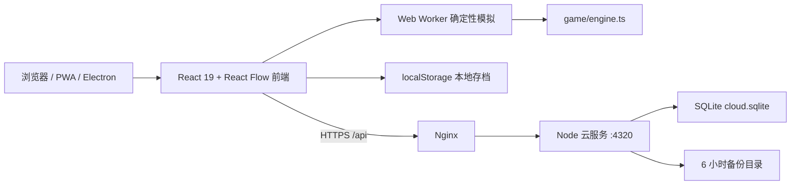

# 系统架构

## 1. 总体拓扑

前端是游戏运行时和本地数据的主载体；后端只负责账号、云存档、排行榜和运营数据，不参与每个生产周期的权威模拟。

## 2. 前端分层

### 启动层

- `src/main.tsx`：安装客户端监控，挂载 React，生产环境注册 PWA；普通入口按需加载 `GameLauncher`，管理员入口独立加载后台。
- `src/GameLauncher.tsx`：主菜单、版本公告和工厂启动边界；只有玩家进入工厂或执行存档操作时才继续加载存档迁移器与工厂运行时。
- `src/FactoryRuntime.tsx`：按需加载 React Flow Provider 与 `FactoryGame`，避免主菜单提前下载画布 JavaScript 和模拟器。React Flow 基础 CSS 在 `styles.css` 最前合并，以保留自定义端口覆盖的稳定级联顺序。
- `src/hooks/usePlayerPresence.ts`、`src/game/presence.ts`：进入工厂后的匿名心跳、可见性节流与本机稳定 ID；不读取游戏存档。
- `src/game/analytics.ts`：页面访问、活跃时长和白名单关键事件的会话级批处理；页面加载、LCP 和静态传输量只上传隐私分桶，不上传原始时序、URL 参数或游戏存档。
- `src/game/savePreview.ts`：主菜单只读存档索引，只解析摘要、设置和原始 payload；不迁移、不推进模拟、不写入存档，正式校验仍由 `storage.ts` 在载入时执行。
- `src/components/AdminDashboard.tsx`：独立 `/admin` 路由，只使用浏览器会话中的管理员 token 读取聚合运营数据。
- `src/components/StartMenu.tsx`：开始/继续、槽位、导入、云账号、邮箱验证/密码重置链接和主菜单设置。
- `src/components/CloudAccountSecurity.tsx`、`CloudSaveConflictDialog.tsx`、`CloudSaveSlotsPanel.tsx`：主菜单与银河工作区共用的账号安全、邮箱绑定、设备会话、数据导出、四槽云存档和云冲突选择界面。
- `src/components/ReleaseNotesDialog.tsx`：版本公告单一数据源、首次展示偏好和主菜单/游戏内设置共用弹窗。
- `src/game/onboarding.ts`、`src/components/OnboardingCoach.tsx`：独立于 `GameState` 的 13 步渐进教学偏好、里程碑判定和设备/线路卡点诊断；教学关闭状态不会随存档或云同步改写。
- `src/App.tsx`：顶层会话和工厂编排。它管理工作区、画布交互、连接、选中状态、存档定时器和模拟 Worker。

### 展示与交互层

- `src/components/FactoryNodes.tsx`：矿脉、生产、电力、仓储、分流器和物流站节点。
- `src/components/FactoryEdges.tsx`：线路路径、标签、层级、监测和连接虚影。
- `src/components/GamePanels.tsx`：资源栏、行星导航、检查器、制造与施工托盘。
- `src/components/mobile/`：阶段 0-3 的可选手机壳层、顶栏、五项导航、更多工作区、三档抽屉、移动建造/物资/检查器、放置状态条和选择上下文条。它只调用现有命令和 selectors，不拥有生产规则。
- `src/components/RecipeWorkspace.tsx`、`CodexSections.tsx`：统一生产资料库。物品/配方沿用现有正反查与聚焦链；建筑、物流、电力、星球、戴森和科研页只从运行时内容目录、行星档案与引擎 selectors 派生，不维护另一套数值常量。
- `src/components/*Workspace.tsx`：科技、生产资料库、统计、星图、蓝图、戴森规划、战役、银河和运营中心。
- `src/components/CatalogPicker.tsx`：配方和物品的面板式选择器。新增长列表选择应优先复用它；打开时按 compact 视口决定焦点，桌面自动聚焦，手机等待玩家主动点击以免弹出软键盘。
- `src/hooks/`：`useCompactLayout` 只按视口判定 compact/medium/desktop，`useMobileUiPreference` 保存独立的手机壳偏好，`useMobileNavigation` 管理移动路由、覆盖层和浏览器返回；粗指针仍只负责手势、吸附和命中区。
- `src/styles.css`：桌面与经典手机基线，包含字体倍率和动效降级规则。
- `src/hooks/useResolvedTheme.ts` 与 `src/theme.css`：把 `dark / light / system` 解析为根节点主题并集中覆盖桌面、React Flow、工作区和新版手机壳；主题模式属于 `GameSettings`，不复制玩法规则。
- `src/styles/mobile-shell.css`：新版手机壳、顶栏、底栏和路由边界；`mobile-factory.css`：阶段 2 的三档抽屉、建造/物资/检查器和画布模式；`mobile-workspaces.css`：阶段 3 的单滚动工作区、移动列表/详情和大字适配；`codex.css`：生产资料库桌面主从布局及限定在新版壳层下的移动列表/详情规则。

React Flow 的持久真相仍来自 `GameState`。手机横竖屏切换只重新计算视口平移以保持原世界中心；触摸端的扩大吸附、连接虚影和低性能 LOD 都是瞬时展示状态，不写入存档。第二根触摸指针由画布捕获层接管，先取消第一指未提交的节点拖动、连线、采矿、放置、区域草稿和长按，再以双指中心与距离直接更新 React Flow 视口。生产区域的矩形、名称与颜色保存在 `GameState.canvasRegions`，但区域草稿和编辑器选择仍是瞬时 UI 状态。

移动端另外维护节流后的 `canvasGame` 展示快照：确定性模拟继续按真实时间推进，节点、端口和线路最多每 450 ms 发布一次；受限设备或低帧模式为 750 ms。科技树、统计、星图等全屏工作区打开或页面进入后台时，底层画布快照冻结，关闭工作区后一次性追上最新 `GameState`。该快照绝不能反向写回游戏状态。

阶段 0-3 的新版手机壳由 `?mobileUi=next` 或独立的 `dsp-idle-network.mobile-ui.v1` 偏好启用；`legacy` 仍保留为回退路径。偏好、移动路由、抽屉高度、画布模式、连续放置开关、工作区详情栈和最近使用列表都不进入 `GameState` 或云存档。`useMobileNavigation` 同时管理 `peek / half / full`、工作区 subview 栈和浏览器历史，因此界面返回、Android 返回与浏览器返回按相同顺序收起抽屉、退出详情和返回工厂。

移动画布显式区分 `browse / place / connect / select / layout / region`。节点只在 `layout` 模式允许拖动；放置数量和连续扩建由移动状态条控制；端口连接继续调用 React Flow 与现有 `canConnectBelt/connectBelt` 路径，保留 56px 粗指针吸附和真实 handle 几何。建造、物资和 `peek/half` 检查器使用移动专用呈现；`full` 检查器把事件透传给原完整检查器，从而复用配方、物流槽、电网、升级和回收命令。

阶段 3 的科技、生产资料库、星图和蓝图使用路由化列表/详情；科技与资料库返回列表时恢复筛选和滚动位置，资料库可在物品、建筑、科技和行星详情间替换当前详情路由，星图支持恒星系→行星两级返回。统计/生产管理使用移动概览、分段导航和展开行卡；其余工作区由隔离样式层统一为不透明单纵向滚动页。`ResizeObserver` 在壳层网格变化时按旧画布尺寸计算世界中心，避免横竖屏切换漂移；React Flow 始终位于新版画布网格的有效行。

工厂运行时和大型工作区都由 `React.lazy` 按需加载。主菜单首屏不再静态依赖 React Flow、`engine.ts`、`storage.ts` 或工厂工作区；生产构建必须检查入口 HTML 没有提前 preload 这些 chunk。

### 领域层

- `src/game/types.ts`：领域 ID、实体、线路、科研、银河、蓝图和 `GameState` 类型。
- `src/game/content.ts`：物品、建筑、配方、施工成本、科技和内容闭合审计。
- `src/game/galaxyCatalog.ts`：16 种生态模板、8 种恒星类型、各行星模板池和星区基础坐标；只保存稳定内容定义，不读取运行时时钟。
- `src/game/galaxy.ts`：由持久化种子确定性生成 8 系 22 星的恒星参数、二维坐标、生态、矿物、海洋、能源、殖民成本和工业档案；加载时优先保留已保存档案，缺字段才回退生成值。
- `src/game/engine.ts`：确定性生产、电网、运输、科研、手搓、戴森与状态变更命令。
- `src/game/stellarIndustry.ts`：全星区物流快照、真实中转路径、枢纽供电诊断、行星分工与星系汇总。
- `src/game/network.ts`：线路占用、吞吐预测、连续网络与瓶颈诊断。
- `src/game/statistics.ts`、`productionManagement.ts`、`planning.ts`、`alerts.ts`：统计、全星球设备诊断、目标产能反推和故障聚合。生产管理快照完全由 `GameState` 派生，不写回存档。
- `src/game/campaign.ts`、`progression.ts`、`endgame.ts`：任务、成就和终局 progression。
- `src/game/storage.ts`：迁移、校验和、离线结算、槽位、备份与快照。
- `src/game/cloud.ts`：同源 `/api` 客户端、会话和 8 秒请求超时。
- `src/game/mods.ts`、`contentPacks.ts`：内容包格式校验、依赖和运行时目录注入。

## 3. 状态与模拟流

1. 主菜单调用 `loadGame()` 或加载指定槽位，得到 `LoadedGame`。
2. 当前工作区的 `FactoryGame` 以 `GameState` v31 作为唯一持久游戏状态；香港 `0.6.0` 与上海 `0.5.0` 线上仍使用 v30，v31 尚未发布。
3. 桌面正常模式每 100 ms、手机正常模式每 500 ms、性能或受限手机模式每 750 ms 累积真实经过时间，并乘以 `1x/2x/4x` 模拟倍率。提交频率只影响 UI 发布，不改变传入模拟器的总秒数。
4. 浏览器支持 Worker 时，状态和时间提交给 `src/game/simulation.worker.ts`；Worker 调用 `advanceSimulation()`。
5. Worker 不可用或报错时，主线程使用同一个 `advanceSimulation()` 回退，保持规则一致。
6. 返回的新状态驱动节点、线路、面板和统计重新渲染。
7. 按设置中的 30/60/120 秒间隔自动保存；切后台、`pagehide`、卸载和返回主菜单立即保存。旧 2/10 秒偏好在 v29 迁移为 30 秒。

模拟器应保持纯状态输入和确定性输出。新增随机机制必须从持久化 seed 派生，不能直接依赖 `Math.random()` 或墙上时钟，否则基准哈希、离线结算和云存档会分叉。

行星矿储、能源、航程和专长倍率保存在 `GameState.galaxy.profiles`，恒星类型、亮度和二维坐标保存在 `GameState.galaxy.systemProfiles`。普通“开始新游戏”只生成一次随机 seed；之后所有生态与路线计算都从该 seed 和持久状态派生。`migrateGame()` 会验证并恢复已有倍率，而不是只用 seed 重抽，因此首次保存、云端往返和跨设备加载不会改变同一工厂。

## 4. 内容模型

核心内容使用字符串联合 ID 和 `Record<ID, Definition>`：

- 物品：名称、符号、颜色、固体/流体/矩阵类型和说明。
- 配方：设备、周期、输入、输出和可选科技要求。
- 建筑：类型、速度、缓存、电力、等级和设备族。
- 科技：矩阵成本、层级、前置和解锁说明。
- 施工定义：制造成本、产量和科技要求。

修改内容时必须运行 `validateContentCatalog()` 和 progression audit。新内容不能只加显示项，还要闭合 ID 类型、定义、来源/用途、解锁、制造和迁移引用。

内容包会在模块加载阶段先恢复注册表并修改运行时目录，然后才迁移存档。不能把这一次序颠倒，否则包含扩展 ID 的存档会在迁移时丢失引用。

## 5. 画布与物流

React Flow 只负责可视节点、边、视口和交互；真实生产库存与运输状态都在 `GameState` 中。显示层通过实体和线路派生 Node/Edge，不应把 React Flow 的临时对象当作存档真相。

`GameState.constructionAutomation` 持久化建筑制造中心的启停、目标库存、轮询游标、累计制造量和按中心 ID 隔离的递归任务。任务将缺少的可手工加工中间材料展开为确定性步骤，基础耗时为材料 0.1 秒/件、成品 5 秒/个；两级升级同时缩短两类步骤。每一步只从中心所在行星托盘原子扣料，原矿缺失时停机，不会凭空生成。施工托盘的递归快速建造仍只生成临时规划，必须先证明完整链可完成再一次性提交。

全星球批量命令按实体所属行星分组，临时切换到对应行星执行既有配方或物流槽命令，再恢复玩家原先所在行星。这样配方切换和槽位替换产生的物资返还会进入正确的行星托盘；批量物流模板只修改指定槽位，物品已占用其他槽位的站点会被跳过。

线路模型包含源、汇、物品、等级、分拣等级、优先级、堆叠、路由、流量和拥堵。端口能够根据已有配方、物流槽或默认状态自动接受物品。连接草稿在开始拉线时锁定传送带等级；自动模式按 Mk.III→Mk.II→Mk.I 选择已解锁且有库存的最高等级，并优先复用已有并行线等级，手动模式保留显式选择。多条同端点线路由 bundle 信息进行视觉错位。

星际物流槽持久化 `direct`、`relay-preferred` 或 `relay-required` 策略及 1-4 个/船翘曲预算。中转物流站持久化启用状态与优先级；在途 `StationRoute` 保存 waypoint、总距离、实际每船翘曲消耗和 `vehicleStationId`。航线仍挂在需求站上，但载具可属于供给站或需求站；占用、卸载限制、返航、翘曲扣除/退款和诊断必须按所属站计算。多跳耗时、能耗、诊断和模拟使用同一经济函数。

物流站连接自动配置只修改未配置状态：已有同物品槽优先复用，否则占用第一个空槽；五槽已满、物品冲突或方向非法时返回结构化失败原因。旧 `sorterTier` 只作为兼容字段保留并始终归一到传送带等级，运行时吞吐只读取线路等级、并行数和堆叠层数。

`getEntityInputCapacity()`、`getEntityOutputCapacity()` 与 `getStationSlotCapacity()` 是堆叠缓存的统一入口。生产输入/输出、燃料、仓储和物流槽按 `machineCount` 线性增长并封顶；减堆不会裁剪超额库存，写入路径在库存回落到新上限前返回零剩余容量。

闲置物流运输机和运输船保存在 `GameState.portableFleet`，不属于任何行星托盘；装入物流站后仍由对应实体的 `stationDrones` / `stationVessels` 持有。切换行星不复制普通库存，只保留这一明确的随身载具库存和光标单组载荷。

`GameState.planetViewports` 按 `PlanetId` 保存 React Flow 的 `x/y/zoom`。离开行星和 `onMoveEnd` 更新当前记录，返回时恢复目标记录；书签、设备定位和网络定位属于显式视角命令，可以覆盖恢复结果。瞬时 React Flow 对象仍不进入存档。

殖民费用沿用行星档案中的 `colonyCost`，但 `getColonizationRequirements()` 为每项成本派生 `planet-tray` 或 `portable-fleet` 来源。`colonizePlanet()` 只在全部成本一次性验证成功后复制状态并统一扣料，因此不会在缺船或缺运输机时先扣普通材料。

`GameState.planetTrayItemLimits` 按行星保存单种物资上限。普通自动入库命令先计算剩余容量，只移动可容纳的整数数量；设备回收、配方切换、线路取消以及玩家主动放下光标整组载荷属于保护性返还，不受上限截断，避免降低上限或配送枢纽满仓后销毁、截断或卡住既有物资。

有限资源的唯一展示判定为 `engine.ts#getResourceReserveSnapshot()`。React Flow 节点通过派生 NodeData 接收快照，桌面/移动检查器直接调用同一 helper，`stellarIndustry.ts` 与生产统计也使用相同的 `infinite/exhausted/remaining/capacity/remainingPercent` 语义。

节点卡片必须高于线路并拦截指针事件；连接虚影和成功/失败反馈属于临时 UI 状态，不写入存档。

## 6. 存档架构

### 本地

| 数据 | 键或位置 | 说明 |
| --- | --- | --- |
| 主存档 | `dsp-idle-network.save.v1` | v2 envelope；当前工作区写 v31，香港/上海线上仍写 v30；`productionHistory` 始终以空数组写入 |
| 主备份 | 主键后缀 `.backup` | 主存档写入并读回校验成功后，尽力保存上一份有效版本 |
| 快照 | 主键后缀 `.snapshot.*` | 自动快照最多 2 份、至少每 5 分钟生成；手动快照独立保留，不参与自动清理 |
| 手动槽位 | `dsp-idle-network.slot.1..3` | 3 个独立槽位 |
| 云 token | `dsp-idle-network.cloud-token.v1` | 仅安全入口调用云 API |
| 云同步标记 | `dsp-idle-network.cloud-sync.v1` | 按云用户和 `main/1/2/3` 槽位分别记录最后同步修订、云 SHA-256 和游戏状态校验值，不包含存档 payload |
| 自动云同步状态 | `dsp-idle-network.cloud-auto-sync.v1` | 只记录最近一次主存档同步的时间、结果和修订，不包含存档 payload |
| 匿名玩家 ID | `dsp-idle-network.player-id.v1` | 仅在进入工厂后生成；服务器只保存其 SHA-256 哈希 |
| 本地身份与榜单账本 | `dsp-idle-network.account.v1` | schema v2；可显式绑定一个云用户，绑定不改写 `GameState` 或工厂存档 |
| 已读版本公告 | `dsp-idle-network.release-notes.seen.v1` | 仅保存最近已确认的公告 ID，不属于游戏存档 |
| 内容包注册表 | 见 `contentPacks.ts` | 必须先于存档迁移加载 |

`saveGame()` 先生成轻量 envelope、清理过期自动快照、写主存档并立即读回校验；只有校验成功才返回成功。配额错误只会从最旧自动快照开始清理并重试一次，绝不自动删除手动槽位或手动快照。最终失败不会中止模拟，但运行时必须持续显示导出提示，不能把“界面继续运行”误报成“已保存”。

### 离线结算

- 未暂停存档按离线秒数调用同一模拟器。
- 基础上限为 7 天，终局连续体研究每级增加 1 天，最高 30 天。
- 离线报告汇总新增物品、完成科技、戴森结构、终局研究和银河出口。
- 离开 72 小时以上会发放一次带领取凭据的基础回归物资。

### 云端

云端为每名用户保存 `main`、`1`、`2`、`3` 四个独立槽位，每个槽位分别维护完整导出 payload、元数据、修订号和最多 20 条历史。元数据包含 SHA-256、状态校验值、保存时间、状态版本、运行时长、设备/科技数量等安全摘要。上传必须携带该槽位的 `expectedRevision`，版本冲突返回 409；前端通过按槽位同步标记区分本地更新、云端更新和双向分叉，只有玩家明确选择后才推进修订。恢复历史版本会在同一槽位生成一个新修订，不会原地覆盖历史。排行榜只读取 `main`。

已验证邮箱的工厂运行时每 10 分钟比较并上传一次 `main`。相同状态不重复创建修订；云端更新或双向分叉会停止自动覆盖并留下可见冲突状态。网络、邮件或服务端错误不会改变本地存档。手动槽位只接受玩家显式上传，不参与自动同步。

## 7. 云服务

`server/index.mjs` 是无框架 Node HTTP 服务，生产使用 `better-sqlite3`。SQLite 当前只有一行 `app_state` JSON payload，启用 WAL 和 `synchronous=NORMAL`。工作区与线上云服务均为 schema v6，在 v5 账号安全之上增加旧账号邮箱绑定和三个独立手动云槽；v5 的主云存档原位保留为 `main`，迁移不会复制或覆盖它。

API 表面：

- `GET /api/health`、`GET /api/public-status`
- `GET /api/admin/metrics`：至少 32 字符的管理员 bearer token
- `POST /api/analytics`：匿名批次、客户端序列去重和严格事件白名单
- `POST /api/presence`
- `POST /api/auth/register|login|logout|verify-email|resend-verification|forgot-password|reset-password`
- `GET /api/account`、`GET /api/account/sessions|export`、`POST /api/account/email|password|sessions/revoke|delete`
- `GET|PUT /api/cloud-save?slot=main|1|2|3`、`GET /api/cloud-save/history?slot=...`、`POST /api/cloud-save/restore?slot=...`
- `GET|POST /api/leaderboard`
- `POST /api/feedback`、`POST /api/errors`

密码使用 scrypt 派生并采用 timing-safe 比较；会话 token 和邮箱动作 token 只保存 SHA-256，登录会话默认有效期 30 天，邮箱动作链接有效期 30 分钟。新账号验证前可以登录和读取自己的数据，但不能写入云存档、恢复云修订或提交排行榜。`server/mail.mjs` 优先使用腾讯云 SES `SendEmail` 审核模板 API，分别传入验证或重置模板 ID 及单一 `actionUrl` 变量；凭据不完整时可以回退到原有 HTTPS webhook，二者都不可用时新注册与邮件恢复明确返回不可用。`/api/health.mailProvider` 只控制注册、绑定、验证重发和找回入口；它不会关闭已有账号登录或四槽云存档。邮件失败日志只记录供应商错误码和 RequestId，不记录收件地址或动作 token。请求体上限为 8 MiB，认证接口每 IP/路径每分钟 12 次，其余接口 120 次。Origin 白名单、Nginx `client_max_body_size` 和前端 HTTPS 限制共同形成入口边界。

匿名心跳默认每 45 秒发送一次，服务端接口限流为每 IP 每分钟 10 次；同一浏览器 ID 去重，最近 120 秒有心跳视为在线。访问统计按 `Asia/Shanghai` 自然日聚合 PV、UV、会话、进入工厂、活跃秒数和允许的关键事件。服务端只保存带命名空间的 SHA-256 标识，不保存原始匿名 ID、鼠标坐标、按钮文案或存档内容。香港与上海数据库相互独立，因此统计也是节点级数据，不做跨节点合并。

## 8. 部署架构

- Nginx 静态根目录：`/var/www/dsp-idle/current`
- 云服务代码：`/opt/dsp-idle-cloud/current`
- 云数据库：`/var/lib/dsp-idle-cloud/cloud.sqlite`
- 云备份：`/var/lib/dsp-idle-cloud/backups`
- 云进程：绑定 `127.0.0.1:4320`，只能经 Nginx 暴露
- systemd：云服务自动重启；健康检查每两分钟访问本机 `/api/health`。
- 运维工具链：每日异地备份使用公钥认证加密，恢复节点每月在隔离目录启动临时 API 演练；五分钟节点探针检查公网端点、磁盘和 TLS，结果通过管理员指标读取。
- Nginx 模板对 JS、CSS、JSON、manifest、XML 和 SVG 启用 gzip，并保留 hashed asset immutable 与 `index.html`/`sw.js` no-cache 边界。
- Service worker 注册 URL 携带确定性 build ID，缓存命名也使用该 ID，避免版本切换后新旧应用壳混用。

正式香港节点与上海旧节点各自运行本机 API 和数据库。上海不能反代或重定向到香港，否则会破坏当前备用入口边界。具体运行手册见 [DEPLOYMENT_OPERATIONS.md](./DEPLOYMENT_OPERATIONS.md)。

## 9. 当前结构性问题

- `App.tsx` 同时承担会话、画布、工作区和大量命令编排，应逐步拆成运行时 hooks 与工作区控制器。
- `engine.ts` 包含多个领域，应按“模拟内核、实体命令、电力、物流、科研、戴森”分模块，但保持公共确定性入口。
- `styles.css` 超过一万行，应按 shell、canvas、workspace、responsive 分层，并保留加载顺序测试。
- 云端单 JSON row 在用户量增长后会造成整块序列化和写放大，应在有真实规模数据后再迁移到规范化表，而不是提前重写。
