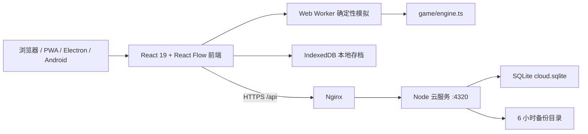

# 系统架构

> **Windows Rust Campaign / Galaxy 玩家壳纵切（2026-09-01，开发候选，未发布）**：native ownership 下的 Campaign 与 Galaxy 入口不再消失。Campaign 只接收 `campaign-workspace-v1`：固定任务目录、最多 16 章/64 任务、256 KiB，字段仅含任务状态、完成数、进度和 item/technology/entity/planet/workspace UI locator。每次打开仍会在 Rust 中执行一次 `O(entities + belts)` 的只读 factory metrics 扫描；它降低 renderer 驻留与 IPC 数据量，但当前不能称为低成本或事件驱动任务查询。locator 只改变界面路由，不选择任务、不改游戏。
>
> Galaxy 将 renderer 本地 `accountState` 与 `galaxy-account-workspace-v1` Rust 游戏摘要并排展示而不合并：64 KiB、256 位十进制、只含模式/运行时间、生产、进度、戴森和 v47/envelope v2/cloud v8 兼容摘要。账户创建、切换、资料和登录绑定仍是账户域操作；Rust authority 活动时从旧 renderer GameState 记账的定时器停止。恢复、导入和覆盖当前主档没有按钮或回调，必须经过独立持久化边界。
>
> 两个投影均绑定 `sessionId/runId/revision/registryFingerprint`；Host 用活动 exact-realtime lease 二次证明，main projection broker 在异步读前后再次核对。旧 run 同 revision ABA、stale revision/registry、未知字段、重复任务、计数漂移、payload 超限或 `truncated=true` 都使整页失败关闭，不拼接 Web GameState。Web/PWA fallback 原样保留。GameState v47、envelope v2、cloud schema v8、SQLite layout v3、package 1.2.3、固定进度口径及 `authorityEligible=false` 均不改变。

> **Windows Rust 恒星系空间站可达写面与明确拒绝边界（2026-09-01，开发候选，未发布）**：原生星图的已发现内置恒星系现在直接提供“管理本系空间站”入口；native/legacy 星图都复用同一打开动作，原生权威模式只渲染有界 `system-space-station-workspace-v1`，renderer 不读取完整 `GameState` 来提交空间站写入。七类操作——开工、托盘交付、模块目标、单站/本系批量升级、模式切换和二次确认的输出口修改——只形成最小 intent。每个 intent 同时绑定投影的 session、run、revision、registry fingerprint 与 system ID；这些字段进入命令摘要和 Host 请求，Rust 再从实体所属行星推导恒星系并拒绝跨系实体、跨系批量或过期投影。这样旧窗口、重新导入后的同 revision 以及跨存档 ABA 都不能把一次点击绑定到新权威会话。
>
> Rust 只有在 `prepare_system_space_station_command` 或隔离副本的 apply 失败、且尚未创建 durable pending command 时，才以专用 typed error 标记“明确未写入”。Host 只通过 Rust error type 映射该 code，main runtime 又必须同时看到该精确 code 和当前 active entry 的 `kind=system-space-station` 才会丢弃本操作及依赖它 revision 的排队操作、保持 checkpoint/revision 不变并恢复时钟。普通命令伪造同 code、响应丢失、协议畸形以及 AfterStage/WAL/checkpoint/receipt/lease-ACK 五个故障边界仍保持 uncertain，并且只允许原字节幂等重试。当前仍有一个非阻塞 P2：preload 方法恒定存在，混装旧 Host 时按钮可能先显示可用、随后由真实 capability 门拒绝；匹配构建不受影响。GameState v47、envelope v2、cloud schema v8、SQLite layout v3、package 1.2.3 与 `authorityEligible=false` 均不改变。
> **Windows Rust ordinary producer/miner 活动结算边界（2026-09-01，开发候选，未发布）**：`simple_factory` 为内置目录中的本地普通机器与矿脉增加 session-only、按持久实体行号排序的 wake index。冷启动先执行原有完整生产/矿脉结算；随后只有仍可运行、处于一拍零值归一、被两段 belt 真实库存移动触及，或在本步取得正 output credit 的行进入电力需求探针和结算。机器消费最后输入、机器刚填满输出或矿机刚填满输出时，会因 `pre-step runnable || post-step runnable` 再保持一拍，直到旧路径已经把 `utilization`、`productionRate`、`progress` 与适用的 `powerFactor` 归一后才可休眠。有限矿耗尽也保持同一拍间零值一致性，但旧语义仍把“输出未满但资源耗尽”的矿机视为耗电活动行，因此这类矿脉归零后仍常醒，不会被错误休眠。full-output 矿机休眠期间的 connected/disconnected 计数由同 topology 的逐电网静态整数聚合补回。
>
> 该索引不持久化；普通命令、配方/科技/设置/容量/拓扑变化会丢弃 prepared runtime，电源行本身仍按旧路径检查。活跃科研会保守扫描全部普通 producer/miner，以覆盖本步科研完成引起的科技、生产速度或矿速变化；`matrix_research`、太阳帆与火箭发射行始终保持旧稳定行序的活动 barrier。非空 MOD registry、opaque/命名空间身份、实体或 topology 漂移、writer 证明不足，以及活动行达到 `75%` 都使用原 full-scan oracle。候选 runtime 只在完整 simulation revision 成功后安装；就绪顺序或更晚写回失败不会清除源 wake。
>
> 合成 4,164 行的固定输入在 `1/5/60` 秒得到 `4164`、`4164→2×4`、`4164→2×59` 的逐秒扫描计数；force-full A/B 的完整字节、canonical、domain 与物料守恒 SHA-256 一致，1/2/4/8 worker 也一致。这只是扫描计数证据，不是墙钟或吞吐承诺。仍有意全扫或常醒的域包括 power sources、科研/戴森全局 barrier、活动科研、行星指标的全实体归集、production-history 采样、material-delivery hubs、自然稠密与所有 fail-closed 路径，因此不能称为“全部生产已经 O(active)”。GameState v47、envelope v2、cloud schema v8、SQLite layout v3、package 1.2.3 与 `authorityEligible=false` 均不改变；未连接生产、未部署，也未读取或修改真实玩家存档。

> **Windows Rust 固定分区 prepare/串行提交边界（2026-09-01，开发候选，未发布）**：`DeterministicRuntime` 现在可以在同一个进程生命周期、最多 8 线程的 Rayon 池中并发执行固定 4/8 个异构只读 prepare 分区。工厂打开或缓存失效时，线路路由、普通物流 buffer、本地/量子目录、施工、站点/量子过渡和星际目录/活动从同一不可变 revision 生成私有结果；每个模拟步的 ready station、矿脉和普通机器电力需求同样先生成独立事件缓冲。所有分区必须全部 join，随后才按历史领域顺序检查错误并串行回放；任何失败都丢弃整组结果，不安装先完成的缓存，也不改源 revision。
>
> 分区少于 2 个、`entities + belts` threshold source rows 少于 4,096 或线程策略为 1 时自动走调用线程；其他情况仍只使用同一有界池，不创建临时线程池。profile 中的 work items 不是八领域真实累计工作量，selected workers 也是计算上限而非预留子池；observed workers 只记录实际进入外层分区闭包的 worker 数代理，因此不能把这些数字冒充墙钟收益。合成核心工厂候选回归覆盖 1/2/4/8 worker 的状态字节、规范 SHA-256、领域 SHA-256 和物料投影 SHA-256 一致，并覆盖“较晚领域失败但较早领域成功”时所有 prepared cache 仍为空；该 helper 不包含 public advance 的 production-history、campaign、speedrun finalizer 或正式 cache-install，因此只证明被修改的核心边界。该切片只并行无共享写的准备阶段；共享物料提交、线路冲突提交、完整 pure-idle/offline/time-warp 和跨 CPU/Windows 版本长跑仍未闭合，所以 `authorityEligible=false` 保持不变，GameState v47、envelope v2、cloud schema v8、SQLite layout v3 和 package 1.2.3 均不改变。
> **Windows native orbital-contract authority（2026-09-01，开发候选）**：durable semantic request 为 `{sessionId,runId,expectedRevision,expectedRegistryFingerprint,confirmedWallClockMs,intent}`；`intent` 是 deny-unknown-fields 的五分支 union，renderer 永远不提供 patch、GameState、余额、进度或奖励。Rust prepare 在任何 WAL staging 前拒绝 stale lineage、非空 content-pack registry、终端 safe revision、畸形板/ID/库存，并在 clone 上先调用既有 UTC+8 `station_contracts::synchronize`，再执行玩家动作。成功 patch 只覆盖 `orbitalStation`，量子交付另覆盖唯一 item inventory；Host 使用普通 player-authority WAL/checkpoint/receipt/cold-replay 事务。
>
> mutation 的 main clock 只在首次 enqueue 采样一次并参与 command hash；未知响应由同一个 runtime queue entry 原字节重试。read route 不缓存同 revision 的昨日合同板：projection broker 每次读取重新采样 main clock，Host 以 exact-realtime lease 二次证明 authority session/run/registry，Rust 只在 clone 上 synchronize 后投影。旧 offer 拒绝不会提交 rollover 副作用，UI 在 FIFO settle 后重新读取。history 投影最多 8 行，若合法 featured 不在 newest 8，则输出 newest 7 + featured；48 行持久 history 因 expiry 插入而截断 featured 时清 null，保持 strict invariant。
>
> 本纵切不扩展格式或 authority eligibility。cargo terminal binding、decorations、profile/public showcase、construction、MOD 和其他银河操作仍由原生 route 显式失败关闭；Web fallback 保持独立 JavaScript 实现。

> **Windows ordinary storage/splitter 活动桥接边界（2026-09-01，开发候选，未启用）**：Rust 普通物流 buffer 的 `inputs → outputs` 桥接不再在每个模拟步遍历全部 storage/splitter 行。冷启动/拓扑重建执行一次全扫描，随后 session-only `BTreeSet<entity-row>` 仅接收传送带真实物料移动的 source/target wake；桥接按持久实体行顺序提交，处理后休眠，直到下一次库存事件。活动达到 75%、目录/实体数量漂移或无法证明 built-in 形状时回到同一全扫描语义。runtime queue 只在完整候选提交后安装，不序列化、不参与规范哈希，失败候选保留源 revision 与 wake 证据。该边界只关闭 ordinary storage/splitter 桥接外层全扫，不能代表普通生产、电力、material-delivery、量子高扇出或全部物流已经严格 `O(active)`。

> **Windows Rust ordinary 蓝图完整生命周期边界（2026-09-01，开发候选，未发布）**：原生权威模式下，普通内置蓝图现已把捕获、严格导入、确定性导出、直接部署、仅入队、领料、队列部署和取消闭合到同一条 Rust/Host/薄 UI 事务链。renderer 只提交与当前 session/run/revision/registry 绑定的最小语义 marker；Rust 独占目录解析、canonicalization、材料与拓扑推导，并在 prepare 和私有 apply 两层重验实体、线路、蓝图、版本和施工队列八个持久 ID 域。live、generic cold-WAL、重复 command ID 与五个 durable fault boundary 复用同一展开器；候选失败只丢弃副本，不允许部分扣料、部分建造、假成功或 renderer 自动重发。
>
> native import 的原始 UTF-8 exchange 在进入 Rust 前受 1 MiB、well-formed Unicode 和 fatal decode 限制，Rust 再限制 512 entities、1,024 belts、64 library rows 与 ordinary 内置域；raw exchange 不进入 WAL。native export 是只读有界投影，Rust 生成无时间戳 v2 exchange、精确字节数、SHA-256 与 Windows 安全文件名，desktop 不解析或重序列化正文。export 的 owner-ID 冲突检查允许合法的 `version.blueprintId` / `queue.blueprintId` 外键，但拒绝独立 owner ID 复用及异常 version 引用。accepted import draft 只有在连续 ACK、同 lineage/registry、frame revision 不早于 ACK 且目标行精确存在时清除；任何漂移都失败关闭。Web/PWA 仍保留独立 JavaScript fallback，但使用相同数量/字节/库容量硬门限，不进入 Host WAL。GameState v47、envelope v2、cloud schema v8、SQLite layout v3 与 `authorityEligible=false` 均不变；MOD、resource anchor、external port、空间站/舰队和其他特殊域继续拒绝。

> **Windows Rust 普通生产者活动线路与 clone-safe 工作区边界（2026-08-31，开发候选，未发布）**：线路拓扑为内置默认内容目录中的普通生产者建立配方输入与全部已路由输出的反向依赖。普通输出组只有在已有输出/输入、运行时流量、完整输入周期或反向唤醒存在时保持活动；输入货物写入会唤醒同一生产者的所有路由产物，而不是只唤醒输入物料对应的一条线。若唤醒发生在本步活动快照之后，内核只对新唤醒且此前未选中的普通输出组执行一次同秒时钟补齐，再按原稳定线路顺序预留容量和提交。未路由副产物不会伪造线路，MOD、opaque、特殊/全局配方及证明不足的形状继续常醒；活动比例达到 75% 时保留完整扫描 oracle 的稳定退化。
>
> `BeltActivitySnapshot` 的活动索引与一个精确拓扑绑定的单槽 `BeltReusablePool` 共享所有权。候选借用后，已提交快照仍保留同一池身份；成功发布把携带本次活动索引来源的工作区归还，下一借用先按该 provenance 清除上次为真的活动位，再播种自己的不可变快照。发布前任意失败则由 `BeltRuntime` 的销毁边界清空活动位、选择/候选/待唤醒集合和逐组临时状态后归还。重叠 clone 在池被占用时分配独立工作区，归还时 first-return-wins；后归还的副本不得覆盖已驻留缓冲。真实 `Barrier` 双线程回归会让两个 OS 线程都完成 checkout 后才允许任一候选发布，证明只有一个候选取得池内驻留工作区、另一个使用独立分配，二者不共享可变缓冲；发布回池后下一借用仍会清除获胜来源的旧活动位。这样 disposable pure-idle candidate、写回失败或取消都不能污染下一 revision，也不能抽干 live snapshot 的复用能力。池、活动索引和工作区均为 revision 私有运行时数据，不持久化、不参与 canonical hash。
>
> 该边界只减少已证明休眠线路的 transfer/reservation route scan；诊断中的 `stableRoutesSkipped` 也只表示跳过了这些扫描，不能解释为该线路在整个 revision 绝对没有任何有界补齐动作。合成夹具的 route pass 检查数已从 `309/1545/18540` 降为 `6/48/1034`（`1/5/60` 秒），但完整小型测试约慢 `2%`，因此架构上只确认等价性和扫描闭合，不宣称墙钟或生产吞吐收益。公开 GameState v47、envelope v2、cloud schema v8、SQLite layout v3、package 1.2.3 与 `authorityEligible=false` 不变。

> **Windows Rust 工厂节点展示边界（2026-08-30，开发候选）**：`viewport-v2` 保持原有 schemaVersion 2，并通过 Host hello 能力 `native-core-viewport-entity-presentation-v1` 与请求字段 `entityPresentationVersion:1` 显式选择 projection-only sidecar。Rust 只读取活动 `CoreState`、目录和已解析实体，为返回页生成同序 `entityPresentation`；旧请求不增加任何响应字段。支持行携带保守状态、供电、资源、容量、周期和有界物料端口，无法证明的 MOD/未知行只有 `{entityId,supported:false}`。sidecar 与实体页共用 1 MiB 字节门禁，经过 Host owner、main session/revision、MessagePort SHA-256、renderer exact-object、分页 pin 去重与 frame 原子合并；它不得并入保存用 `FactoryEntity`，不得成为命令输入，也不得参与 canonical hash。native ownership 下 App 不再创建完整 JavaScript display lookup，并在静态/动态卡均优先消费该 Rust sidecar；unsupported 行只绘制只读拓扑且不开放连线。全局科研/戴森/时间扭曲、端口拓扑和告警仍需后续独立投影，故该边界不代表 renderer 已成为完整薄客户端，`authorityEligible=false` 保持关闭。

> **Windows 原生 pure-idle v14 联合量子施工边界（2026-08-30，开发候选，未启用）**：`native-pure-idle-macro-v10-closed-ledger-construction-quantum-v14` 在一个 disposable candidate 内固定执行“闭合 ordinary 宏观结算 → 绝对五秒量子边界 → construction-only 固定 30 秒规范块”。ordinary 阶段写入量子共享库存的正增量先进入逐物料 attribution ledger；施工阶段在复制的 base 中先 hold back 全部 pending credit，再按 ordinary 证书的逐秒安全整数产率释放到对应五秒边界，调用真实量子下载结算后才唤醒紧凑施工 runtime。每个待释放物料都必须在当前 ordinary 证书中仍有正的 release rate；缺失或为零时在安装前原子拒绝候选，不能用陈旧 attribution 推断普通产量。施工宏观尾段的起止微秒还必须同时位于整秒边界，小数秒区间保留给 exact path，不能通过向上取整获得额外施工秒或 30 秒规范块。这样 `F^(a+b)`、任意有序分段和 checkpoint/reload 不会把未来普通产量当作旧量子库存，也不会在首个五秒边界一次性释放完整 30 秒信用。施工 receipt bridge、量子 fingerprint/每边界带宽、制造中心身份与永久可再生电网证书都必须连续；任何一步失败都不会安装 candidate、runtime 或部分账本。
>
> 量子 replay 是每个连续 macro-v10 session 最多 30 秒的一次性私有额度。`CoreState` 的 internal manifest 用 `pureIdleMacroConstructionQuantumReplayRemainingSeconds` 保存 `0..=30` 游标，并用 `pureIdleMacroConstructionQuantumPendingCredits` 保存尚未跨过下一固定 30 秒施工块的逐物料 safe-integer 归属；完整与增量 checkpoint 均往返这两项。旧 manifest 缺字段分别恢复为 `30` 和空表；显式 replay 只接受当前 macro-v10 session 的有界整数，pending key 本身只在同类 session 且 replay 大于零时合法。无 session、conservative/orphan、manifest 绑定的 revision 不匹配、空 ID、负数、字符串、`null`、超范围或超过 JavaScript safe integer 都失败关闭；运行中后来发生的 committed revision 漂移则通过私有 getter 对外恢复 `30`/空表，切回 conservative session 会实际清空 attribution。真实量子回放后只失效量子目录而保留其他 prepared cache。若 ordinary settlement 命中逐物料容量地平线，v14 立即把 replay 置零并清空 attribution，禁止施工下载释放空间后反向扩张 ordinary horizon。
>
> 量子物流的运行时 request identity 使用长度前缀结构化 key：命名空间、实体 ID、物料 ID 分别带 UTF-8 字节长度，因此带冒号、任意 Unicode 或 MOD ID 的 station 与 construction owner 也不会碰撞。旧 `order_key` 只决定历史兼容的确定性分配顺序；结构化 key 才用于聚合身份并作为最终 tie-break。专项回归用历史分隔符下会碰撞的两个 owner 验证下载总量 `101 = 100 + 1`、库存扣减同为 101，且 exclusive construction 候选面对 ordinary owner 时仍原子拒绝。以上游标、账本、结构化 key 和 cache 均为 runtime/private 数据，不序列化到公开 GameState v47，不进入 v47 envelope、canonical hash 或云协议；`authorityEligible=false` 不变。

> **Windows 原生蓝图重命名语义边界（2026-08-30，开发候选，未启用）**：蓝图写面首批只接通重命名。durable marker 固定为一个 `blueprints/intent` set，正文只有 `kind/id/name`；Rust 必须从权威 v47 目录定位唯一行并展开为该行 `name` 与安全递增的 `revision`。live 提交与 generic WAL replay 共用同一 expander，首批均保守返回 `topologyDirty=true`。名称必须已经按 Unicode whitespace/FEFF 去边、无控制字符且不超过 32 个 UTF-16 code unit；renderer 与 Rust 双侧复验，same-name 和任何混合 patch 失败。renderer 的编辑 identity 只含 session/run/registry、blueprint ID 与原行 name/revision，不能绑定不断前进的全局 revision；同 lineage 且原行未漂移时保留同一 input DOM/焦点/草稿/composition，只在提交边界重新绑定最新且相互一致的 frame/route/command-source revision。提交结果必须显式区分 rejected、accepted-awaiting-ACK、awaiting-projection、definite-failure、uncertain 与 conflict；只有 durable ACK 后的目标 name + 原行 revision+1 精确投影可关闭编辑器，不确定结果禁止自动重发。完整未知/MOD字段、版本快照、施工队列、库存、实体、线路与 nextId 保持不变。公开投影仍是 read-only v1；没有新增 IPC/schema/version，也没有改变 `authorityEligible=false`。

> **Windows 原生玩家命令的 `null`/删除边界（2026-08-29，开发候选，未启用）**：Rust `ValuePatch` 现在把显式 JSON `null` 与缺失 `value` 分开解码，因此清空配方、目标或可选配置的 `set null` 不再被误判为“没有值”。renderer 生成的 `delete` 可以继续省略 `value`；Host 只对该精确形状兼容既有 durable `value:null` 表示，其他缺字段、未知字段或非规范对象仍失败关闭。命令在 WAL 前预检，已暂存命令经过进程重启后使用相同 command ID/revision 恢复，同 ID 重试只返回既有回执；失败不能发布部分状态。该修复不改变核心协议版本、GameState v47、envelope v2、cloud schema v8 或 SQLite layout v3，也不改变 `authorityEligible=false`。

> **Windows 原生权威 E1a 写入栅栏（2026-08-28，开发候选，未启用）**：性能开发版的 `normal-main` 原生存档现在以 Rust 持久租约作为唯一写入栅栏。租约存在或损坏时，普通保存事务的开始与提交、原始/幂等 WAL、压缩、通用核心提交和检查点都会 fail-closed；即使事务先于租约创建，也会在发布边界再次被拒绝。实验性精确推进只能由主进程内部使用独立 capability 调用，调用者只提供租约身份，command ID、base revision、固定 1 秒 exact 预算和空 gameplay command 均由 Rust 从已持久化 pending tick 派生。该操作没有 `ipcMain`/preload/renderer 入口。桌面启动会在 Host hello 后、创建普通窗口前检查租约；有效或无法验证的租约会阻止窗口启动，缺失租约保持既有路径。此门禁解决“双写”风险，但**没有**把实验核心提升为玩家可见权威，`authorityEligible=false` 保持不变。

> **Windows 大档热路径 E5～E18（2026-08-28，开发候选）**：Rust 核心已经把线路拓扑、精确行索引、实体/线路原始记录写回、普通机器批处理、量子与本地物流、生产历史和规范哈希的多处临时 JSON/字符串复制改为紧凑索引、确定性分区、流式聚合或既有键原位更新。不可变线路路由和本地物流 peer directory 在 revision 内缓存，只有命令改变拓扑或 5 秒模式边界时失效。提交仍按稳定输入顺序合并，跨 `1/2/4/8/auto` 线程的状态哈希必须一致；任何错误在安装候选前返回，不能部分提交。

> **Windows 原生有限矿纯挂机边界（2026-08-29，开发候选，未启用）**：Rust `native-pure-idle-macro-v10` 的三段 10 秒闭合证书现在可以覆盖有限矿源。证书逐矿脉记录稳定整数产率及公开 v47 的 `resourceRemaining` 端点，固体矿脉还闭合 `resourceDepletionRemainder`；尾段按最早可证明储量地平线截断，并在提交累计生产、量子库存、配方、科研或戴森物料结果时同步扣减同一公开矿脉账本。有限矿开采量不得超过对应累计生产增量，矿脉身份、矿工数量、资源、矿耗科研或端点发生变化会使候选整体拒绝，失败不安装部分状态。无限资源、自然海洋资源和矿脉利用等级 10 继续按可再生源处理。该切片没有新增持久字段，也不改变 GameState v47、envelope 或云协议；纯挂机施工尾段、完整离线/时间扭曲以及其余未覆盖玩家命令仍未证明为 Rust 单一权威，因此 `pureIdleMacro=false`、`offlineAndTimeWarp=false`、`authorityEligible=false` 保持不变。

> **Windows 性能开发版安装与数据身份（开发候选，未部署）**：Electron Builder 的 appId/AppUserModelID 固定为 `com.dspidle.network.performance`，产品、快捷方式和卸载项固定为 `DSP极简网络 Windows 性能开发版`，EXE 与 setup 分别使用 `dsp-idle-performance-edition` 前缀，构建输出固定为 `release-performance-edition/`。主进程不依赖 Electron 对 `productName` 的隐式推导，而是在 ready/单实例锁前显式建立 AppData 下独立的 `DSPidle2-Performance-Edition` userData 和其中的 `Chromium` sessionData；目录创建或 `setPath` 失败即停止启动，不回退到稳定版。安装目录选择被关闭、NSIS GUID 继续从独立 appId 确定派生、卸载不删除应用数据，因此性能版的安装、任务栏、快捷方式、IndexedDB/localStorage、原生存档、窗口状态和本机性能策略均不复用稳定版身份。

> **Windows Electron 壳层运行策略（开发候选，未部署）**：主进程在 `app.ready` 前解析一个严格的壳层策略；默认不调用 `disableHardwareAcceleration()`，不追加 Chromium/V8 参数，也不改变操作系统进程优先级。只有精确设置开发环境变量 `DSP_DESKTOP_EXPERIMENTAL_DISABLE_HARDWARE_ACCELERATION=1` 才会在启动早期禁用硬件加速，其他非空值按无效配置忽略。受信 renderer 可以按需读取有界、5 秒缓存的 GPU feature/device、Electron `getAppMetrics()` 进程、系统/主进程内存、主进程 V8 heap limit 和只读优先级诊断；结果不包含命令行、环境变量、文件路径、URL、存档内容或异常文本。独立 Rust Host 只报告 PID，并明确不在 Electron 进程树汇总内；发布性能报告仍必须使用外部采样器统计完整进程树 Private Bytes。

> **Windows 原生线程策略边界（开发候选，未部署）**：Electron 主进程从 `userData/native-performance-policy-v1.json` 读取设备级 `quiet`、`balanced`、`performance` 或 `custom` 策略，并只把它映射为 Rust 已支持的 `DSP_NATIVE_CORE_THREADS=auto/1/2/4/8`。Rust 内部的实体解析、实体编码、电力探针和普通机器探针共用一个进程生命周期的具名 Rayon 线程池；少于 4,096 条记录固定串行，索引结果按输入顺序合并，多个失败固定返回最小输入索引，`threads=1` 不会再由其他阶段另开临时工作线程。配置采用有界严格 schema 和同目录临时文件原子替换；损坏或未知字段回退到 `balanced/auto`。renderer 只能通过校验来源的 IPC 读写策略，不能传环境变量、文件路径或进程参数。运行中修改只设置 `restartRequired`，不会杀死 Host、切换检查点或回退 revision；新策略在下次完整应用启动时生效，不进入 GameState、存档或云协议。

> **1.2.3 Windows 原生增量运行时边界（2026-08-27，开发候选，未部署）**：原生核心为活动 revision 分别维护 base、实体页、线路页和拓扑脏标记，只有完整持久提交回执才能清除。线路路径目前是安全的稀疏 route mask：能跳过已证明源为空的组，并在稠密场景保持原全扫描，但每步仍遍历全部 route group；尚未形成带反向依赖的真正 O(active) 事件队列。`viewport-v1` 与 `statistics-v1` 通过最多 1 MiB、带 session/revision/sequence/长度/SHA-256 的二进制 MessagePort 块分页返回，但玩家 renderer 尚未消费这条薄投影。v47/envelope v2 已由 Rust 流式导出，并新增主进程选文件、Rust 流式校验的 current-v47 导入切片；两者仍只服务 shadow 原生核心。公开格式和云端 schema 不变，`authorityEligible=false`，24 小时/多硬件 Gate C 前不切换玩家可见权威。详见 [ADR-007](./architecture/ADR-007-WINDOWS-NATIVE-INCREMENTAL-RUNTIME.md) 与 [三层计划书第 21 节](./WINDOWS_NATIVE_PERFORMANCE_DEVELOPMENT_PLAN_2026-08.md#21-e18-与-e503-方案整合复核2026-08-28)。

> **1.2.3 终局结算内存与施工领域边界（2026-08-28，集成开发分支，未发布）**：`fast-30s-v6-final-conservation-gate` 与 `pure-idle-macro-v10-final-conservation-gate` 最多保留一个 Worker 权威校准候选，三个 10 秒窗口在拓扑数组身份稳定时复用模拟索引，历史点只保留紧凑库存、累计生产、奖励、科研和终端事件投影。大型 Worker 消费 `postMessage` 已隔离状态；稳态证书以完整 30 秒的物料身份和活动配方依赖证明可重复上游供给，普通合同以原始数值 undo journal 原地提交或回滚。证书只写单调累计产量，不复制物流缓存；未闭合物料继续使用消耗边界。科研只有在所有实际矩阵输入均获稳态证书时才允许尾段推进。普通生产、科研、逐恒星系火箭和建筑制造组合落地后，还必须通过 aggregate、有限资源与戴森终端的最终总账门禁；失败候选整体丢弃。`advanceConstructionAutomationMacroInPlace()` 只推进施工中心领域。闭合火箭事件按恒星系保存采样整数权重和独立小数余数，任意有序分段必须得到同一逐星系结构结果；制造不足、窗口不稳定或物料边界耗尽时只冻结该终端。其他终端尾段继续冻结。所有候选仍须通过守恒、正式序列化、`inspectSave()` 与重载门禁。

> 校准通过 `isolateConstructionAutomation` 把施工任务、WIP 与量子直供物料变化从普通产线样本中隔离，但保留制造中心在逐电网功率计划中的需求。`PureIdleConstructionPowerCertificate` 只向每个中心签发同一行星/电网三个窗口的最低可再生余电和最低实测供电因子；有限燃料或储能为施工提供的功率从可签发额度中扣除。量子施工精确回放由联合检查点共享 30 模拟秒预算，初始校准不会重复获得额度，只有实际被候选采纳的后续精确检查点才能返还。施工 receipt 先在暂存账本计量，只有最终物料与供电校验全部通过才合并，失败时原状态和所有余数一起回滚。

> 普通供电尾段把每台已调度燃料电站的实测热耗换算为燃料件/模拟秒，并按物料汇总。无限供电要求每台电站都有本地可达的矿脉、配方生产者或量子需求端点，同时完整 30 秒物料合同必须为该燃料给出正稳态因子、没有逐物料寿命上限，且累计生产速率覆盖全部电站燃耗。端点只证明拓扑，不增加物料额度；整数燃料消耗与连续余热仅允许每台严格小于一件的窗口相位差。普通合同的安全整数与规范十进制增量分别携带未结算余数，任意有序分段与长窗口保持一致。

> **Windows 原生结果进入 renderer 的边界（2026-08-28，开发候选）**：`desktop/native-renderer-boundary.cjs` 对 Host hello、保存/WAL、核心打开/导入/摘要/三类投影/命令/推进/提交/checkpoint/导出/比较/关闭等 24 种回执分别执行精确对象字段、数量/长度、数值范围、revision/session/sequence 和 SHA-256 关联校验。未知字段、嵌套 Host 诊断、路径与异常正文在主进程内被拒绝或转换为固定错误码，不能直接跨 context-isolated bridge。该边界只收紧 shadow 能力的返回面，不表示 renderer 已经消费原生薄投影，也不改变 `authorityEligible=false`。

> 时间扭曲升级为 `time-warp-rolling-v6-final-conservation-gate`：首次切片仍用 0.5 秒校准与 0.5 秒独立验证，随后把闭合合同、科研账本、逐物料边界和余数存成最长 10 秒的 Worker 内证书。短探针的物料寿命用微秒精度计算，科研流入只能使用同一探针可证明的生产或净库存消耗。同一权威状态、拓扑身份、控制器和倍率可连续复用；每个候选在普通生产、科研和建筑制造合并后再执行联合守恒。命令、倍率变化、科研完成、普通/多核推进或注册表变化会使证书失效。异常或最终门禁失败会丢弃 Worker 运行态并要求新权威快照，不在可能部分修改的状态上精确重放。真实 44.3 MB 档首次切片约 5.6～5.8 秒，连续同配置约 1.53 秒；主线程停止仍可直接终止 Worker。

> **1.2.2 纯挂机轻量校准边界（2026-08-27，开发候选，未部署）**：`pure-idle-macro-v5-lite` 为复杂大档保留一个 30 模拟秒的隔离权威副本，并在 0/10/20/30 秒采集紧凑物料投影；不再保留历史通用仿射路径的四份完整 GameState、线路诊断或循环相位。普通生产、实体输入输出、行星/量子库存与专用科研账本可以形成尾段合同；逐物料净消耗时间沿活动配方向下游传播。火箭/太阳帆制造与发射、戴森终端、银河出口、合同及巨构交付从紧凑合同排除，只保留精确前缀。候选继续走既有事务守恒、稀疏序列化、`inspectSave()` 与重载校验；没有新增持久字段或协议版本。

> **1.2.1 Windows 原生热路径优化（开发候选，未部署）**：第二层恢复接口以一次已验证 generation 读取所需记录，健康最新代际优先验证并在成功后停止；第三层首次加载保留原始 JSON 记录的共享不可变表示，解析结果复用于索引与线路路由。规范根哈希、组件/字段哈希和领域摘要共享一次实体/线路扫描，并以 revision 缓存小型摘要。事务候选通过共享记录避免整厂字符串复制，顶层命令跳过不必要的索引重建。Worker 分块保存只在权威 revision、数量、清单元数据和物理区块全部一致时复用集合页，任何证明缺失都会回退到完整投影/哈希路径。JavaScript 权威、原生影子失败关闭、公开 v47 存档和所有云端 schema 边界不变；详见 [1.2.1 开发报告](./releases/1.2.1-windows-performance-development-report-2026-08-27.md)。

> **1.2.0 Windows 原生性能边界（开发候选，未部署）**：Electron 主进程独占受限 Rust Host；renderer 只能调用逻辑槽位、命令、投影和状态接口，不能传文件路径、进程参数或任意帧。第二层私有存档使用内容寻址压缩区块、manifest-last、双 superblock 和连续 WAL；第三层原生核心从同 revision 检查点建立独立状态与索引，在邀请 Beta 中只做影子对照。JavaScript 仍是权威，`authorityEligible=false`；原生失败不会安装旧检查点。公开兼容仍为 GameState v47 / envelope v2，详见 [ADR-005](./architecture/ADR-005-WINDOWS-NATIVE-SAVE-FORMAT.md)、[ADR-006](./architecture/ADR-006-WINDOWS-NATIVE-CORE-PROTOCOL.md) 和 [开发实测报告](./releases/1.2.0-windows-native-layers23-development-report-2026-08-27.md)。

> **1.1.8 内存策略边界（发布候选，未部署）**：`memoryBudget.ts` 是无 React/存储依赖的内存闸门。模拟调度器和保存路径共用同一 `MemoryGuardPolicy`：默认在浏览器 JS 堆达到 90% 或可选固定水位、模拟积压达到安全线时暂停；关闭设备级开关后，堆水位和模拟积压不会触发回档或清空未提交时间，调度器也不因积压停止接纳切片。Worker/检查点协议失败与显式分配失败仍是数据完整性硬保护。固定水位只增加提前暂停，不降低浏览器上限保护。开关与阈值由 `uiPreferences.ts` 写入本机 localStorage，不进入 `GameState`、save envelope、云上传、确定性哈希或服务端 schema；浏览器不提供 `performance.memory` 时按未知处理。内存闸门拒绝保存必须走与异常相同的 `failed` persistence phase/transition，避免 UI 留在进行中。详见 [1.1.8 内存优化交接](./releases/1.1.8-memory-optimization-handoff.md)。

> **1.1.8 建筑制造巨构优化（开发中，未部署）**：建筑制造中心的普通保护预算仍为每模拟秒最多 256 次调度迭代和 24 次计划构建；仅当同一行星存在多个未满足目标且至少一个中心堆叠达到 1,000,000 台时，才使用确定性的 512/512 扩展预算。多目标调度不再为单个目标预探测私有副产物循环，避免消耗公平轮转的计划预算；单目标仍保留已验证的循环批处理。百万级扩展路径把公平批次上限从 4,096 提高到有界的 1,000,000 个作业，因此在工作量足够时可释放整个机器工作秒，但仍受 512 次迭代、目标库存和材料可用性限制。该优化不改变配方、库存、WIP、存档字段或 GameState v47/envelope v2/cloud schema v8，所有预算仍是硬上限。

> **1.1.8 量子建筑直供试验（开发中，未部署）**：建筑制造中心增加持久化的可选 `quantumSourceEnabled` 开关，默认关闭。开启后，量子五秒下载边界为每个中心/物品建立直接需求端点，按中心堆叠和一个有界工作窗口预取当前递归制造链缺料；下载结果写入该中心自己的 `quantumMaterialBuffer`，批处理和原子制造事务都直接从该缓存消费，**不写入行星托盘，也不经过行星托盘容量**。普通中心每个边界最多预取 1,000 万个作业；百万级中心提高到有界的 1 亿个作业，以覆盖一个五秒工作窗口但不创建逐件对象。实际仍受量子塔带宽、仓库库存和目标库存限制。量子塔需求仍按优先级、公平游标和共享带宽共同分配；不会绕过科技/配方门禁、不会创建虚假物流站或 `StationRoute`。没有量子带宽或关闭开关时保持旧的本地托盘语义；已送达的直供物料在取消任务/拆除中心时退回量子仓库（仓库满出的尾数才回到行星托盘）。旧 v47 存档缺失该可选字段时按关闭处理，直供缓冲通过现有 v47 存档投影持久化并在加载时校验物品与数量。

> **1.1.7 候选增量（未发布）**：v47 稀疏持久投影可以省略共享契约默认的 `quantumMode`；服务端仅在字段缺失且实体为 v47 量子端点时按 `legacy` 解释，显式 `null` 或未知值仍拒绝。空间站合同加载先以 history/settledIds 建立奖励围栏，丢弃不可再次领取的活动重复项；服务端只兼容带围栏且身份完全相同的旧版 offer/history 重叠。内容包激活后，施工目录从运行时 `CONSTRUCTION` 派生，核心顺序固定、有效自定义建筑追加，桌面和手机托盘共用按 `kind` 的安全分类；真正的传送带仍必须来自 `belts` 注册。该候选基于 1.1.6 固定提交 `4f6d24f`，不改变 GameState v47、envelope v2、cloud schema v8 或 SQLite layout v3，也未连接生产。

> **1.1.5 稳定生产架构（2026-08-24）**：运行时 `a92c0d3157f3658523d8d4abbbb0ae654dc4fc35` 已完成香港/上海 Web/API、上海下载页、Windows 和 Android stable 的不可变目录部署与原子切换；香港 previous-stable 固定为 1.1.4 Web 目录。当前协议边界为 GameState v47、save envelope v2、cloud schema v8、SQLite layout v3。Android 实体设备门禁为用户明确豁免，Windows 按既有策略保持 `NotSigned`；发布证据、备份、健康、回滚与观察结果见 [1.1.5 正式发布记录](./releases/1.1.5.md)。

> **1.1.5 超大存档内存边界（2026-08-24）**：模拟 Worker 仍生成唯一权威规范 JSON；保存 Worker 只在自己的对象图上做 v47 精确默认稀疏投影并生成 envelope，随后于 Worker 内 gzip，主线程只转发可转移压缩缓冲和小型 proof。持久化 Worker 解压后使用 `canonicalSaveEnvelopeInspection.ts` 的范围扫描核对 envelope、FNV checksum、模式、版本、实体/线路数量和身份，不为 primary/backup 读回再执行完整 `JSON.parse`；只有小档兼容路径允许完整解析。`hydrateCurrentPersistentSaveProjection()` 仅恢复已通过 checksum 的当前 v47 内部投影默认值，不是通用迁移器，普通导入继续由 `migrateGame()` 负责。IndexedDB 仍保存兼容的规范 JSON；gzip 是 Worker 传输与 `.json.gz` 导出格式，不改变云正文或本地存储格式。导入支持 JSON/gzip、对解压后正文设 256 MiB 上限，Android 导出使用有界 base64 分片，禁止把超大正文重新集中到主线程。

> **1.1.5 纯挂机、综合榜与周期显示边界**：桌面存档估算正文不少于 64 MiB 或峰值不少于 2 GiB 时，纯挂机直接选择可取消的保守宏观路径；先精确结算可证明的 1 秒前缀，再冻结不确定尾段，最终由 `projectPersistentSaveState()` 生成可规范重载状态，绝不把估算收益当作精确收益。银河综合 `balanced-log-v2` 对五个公开指标分别计算 `max(0, log2(1 + value / baseline)) × 1,000,000` 后求和；五项等权、每次翻倍增量相同，不读取隐藏探索或殖民字段。仍在运行且语义、周期速率和倍率均不变的生产显示保持原单调视觉时钟，延迟权威快照不能在自然换圈后重新基准；暂停、目标或速率变化时立即采用新权威快照。三项均不改变 GameState v47、envelope v2、cloud schema v8 或 SQLite layout v3。

> **1.0.46 存档运行时边界（2026-08-18，未发布）**：普通构建默认使用 `runtimePersistenceMode.ts` 选择的 1.0.43-compatible verified-primary 协调器；模拟 Worker 生成权威检查点，保存 Worker 在既有 writer lease、backup、checksum 与逐字读回合同下提交主档。该默认路径不建立 recovery head，也不会因为打开既有玩家档而自动启用 durable WAL；自动保存前正在运行的模拟在保存期间和验证完成后保持运行，玩家主动暂停意图不变。`VITE_DURABLE_RUNTIME_RECOVERY=true` 只用于显式开发验证，空间站 v46 bridge 即使收到该变量也强制保持稳定协调器。默认保护模式拒绝保存窗口内的玩家编辑但不暂停模拟；设备级实验开关开启后，已接受编辑保留在 durable 队列，保存失败不回滚当前进度并允许立即导出。两条路径都不改变 GameState、save envelope、cloud schema、SQLite layout 或 IndexedDB records。

> **1.0.46 durable 故障恢复边界（显式开发模式）**：模拟 Worker 失败或 durable finalize 回执失败时，`FactoryGame` 保留 T0 recovery base，使用 `replaySimulationRuntimeStartupInWorker` 回放 finalized/pending intent，将精确结果验证写入 T1，并以持久化 Worker 原子替换 recovery head 后安装新模拟 Worker。新 Worker 安装清除旧 disabled latch；暂停状态可在同页恢复。若主存档已先完成 T1 读回而旧 head 尚未替换，head 身份比较跳过旧 journal，待保存锁释放后从 T1 建立新基线。T1 revision 只取自生成对应 payload 的 Worker 回执；较新回执必须重新取得并验证新检查点，不能给旧 payload 提升 revision。

> **1.0.46 手机连续拉线与错误边界**：next-mobile shell 只挂载非模态 `.mobile-batch-connection-actions`，桌面 `.batch-connection-panel` 在该分支不进入 React 树。底栏默认收起并位于导航与 safe area 上方；展开列表按最新候选优先、可滚动查看全部候选，并可按建筑名称/目标端口定位或删除任意一条。候选是临时 UI 状态，不进入 GameState、存档或同步。`DynamicImportBoundary` 只把真实 chunk/module/CSS-chunk 加载签名归类为动态导入故障；普通运行时异常使用独立脱敏文案、稳定诊断码和 React component stack，禁止记录错误正文、props、存档或云 payload。

> **1.0.46 周期显示、纯挂机终局输出与合同交付边界（2026-08-19，未发布）**：生产进度的 aria、文字和 fill 继续由单一 `displayProgress` 派生；发布门禁在浏览器内连续采样 `performance.now()`，按配方周期、100 ms 视觉刷新和 1 秒权威模拟发布窗口寻找可成立的 0/1/多圈前向展开，不再使用固定下降阈值，也不允许无法由时间与回绕解释的倒退。纯挂机展示只对白矩阵、累计发射/吸收、结构点与活动交付等单调计数做非负桶间插值；戴森功率、壳面帆和在轨帆属于非单调瞬时状态，显示最后一次 30 秒已结算快照。空间站量子手动交付是所有普通合同要求的玩家确认兜底；`sourcePlanetIds` 继续只约束自动货运终端，`channel=quantum` 仍拒绝终端交付。三项均不新增 GameState、存档、云端或数据库字段。

> **1.0.45 空间站扩展候选（2026-08-17）**：`codex/1.0.45-space-station` 已合并 `codex/space-station-expansion`，启用 GameState v47 / cloud schema v8 / SQLite layout v3。默认开启全星系空间站；M0 桥接开关 `VITE_SPACE_STATION_ENABLED=false` 可构建不升级 v46 的桥接版。完整发布交接见 [RELEASE_HANDOFF_1.0.45.md](./RELEASE_HANDOFF_1.0.45.md)。

> **1.0.44 本地存档目录开发态（未发布）**：IndexedDB 继续使用 version 2 与同一个 `records` store，存档正文仍是既有 `value: string`。每份正文旁增加小型 catalog side-record，和 payload/revision 在同一事务提交并绑定精确 UTF-8 byte length、正文 checksum 与 revision。启动只枚举 key 和读取小记录，禁止 `records.getAll()`；主页持有 handle/summary 而不保留 raw，只有玩家选择继续、槽位或恢复源后才逐份读取并在 inspection Worker 做完整解析和 checksum 核对。旧记录按 key 一次一份在 catalog Worker 完整 `JSON.parse` 后后台建索引，写入前再次读取并核对原文与 revision；Worker 不可用只允许带诊断的同步兼容回退。主档损坏仍按 primary → backup → snapshot 的既有顺序惰性回退，原 writer lease、fencing、CAS、冲突双副本与逐字读回合同不变；正文 LRU 只保留最多两个显式选中的 payload，主页 idle 为零。存档索引与云账号面板都位于动态加载边界，避免把 catalog builder 或云端管理代码重新并入菜单静态闭包。

> **1.0.44 存档槽位稀疏投影开发态（未发布）**：GameState v46 / envelope v2 的 `stationSlots` 现在与 entity、belt 共用根 `save-field-contract.json`。投影只省略契约声明的八个默认字段，并且只从数组末尾裁掉 JSON 语义为空的槽；中间空槽、槽位顺序、显式非默认值和显式 `null` 原样保留，避免改变 `StationRoute.slotIndex`。客户端加载仍按原规则补足五槽；服务端从同一契约读取缺省值并拒绝显式非法值。库存、线路、route、游标、`nextId` 与微型黑洞强制显式布尔字段不在本改动范围。

> **1.0.43 超大存档热修候选（2026-08-14，未部署）**：`storage.ts` 在补齐历史初始矿脉后建立 first-match 实体索引与独立 first-match 物质投递枢纽索引，保持“全量端口归一 → 全量线路过滤 → 退款”三阶段和原始数组顺序；accepted/rejected 按对象 occurrence 分区，避免重复 belt id 被误去重，黑洞端口仍只在端点/行星校验通过后按首条有效线占用。`saveInspection.ts` 负责主线程 Worker 调度，Worker 自身只导入纯检查路径，避免构建入口环；无 Worker 时回退同一 `inspectSave`。备份对旧主档只做一次完整结构检查，再以绑定原文的 `{ raw, checksumValid }` proof 配合逐字持久读回，既不弱化完整性，也不在 IDB flush 期间保留迁移后的大对象图。立即保存只走一次 verified commit；返回主页以 game identity、pending debt、submission id 和 viewport signature 判断是否需要最终 cleanup。协议与数据库版本均不变。

> **全星系空间站扩展已合并进 1.0.45 候选。** 原 `codex/space-station-expansion` 基于 1.0.42；合并后已重新基于 1.0.44 release candidate，并保留 GameState v47 / envelope v2 / cloud schema v8 / SQLite layout v3。M0 前向读取桥接已通过代码开关实现，正式发布前仍需 release agent 完成跨端 rollout 门禁。

> **1.0.42 开发基线（2026-08-14）**：香港已发布的 1.0.41 P0 热修源码 `2e43f564…` 是本版运行时父级。在线云正文回收继续使用定向 orphan cleanup；微型黑洞两个显式布尔字段继续强制持久化。本版在该基线上增加大本地存档同 writer 续租、可验证冲突恢复、未提交时间扭曲预算恢复、增产剂 1 亿上限和无限矿物速通标签。GameState v46、envelope v2、云 schema v7、SQLite layout v2 和 IndexedDB records 结构均不升级。

> **1.0.41 香港 P0 热修（已发布）**：云存档自动删除从同步全库 GC 改为事务内定向 orphan cleanup；启动时只审计 `cloud_save_payloads` 每行的 SQLite 类型和最多 161 字符 alias 投影，以实际 alias 维护逻辑行索引和 checksum 引用计数。损坏 alias 或非 TEXT 动态类型令索引不完整，在线回收一律保留候选；显式离线维护 GC 仍全量解析 alias、解析正文并核对大小/SHA-256。固定 `32daa4f` 未复现微型黑洞运行意图丢失，Web 侧仅在稀疏投影后强制保留两个显式布尔字段并拒绝保存缺失字段的当前态。完整生产状态见 [1.0.41 发布记录](./releases/1.0.41.md)。

> **当前发布基线（2026-08-14）**：香港 Web/API 使用 `1.0.41+2e43f5644241`，上海使用原始 1.0.41；两端均为 GameState v46、envelope v2、cloud schema v7、SQLite layout v2。有效资产的 v43 空间站实验存档不迁入量子共享池，传统物流站升级入口仍作为兼容域命令保留；普通与速通存档按模式隔离。

> **1.0.38 正式基线（2026-08-11）**：保存/云上传/离线/纯挂机采用 Worker 权威序列化与可转移缓冲区，传送带、生产、电力和量子物流复用稳定运行时批次，持久存档使用兼容的稀疏 v46 JSON；1.0.37 的资源目录修复、离线决策、科技树和星图批量入口继续全量保留。正式构建继续使用 `GameState v46 / envelope v2 / cloud schema v7 / SQLite layout v2`，没有数据库或排行榜迁移；两地直接代码回滚为完整 1.0.37。

## 全星系空间站扩展边界（1.0.45）

- 新玩法只写 `GameState.orbitalStation`，不会读取、迁移或清空历史 `systemSpaceStations`、`galacticHubNetwork` 或银河出口记录。速通模式得到规范空状态且没有入口。
- 三阶段成本快照、合同板、徽记/声望、装饰收藏、布局、档案和独立视口属于全局空间站；四个输入口、绑定、缓存、分配游标和累计上传属于各行星 `orbital_cargo_terminal` 实体。
- 货运终端复用权威模拟域和 `SimulationLookupContext.orbitalCargoTerminals` 索引；没有终端的旧档不会在每步扫描实体。批量、逐秒、低电和稀疏端口使用同一整数公平游标。
- 每日合同属于墙钟域，按 `Asia/Shanghai` 单调任务日、银河种子、槽位和规则版本派生；模拟倍率、暂停和时间扭曲不推进任务日。匿名公共状态中的服务端时间只允许向前校准。
- 普通合同可由玩家确认后从量子共享库存原子交付，即使要求指定来源行星；指定来源只约束货运终端的自动上传。量子专属要求仍不接受终端，所有路径只扣目标尚缺量并保持量子库存与合同进度同一状态提交。
- `/station/:publicId` 在启动层被分流到独立只读页面，不初始化本地存档。服务端只从普通主云档重建 `station-showcase-v1` 白名单快照，客户端不能提交自制快照。
- SQLite layout v3 将 `station_profiles`、`station_favorites`、`station_signals`、`station_moderation` 与 `app_state`、云存档正文分离；v2→v3 迁移不重写云 payload/blob 行。
- 公开主页可见性与 `leaderboardVisible` 独立。收藏、通讯信号和访问不进入 GameState、模拟哈希、奖励或排行榜公式。

完整模块所有权、迁移与合并门禁见 [空间站开发交接](./SPACE_STATION_DEVELOPMENT_HANDOFF_2026-08-14.md) 与 [1.0.45 发布交接](./RELEASE_HANDOFF_1.0.45.md)。

## 1. 总体拓扑

前端是游戏运行时和本地数据的主载体；后端只负责账号、云存档、排行榜和运营数据，不参与每个生产周期的权威模拟。

1.0.35 候选增加两条不进入存档的运行时边界。`offlineComplexity.ts` 根据实体、线路、物流、缓存、流体、戴森、递归任务、有限资源与设备能力生成简单、稳定终局、波动终局或复杂档分类，并只影响离线/纯挂机路径选择、预算和预警；失败或取消仍从原始副本回退。`saveSizePolicy.ts` 统一 1/7/20/28/30 MiB 提示，云上传在 sessionStorage 记录准备、压缩、网络、回退和取消的聚合耗时，不记录 payload。自动云同步直接复用保存 Worker 生成的已校验 payload 与摘要，不再同步导出第二份完整存档。

持续模拟的 `SimulationLookupContext` 继续由 Worker 持有完整权威状态；仅实体或线路数组拓扑引用变化时重建。线路 fallback、物流站翘曲器补充和量子五秒边界都复用实体/路线/预留索引，普通状态对象提交不再触发无意义的全量索引重建。主线程、实时 Worker、离线 Worker 和分段推进仍共用同一引擎规则。

1.0.36 将该上下文扩展为严格的运行时投影：按行星保存 `beltById/sourceToBelts/targetToBelts/itemToBelts` 与活跃、堵塞、缺料、满载、限电集合；按源端和物品固定路由组、目标容量编号及机器/矿脉/物流缓存视图。索引只引用当前权威实体和线路，不进入 `GameState`、保存 Worker、导出或云 payload；拓扑、配方、供电、库存、量子或物流环境变化时由同一会话唤醒或重建，无法证明稳定时继续遍历完整线路。线路提交仍按持久化顺序和既有公平游标执行，索引路径必须与完整 oracle 状态哈希一致。

高密度星球在实体不少于 700 或线路不少于 1,500 时，若玩家没有关闭相应设备级开关，会自动启用 Canvas 批量线路、节点 LOD、视口裁剪和低频小地图。`canvasBeltSpatialIndex.ts` 对打包后的曲线/折线路径建立网格命中；React Flow 只提升选中、悬浮、寻线、任务和生产定位相关的详细 Edge。Canvas 上下文创建或运行失败会关闭批量层并恢复 React Flow 线路与既有视口，节点、蓝图、拉线和选中命令仍由原交互层负责。

“新建传送带默认并联数量”沿用 `uiPreferences.ts` 的 localStorage 设备偏好，不进入保存结构。桌面、点击和触摸新线路入口使用该偏好；蓝图部署则严格使用模板显式 `lanes`，预览、施工扣除和队列版本都以模板值为准，避免设备偏好悄悄改写蓝图拓扑。蓝图模板本体不被改写，队列保存其不可变版本。

云服务保持单进程 + SQLite layout v2，不做本批分表迁移。1.0.35 在内部 `app_state` 增加规范化的账号安全与账号控制记录，并提供 SQLite/WAL/表大小、修订增长、备份状态、写队列、慢请求及磁盘 80%/90% 水位指标。历史裁剪先生成稳定预览哈希，再用同一确认值事务性保留最近 20 条；账号处置只返回摘要并写隐私最小化审计。新登录只保存匿名设备/区域哈希，不保存原始 IP 或完整指纹。高置信排行榜异常只冻结后续提交并移除公开成绩，不回写玩家存档；恢复必须产生新的合法云修订。

实时、纯挂机和离线 Worker 在首次模拟前接收同一份规范化内容包运行时快照。快照带有单调 revision 和 fingerprint；注册表变化会建立模拟边界，旧代次响应被丢弃，必要时只重建运行时目录和索引，不重建 `GameState`。主线程 fallback 与两个 Worker 对同一状态、注册表和时间预算必须保持确定性等价；`GameState.contentPacks` 仍只保存 `{ id, version }`。

## 2. 前端分层

### 启动层

- `src/main.tsx`：安装客户端监控，初始化原生运行时并挂载 React；仅 Web 生产环境注册 PWA，普通入口按需加载 `GameLauncher`，管理员入口独立加载后台。
- `src/nativeApp.ts`、`src/components/NativeUpdateCard.tsx`：统一 Electron/Android 平台识别、生命周期、系统返回、网络状态、应用版本和更新状态；这些信息属于设备 UI，不进入 `GameState`。Android 更新清单和账号深链 origin 必须由构建环境显式注入，社区构建没有官方回退地址。
- `src/game/apiTransport.ts`：Web/Android 沿用 Fetch 语义；Electron 的绝对 HTTPS API 请求改走受限主进程桥，渲染进程不关闭 Web 安全策略。
- `src/game/fileExport.ts`：Web/Electron 使用下载链接，Android 使用 Capacitor Filesystem 与系统 Share sheet 导出 JSON。
- `src/GameLauncher.tsx`：主菜单、版本公告和工厂启动边界；只有玩家进入工厂或执行存档操作时才继续加载存档迁移器与工厂运行时。
- `src/i18n/locale.tsx`、`releaseNotes.ts`、`legacyTranslations.ts`、`catalogEnglish.ts`：设备级语言上下文、1.0.40 新发布说明稳定键、既有界面文案映射和目录英文派生层。`?lang=en` 只更新独立语言偏好；英文目录进入工厂后懒加载，不修改核心目录 ID、`GameState` 或云存档。新触达文案优先进入稳定键目录，不继续扩大按中文 DOM 原文替换表。
- `src/FactoryRuntime.tsx`：按需加载 React Flow Provider 与 `FactoryGame`，避免主菜单提前下载画布 JavaScript 和模拟器。React Flow 基础 CSS 在 `styles.css` 最前合并，以保留自定义端口覆盖的稳定级联顺序。
- `src/hooks/usePlayerPresence.ts`、`src/game/presence.ts`：进入工厂后的匿名心跳、可见性节流与本机稳定 ID；不读取游戏存档。
- `src/game/analytics.ts`：页面访问、活跃时长和白名单关键事件的会话级批处理；页面加载、LCP 和静态传输量只上传隐私分桶，不上传原始时序、URL 参数或游戏存档。
- `src/game/localSaveStore.ts`、`localSaveCoordination.ts`、`savePreview.ts`：IndexedDB 是主档、备份、快照和三个槽位的权威存储，主菜单只读内存索引解析摘要；首次启动把旧 localStorage 副本读回验证后迁入并删除。1.0.40 将本地数据库内部版本从 1 提升到 2，但不新增/删除 object store，也不改变任一存档正文；升级只用于关闭仍运行旧代码的连接。一个可过期 writer lease、单调 fencing token 和逐键 revision/tombstone 保护所有写入，Web Locks 只串行化抢占/续租，BroadcastChannel 配合 storage event 传播提交。1.0.42 允许持久租约的 `writerId + fencingToken` 与当前 writer 完全一致时在写事务内续期，即使大档工作令心跳超过 15 秒；任何 owner/token 变化仍拒绝。冲突选择先写入、逐字读回并核对 revision/checksum/mode，之后才在第二个事务清理双方副本；若清理前租约变化，副本保留且下一次合法租约可安全重试。次标签页明确只读；正文、revision、lease 或实际持久值任一不一致时，事务拒绝覆盖并保存 candidate/persisted 两份冲突副本。页面生命周期急救镜像使用模式化独立 payload/metadata 键；仅当当前 reload 复用同一 writerId，metadata 与持久 lease/revision 的 fencing 链连续，正文模式、savedAt 和 checksum 全部吻合时自动恢复。半写入、外部 writer、损坏或不明来源镜像不会按时间戳选胜者，而是保留双方原文。正式 envelope 校验仍由 `storage.ts` 在载入和采用候选时执行。
- `src/game/localSaveStore.ts`、`savePreview.ts`：IndexedDB 是主档、备份、快照和三个槽位的权威存储，主菜单只读内存索引解析摘要；首次启动把旧 localStorage 副本读回验证后迁入并删除。正式 envelope 校验仍由 `storage.ts` 在载入时执行。自动主档保存会先生成去除运行时字段的持久投影，再把校验和与 JSON 序列化交给短生命周期 `src/game/save.worker.ts`；Worker 不可用、异常或校验失败时回退同步路径，revision 合并和读回校验仍由主线程/IndexedDB 控制。相同不可变状态在最近一次校验成功且主键仍存在时跳过重复序列化/写入，失败或状态变化会自动解除跳过。存档迁移和持久化序列化会剔除普通建筑及普通蓝图模板的历史 `quantumTarget` 字段，只允许星际物流站保留它；服务端对遗留 `false` 做向后兼容，避免一次升级锁死旧云存档。
- `src/components/AdminDashboard.tsx`：独立 `/admin` 路由，只使用浏览器会话中的管理员 token 读取聚合运营数据。
- `src/components/StartMenu.tsx`：开始/继续、槽位、导入、云账号、邮箱验证/密码重置链接、主菜单设置和首屏常驻的设备级中英文切换。普通离线快速路径无法形成合格候选时，它保留原始 `DeferredLoadedGame` 并显示决策界面；精确重试始终从该原状态开始，取消不写盘，普通模式零收益跳过必须二次确认，速通不提供跳过入口。1.0.42 在普通存档进入离线选择前核对纯挂机 journal：匹配的普通 main 继续交给既有恢复器；缺失、已提交、无效或与载入源不匹配时把真实 pending wall time 合并到普通离线区间并丢弃未提交高倍率债务；IndexedDB 不可用或时间字段非法时显示可取消的“恢复检查点并快速结算”对话框。
- `src/components/CloudAccountSecurity.tsx`、`CloudSaveConflictDialog.tsx`、`CloudSaveSlotsPanel.tsx`：主菜单与银河工作区共用的账号安全、邮箱绑定、设备会话、数据导出、四槽云存档和云冲突选择界面。
- `src/components/ReleaseNotesDialog.tsx`、`src/i18n/releaseNotes.ts`：离线版本历史、首次展示偏好和主菜单/游戏内设置共用弹窗。1.0.40 与 1.0.39 文案由稳定中英键直接渲染，历史记录继续分页；弹窗复用 `AccessibleDialog` 的焦点循环、背景 inert、Escape/原生返回、触控背景和关闭后焦点恢复合同。
- `src/game/onboarding.ts`、`src/components/OnboardingCoach.tsx`：独立于 `GameState` 的 5 步基础操作和 13 步渐进教学偏好、真实命令里程碑判定及设备/线路卡点诊断；教学关闭状态不会随存档或云同步改写。
- `src/App.tsx`：顶层会话和工厂编排。它管理工作区、画布交互、连接、选中状态、存档定时器和模拟 Worker。
- `src/game/simulationProjection.ts`、`src/game/simulationDelta.ts`：定义 P4 的版本化 UI 投影和实验性增量协议。实时 Worker 默认继续返回完整 `GameState` 兼容 oracle；设备级开发开关 `dsp-idle-network.experimental-simulation-delta.v1` 开启后，首次/命令边界仍传完整状态，连续模拟只传带 `baseRevision/nextRevision` 的变化实体、线路和顶层字段。Worker 会比较增量与完整状态的同编码序列化大小，增量不更小时自动回退完整状态并标记原因；主线程发现 revision 不匹配会暂存时间预算并要求完整重同步，不能用旧响应覆盖新状态。两条路径共享同一 `advancePersistentSimulationRuntime`，不改变存档格式。
- `src/components/TimeWarpIdleOverlay.tsx`：时间扭曲纯挂机覆盖层。覆盖层是独立的交互边界，隐藏画布并展示实际倍率、挂机时间、模拟积压、关键产量、保存状态和退出原因。停止时冻结目标墙钟边界并复用当前已校准 Worker；只有主存档写入和读回验证成功后才退出。保存或 Worker 失败继续显示检查点、提交状态、重试和明确放弃未结算时间入口，不静默返回画布。
- `src/game/pureIdleMacro.ts`、`pureIdleMacro.worker.ts`、`pureIdleMacroClient.ts`：`pure-idle-macro-v10-final-conservation-gate` 终局宏观纯挂机的校准合同、闭合稳态供需证书、候选状态、普通/科研/火箭账本、施工领域结算、验证摘要和正式重载门禁。大档 Worker 直接消费已由消息边界隔离的图，小档继续使用普通克隆；3 × 10 秒校准复用模拟索引，完整 30 秒物料身份平滑单个 10 秒物流相位，最慢窗口限制累计产量，紧凑合同通过 undo journal 原地提交或完整回滚。候选先应用普通生产与科研，再由施工领域消费真实库存；缺少任一矩阵稳态证书时科研尾段冻结；组合结果最终用紧凑 checkpoint 重验 aggregate、有限矿与戴森终端。闭合火箭账本按全部活跃恒星系分别推进制造、发射和结构，逐星系小数余数保证分桶不改变归属，其余终端冻结且不参与最低效率。标准/受限/低内存设备的现实预算分别为 90/120/180 秒。Worker 代次继续隔离迟到消息。`pureIdleRecovery.ts` 将检查点、心跳、墙钟进度、失败次数、开始前暂停状态、结算 ID、检查点指纹、冻结边界、退出原因和提交标记保存到独立 IndexedDB；Web Lock、租约、指纹与提交标记继续防止跨槽或重复结算，恢复日志不属于 `GameState`、存档 envelope 或云 payload。
- 页面进入后台时，`pureIdleRecovery.ts` 记录设备级背景边界；高倍率宏观结算最多覆盖该边界后的 300 秒。恢复或重新打开页面时，超过宽限的剩余墙钟时间只交给普通离线 Worker，且通过运行时单飞锁避免可见性事件与心跳定时器重复提交；浏览器硬关闭没有 `pagehide` 时以最后一次持久心跳作为保守边界。
- `src/components/TutorialWorkspace.tsx`：零基础教程工作区。内容是只读 UI 数据，搜索、目录和阅读进度使用设备级 `localStorage`，不写入 `GameState` 或云存档。
- `src/components/SystemSpaceStationWorkspace.tsx`：空间站/太空电梯独立工作区；只通过领域命令管理施工、Mk.II 模式、共享仓库、模块和五路输出，不把空间站伪装成普通行星画布。

### 展示与交互层

- `src/components/FactoryNodes.tsx`：矿脉、生产、电力、仓储、分流器和物流站节点。
- `src/components/FactoryEdges.tsx`：线路路径、标签、层级、监测和连接虚影。
- `src/components/GamePanels.tsx`：资源栏、行星导航、检查器、制造与施工托盘。
- `src/components/mobile/`：阶段 0-3 的可选手机壳层、顶栏、五项导航、更多工作区、三档抽屉、移动建造/物资/检查器、放置状态条和选择上下文条。它只调用现有命令和 selectors，不拥有生产规则。
- `src/components/RecipeWorkspace.tsx`、`CodexSections.tsx`：统一生产资料库。物品/配方沿用现有正反查与聚焦链；建筑、物流、电力、星球、戴森和科研页只从运行时内容目录、行星档案与引擎 selectors 派生，不维护另一套数值常量。
- `src/components/*Workspace.tsx`：科技、生产资料库、统计、星图、蓝图、戴森规划、战役、银河和运营中心。
- `src/components/WorkspaceFrame.tsx` 与 `AccessibleDialog.tsx#useAccessibleModalSurface`：全屏工作区共用模态语义、背景 `inert`/`aria-hidden`、焦点圈定、Portal 焦点根和关闭后焦点恢复。桌面顶栏与新版手机顶/底栏属于工作区交互边界，工厂画布和侧栏属于被覆盖背景；所有工作区只使用壳层提供的 `--shell-header-height` / `--shell-dock-height` 安全区，禁止重新写死顶栏或托盘高度。
- `src/components/CatalogPicker.tsx`：配方和物品的面板式选择器。新增长列表选择应优先复用它；打开时按 compact 视口决定焦点，桌面自动聚焦，手机等待玩家主动点击以免弹出软键盘。
- `src/hooks/`：`useCompactLayout` 只按视口判定 compact/medium/desktop，`useMobileUiPreference` 保存独立的手机壳偏好，`useMobileNavigation` 管理移动路由、覆盖层和浏览器返回；命令面板跳转以单次 modal→workspace/sheet replace 原子更新路由和覆盖层，不能在关闭面板时追加第二次 history back；粗指针仍只负责手势、吸附和命中区。
- `src/styles.css`：桌面与经典手机公共基线，包含字体倍率和动效降级规则。1.0.40 已把共享 Dialog、本地保存状态、命令面板和托盘管理分别放入 `src/styles/accessible-dialog.css`、`local-save-writer.css`、`command-palette.css` 和 `tray-management.css`；继续拆分必须保持明确导入顺序和构建预算。
- `src/hooks/useResolvedTheme.ts` 与 `src/theme.css`：把 `dark / light / system` 解析为根节点主题并集中覆盖桌面、React Flow、工作区和新版手机壳；主题模式属于 `GameSettings`，不复制玩法规则。
- `src/game/uiPreferences.ts`：设备级 UI 偏好边界。主题、运行记录可见性和设置分类使用独立版本化 `localStorage` 键；它们只影响展示，不进入 `GameState`、存档 envelope、云 payload 或状态哈希。`src/main.tsx` 在 React 首次挂载前应用主题，避免亮色首屏闪烁。
- `src/theme.css` 以语义主题变量统一开始菜单、账号、云存档、排行榜、工作区、模态和两套手机壳；异步加载的工作区样式也消费同一变量层，避免亮色模式回落到硬编码深色。
- `src/components/ReleaseNotesDialog.tsx`：离线静态版本历史。列表按版本和日期倒序分页，只挂载当前页；详情返回会保留页码和滚动位置。当前和 1.0.39 记录使用稳定 locale key，历史中文记录仍由兼容翻译层服务。`src/hooks/useHorizontalPan.ts` 使用原生非 passive 监听把科技树鼠标/触控板滚轮转换为纯横向滚动，支持中键/右键拖动和键盘；`src/game/technologyTreeLayout.ts` 依据真实视口高度、字号和标准/精简模式把高密度层级分入相邻横向子列。`src/components/ItemReference.tsx` 通过应用行为上下文提供定位/图鉴操作，Portal 卡片保留焦点和指针过渡。
- `src/styles/mobile-shell.css`：新版手机壳、顶栏、底栏和路由边界；`mobile-factory.css`：阶段 2 的三档抽屉、建造/物资/检查器和画布模式；`mobile-workspaces.css`：阶段 3 的单滚动工作区、移动列表/详情和大字适配；`codex.css`：生产资料库桌面主从布局及限定在新版壳层下的移动列表/详情规则。

React Flow 的持久真相仍来自 `GameState`。`src/game/canvasLineBatch.ts` 提供当前行星线路的预分配端点批数据，`CanvasBeltLayer` 在终局极限模式且线路达到 600 条时以可选 Canvas 层绘制线路；React Flow DOM 仍保留边命中路径、建筑节点、选中态和连接预览。该实验层不改变线路对象和存档，关闭极限模式或线路低于阈值自动回到旧 SVG 路径。P0 性能监控只在玩家主动开始采样时附带阶段计时和画布指标，普通运行不承担持续采样成本；P1/P2 的投影、拓扑和空间索引缓存只服务当前画布派生，不能反向写入 `GameState`。手机横竖屏切换只重新计算视口平移以保持原世界中心；触摸端的扩大吸附、连接虚影和低性能 LOD 都是瞬时展示状态，不写入存档。第二根触摸指针由画布捕获层接管，先取消第一指未提交的节点拖动、连线、采矿、放置、区域草稿和长按，再以双指中心与距离直接更新 React Flow 视口。生产区域的矩形、名称与颜色保存在 `GameState.canvasRegions`，但区域草稿和编辑器选择仍是瞬时 UI 状态。`StableTextInput` / `StableTextArea` 只用当前页面内存保存非敏感搜索与编辑草稿并保护 IME composition；不写入 localStorage、sessionStorage、GameState、云存档或诊断。需要保持旧控件提交边界的重命名/规划字段使用 `commitOnBlur`，输入期间只更新页面草稿，失焦时才调用领域命令；密码输入必须使用 `sensitive` 路径并禁止进入共享草稿。

桌面与移动端共用节流后的 `canvasGame` 展示快照：确定性模拟继续按真实时间推进，节点、端口和线路按设备级生产画面刷新偏好发布；选中对象和检查器优先追上真实 Worker 状态。科技树、统计、星图等全屏工作区打开或页面进入后台时，底层画布快照冻结，关闭工作区后一次性追上最新 `GameState`。该快照绝不能反向写回游戏状态。

设置工作区的分类筛选、运行记录可见性和版本历史当前页都是瞬时展示状态或设备偏好。关闭运行记录只隐藏普通状态浮条与运行事件列表；存档失败、冲突、严重错误、成就和研究完成等必要反馈仍可见，诊断与性能采样不停止。亮色主题由同一组语义变量覆盖卡片、按钮、禁用/危险/选中状态和原生控件，字号或窄屏不足时设置组改为可读的单列布局，不以压缩成单字列换取适配。

暂停是模拟调度的硬边界：计时器不累积墙钟预算，Worker 不提交新任务；暂停切换会清理未到达提交边界的预算，恢复从暂停时的确定状态继续，不补算暂停时长。普通模拟积压通过 `simulationBudget.ts` 以最多 2 个模拟秒的请求持续提交；纯挂机仍使用同一 `advancePersistentSimulationRuntime` 路径，时间扭曲请求最多包含 12 个模拟秒，并由始终返回的轻量 Worker 耗时动态降档。请求上限只限制单次工作，不截断尚未提交的积压。停止纯挂机先停止新请求，最多等待当前切片 750 ms；超时会终止并重建 Worker、明确丢弃尚未提交的切片且不在主线程同步补算，已经提交的状态继续作为权威存档。同一总模拟时长使用不同 Worker 切片时，生产、物流、库存、制造任务和其他玩法字段必须逐字段一致；`productionHistory` 只在每次提交边界采样，因此允许样本密度不同，但不能反向影响模拟结果。

阶段 0-3 的新版手机壳由 `?mobileUi=next` 或独立的 `dsp-idle-network.mobile-ui.v1` 偏好启用；`legacy` 仍保留为回退路径。偏好、移动路由、抽屉高度、画布模式、连续放置开关、工作区详情栈和最近使用列表都不进入 `GameState` 或云存档。`useMobileNavigation` 同时管理 `peek / half / full`、工作区 subview 栈和浏览器历史，因此界面返回、Android 返回与浏览器返回按相同顺序收起抽屉、退出详情和返回工厂。

移动画布显式区分 `browse / place / connect / select / layout / region`。节点只在 `layout` 模式允许拖动；放置数量和连续扩建由移动状态条控制；端口连接继续调用 React Flow 与现有 `canConnectBelt/connectBelt` 路径，保留 56px 粗指针吸附和真实 handle 几何。建造、物资和 `peek/half` 检查器使用移动专用呈现；`full` 检查器把事件透传给原完整检查器，从而复用配方、物流槽、电网、升级和回收命令。

阶段 3 的科技、生产资料库、星图和蓝图使用路由化列表/详情；科技与资料库返回列表时恢复筛选和滚动位置，资料库可在物品、建筑、科技和行星详情间替换当前详情路由，星图支持恒星系→行星两级返回。统计/生产管理使用移动概览、分段导航和展开行卡；其余工作区由隔离样式层统一为不透明单纵向滚动页。`ResizeObserver` 在壳层网格变化时按旧画布尺寸计算世界中心，避免横竖屏切换漂移；React Flow 始终位于新版画布网格的有效行。

工厂运行时和大型工作区都由 `React.lazy` 按需加载。主菜单首屏不再静态依赖 React Flow、`engine.ts`、`storage.ts`、内容目录或工厂工作区；内容包只在真正读取存档前注入。所有动态模块统一自动重试两次，并读取 no-cache `version.json` 区分暂时网络失败和版本切换；失败页始终保留本地存档并提供“重新加载最新版”。生产构建必须检查入口 HTML 没有提前 preload 这些 chunk。

### 领域层

- `src/game/types.ts`：领域 ID、实体、线路、科研、银河、蓝图和 `GameState` 类型。
- `src/game/content.ts`：物品、建筑、配方、施工成本、科技和内容闭合审计。
- `src/game/galaxyCatalog.ts`：16 种生态模板、8 种恒星类型、各行星模板池和星区基础坐标；只保存稳定内容定义，不读取运行时时钟。
- `src/game/galaxy.ts`：由持久化种子确定性生成 8 系 22 星的恒星参数、二维坐标、生态、矿物、海洋、能源、殖民成本和工业档案；加载时优先保留已保存档案，缺字段才回退生成值。
- `src/game/engine.ts`：确定性生产、电网、运输、科研、手搓、戴森与状态变更命令。
- `src/game/multicoreSimulation.ts`、`multicoreSimulation.worker.ts`：P6 多 Worker 星球阶段执行路径。协调 Worker 继续独占权威 `GameState`，先运行全局前置阶段，再按实体负载把 22 颗行星稳定分成最多 4 个批次；子 Worker 只接收本批行星实体、全局物流站只读上下文和屏障参数，不接收传送带，返回实体/电网/产量增量后由协调 Worker按固定行星顺序完整校验并合并。物流、量子、传送带、科研、戴森和建筑制造仍在权威 Worker 串行完成；任何分区缺失、重复、未知实体、注册表或 Worker 错误都会恢复请求前完整基线并只执行一次串行结算。真实终局档的完整路径慢于单 Worker，因此生产构建硬关闭，只有开发环境显式开关、完整模拟证明和超过 15% 的实测收益同时满足时才允许实验运行。
- `src/game/recursiveCrafting.ts`：手工快制、施工快制和建筑制造中心共用的纯递归材料规划器；先证明完整链可完成，再返回原子库存结果、确定性步骤和高级配方回退原因。
- 递归制造把“可直接手搓”与“允许作为递归上游”分开；`plasma_refining` 只作为原油到精炼油的内部上游，`xray_cracking`/`reforming_refine` 仍被循环保护。候选配方按目标物品净产出（总输出减总输入）过滤，施工托盘、物品手搓和建筑制造中心共享同一策略和批次数计算。
- `src/game/productionLocator.ts`：按当前持久状态派生物品生产设备及完整上游线路集合；只生成定位结果，不修改选择、建筑或模拟状态。
- `src/game/stellarIndustry.ts`：全星区物流快照、真实中转路径、枢纽供电诊断、行星分工与星系汇总。
- `src/game/network.ts`：线路占用、吞吐预测、连续网络与瓶颈诊断。
- `src/game/statistics.ts`、`productionManagement.ts`、`planning.ts`、`alerts.ts`：统计、全星球设备诊断、目标产能反推和故障聚合。生产管理快照完全由 `GameState` 派生，不写回存档。
- `src/game/campaign.ts`、`progression.ts`、`endgame.ts`：任务、成就和终局 progression。
- `src/game/productionRefresh.ts`、`quantityFormat.ts`、`infiniteResearch.ts`、`galacticActivity.ts`：设备级画面发布策略、精确大数显示、BigInt 无限科研曲线和银河活动时间域。前三者不读取墙上时间；活动时钟只接受服务器校准后持久化的单调时间。
- `src/game/storage.ts`、`saveProjection.ts`、`saveEnvelopeIntegrity.ts`、`saveTransfer.ts`、`save.worker.ts`：迁移、确定性 envelope 校验、稀疏持久投影、可转移 UTF-8 缓冲区、受控救援、离线结算、槽位、备份与快照。`saveProjection.ts` 是不导入任何 Worker URL 的纯模块，避免 Worker 入口反向导入 `storage.ts` 形成生产构建循环。Worker 对一份权威 JSON 计算状态校验、payload 哈希和字节长度，主线程只对原样读回做证明匹配；Worker 不可用时保留同步兼容路径。1.1.4 对大档向模拟 Worker 请求 transfer-only 权威检查点，只返回 UTF-8 缓冲和小型状态身份，跳过第二次 `JSON.parse`、完整状态镜像和分块回传；保存 Worker 必须核对该身份，revision 偏差才进入既有完整重同步。v47 投影额外省略迁移器会精确恢复的零燃料、未安装喷涂机、空模式/量子过渡和五槽全空电梯输出，活动值与所有玩家资产仍完整保存。校验函数在客户端与服务端各有无浏览器依赖的同算法实现。
- `src/game/pureIdleMacro.ts`、`pureIdleMacro.worker.ts`、`pureIdleMacroValidation.ts`：宏观结算核心与 Worker 保持纯依赖；同步诊断调用所需的正式序列化/重载门禁单独放在 validation 模块，Worker 不导入它。生产 Worker 返回已哈希的运行态缓冲区，主线程只解析一次并核对摘要。
- `src/game/performanceMonitor.ts`、`src/hooks/usePerformanceMonitor.ts`：默认关闭的页面会话性能采样、60 秒滚动窗口和匿名报告；只读取权威状态与 Worker 计时，不进入 `GameState`。
- `src/game/systemSpaceStation.ts`：空间站四阶段施工、Mk.I→Mk.II 原地升级、升级状态/材料缺口查询、稳定顺序批量升级、legacy/elevator 模式切换、五路输出约束和模块成本；命令只返回新的 `GameState`，不持有可变全局配置。
- `src/game/systemHubLogistics.ts`：系统共享仓库的规范十进制大整数、五秒边界比例分配、跨星系舰队返回桶和电梯站输入/输出结算。运行时只保存聚合舰队桶，`bigint` 不进入 JSON。
- `src/game/quantumLogisticsNetwork.ts`：全星区量子库存的规范十进制大整数、逐物品容量、上传/下载独立全局预算、公平游标，以及星际物流塔和轨道采集器的五秒接入桥。采集器不产生独立带宽；传统本地运输机仍由 `engine.ts` 的 `local` 调度路径处理。
- `src/components/SystemSpaceStationWorkspace.tsx`：从星图进入的桌面/新版手机空间站工作区；阶段材料、共享库存、模块、物流站模式和五个输出口均调用领域命令。
- `src/game/cloud.ts`、`cloudTransferContract.ts`、`androidApiTransport.ts` 与根/API 包内的 `cloud-transfer-contract.json`：统一同源 `/api`、会话和大存档传输。新上传正文就是原始存档 envelope，`expectedRevision` 进入有界请求头；Web/Windows 优先 gzip，Android 用原生插件支持的 base64 file 输入把 gzip 字节交给系统 HTTP。Windows 的 `desktop/main.cjs`/`preload.cjs` 使用 1 MiB 有背压 MessagePort 分片，避免 Electron IPC 同时保留多份大字符串。1.1.4 合同保证 64 MiB 存档，单修订硬上限为 `96 MiB - 1024 B`；压缩请求、解压正文、并发展开和单档响应分别限制为 80/96/128/208 MiB，raw fallback 保持 30 MiB。客户端超时按正文与响应规模从 15 秒扩展但最高 180 秒，压缩安全超时 30 秒；活动 Nginx 模板使用 `client_max_body_size 112m` 和 300 秒读取超时。发送后取消或网络超时只比较相邻 revision、完整 SHA-256 和 UTF-8 size，未确认时返回状态未知且不重传。旧 `{payload, expectedRevision}` raw/gzip 协议继续接受；只有明确编码拒绝或旧 API 不识别直接正文时允许一次兼容回退。账号与云存档仍只允许 HTTPS 或本地开发入口，匿名只读接口不会附带 token，未知 origin 拒绝。
- `src/game/mods.ts`、`contentPacks.ts`：内容包格式校验、依赖和运行时目录注入。

## 3. 状态与模拟流

1. 主菜单调用 `loadGame()` 或加载指定槽位，得到 `LoadedGame`。
2. `FactoryGame` 以 `GameState` v46 作为唯一持久游戏状态；旧版经连续迁移归一到 v46，存档 envelope 仍为 v2。v44/v45 的量子共享库存、塔/采集器接入和逐物品容量迁移继续保留，v46 补齐量子网络守恒字段和运行时摘要边界；运行时摘要在序列化前移除。旧实体、线路、库存、槽位、本地/星际在途路线逐字段保留，带有效旧空间站实验资产的 v43 存档继续拒绝加载。
3. 工厂每 1 秒累计并向模拟 Worker 提交真实经过时间。模拟步长、状态发布和视觉动画彼此独立；画面档位绝不能改变 `1x/2x/4x` 累计秒数、生产、物流、科研、戴森或确定性顺序。
4. 浏览器支持 Worker 时，状态、模拟秒数和可信墙钟秒数分别提交给 `src/game/simulation.worker.ts`；Worker 调用 `advanceSimulation()`。普通倍率与时间扭曲只放大模拟预算，活动资格和倒计时只消费墙钟预算。暂停时停止重复回传完整状态，Worker 不可用或报错时使用同一个函数回退到主线程。
5. `canvasGame` 是只读展示快照。设备级 UI 偏好 `dsp-idle-network.production-refresh.v1` 提供自动、100/200/500/1000/1500/3000 ms 档位；自动档桌面从 200 ms、粗指针设备从 500 ms 开始，并依据 FPS、Worker 延迟和积压以迟滞窗口逐档调整。固定档不会被自动策略覆盖。
6. 选中实体、选中线路和检查器需要在真实 Worker 状态到达时优先刷新；普通屏幕内容按全局档发布。`useProductionVisualClock()` 以最多 200 ms 的 UI 时钟在两个真实快照间计算周期进度，填充、文本和 ARIA 共用同一数值；库存数字永远来自最近真实状态。
7. 返回的新状态驱动 React UI；全屏工作区或页面后台期间冻结底层画布快照，关闭后追上最新状态。
8. 按设置中的 30/60/120 秒间隔自动保存；切后台、`pagehide`、卸载和返回主菜单立即保存。旧 2/10 秒偏好在 v29 迁移为 30 秒。

启动离线边界必须保持可中止且不产生半成品：`loadGameDeferredOffline()` 只解析并校验当前存档，`offlineSimulation.worker` 负责真正推进。精确或经校准/尾验的合格近似才返回 `complete`；保守前缀、Worker 超时/异常、内存风险或边界失败只返回不含候选状态的 `decision-required`。取消会丢弃载入副本并留在菜单，不修改原 `savedAt` 或待结算区间；精确重试从原状态重新运行。普通模式只有玩家二次确认后才能调用 `skipDeferredOfflineGame()`，只推进 `elapsedSeconds` 并生成零收益回执；速通存档拒绝该路径。云上传准备仍保留其既有显式 `skipOffline` 协议，只使用当前有效状态生成 payload，不反向修改本地主档。

`offlineTimeWarpRecovery.ts` 是 1.0.42 的启动前时间线适配层，不是新的结算引擎。只有存档仍带 `timeWarp.enabled` 或正的 pending budget、同时没有匹配的 live 纯挂机 journal 时才运行：最后已保存状态保持权威，未提交高倍率模拟秒丢弃，真实 pending wall 秒与既有普通离线秒合并一次并套用同一个离线上限，时间扭曲运行字段清零。转换函数不修改源对象且再次调用为 no-op；真正持久化仍只能发生在普通离线候选通过正式保存后。journal 无法读取时不得猜测，UI 让玩家取消或显式恢复检查点并快速结算。

云上传的请求体先由 Worker 生成一份已校验 payload，再由 `cloud.ts` 处理传输：浏览器用持续消费的 `ReadableStream → CompressionStream("gzip")`，压缩阶段最多等待 5 秒；不支持压缩、流异常或压缩超时时，只要原始请求不超过 30 MiB 才回退明文，主动取消始终抛出 `AbortError`，不能静默回退。网络请求超时不等同于压缩失败：客户端先读取 `/account` 的当前云端元数据，若新 revision 的 `stateChecksum`、`savedAt` 和完整摘要与本次 payload 一致则视为已提交；revision 未变化时使用同一 `expectedRevision` 最多重试一次明文请求；revision 变化但摘要不匹配进入 409 冲突，无法确认时显示状态未知，绝不显示成功或静默覆盖。所有主档、自动同步、手动槽位和银河页面上传共用该协议。

1.0.38 的主档、槽位、快照和云上传均把稀疏投影、状态校验与序列化放在 Worker 内完成，再通过可转移 `ArrayBuffer` 返回。纯挂机停止需要立即进入 UI 的完整运行态，因此 Worker 返回完整运行态 JSON 的单一可转移缓冲区，主线程只解析一次；正式落盘随后仍使用稀疏持久投影。这样避免“稀疏对象 + 迁移完整对象 + structured clone”同时驻留。所有传输失败都丢弃候选并保留原始检查点，不能用跳过产量或补发物资恢复。

1.0.39 的服务端先对上传正文执行 envelope/FNV 完整性检查，再做结构检查。对 v46 普通线路，只有字段缺失时才在局部变量中读取 `lanes=1`、`tier=1`、`progress=0`；实体缺失 `interactionLocked` 时同样只按 `false` 校验。该过程不规范化或回写 payload，因此云 SHA-256、revision、冲突检测、历史正文和速通提交摘要保持原值。显式 `null`、字符串、非有限数、零/负数（允许为零的 `progress` 除外）和越界值继续失败；v35-v45 仍沿用原稠密要求。

排行榜人工解除冻结后的“等待新主档”检查点保存在内部 `accountControls.leaderboardResumeAfterRevisionByMode.normal/speedrun`。旧 `leaderboardResumeAfterRevision` 继续作为普通模式别名，保证旧数据读取和代码回滚；新普通/速通主槽上传或历史恢复只清除本模式阈值，手动槽不参与。公开可见性与永久 `leaderboardModeration` 冻结是独立状态：完成复核不会自动公开账号，上传/恢复也不能解除永久冻结。

性能监控只有玩家主动开启后才随 Worker 请求附带 `profile=true`。模拟器在生产/采集、传送带、物流、电力、戴森、制造施工、统计历史和状态复制边界累计耗时；这些数字不参与状态变更、随机顺序或哈希。主线程 hook 以每秒最多一个样本记录 FPS、帧峰值、Worker 往返、积压、内存、状态/存档大小和保存耗时，停止后不再执行阶段计时。

模拟会话还可以建立只读 `SimulationLookupContext`。它按实体 ID、行星、电网和线路端点组织运行时索引，并额外缓存按行星分类的机器、站点、轨道采集器、物流缓冲区和巨构视图，以及线路端点、容量和兼容性，避免每步重复执行 `state.entities.find` 和实体类型过滤。动态航线账本带有 Worker 私有脏标记：会话开始或航线完成时才重建，派遣新路线立即增量写入；未完成航线不会每个模拟步全量扫描。每步派遣写入不持久化的槽位结果，拥堵统计直接复用该结果；科技或探索使路线环境变化时会清空相关缓存。索引只在会话内随状态复制创建，绝不写入 `GameState`、存档或状态哈希；legacy 全扫描路径继续作为逐状态比较的确定性 oracle。供电、采矿、生产、施工、射线接收、线路转运和容量预留在索引存在时保持原数组顺序，索引不存在时继续使用 legacy 路径；实体配置、配方或线路拓扑改变时必须重建索引。

1.0.38 进一步让传送带候选、源可用量账本、目标容量账本和稳定分配顺序跨连续 Worker 请求复用；生产阶段缓存配方静态量、喷涂成本和倍率，戴森接收按星系复用发电快照，电网复用覆盖拓扑，量子网络在已归一化的 Worker 私有状态上原地结算。任何实体/线路数组替换、库存/优先级/供电/线路变化都会触发对应重建或动态脏标记。公共领域 API 仍默认不可变，legacy oracle、完整持久状态、每建筑缓存、在途货物和量子库存必须一致。

离线 Worker 通过 `advanceOfflineSimulationChunk()` 使用确定性会话步长；五秒量子/空间站边界已经由引擎内部完整结算时，跳过重复的全体机器事件扫描，较大步长仍保留保守的路线到达、机器周期和探索任务边界提示。边界只是精确模拟会话的切段提示，不能跳过任何结算公式。`fast-30s-v6-final-conservation-gate` 在内存副本上执行最多 30 个模拟秒的有界精确校准；三个窗口在拓扑身份稳定时复用 `SimulationLookupContext`，只保留一个完整候选和紧凑投影。有限/无限科研用专用账本，活动奖励用 grant ledger 区分合法来源，尾段合同以 undo journal 原地提交或回滚；闭合火箭事件按恒星系独立余数推进。科研矩阵缺少持续来源时只保留精确前缀；建筑制造完成后再次执行组合物料、资源与终端门禁。大型标准/受限 Worker 使用 90/120 秒预算，低内存保守预算为 180 秒；校准、宏观和验证阶段持续检查取消与 deadline。普通合同拒绝、尾验偏差或校准超时只转保守宏观，不得整段精确重放。Worker 异常丢弃运行态和索引并要求新权威快照；`invalid-source`、用户取消和失败保持独立结果语义。结构、有限数值、容量、守恒和正式序列化重载仍是硬门禁。`alerts.ts` 在告警工作区关闭时只构造计数快照。

燃料发电和能量枢纽使用“完整燃料/蓄电单元数量 + 最后一个余量”的闭式批量结算，避免极端堆叠按物品循环。建筑制造中心把一份完整递归计划编译成托盘消耗、必要 WIP、托盘/随身载具返还、副产物销毁、产出统计和工作秒数的确定性事务；复杂配方、副产物、多目标和多中心均可复用。只有单一活动目标且返还不会改变后续递归选择时才跨成品整批结算；其他情况按原轮询顺序快速结算单份事务，已有部分 WIP 仍走原逐步路径。正式路径每模拟秒最多执行 256 次制造迭代和 24 次递归计划构建；普通高堆叠相同目标单批最多处理 4,096 个任务，百万级多目标扩展路径最多处理 1,000,000 个任务。预算耗尽只把现有 job/WIP 留到后续步骤，不阻塞其他模拟阶段。计划缓存随 Worker 的持久运行时和索引重建复用，按星球、目标、科技、内容包和材料快照验证，相关物资增加或整份消耗不足时失效；缓存和预算均不进入 GameState 或存档。`SimulationAdvanceOptions` 的批处理开关只作为非持久测试 oracle，不进入 Worker 协议、GameState 或存档。

性能基准使用 `src/game/performanceFixtures.ts` 生成的匿名 P50/P95/Max、玩家同形和 2 倍终局合成状态，不包含线上玩家存档正文。后两档分别覆盖约 600/1,200 个实体、1,250/2,500 条线路、100/256 座物流站和 150/300 万并联。基准同时记录模拟阶段耗时、候选检查、状态字节数、状态哈希和未完成模拟债务；浏览器 FPS、真实 Worker 往返和设备温度必须通过独立的浏览器/真机测试确认，不能由 Node 基准推断。

模拟器应保持纯状态输入和确定性输出。新增随机机制必须从持久化 seed 派生，不能直接依赖 `Math.random()` 或墙上时钟，否则基准哈希、离线结算和云存档会分叉。

1.0.34 候选继续使用 `pure-idle-macro-v3`：`pureIdleMacro.worker.ts` 内执行有界校准，并按模式选择普通或保守宏观合同；候选状态最终必须经过 `serializeEnvelope()`、`inspectSave()` 和线路/数值安全检查才可提交。宏观合同不以航线 cargo/progress、传送带瞬时流量或功率诊断的仿射增量伪造在途状态；这些不确定产线可冻结在安全边界并少发收益。有限/无限科研不再改变启动或恢复分支，而是由 `researchMacro.ts` 按实测投入、整数余数和原有领域完成函数推进；旧 `pure-idle-macro-v2` 记录即使包含科研也可迁移并重新求值供电倍率。纯挂机停止不再新建第二个 finalizer，冻结目标后复用现有 Worker；若候选有效但写盘失败，原 Worker 与恢复日志保持可重试，`committed=true` 只能在 `saveGameVerified()` 成功之后写入。连续两次 Worker 失败后先从原始合法检查点尝试 1 个模拟秒的隔离精确前缀，再进入保守模式；实时模拟 Worker 的兼容近似路径继续使用 `time-warp-short-calibration-v3`。

科研完成边界由 `engine.ts` 的领域函数统一处理。普通模拟会话开始/完成、命令切换、Worker 返回和 `storage.ts` v46 迁移都会修复“投入已满但未完成”的状态，执行一次奖励和队列切换；该修复不清空科研站缓存、不增加存档版本，也不允许组件直接改写科研字段。

行星矿储、能源、航程和专长倍率保存在 `GameState.galaxy.profiles`，恒星类型、亮度和二维坐标保存在 `GameState.galaxy.systemProfiles`。普通“开始新游戏”只生成一次随机 seed；之后所有生态与路线计算都从该 seed 和持久状态派生。`migrateGame()` 会验证并恢复已有倍率，而不是只用 seed 重抽，因此首次保存、云端往返和跨设备加载不会改变同一工厂。

## 4. 内容模型

核心内容使用字符串联合 ID 和 `Record<ID, Definition>`：

- 物品：名称、符号、颜色、固体/流体/矩阵类型和说明。
- 配方：设备、周期、输入、输出和可选科技要求。
- 建筑：类型、速度、缓存、电力、等级和设备族。
- 科技：矩阵成本、层级、前置和解锁说明。
- 施工定义：制造成本、产量和科技要求。

修改内容时必须运行 `validateContentCatalog()` 和 progression audit。新内容不能只加显示项，还要闭合 ID 类型、定义、来源/用途、解锁、制造和迁移引用。

内容包 v2 会在真正读取存档前恢复注册表并修改运行时目录，然后才迁移存档。它支持声明式物品、通用建筑、配方、科技、安全字段建筑覆盖和 4～32 级传送带，不执行 JavaScript。GameState 保存启用包的精确 ID/版本；缺包、停用或版本不匹配时阻止载入，不能静默删除扩展引用。作者格式、依赖和边界见 [MODDING.md](./MODDING.md)。

## 5. 画布与物流

React Flow 只负责可视节点、边、视口和交互；真实生产库存与运输状态都在 `GameState` 中。显示层通过实体和线路派生 Node/Edge，不应把 React Flow 的临时对象当作存档真相。

画布派生先按 `activePlanetId` 建立当前行星实体、线路和实体 ID Map。`canvasTopology.ts` 再缓存稳定建筑拓扑、端口占用、线路束和自动避让几何；节点与边使用视觉签名复用未变化对象，运行时库存、进度和告警仍来自最新只读快照。线路诊断消费预构建实体索引，不得把显示缓存反向写入模拟状态，也不能改变端口 ID、坐标或 React Flow handle 几何。当前行星达到 300 个实体后才启用视口裁剪，较小工厂保持全部节点可达；裁剪只影响 React Flow 展示对象，不影响模拟、存档、直接定位目标或线路层级。

建筑细节同时服从设备偏好、真实 viewport 内的原始可见节点压力和当前交互保护集合。自动档在 140 个可见节点进入 `medium`、低于 100 个退出，在 480 个进入 `compact`、低于 360 个退出；固定完整、中等、一行分别保持 `full/medium/compact` 内容层级，但高密度星球的固定完整档也只挂载视口附近的完整卡片，避免一次创建整颗星球的重 DOM。缩放仍参与端口、视口与连接呈现，但不能绕过密度上限把 fit-view 的整颗大行星恢复成 full。source、单一主选、hover/focus、当前拖动主节点、连接候选与直接定位目标可临时提升；批量选择、整网高亮和批量拖动的其余成员只保留简化选择/几何语义。

卡片档位拥有稳定的展示几何：一行 `96×32`、中等 `244×118`、数量标记 `88×44` 点击区（可见胶囊约 `80×30`），视口裁剪、Canvas 线路端点和路由中心必须消费当前展示尺寸，不得复用上一档 React Flow measurement。带平移/缩放的 `.react-flow__viewport` 禁止 paint containment，否则世界坐标子节点会被裁到变换后的父盒内并出现“线路存在但建筑消失/半截”；只允许不改变绘制与命中的 style containment。完全无节点落入当前视角时，React Flow store 只保留四个边界恢复锚点供 Fit View 计算，权威节点仍在派生层；标准 SVG MiniMap 与低频 CanvasMiniMap 都必须把点击转换为同一世界中心命令。

`GameState.constructionAutomation` 持久化建筑制造中心的启停、建筑/随身物流载具目标库存、轮询游标、累计制造量、累计销毁副产物和按中心 ID 隔离的递归任务。`recursiveCrafting.ts` 会对同一输出按 `recursivePriority` 和稳定 ID 排序，优先尝试已解锁的高级、稀有资源或精简配方；只有完整材料链不可完成时才回退基础配方。任务保存实际配方选择与回退说明，并将材料步骤、建筑成品步骤或载具入库步骤按确定性顺序执行。每个材料步骤完成后从后向前计算后续步骤的净 WIP 需求：必要中间产物留在任务库存，不受普通建筑缓存上限或固定 WIP 总量限制；可选副产物优先写入中心所在行星托盘，托盘已满时只销毁任务不再需要的新增副产物并累计到 `destroyedByproducts`。这样隐藏任务库存始终只包含未来步骤的真实净需求，不会因高成本巨构无限积累无关物品。暂停、断电或缺料只保留任务等待，恢复后继续原步骤；取消任务仍保护性返还全部剩余 WIP。加载器按非负安全整数保留任务库存，不套用建筑缓存的 1 亿上限。基础耗时为材料 0.1 秒/件、建筑成品 5 秒/个；两级升级同时缩短两类步骤。默认材料源是中心所在行星托盘；开启可选 `quantumSourceEnabled` 后，量子边界把缺料直接写入按中心隔离的 `quantumMaterialBuffer`，制造消费顺序为任务 WIP → 行星托盘 → 直供缓存，量子物料不经过行星托盘容量。目标库存上限继续按科技分为 100、500 和最终 100,000，速度升级规则不变。运输机/运输船最终进入全局 `portableFleet`，原矿缺失时停机且不会凭空生成。施工托盘和即时手工递归快制也必须先证明整链可完成再一次性提交库存结果。高堆叠复杂递归链若存在有限副产物相位，会先探测并证明闭合的多作业周期，再按周期事务批量结算；相位不闭合、载具返还或副产物溢出时回退原子作业。多个制造中心共享有界公平预算，先到的中心不能耗尽整颗行星的保护配额，后续中心仍会获得确定性工作机会。非保守纯挂机遇到量子直供中心时，制造尾段改用有界精确引擎以处理五秒边界的 job/直供缓存变化；内存风险触发的保守模式仍遵守其冻结不确定尾段的安全策略。

全星球批量命令按实体所属行星分组，临时切换到对应行星执行既有配方或物流槽命令，再恢复玩家原先所在行星。这样配方切换和槽位替换产生的物资返还会进入正确的行星托盘；批量物流模板只修改指定槽位，物品已占用其他槽位的站点会被跳过。

线路模型包含源、汇、物品、等级、并联数量、分拣兼容字段、优先级、货物堆叠、路由、流量和拥堵。端口能够根据已有配方、物流槽或默认状态自动接受物品。连接草稿在开始拉线时锁定传送带等级；自动模式按 Mk.III→Mk.II→Mk.I 选择已解锁且有库存的最高等级，并优先复用已有并行线等级，手动模式保留显式选择。多条同端点线路由 bundle 信息进行视觉错位。

`setBeltLaneCount()` 是修改已建线路并联数量的唯一命令入口：目标范围为 1～4096；增加数量原子扣除同级施工传送带，减少数量原子返还同级施工库存。命令只修改 `lanes` 和对应施工库存，必须保留 `progress`、`totalTransferred`、优先级、堆叠、路由、端口与在途物资。v38 加载器把非法超上限值限制到 4096，并把裁掉的实体传送带完整退回对应施工库存；蓝图参数同样夹紧但不凭空产生库存。64/256/1024/4096 四档基准均保持单个 bundle 对象和常数时间容量计算。`getBeltCapacity()` 继续统一按等级基础速度 × `lanes` × 货物堆叠计算。连续拉线只收集带源/目标/物品/端口/等级的临时候选。每次拟新增候选可用 `connectBeltsAtomically()` 对完整集合做累计预检；重复、不兼容、已有线路或材料不足只作为本次点击的非阻塞临时反馈，不新增候选、不扣料、不污染此前有效候选，也不禁用其确认。最终确认必须再次调用同一领域事务做严格原子复核；失败按候选索引展示原因并保持零创建、零扣料。撤销只删除最近一条，清空候选与退出连续模式是独立命令；取消、Escape 或离开画布不改变线路与施工库存。

普通来源和分流器都按 `高 2 → 标准 1 → 低 0` 分配输出，同优先级线路按稳定 ID 与持久 `routingCursor` 确定性轮询。模拟步先结算已有输出，再为本步可生产输出预留目标容量并完成第二次转运，因此单个来源的 100 万输出缓存不再把多条高吞吐线路错误截断。`settings.beltBufferLimit` 只限制每条线路在大时间步累计的转运额度，范围 1,000～100,000,000；它不是实际货物库存，也不改变每秒吞吐。

蓝图 v38 可选持久化 `resourceAnchors`。资源锚点只保存资源类型、相对坐标、采集设备类型和目标数量，不保存矿脉储量、初始容量、枯竭余数或无限模式。部署按变换后坐标和稳定实体 ID 确定性匹配 180 世界单位内尚未占用的同类型现有矿脉，只安装 `max(0, 蓝图目标-当前数量)`；缺少锚点时跳过其采集设备和相连线路并报告，不创建、移动、补充或修改资源节点。蓝图交换格式 v2 写入锚点，同时继续接受无锚点的 v1 文件。

`BeltConnection.totalTransferred` 是模拟层单调累计的真实整数结算量。`BeltFlowSampler` 保持在 React/UI 侧，以 `GameState.elapsedSeconds` 建立近 5 模拟秒窗口，并把派生观察值附加到只读 `canvasGame`；采样历史不进入 `GameState`、Worker payload、存档或确定性哈希。线路标签、检查器、统计与两套手机摘要必须消费同一观察值并统一标为 `/s`，理论供需与近期实际不能混为一个数字。

星际物流槽持久化 `direct`、`relay-preferred` 或 `relay-required` 策略及 1-4 个/船翘曲预算。中转物流站持久化启用状态与优先级；在途 `StationRoute` 保存 waypoint、总距离、实际每船翘曲消耗和 `vehicleStationId`。航线仍挂在需求站上，但载具可属于供给站或需求站；占用、卸载限制、返航、翘曲扣除/退款和诊断必须按所属站计算。多跳耗时、能耗、诊断和模拟使用同一经济函数。

`SimulationAdvanceSession` 持有不进入存档的物流查询上下文：实体 ID、站点槽、稳定伙伴匹配、忙碌载具、供给预留、在途货物、活动航线、派遣摘要、路线经济和跨星系路径计划缓存。跨星系路径按源行星、目标行星、路线策略、翘曲预算和路线环境复用；同一行星对不再为每座塔重复搜索中转路径，科技、探索或路线环境变化会使缓存失效。动态航线计数每个模拟步重建，派遣后立即更新；需求槽会按距离、优先级和持久化公平游标遍历全部合法供应源，单一来源不足时继续部分补足，直到需求、载具或容量耗尽。同一调度会话共享候选索引和动态路线缓存，但不改变稳定排序与状态哈希。测试保留旧全扫描模式，用于 10/50/100/128/300/500 塔逐字段和状态哈希对比。

Windows Rust 候选另外维护 revision 私有的本地/星际活动需求队列，并在每个模拟步用一个稳定实体顺序的 `StationRouteLedger` 同时服务本地和星际 ready 判定，再在路线完成后重建一次供两类拥堵摘要共用。稀疏时只解析本地活动、星际活动和无法由标准队列证明的 MOD/未知 scope 路线行；达到 75% 时退化为完整站点顺序，非 station 的 opaque 路线仍显式保留。传统本地站与旧星际 permissive 扫描使用分离只读视图，不能因共用解析而扩大本地物流的语义范围。ready 外层本身也保留上一边界仍满足库存/容量条件的站点，并把库存写入、容量释放、路线完成、量子/传送带写入、翘曲器补充和供电恢复产生的反向依赖加入下一次稳定候选；本地和星际 dispatch 都与 readiness 使用独立待处理队列，避免同一步派遣探测排空一次晚到唤醒。不可变目录的完整 key/rank/order 校验在构建期完成，星际活动与 `CoreState` 拓扑的成员校验每次活动缓存只执行一次，保留 revision 的稳态热路径不再扫描全部站点作为 guard。本地 dispatch 的外层工作行现在只包含被唤醒的需求站；供应站的库存、载具或路线变化通过 `(planet, item)` 反向目录展开到匹配需求，需求站容量变化直接唤醒自身，供电缓存只比较活动功率集合的恢复边。需求候选始终按原实体 rank 提交，成功派遣后才排空待处理和安装功率/活动路线缓存；达到全部本地站的 75%、非法 pending、精确映射失配或 opaque/MOD 路线形状时仍按旧完整站序失败关闭。路线创建由派遣即时唤醒，完成由活动推进移除。站点功率图会把 ready/活动路线/中继站集合与持久本地 peer 目录、星际物品反向键解析出的精确供需闭包合并；预填充在功率采样之后发生，因此待填充站也会预先扩展本地与星际对端。集合达到 75% 时按原站点顺序全扫，目录失配、未知依赖和 MOD/opaque 形状同样失败关闭；曲速科技未解锁时只排空运行时填充唤醒，科技签名变化会重建目录并重新唤醒全部候选。断电中的既有路线和 ready 但暂时无电的站点保持活动，实体命令通过 revision 索引重建使队列失效重编，五秒电梯模式切换也必须同时重编本地目录与星际 opaque 分类。1/5/60 秒专项对比覆盖 readiness 选择、功率图、派遣和线路推进字节结果；新增本地派遣 oracle 是逐秒 dispatch/route 切片，不是完整 `simulate_step` 的五秒量子边界证明。

量子物流随后增加了与同一不可变 `FactoryTopology` 绑定的 `QuantumLogisticsDirectory`：端点、上传/下载 slot、反向 station/item 键、塔/采集器堆叠和两种 JavaScript 可观测的 IEEE-754 带宽顺序只在打开或拓扑/科技命令失效时重编。普通步的 supply-buffer flush 只访问待处理上传计划；五秒下载只访问仍有容量的需求和由库存、容量、belt credit、路线完成或拓扑变化唤醒的计划。即使共享库存暂时为零，正容量需求仍保持活动，因为全局带宽分配先于逐物品库存分配。`StationRouteLedger` 在原有一次路线解析中同时生成量子专用的 raw-cargo/all-scope 预留与在途视图，保持 MOD/未知 scope 的 permissive 旧语义和“累加后取整”顺序，不再另做 `O(R)` 提取。成功候选才安装 pending 集合；达到 75%、非 ASCII/MOD slot、精确 key/rank/slot 或拓扑失配时按稳定全序失败关闭。量子库存实际写入站形成精确反向唤醒和下一步 runtime reset，不再每步把全部量子端点塞回本地/星际 ready 队列。Rust active-vs-full oracle 逐秒覆盖 1～60 秒，并在每个五秒边界校验下载与反向唤醒；完整 JS↔Rust `simulate_step` oracle 覆盖 1/4/5/10/60/600 秒并严格比较持久字节。

这仍不是整个物流系统的完整 `O(active)`：五秒上传预算当前仍按稳定顺序检查全部量子上传计划和活动采集器，施工中心的量子需求收集、模式过渡/拓扑重编、达到 75% 的高扇出以及任何 fail-closed 路径也会有意全扫。正容量下载需求本身属于语义活动集合，稠密时不能安全休眠。因此这里只能称为关闭了 `runtime_bandwidth`、独立 `reserved_outgoing`/`in_flight`、普通 flush 和休眠下载外层扫描；不能把剩余上传与跨域边界虚报为完整 `O(active)`。这些索引与账本不持久化、不参与命令资格或状态哈希，候选失败时不会安装部分活动集合。

Windows Rust 精确推进的后处理继续按“生产历史 → 任务 → 速通”固定顺序提交。遇到需要生成生产历史样本且任务尚未全部完成时，生产历史的实体顺序扫描会顺带生成一份 revision 私有、只读的任务工厂指标，任务阶段直接复用，避免同一模拟秒再次扫描全部实体和线路；无采样边界时安全回退原任务扫描，任务全部完成时不增加逐实体工作。普通一秒样本在不跨十秒库存刷新边界且任务已经完成时，只遍历拓扑编译得到的矿脉、生产机和轨道采集器稳定行索引；索引达到实体数 75%、越界、需要库存端点或需要任务指标时退化为旧有完整实体顺序。生产率的每次浮点加法仍按原存档行顺序执行，不能用并行归约或分片合并改变两位小数舍入；十秒库存快照也继续覆盖全部建筑输入输出。该索引不持久化、不进入 v47、协议或规范哈希，任一阶段失败时整个候选仍不提交。速通科技检查只有有界目录规模，保持单线程一次扫描并避免额外目录集合分配。

物流站连接自动配置只修改未配置状态：已有同物品槽优先复用，否则占用第一个空槽；五槽已满、物品冲突或方向非法时返回结构化失败原因。旧 `sorterTier` 只作为兼容字段保留并始终归一到传送带等级，运行时吞吐只读取线路等级、并行数和堆叠层数。

物资配送枢纽在 v39 持久化三个稳定 `deliverySlots`，每槽分别为 `auto`、`manual` 或 `disabled`，线路用 `targetPortIndex` 归属具体接口。旧存档按线路稳定顺序把已有物品绑定迁移到三个接口。修改接口只处理该端口的线路；需要断开时先显式确认，再返还线路并联施工件，并把线路缓存和在途物品保护性写回枢纽所在行星托盘，不应用托盘上限且不影响其他接口。

`getEntityInputCapacity()`、`getEntityOutputCapacity()`、`getEntityItemInputCapacity()` 与 `getStationSlotCapacity()` 是堆叠缓存的统一入口。v32 将原固定安全上限拆成存档级 `productionBufferLimit` 与 `logisticsBufferLimit`；v33 再增加 `proliferatorBufferLimit`，只约束已安装喷涂机当前等级的增产剂物品。生产/采集类实体使用前者，`storage`、`splitter`、`station` 使用后者，内容包实体沿用相同 `kind` 分类。每一种输入、输出分别按 `min(基础容量 × 堆叠数量, 对应上限)` 计算；物流槽还需与非零 `maxStock` 取最小值，零值表示额定容量。函数显式接收 `GameState`，不得通过可变全局设置影响模拟。

调低上限或减少堆叠不会裁剪已有缓存。普通传送带、生产、托盘转入和新物流派遣在库存回落前得到零剩余容量；已经在传送带或航线中的货物继续安全到达并可形成临时超额，之后才阻止新写入。当前加载器把两项建筑上限限制到 1,000～100,000,000、增产剂上限限制到 1～100,000,000，并将建筑缓存、在途货物和堆叠数量归一为非负整数。增产剂上限变化只影响喷涂物品的后续写入容量，不改变普通输入容量、喷涂倍率、消耗或补充逻辑。

闲置物流运输机和运输船保存在 `GameState.portableFleet`，不属于任何行星托盘；装入物流站后仍由对应实体的 `stationDrones` / `stationVessels` 持有。切换行星不复制普通库存，只保留这一明确的随身载具库存和光标单组载荷。

`GameState.planetViewports` 按 `PlanetId` 保存 React Flow 的 `x/y/zoom`。离开行星和 `onMoveEnd` 更新当前记录，返回时恢复目标记录；书签、设备定位和网络定位属于显式视角命令，可以覆盖恢复结果。瞬时 React Flow 对象仍不进入存档。

殖民费用沿用行星档案中的 `colonyCost`，但 `getColonizationRequirements()` 为每项成本派生 `planet-tray` 或 `portable-fleet` 来源。`colonizePlanet()` 只在全部成本一次性验证成功后复制状态并统一扣料，因此不会在缺船或缺运输机时先扣普通材料。

`GameState.planetTrayItemLimits` 按行星保存单种物资上限。普通自动入库命令先计算剩余容量，只移动可容纳的整数数量；设备回收、配方切换、线路取消以及玩家主动放下光标整组载荷属于保护性返还，不受上限截断，避免降低上限或配送枢纽满仓后销毁、截断或卡住既有物资。

`GameEntity.interactionLocked` 是 v35 起的持久玩法状态。所有会改变实体位置、数量或配置的领域命令都必须在引擎边界拒绝锁定实体；模拟、供电和物流仍正常推进。React Flow 的拖动拦截只负责交互反馈，不能替代命令守卫。批量命令跳过锁定实体，复制可读取锁定源，但新粘贴实体始终解锁。

有限资源的唯一展示判定为 `engine.ts#getResourceReserveSnapshot()`。React Flow 节点通过派生 NodeData 接收快照，桌面/移动检查器直接调用同一 helper，`stellarIndustry.ts` 与生产统计也使用相同的 `infinite/exhausted/remaining/capacity/remainingPercent` 语义。

节点卡片必须高于线路并拦截指针事件；连接虚影和成功/失败反馈属于临时 UI 状态，不写入存档。拉线草稿存在时，节点 class 可从当前端口目录派生起点与兼容候选卡片高亮；该提示只复用 `getAcceptedInputs()`、`getProducedOutputs()` 和通用端口规则，不能代替 `isValidConnection()` 的行星、等级、库存、重复线路和端口容量最终校验，取消或切换工作区时必须随草稿清除。

## 6. 存档架构

### 本地

| 数据 | 键或位置 | 说明 |
| --- | --- | --- |
| 主存档 | IndexedDB `dsp-idle-network.local-saves/records`，逻辑键 `dsp-idle-network.save.v1` | v2 envelope；`1.0.14` 写 v42并可迁移 v1-v41；写入后读回校验，`productionHistory` 始终以空数组写入 |
| 生产画面刷新偏好 | `dsp-idle-network.production-refresh.v1` | 只按设备保存，不进入 `GameState`、本地/云存档或迁移版本 |
| 界面语言偏好 | `dsp-idle-network.locale.v1` | `zh-CN / en`；可由 `?lang=en` 更新，只按设备保存，不进入游戏存档或云同步 |
| 检查器布局偏好 | `dsp-idle-network.inspector-layout.v1` | 分区顺序和折叠状态；损坏或未知 ID 自动归一，不进入游戏存档 |
| 主备份 | IndexedDB 主键后缀 `.backup` | 主存档写入并读回校验成功后，尽力保存上一份有效版本 |
| 快照 | IndexedDB 主键后缀 `.snapshot.*` | 自动快照最多 2 份、至少每 5 分钟生成；手动快照独立保留并支持显式批量管理 |
| 手动槽位 | IndexedDB `dsp-idle-network.slot.1..3` | 3 个独立槽位 |
| 云 token | `dsp-idle-network.cloud-token.v1` | 仅安全入口调用云 API |
| 云同步标记 | `dsp-idle-network.cloud-sync.v1` | 按云用户和 `main/1/2/3` 槽位分别记录最后同步修订、云 SHA-256 和游戏状态校验值，不包含存档 payload |
| 自动云同步状态 | `dsp-idle-network.cloud-auto-sync.v1` | 只记录最近一次主存档同步的时间、结果和修订，不包含存档 payload |
| 匿名玩家 ID | `dsp-idle-network.player-id.v1` | 仅在进入工厂后生成；服务器只保存其 SHA-256 哈希 |
| 本地身份与榜单账本 | `dsp-idle-network.account.v1` | schema v2；可显式绑定一个云用户，绑定不改写 `GameState` 或工厂存档 |
| 已读版本公告 | `dsp-idle-network.release-notes.seen.v1` | 仅保存最近已确认的公告 ID，不属于游戏存档 |
| 内容包注册表 | 见 `contentPacks.ts` | 必须先于存档迁移加载 |

v33→v34 集中增加戴森壳层分配起点、微型黑洞三端口统计、传送带目标端口、时间扭曲主控与待处理时间预算，以及物流需求槽公平游标。旧壳层分配起点为 0；旧线路不重排；时间扭曲默认关闭且不改变原 1x/2x/4x 设置；新巨构不补发。迁移逐字段保留活动贡献、库存、实体、线路、载具、在途航线、科研、递归制造和戴森建设进度，并保持重复加载幂等。

微型黑洞只有 `blackHolePaused === false` 且 `blackHoleActivationConfirmed === true` 时运行；新建设备继续使用 `true/false` 的安全默认值，真正缺字段的旧档在加载时同样归一为 `true/false`。1.0.41 热修不从 `confirmed` 或其他派生事实猜测玩家意图：当前 v46 状态保存前必须已有两个布尔字段，稀疏默认省略完成后再把二者写回投影。因此运行态 `false/true` 和玩家主动暂停 `true/true` 都以 own properties 持久化；已经持久化为 `true/true` 的状态不能判断是玩家选择还是假设中的回归结果，不做批量自动启用。

v34→v35 只增加实体交互锁。所有旧实体迁移为 `interactionLocked=false`；已有 v35 的布尔值原样保留，非法值归一为 false。迁移不改变库存、缓存、线路、载具、航线、生产进度、科研、活动或戴森状态；云 schema 和 SQLite layout 不升级，服务端只补充字段类型与托盘 1 亿范围校验。

v35→v36 扩展建筑制造中心目标和任务，使 `logistics_drone` / `logistics_vessel` 可作为持久目标，并允许任务保存 `fleet` 入库步骤与实际递归配方决策。旧 v35 建筑目标和 WIP 原样保留；新字段缺失时使用空值。迁移器同时区分“有限资源显式剩余 0”与“旧存档没有储量字段”，避免枯竭矿脉重载后恢复。云 schema 与 SQLite layout 仍不升级，服务端只把合法客户端状态上限扩展到 v36。

v36→v37 为固体矿脉增加 `resourceDepletionRemainder`，用 0～9 的整数保存十分之一矿脉消耗，保证在线、离线和分段模拟确定性一致；旧矿脉从 0 开始，非法值在客户端夹紧且服务端拒绝。迁移同时把旧人造恒星超过每台 30 个的反物质燃料棒优先退回所在行星托盘，托盘放不下的超额仍原位保留；旧戴森球壳按边界结构点和新系数重算容量，不删除已吸附帆。蓝图物流塔可选保存运输机/运输船目标，旧蓝图缺失字段时保持零目标。云 schema 与 SQLite layout 不升级，服务端合法客户端状态上限扩展到 v37。

v37→v38 为建筑制造中心增加 `destroyedByproducts`，并为蓝图增加可选 `resourceAnchors`；旧存档分别迁移为空记录和无锚点蓝图，不改变现有 WIP、实体、矿储、线路或库存。迁移把超出 4096 的恶意/异常实体线路夹紧并返还差额传送带，合法 v37 线路不变。云 schema 与 SQLite layout 不升级，服务端合法客户端状态上限扩展到 v38，并校验实体与蓝图线路并联数、锚点结构和非负安全整数销毁统计。

v38→v39 为物资配送枢纽增加三个持久接口模式，并为指向枢纽的线路补充稳定 `targetPortIndex`。迁移按旧线路与已绑定物品确定性分配端口，不重建实体、不移动线路，也不改变缓存、在途物资、库存、科研、制造、物流或戴森进度。云 schema 与 SQLite layout 仍不升级；服务端合法客户端上限扩展到 v39，并校验接口模式、物品和线路端口归属。

v39→v40 增加存档级 `settings.beltBufferLimit`（旧档默认 100,000,000）和精确 `contentPacks` 引用。已有线路等级、并联、进度、缓存和累计运输不变；旧空间站建设活动的结束时间迁移为长期开放。服务端合法客户端上限扩展到 v40，并校验线路额度、动态传送带 1～32 级及内容包 ID/版本；envelope v2、云 schema v7 和 SQLite layout v2 不升级。

v40→v41 只为电磁轨道弹射器增加 `targetDysonOrbitId`。旧实体按所在恒星系迁移时的活动轨道补齐；旧蓝图保持无目标字段，并在实际部署时使用目标恒星系的活动轨道。已有 v41 中指向已删除或其他恒星系的目标 ID 原样保留并暂停发射，等待玩家重新选择，不能静默改绑。迁移不重建太阳帆、实体、蓝图、输入缓存、线路、发射进度或戴森工程数据；envelope v2、云 schema v7 和 SQLite layout v2 不升级。

v41→v42 只增加 `galaxy.planetMetadata` 与 `galaxy.systemMetadata`。旧存档和缺字段存档使用空元数据；自定义名称、备注和标签在载入及服务端校验时分别限制为 32/240/16 字符、8 个标签和合法目录 ID。元数据只参与显示、搜索和星图跳转，不参与生产、物流、科研、戴森或状态确定性；删除或重置显示名称不会删除星球实体或改写任何内部引用。envelope v2、云 schema v7 和 SQLite layout v2 不升级。

`saveGame()` 先深度分离一次确切的可序列化状态，再用该对象生成轻量 envelope 和校验值；生成 JSON 后立即重算校验，随后才清理过期自动快照、写主存档并读回复核。只有生成前后和写入读回都一致才返回成功。配额错误只会从最旧自动快照开始清理并重试一次，绝不自动删除手动槽位或手动快照。最终失败不会中止模拟，但运行时必须持续显示导出提示，不能把“界面继续运行”误报成“已保存”。

页面正常运行时所有可见成功路径等待 IndexedDB 事务和读回复核。`pagehide/beforeunload` 无法等待异步事务，因此只有持有 writer lease 的主标签页能额外写一份主档急救镜像到 localStorage。尚无协调 revision 的旧数据库仍按 `savedAt` 完成一次兼容迁移；已经存在 revision 时，差异急救镜像一律作为冲突候选保存，不能依靠墙钟覆盖持久主档。急救路径不复制备份、快照或三个手动槽，也不会让普通 StrictMode 清理留下重复主档。

校验失败不会再用零值伪造预览；只要 JSON、envelope 和 `GameState` 结构可迁移，`inspectSave()` 会保留解析后的真实运行时间、实体、线路和科技摘要并标记 `repairable`。救援必须先导出原始异常文件并连续确认两次，已有工厂还会先创建回滚快照；`repairSave()` 只迁移并重签结构完整状态，再次复核通过后才允许进入游戏。结构损坏的文件没有救援入口。

### 离线结算

- 未暂停存档按离线秒数调用同一模拟器；长时间离线由 `offlineSimulation.worker.ts` 分批推进并回传进度。
- 主菜单只在 Worker 完整结束后一次性提交并保存结果；取消、刷新或失败不会写入半成品，也不会重复结算。
- Worker 与同步路径对 1 小时、8 小时、9 小时、24 小时、7 天和 30 天状态执行等价性校验，不能通过扩大时间步长改变物流、电力、缓存或科研顺序。
- 基础上限为 7 天，终局连续体研究每级增加 1 天，最高 30 天。
- 离线报告汇总新增物品、完成科技、戴森结构、终局研究和银河出口。
- 离开 72 小时以上会发放一次带领取凭据的基础回归物资。
- 设备级“快速离线结算（实验）”由 `offlineApproximation.ts` 实现，默认开启且不进入 `GameState`。`fast-30s-v6-final-conservation-gate` 对不超过 30 秒的离线时间使用原精确路径；长时间离线用最多 30 个模拟秒校准和复用索引生成紧凑合同，普通合同、科研、施工和逐恒星系闭合火箭事件分别由专用账本推进。合法任务/科技奖励进入 grant ledger；物流重分布不计为生产。科研输入缺少稳态证书时冻结尾段；所有领域组合后再执行一次紧凑总账。普通库存、缓存和运输量偏差作为诊断，结构、非有限数值、负库存、非法大整数、容量、终端守恒、序列化或正式重载失败都会回滚或丢弃候选。太阳帆、壳面、银河出口和合同等未闭合终端继续冻结。
- 快速路径只改变普通离线结算的尝试顺序，不改变云上传、普通排行榜或玩法规则。普通合同或尾验不满足时转为保守宏观，Worker 异常最多从原状态启动一次有界保守重试，不得回到覆盖全时长的精确重放；取消或再次失败不提交副本。不能把合成或个别真实存档结果表述为任意存档 30 秒硬保证，玩家可用设备级开关关闭快速尝试。

### 速通模式

- `GameState.speedrun` 是可选的 v46 字段，仅由新建速通工厂初始化；普通工厂、旧存档和普通排行榜不自动转换。速通目标使用稳定 ID 和开始时固定的规则/赛季版本，基线记录有限科技、实际火箭发射量和累计宇宙矩阵产量。
- 速通有效时间由模拟会话接收的墙钟秒推进，暂停不计时，时间扭曲只改变模拟生产秒数；离线会话只消费一次有效墙钟预算。目标完成时间写入 milestone 后保持不变，非法导入/回滚/异常时间标记为不可上榜但不删除存档。
- 服务端 `/api/speedrun/submit` 重新读取当前主云档并校验工厂身份、规则/赛季、revision/hash、目标计数和时间窗口；三个速通排行榜类别独立于普通榜，重复提交幂等且不接受客户端伪造完成时间。

### 云端

云端为每名用户保存 `main`、`1`、`2`、`3` 四个独立槽位，每个槽位分别维护完整导出 payload、元数据、修订号和最多 20 条历史。元数据包含 SHA-256、状态校验值、保存时间、状态版本、运行时长、设备/科技数量等安全摘要。上传前客户端先复核 envelope 内部校验；服务端再独立按 `formatVersion + state` 重算并拒绝不一致载荷，异常 payload 不写入修订、历史或排行榜。上传必须携带该槽位的 `expectedRevision`，版本冲突返回 409；前端通过按槽位同步标记区分本地更新、云端更新和双向分叉，只有玩家明确选择后才推进修订。恢复历史版本会在同一槽位生成一个新修订，不会原地覆盖历史。排行榜只读取 `main`；主槽上传或恢复成功后在同一持久化流程中 upsert 排名，手动槽不会触发排名。

v46 历史存档可能包含正式批量操作曾生成的 `time_warp_device` 或 `micro_black_hole_connector` 安全整数堆叠。客户端加载、保存和服务端四槽校验均原样保留这些数量；运行能力仍按一个节点计算，新的混合批量增加会跳过唯一巨构且不扣施工库存。服务端仍拒绝零、负数、小数和 unsafe integer，不能把兼容解释为取消数值安全校验。

已登录云账号的工厂运行时每 10 分钟比较并上传一次 `main`，不再把邮箱验证作为云存档门槛。相同状态不重复创建修订；云端更新或双向分叉会停止自动覆盖并留下可见冲突状态。注册、登录、退出与自动上传不会下载、替换或删除本地主存档、三个本地槽、备份和快照；云端下载与历史恢复仍只由玩家显式触发，并在替换当前工厂前创建本地回滚快照。网络、邮件或服务端错误不会改变本地存档。手动槽位只接受玩家显式上传，不参与自动同步。

`src/game/cloud.ts` 的认证 token 使用“持久存储优先、当前页面内存回退”策略。正常情况下每次请求重新读取 `localStorage`，因此跨标签登录或退出可见；持久层拒绝写入或变为不可读时使用最后已知 token。显式清除失败时以内存空值作为权威状态，不能让残留旧 token 重新认证。

## 7. 云服务

`server/index.mjs` 是无框架 Node HTTP 服务，生产使用 `better-sqlite3`、WAL 和 `synchronous=NORMAL`。SQLite layout v2 在紧凑 `app_state` 中保存账号、会话、指标和云存档元数据，每个 `(user_id, slot, revision)` 的完整正文独立保存在 `cloud_save_payloads`。上传、恢复、历史裁剪和账号删除会把元数据与正文放在同一事务中；普通心跳和指标写入不再序列化全部历史正文。旧单行库首次加载时先提取并校验全部正文，再事务性写入 layout v2；`/api/health` 暴露 `storageLayoutVersion` 供运维确认。云 API schema 仍为 v7，在 v6 四槽结构之上增加忽略大小写的唯一用户名：新账号以用户名、显示名称和密码注册，邮箱初始为空；v1-v6 旧账号按用户 ID 确定性补充不暴露邮箱的唯一用户名，原邮箱、验证状态、密码、会话、主存档、三个手动槽、历史和排行榜记录保持原位。旧账号继续支持原邮箱登录。

1.0.40 的写入边界使用 AsyncLocal 候选状态和全局 mutation 队列：请求先从最新已提交 `_data` 克隆草稿，所有正文写入/删除只进入请求本地 staging，随后在一个 SQLite transaction 中提交 `cloud_save_payloads + app_state`；只有提交成功才原子发布新的内存快照。失败草稿被丢弃，普通 GET 继续读取旧快照，后续 flush 不能复活失败操作。直接正文 PUT 的 requestId receipt 属于 `app_state` 内部有界运维状态，不存正文、不改变 schema/layout，并与目标 revision 同事务提交；认证 `/api/operations/<requestId>` 可在网络结果不确定时确认。`/api/health` 继续只做 liveness，`/api/ready` 在最近持久化错误尚未被成功写入恢复或服务关闭中返回 503。优雅关闭先拒绝新 mutation，再等待 HTTP、备份、历史裁剪、mutation/write 队列，最后关闭数据库。

1.0.41 P0 热修把引用发现分成启动审计和在线维护两个阶段。启动查询遍历每个逻辑 payload 行，但只读取主键、`typeof(payload)` 和一个最多 161 字符的条件 `substr`；direct legacy 正文不进入返回列、不计算长度，alias 索引也不依赖 `app_state` checksum 或 blob 表是否完整。有效 alias 同时进入 `(user, slot, revision) → alias` 和 `checksum → refcount` 两个内存映射。普通单 revision 裁剪只按主键读取被删行的固定 alias 投影，并对该 checksum 做常数次计数增减和 blob 主键删除；账号删除/归档 replace 的数据库查询只选择目标用户行，内存侧只筛选目标用户引用且不读取任何正文。事务失败时 SQLite、metadata、alias、blob 与两份内存索引都不发布。启动发现 malformed alias 或非 TEXT 动态类型时，无法证明完整性，所有在线候选均按仍有引用保留；允许暂留 orphan，禁止误删可能被损坏行引用的 blob。`server/cloud-payload-maintenance.mjs gc` 继续调用原有全量 `garbageCollectCloudPayloadBlobs()`，扫描并解析全部引用、读取 blob 正文并验证大小/SHA-256，不能用在线路径替代维护审计。

大云上传不会占着全局 mutation 队列读取、解压或解析正文。请求先通过 CORS、路由限流、会话、模式/槽位、磁盘保护、Content-Length 和直接正文头校验，再进入 `UploadInspectionScheduler` 的 FIFO 大请求边界；默认同时处理两个、最多等待十六个，饱和时带 `Retry-After` 返回且不读入另一份大正文。异步 zlib 维持压缩/展开硬上限；1 MiB 以上正文将可转移 `ArrayBuffer` 交给短生命周期 Worker，Worker 对 payload 只执行一次权威 `JSON.parse`，在不规范化正文的前提下完成 envelope/FNV、结构、模式、摘要和排行榜紧凑投影。主线程拿回一份原始正文与紧凑结果，重新核对 expectedRevision 后才进入上述原子事务；断连或关闭在提交前取消，数据库失败仍由原子草稿回滚。受保护管理员指标只暴露数量、阶段耗时、最大展开字节和 Worker heap，不记录 payload、token、账号或路径。GET 云正文按 64 KiB 字符片段进行等价 JSON 转义并遵守响应背压，避免先创建第二份完整响应字符串；旧客户端仍使用同一 JSON 字段和 `response.json()`。该边界不提升 GameState、envelope、云 schema 或 SQLite layout。

API 表面：

- `GET /api/health`、`GET /api/public-status`
- `GET /api/admin/metrics`：至少 32 字符的管理员 bearer token
- `POST /api/analytics`：匿名批次、客户端序列去重和严格事件白名单
- `POST /api/presence`
- `POST /api/auth/register|login|logout|verify-email|resend-verification|forgot-password|reset-password`
- `GET /api/account`、`GET /api/account/sessions|export`、`POST /api/account/email|password|sessions/revoke|delete`
- `GET|PUT /api/cloud-save?slot=main|1|2|3`、`GET /api/cloud-save/history?slot=...`、`POST /api/cloud-save/restore?slot=...`
- `GET|POST /api/leaderboard`
- `POST /api/leaderboard/visibility`
- `POST /api/feedback`、`POST /api/errors`

密码使用 scrypt 派生并采用 timing-safe 比较；会话 token 和邮箱动作 token 只保存 SHA-256，登录会话默认有效期 30 天，邮箱动作链接有效期 30 分钟。注册与四槽云存档只要求安全入口和有效登录会话；排行榜匿名只读，加入要求有效登录会话和 `main` 存档，不要求邮箱验证。服务端忽略旧客户端携带的指标：发电、戴森等从主云快照提取，白糖和实际结算吞吐分别从相邻主云修订的累计量增量计算，窗口至少跨 60 个模拟秒。实际吞吐固定为 `settled-total-produced-v1`，绝不从机器标称速率补数；名义吞吐另由共享 `aggregateGalacticFactoryMetric()` 处理，显式 `planetMetrics` 存在时以所有唯一行星键的同名非负有限指标做饱和和，并同时返回 `activePlanetThroughputPerMinute`、`galacticThroughputPerMinute` 与 `galactic-planet-sum-v1`。根 `state.metrics` 只是当前星球 UI 快照，只有旧存档缺少或为空 `planetMetrics` 时才能作为 `legacy-active-planet-v1` 回退。非法、负数、非有限或字符串行星值按零忽略并计数；JSON 重复键遵循解析器的最后键值语义。历史 `peakThroughputPerMinute` 理论峰值保存在独立诊断字段和 legacy 审计信息中，不得与实际排名值合并；启动时按用户 ID 排序幂等回填已有主存档。`leaderboardVisible=false` 会移除该账号的公开提交，后续主槽同步不会重新加入。

`app_state.leaderboardModeration` 是只存在服务器的可选内部状态，不改变 GameState、存档 envelope、云 schema 或 SQLite layout。合法记录只允许固定的 `blocked / SAVE_DATA_INTEGRITY`、有界来源和时间戳，并且必须引用仍存在的账号。受限账号从五个公开榜单过滤，手动刷新和重新开启可见性返回 `LEADERBOARD_RESTRICTED`，主档上传、历史恢复和启动回填也不能重建提交；登录、云档读写、历史恢复和账号导出继续可用。账号注销才清理该内部标记。`server/moderate-leaderboard.mjs` 默认用只读/query-only SQLite dry-run，先按服务器综合榜排序锁定唯一第一名，再核对受保护显示名、主档 revision、SHA-256、envelope 和官方矿脉不变量；实际写入要求验证备份和服务已停止确认，并在单个事务中写标记、删除提交和追加不含 PII 的审计，云档正文表不参与该事务。

`server/mail.mjs` 优先使用腾讯云 SES `SendEmail` 审核模板 API，分别传入验证或重置模板 ID 及单一 `actionToken` 变量；审核模板固定保留 `https://dsponline.cn` 域名和对应的 `verify` / `reset` 查询参数，不使用变量填充整个链接。凭据不完整时可以回退到原有 HTTPS webhook，二者都不可用时邮箱绑定、验证重发和找回密码明确返回不可用，但用户名注册、登录、四槽云存档、自动同步和排行榜继续可用。邮件失败日志只记录供应商错误码和 RequestId，不记录收件地址或动作 token。请求体上限为 8 MiB，认证接口每 IP/路径每分钟 12 次，新账号注册另按 IP 默认限制为每小时 3 个，其余接口 120 次。Origin 白名单、Nginx `client_max_body_size` 和前端 HTTPS 限制共同形成入口边界。

加载服务时会删除已过期或失去所属账号的会话、邮箱验证 token 和密码重置 token；运行期间每分钟再次清理并持久化。内存限流桶按自身窗口到期回收，不再随历史 IP/路径组合持续增长。仍有效的会话和动作 token 不受清理影响。

匿名心跳默认每 45 秒发送一次，服务端接口限流为每 IP 每分钟 10 次；同一浏览器 ID 去重，最近 120 秒有心跳视为在线。访问统计按 `Asia/Shanghai` 自然日聚合 PV、UV、会话、进入工厂、活跃秒数和允许的关键事件。服务端只保存带命名空间的 SHA-256 标识，不保存原始匿名 ID、鼠标坐标、按钮文案或存档内容。香港与上海数据库相互独立，因此统计也是节点级数据，不做跨节点合并。

## 8. 部署架构

- Nginx 静态根目录：`/var/www/dsp-idle/current`
- 云服务代码：`/opt/dsp-idle-cloud/current`
- 云数据库：`/var/lib/dsp-idle-cloud/cloud.sqlite`
- 云备份：`/var/lib/dsp-idle-cloud/backups`
- 云进程：绑定 `127.0.0.1:4320`，只能经 Nginx 暴露
- systemd：云服务自动重启；健康检查每两分钟访问本机 `/api/health`。
- 运维工具链：每日异地备份使用公钥认证加密，恢复节点每月在隔离目录启动临时 API 演练；五分钟节点探针检查公网端点、磁盘和 TLS，结果通过管理员指标读取。
- Nginx 模板对 JS、CSS、JSON、manifest、XML 和 SVG 启用 gzip，并保留 hashed asset immutable 与 `index.html`/`sw.js` no-cache 边界。
- 发布切换把当前版和目标版 hashed assets 归档到 `/var/www/dsp-idle/shared/assets`，旧页面可继续完成懒加载；共享区刷新两侧文件并清理超过 30 天的历史资源，避免上海节点无限增长。
- Service worker 注册 URL 携带确定性 build ID，缓存命名也使用该 ID，避免版本切换后新旧应用壳混用。
- PWA 更新激活在整个页面生命周期只保留一个 `{ once: true }` 的 `controllerchange` 刷新监听器；重复点击可以再次通知 waiting worker，但不会累积未来的页面刷新回调。
- Electron 更新目录位于 `/downloads/desktop/<channel>/`；Android 更新清单位于 `/downloads/android/<channel>.json`。两端都只接受 HTTPS，正式制品必须保持平台签名连续性。公开文件由上海 `download.dsponline.cn` 托管，香港 `/downloads/*` 只重定向到该节点；Android 正式 APK 必须保持既有发布证书连续性，Windows 当前仍是明确标注的未签名测试包。构建、签名与更新目录规范见 [NATIVE_APPLICATIONS.md](./NATIVE_APPLICATIONS.md)。
- `scripts/build-platform.mjs` 不包含官方 API 或更新地址；官方 GitHub Actions 显式注入地址，`desktop/pack.cjs` 再把桌面云 API 和更新基址写入安装包元数据。普通社区构建保持空配置，不会继承官方账号或更新渠道。
- `scripts/generate-third-party-notices.mjs` 从根目录和云服务 lockfile 生成运行时依赖清单、完整许可证文本及随 `public/` 进入各平台构建的法律文件；CI 使用 `licenses:check` 验证确定性输出。

正式香港节点与上海旧节点各自运行本机 API 和数据库。上海不能反代或重定向到香港，否则会破坏当前备用入口边界。具体运行手册见 [DEPLOYMENT_OPERATIONS.md](./DEPLOYMENT_OPERATIONS.md)。

## 9. 当前结构性问题

### 1.0.27 development additions (not released)

- Connection-point sizing is a device-only `localStorage` preference. The same scale is applied to handle CSS, connection preview circles, React Flow `connectionRadius`, and the spatial-index fallback radius, so the visual target and hit target remain aligned at every zoom level.
- `setConstructionAutomationTargetsForBuildings` is a pure command that updates unlocked building target stock in one copy. It does not cancel existing automation jobs or WIP, and the final target is still gated by the existing construction-capacity technologies (up to 100,000,000 after capacity II).
- `batchIncreaseSelection` computes all building and belt deltas and construction-material requirements before copying state. A shortage leaves the entire mixed selection unchanged; building stacks remain capped at `MAX_BUILDING_STACK_COUNT` and belt lanes at `MAX_BELT_LANES`.
- Mobile selection mode ignores transient React Flow empty-selection events and pane bubbling while selecting. The authoritative selection refs are updated immediately so simulation refreshes and touch timing cannot clear the visible selection or operate on stale IDs.

### 1.0.28 development additions (not released)

- The station inspector uses a compact five-row slot projection; advanced route fields remain in the entity and are not reset when hidden. Building/remote stack targets and mixed selection increases use atomic engine commands with the existing construction inventory and historical-safe-integer rules.
- Research-mode proliferator state is derived from the dynamic research cost rather than a fake recipe. The `reforming_refine` loop is available to production planning/statistics but excluded from recursive handcraft planning.
- Statistics uses cancellable, versioned projections and the server derives `white-rate` from adjacent main-save revisions. Neither projection caches nor leaderboard rate fields are written into GameState v46.
- UI theme, settings category, version history page, run-log visibility, font geometry, hover portals and technology wheel behavior remain outside the simulation state; release details are in `RELEASE_HANDOFF_1.0.28.md`.

- `App.tsx` 同时承担会话、画布、工作区和大量命令编排，应逐步拆成运行时 hooks 与工作区控制器。
- `engine.ts` 包含多个领域，应按“模拟内核、实体命令、电力、物流、科研、戴森”分模块，但保持公共确定性入口。
- `styles.css` 超过一万行，应按 shell、canvas、workspace、responsive 分层，并保留加载顺序测试。
- 云存档正文已经拆为独立 SQLite 行，消除了主要写放大；账号、会话和聚合指标元数据仍集中在一个紧凑 `app_state`，规模继续增长后再按观测结果拆表。

### 1.0.35 补充：纯挂机游标与模式隔离

- `GameState.mode` 是 `normal | speedrun` 的持久模式标记；`SaveEnvelope.mode` 与状态字段必须一致。普通模式继续使用旧主键作为兼容入口，速通模式使用独立主档、备份、槽位和快照键；因此没有升级 envelope v2、GameState v46 或 SQLite layout v2。
- `idleSettlement` 将 `currentRunStartedAt`、`currentRunElapsed`、`lastSettledAt`、`totalIdleTime`、`currentRunProduction` 和 `totalProduction` 分开保存。纯挂机恢复日志仍是未提交时间段的权威检查点，提交时只处理游标之后的区间。
- 宏观纯挂机先消费 30 个模拟秒的精确校准检查点，再外推稳定尾段；有限矿脉、缓存或运输边界不满足守恒时，按普通模拟的 30 日单次上限分块完整重放，并把已精确处理的科研区间从宏观科研账本中扣除。跨界后重新校准合同，不能通过裁剪矿脉、跳过生产或增加虚构库存来通过校验。
- 云端普通记录保留既有 v7 JSON 字段；速通记录使用模式限定的逻辑槽位并映射到 SQLite `cloud_save_payloads` 的复合 slot，不改变既有表结构。云 API 的 `mode` 参与账户摘要、上传、下载、历史、恢复和冲突检查。

### 1.0.42 补充：速通资源标签

- 速通资格仍从已认证用户的 `speedrun:main` 权威正文派生，客户端提交参数不能声明或改写资源模式。服务端只移除“无限资源”这一条禁止原因，MOD、内容包、实验结算、非标准难度和极限模式继续拒绝。
- 新的速通 submission 保存 `resourceMode: finite | infinite`，公开 DTO 只暴露该枚举并在 UI 标记无限矿物。旧 submission 缺字段时归一为 `finite`，不改写历史正文、成绩、完成时间或 rank。
- 该字段属于服务端排行榜记录，不进入 GameState、envelope、云 schema 或 SQLite layout；普通银河榜继续只读取普通 main 的相邻修订窗口。

### 1.0.44 补充：连线期间的视口限定节点呈现

- `canvasConnectionPresentation.ts` 是纯呈现层：把 React Flow `{x,y,zoom}` 和画布尺寸转换为世界矩形，进入 overscan 为 300px，退出 overscan 为 380px。viewport 更新由 latest-only `requestAnimationFrame` publisher 合并，并在普通平移/缩放时持续发布，而不是只在连线草稿期间更新；因此密度统计和视口外简化不会读取陈旧矩形。迟滞状态保存在节点呈现数据，不参与游戏规则或持久化。
- 未连线时沿用普通/极限模式既有 LOD。连线时仅 source、选择、当前 snap 候选、viewport/overscan 和必须保留详情的交互节点使用 full；其余节点最多 medium。显式 expand-all 只对 `activePlanetEntities` 生效。
- `visualSignature` 只表示实体/运行内容，`presentationSignature` 只表示逐节点 draft token、选择、class、拖动、LOD 与极限视觉。远端节点不接收完整 `connectionDraft`；`measured` 仅在 `previous.data.lod !== lod` 时清空，因此候选或连续批次变化不会触发整星球 geometry 更新。
- `dsp-idle-network.ui.connect-expand-all.v1` 是严格布尔的本机 `localStorage` 偏好，只有字面值 `true` 开启；缺失、损坏或存储异常均回退 false。它不属于 GameState v46、envelope v2、cloud schema v7、hash、排行榜或云同步。

### 1.0.44 补充：密集画布自适应、重叠分组与放置策略

- `canvasDensityPresentation.ts` 以纯世界 viewport 计算原始可见数，以带迟滞的 full/medium/compact 阶段限制节点复杂度；固定 `medium` 不再经过自动阈值。重叠分组使用固定网格空间桶和屏幕距离阈值，复杂度为 O(N)，不能为求重叠做 O(N²) 两两扫描。分组只影响呈现，membership、leader、marker、halo、告警聚合与数量徽标都不进入 GameState。
- compact/offscreen 节点在执行供电、状态、容量、周期和输入输出等昂贵 getter 之前命中稳定分支；拓扑、位置、锁定、draggable、selection、stack 成员 token 或实际 LOD 未变时保留原 Node 引用，`setNodes` 在 changed=0 时返回原数组。compact steady edges 同样复用原对象。`CanvasFlowCommitBoundary` 只在 nodes、edges、完整呈现 token 与逐项交互 handler 引用均相等时跳过 React Flow 子树；连接半径、命中范围、裁剪、最小缩放、移动模式、放置/选择、蓝图策略或 handler 闭包变化都会立即击穿边界，不能以冻结旧回调换取性能。
- stack 后层使用 `aria-hidden`、`tabIndex=-1`、无 pointer events 的无视觉壳；只有实际线路端点才保留隐藏 handle 几何。`marker` 模式由唯一 halo 节点持有成员数组并绘制“叠放 N”入口，其他成员不复制该数组，避免展开模式形成 O(N²) 引用；入口通过画布级 inverse-zoom 变量维持至少 44px 屏幕点击高度。`representative` 绘制一张代表卡，`all` 保留全部卡；每组最多一个数量/聚合告警徽标。选择、采矿、拖动或连接 source/candidate 会把目标移出隐藏层，普通 focus 不会让数量入口闪退。历史重叠不迁移、不重排、不修改机器数量。
- `dsp-idle-network.ui.canvas-detail.v1` 接受 `auto/full/medium/minimal`；`dsp-idle-network.ui.canvas-overlap.v1` 接受 `marker/representative/all`；`dsp-idle-network.ui.canvas-interaction-detail.v1` 接受 `selected/hover/base`。三者缺失或损坏分别回退 `auto`、`marker`、`selected`，并与 `dsp-idle-network.ui.blueprint-allow-overlap.v1` 一样只属于设备 UI，不进入存档或云同步。交互展开偏好只控制普通选择/悬停/聚焦；拖动、采矿和连线安全目标始终可强制完整显示。重叠放置开关仍同时约束即时蓝图、排队蓝图和单/多选拖动；默认复用同一 rounded-position 冲突判定并排除正在移动成员自己的旧位置，开启时只跳过 exact-overlap guard，其他材料、ID、线路、资源锚点和锁定校验不变。
- 需要跨保存周期保留的只是订单当次命令语义：`ConstructionQueueEntry.allowExactOverlap?: true`。loader 只接受字面 true，旧/损坏值回退 undefined；`blueprintVersionId` 绝不编码策略后缀。1.0.43 客户端回滚会按旧 loader 丢弃此可选意图，因此重叠订单会变为不兼容而不会静默施工；玩家可取消并完整取回预留施工材料/载具，再在新版本重建订单。
