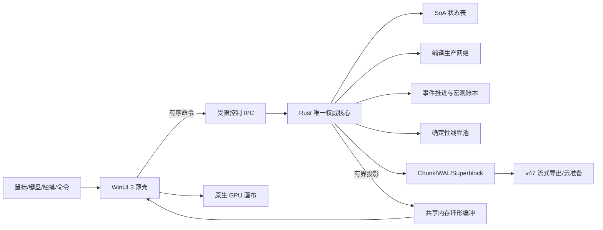

# DSP极简网络 Windows 全原生高性能桌面版总体重构计划

> 文档日期：2026-08-27
> 文档角色：Develop / active architecture execution
> 实施工作树：`D:\GameDev\DSPidle2-windows-full-native`
> 实施分支：`codex/windows-full-native-next`
> 基线提交：`9778ba4cfe4af2c9391f8deae35d6a6035295b40`；E18/E1a clean 源提交：`460742f8648387f299f31ebd961d2742c5a3ded8`
> 当前候选：1.2.3 E18/E1a；标准 clean 目录包已构建，Build ID 为 `1.2.3+460742f86483`，75 个文件、412,627,614 B，12 秒启动冒烟通过；未签名、未部署、`authorityEligible=false`
> 目标平台：Windows 10 1809+ / Windows 11 x64；ARM64 只在 x64 稳定后评估
> 兼容边界：GameState v47、envelope v2、cloud schema v8、SQLite layout v3 默认保持不变

## 1. 执行结论

新 Windows 桌面版不能只把 Electron 换成另一个壳，也不能只把现有 JavaScript 循环翻译成 Rust。要让真实极限档达到每墙钟秒至少推进一个模拟秒，并显著降低内存、保存和画布压力，必须同时完成四类重构：

1. Rust 成为唯一玩家可见权威，JavaScript、UI、保存器不再长期持有第二份完整状态。
2. 将 80,674 个实体和 155,746 条线路编译为可失效、可分区的生产网络，稳定区间按事件边界批量推进，而不是每秒逐对象扫描。
3. 按行星、恒星系和互不共享可变资源的网络执行确定性多核计算，在固定阶段合并跨区事件。
4. 使用原生增量存档、共享内存投影和 GPU 批绘，让保存、统计与 UI 不再复制或遍历整个工厂。

推荐终态：

```text
Windows 原生桌面应用
├─ WinUI 3 壳层进程
│  ├─ 菜单、设置、工作区、输入法、无障碍
│  ├─ 原生 GPU 工厂画布
│  └─ 仅持有视口、选择、摘要和命令状态
├─ dsp-native-runtime.exe（Rust，唯一权威）
│  ├─ 紧凑状态表与编译生产网络
│  ├─ 精确事件引擎与确定性多核调度
│  ├─ 纯挂机守恒宏观引擎
│  ├─ 增量统计与诊断
│  └─ 原生分块存档、WAL、恢复与 v47 流水线
└─ 受限更新/崩溃收集边界
```

现有 Electron 版、Web/PWA 和 Android 继续维护，不在新应用稳定前被替换。新应用必须支持独立安装、只读导入旧档和显式导出 v47；不得自动搬移、删除或覆盖现有应用数据。

## 2. 已确认基线与差距

### 2.1 真实极限档

| 指标 | 已确认值 |
| --- | ---: |
| 公开存档大小 | 76,898,141 B |
| 实体 | 80,674 |
| 线路 | 155,746 |
| 物流站实体 | 约 36,754 |
| 线路方向检查 | 每模拟秒约 311,492 |
| E18 原生一秒精确推进 | 1,419.74 ms（profile 中位）；auto 线程矩阵中位 1,415.05 ms |
| 同次 JavaScript 一秒推进 | 3,144.13 ms（profile 中位） |
| 当前原生局部增益 | 同 profile 约 2.21 倍；冻结公开 1.2.3 Host 到 E18 的三轮交错单步对比快 37.23% |
| 变化线路 | 140,023，约占 89.9% |

这份存档属于稠密活动网络。1.2.3 的活动队列会正确退化为全扫描，因此继续微调“休眠线路跳过比例”不能单独补齐 E18 距离实时模拟仍需的约 1.42 倍收益。

### 2.2 内存与保存基线

| 场景 | 历史基线 |
| --- | ---: |
| 1.1.8 纯挂机 60 秒全进程树峰值 | 约 2.49 GB |
| 1.1.8 建造、拆除、重连、蓝图、保存组合峰值 | 约 4.90 GB |
| 组合峰值中的 renderer | 约 4.57 GB |
| 1.2.3 原生子进程打开增量 | 约 290 MB，不能代表全进程树 |

主要问题不是 Electron 固定外壳本身，而是完整状态在 renderer、Worker、保存和原生影子之间重复，以及每秒大量通用 JSON/对象/哈希工作。

### 2.3 达到实时模拟需要的数量级

| 目标 | 相比当前原生核心仍需提升 | 相比 JavaScript 基线需提升 |
| --- | ---: | ---: |
| 1 秒推进 1 个模拟秒 | 约 1.42 倍 | 约 3.14 倍 |
| 1 秒推进 2 个模拟秒 | 约 2.84 倍 | 约 6.29 倍 |
| 15× 全逐秒精确时间扭曲 | 约 21.30 倍 | 约 47.16 倍 |

因此：普通运行应以“极限档实时精确”为目标；高倍率纯挂机应使用经过物料守恒证明的宏观推进，不能要求所有系统逐秒循环 15 次。

## 3. 产品目标、非目标与完成定义

### 3.1 玩家可见目标

- 极限档能够持续运行、建造、拉线、蓝图、统计和保存，不因达到约 5 GB 而崩溃。
- 主流 6～8 核、16 GB 机器上，真实极限档精确模式 P95 吞吐至少达到 1.0 模拟秒/墙钟秒。
- 12 核以上机器的稳定生产阶段目标达到 2.0 模拟秒/墙钟秒；这是目标，不是发布前承诺。
- 15× 纯挂机在稳定网络上能够跟上墙钟，终端结果均由闭合物料账本约束。
- 操作不静默回档；原生核心、UI、保存或 GPU 故障只能暂停在同 revision 恢复边界。
- 原始 v47 存档可导入、导出、云同步并返回 Web/Android 使用。

### 3.2 非目标

- 不通过降低产量、线路结算频率、物流公平性、取整精度或统计频率制造性能数字。
- 不让 GPU 承担权威库存、物流、科研、戴森或排行榜计算。
- 不把 Windows 私有分块格式变成云协议或 MOD 公共协议。
- 不自动修正、降低或回滚玩家现有戴森球、库存、生产和排行榜数据。
- 不为了“全原生”一次性删除 Web/Android 代码或 JavaScript oracle。
- 不在没有性能证据时承诺替换 Electron 一定带来数倍模拟收益。

### 3.3 项目完成定义

只有同时满足以下条件，才可称为“Windows 全原生高性能桌面版完成”：

- Rust 是唯一完整可修改权威状态所有者。
- UI、保存器、统计器、云客户端均只接收有界投影或流。
- 普通精确、离线、纯挂机、时间扭曲和恢复使用同一规则规范。
- 1/2/4/8/最大线程数跨 CPU 的规范状态哈希一致。
- v47 导入导出、旧档、内容包和云端往返无损。
- 低配、主流、高配 Windows 10/11 完成 24 小时长跑。
- 10,000 次关键提交点故障注入无不可检测损坏、无部分提交、无静默回档。
- 全进程树内存、模拟吞吐、保存 P95、UI 帧和恢复时间全部达到最低 Gate。
- 签名、覆盖升级、回滚、邀请 Beta 和分阶段灰度完成。

## 4. 技术路线决策

### 4.1 推荐终态

| 层 | 推荐技术 | 责任 |
| --- | --- | --- |
| 原生权威运行时 | Rust 独立进程 | 模拟、状态、统计、存档、恢复、兼容导出 |
| Windows 壳层 | WinUI 3 / Windows App SDK | 原生窗口、控件、IME、DPI、无障碍、生命周期、通知 |
| 工厂画布 | 首选比较 wgpu/D3D12 与 Win2D | 批量实例、线路、流量、拾取、LOD、GPU 故障回退 |
| 控制 IPC | 命名管道或继承管道，小型版本化帧 | 命令、ACK、错误、版本协商 |
| 数据 IPC | Windows file mapping 共享内存环形缓冲 | 视口、统计、诊断、批量二进制投影 |
| 私有存档 | 内容寻址 chunk + WAL + 双 superblock | 活动 revision 增量提交与崩溃恢复 |
| 公开兼容 | v47/envelope v2 流式适配 | Web/Android/云端互通 |

WinUI 3 是微软面向新 Windows 桌面应用推荐的原生 UI 框架，并支持 Windows 10 1809 及以上。Tauri 2 在 Windows 上使用 WebView2，仍是多进程 WebView 架构；它适合作为复用 React 的迁移桥梁，但不自动消除 WebView 固定开销和 UI GC。

### 4.2 必须进行的壳层 A/B 原型

在迁移全部 UI 前，用同一 `viewport-v2` 投影建立三种最小壳层：

1. 当前 Electron 薄 UI。
2. Tauri 2 + WebView2 薄 UI。
3. WinUI 3 + 原生 GPU 画布。

统一测量：冷启动、空闲 Private Bytes、10,000 可见实例帧 P50/P95/P99、中文 IME、200% DPI、触摸、屏幕阅读器、GPU 丢失恢复、包大小和覆盖升级。

终态选择规则：

- WinUI 3 相比薄 WebView 路径全进程内存至少再低 15%，或 UI P95/长任务显著更好：选择 WinUI 3。
- 差距不足 15% 且功能迁移成本明显更高：保留薄 WebView 控制面，但工厂画布和全部权威计算仍原生化。
- 不允许先重写全部界面，再寻找性能理由。

### 4.3 进程与安全边界

- 壳层不加载原生 DLL 到不可信 UI 插件上下文；Rust 运行时保持独立进程。
- UI 只能传逻辑槽位、命令、投影查询和取消令牌，不能传任意文件路径、命令行或进程句柄。
- 运行时只访问自己的应用数据目录和用户通过系统文件选择器授予的临时句柄。
- 子进程纳入同一 Windows Job Object，主进程退出时回收；不使用实时优先级。
- 共享内存包含 schema、session、revision、sequence、长度、校验和与只读/可写所有权，不包含指针、token、秘密或未初始化字节。

## 5. 目标运行架构



### 5.1 权威所有权

在稳定形态中只允许：

- 一份原生权威状态；
- 一个正在提交的增量事务；
- 一个最新的 UI 投影基线；
- 一个最后验证成功的持久 checkpoint；
- 有界的命令日志和共享内存页。

禁止 renderer、模拟 Worker、保存 Worker 和 Rust 各自长期保留一份完整 `GameState`。

### 5.2 revision 与命令协议

每个玩家动作携带：

- session ID；
- base revision；
- command ID；
- schema version；
- 有界 payload；
- 可选取消令牌。

原生核心只产生以下终态：

- `committed(resultRevision)`；
- `rejected(reason, currentRevision)`；
- `paused(recoveryBoundary)`；
- `fatal-export-only(recoveryBoundary)`。

不存在“失败后偷偷装入更旧 revision”的路径。

## 6. CPU 与模拟核心全面优化

### 6.1 原生常驻紧凑状态

- 导入时只解析一次 v47，随后使用数值 ID、字符串驻留表、SoA 热列和分块冷记录。
- 热列至少包括库存、输入输出、配方进度、供电、线路额度、路由游标、位置和 dirty bit。
- 拓扑、目录文本和历史字段分离，避免热循环触碰冷缓存行。
- 使用固定容量 scratch/arena/slab；模拟步结束复用，禁止每秒形成大量临时 `Vec`、`HashMap` 和字符串。
- 所有整数宽度、溢出、浮点边界和序列化舍入写入数值 ADR。

### 6.2 编译生产网络

仅靠 active queue 无法优化 89.9% 线路都变化的存档。新核心必须把原始对象图编译为执行计划：

- 按行星、物品、端口、优先级、共享源/目标和连通分量生成稳定 route group。
- 识别串联链、并联束、分流/汇流、循环强连通分量和跨星边界。
- 预计算容量、配方比例、静态拓扑顺序、公平轮询和库存依赖。
- 同端点、同物品、同优先级且语义等价的线路可作为批量容量组执行，但持久 ID、在途量和公平游标仍可恢复。
- 建造、拆除、配方、供电、量子库存、物流到货或内容包变化只失效受影响分量。
- 旧逐线路执行器继续作为测试 oracle，不能从稳定产品中提前删除。

### 6.3 精确事件驱动推进

新引擎不固定每秒扫描全部对象，而是计算下一有效事件：

- 输入耗尽；
- 输出装满；
- 配方、采矿、科研或制造阶段完成；
- 路线到达；
- 燃料/蓄电边界；
- 矿点枯竭；
- 戴森、合同、出口和巨构边界；
- 玩家命令或存档屏障。

稳定区间内一次推进到最早事件，并用整数/确定性批量公式结算。到达事件后只重算受影响网络。1 秒分段和事件跳时必须得到完全相同的规范状态哈希。

### 6.4 确定性多核调度

- 优先按互不共享可变资源的行星、恒星系和生产连通分量并行。
- 每个任务读取同一阶段不可变快照，写入私有事件缓冲。
- 跨分区物流、量子库存、空间站、银河出口和全局统计在固定阶段按稳定键合并。
- 工作窃取可以改变执行时间，不能改变合并顺序、浮点累加顺序或公平游标。
- 小存档或强耦合单网络自动单线程，避免线程开销反向变慢。
- 提供“节能、平衡、最大性能、自定义线程上限”；默认给 UI 和系统保留至少一个物理核心的调度余量。

### 6.5 向量化和批量数学

- 对相同配方族、矿机族、发电族和线路容量使用连续数组批量处理。
- 编译器自动向量化优先；显式 SIMD 只在基准证明收益且有标量 oracle 后采用。
- 大整数累计只在需要防溢出的账本边界使用，不把任意精度整数放进所有热循环。
- 热循环避免虚调用、字符串匹配和通用 JSON `Value`。

### 6.6 纯挂机与时间扭曲

采用双路径：

1. 精确事件引擎：处理动态网络、有限缓存、跨星到达、电力变化和终端系统。
2. 守恒宏观引擎：对已经证明稳定的网络建立输入、输出、库存、消耗、出口和终端账本，一次推进长窗口。

宏观合同必须：

- 记录区间开始/结束库存和所有来源/去向；
- 火箭、太阳帆、结构点、出口、合同和巨构交付分别闭合；
- 电力、增产剂、有限资源和科研倍率在边界重新求值；
- 网络失效或尾验失败时只冻结该网络尾段，不复制物料；
- 同一长窗口与任意合法分段确定一致；
- 定期抽取短精确窗口作为在线 oracle。

## 7. 内存架构全面优化

### 7.1 单一完整状态

- UI 不接收完整 GameState。
- 保存不先构造完整兼容 JSON。
- 统计不在打开页面时扫描整个工厂。
- 崩溃恢复使用持久 checkpoint + WAL，不在内存保留多个完整历史状态。

### 7.2 热、温、冷数据分层

| 层 | 示例 | 策略 |
| --- | --- | --- |
| 热 | 进度、库存、供电、活动线路 | 常驻 SoA、对齐数组、固定预算 |
| 温 | 当前行星拓扑、活动统计桶 | 分页驻留、revision 缓存、精确失效 |
| 冷 | 其他星球静态记录、历史、旧 checkpoint | 只读 mmap、压缩 chunk、LRU |

### 7.3 分配治理

- 记录每个领域的当前、峰值、分配次数和碎片预算。
- 事务使用 copy-on-write 页，不复制整个实体/线路集合。
- 共享内存和 mmap 计入全进程树，不用“Rust heap 很小”掩盖真实占用。
- 在 8 GB 设备使用更小 LRU 和线程池；在 32/64 GB 设备只扩大有收益的缓存，不无界吃满内存。
- 模拟和导出使用背压；内存不足时拒绝新任务并安全暂停，不回档。

## 8. 原生存档、磁盘与恢复

### 8.1 私有格式

复用并升级现有内容寻址 chunk、manifest-last、双 superblock 和连续 WAL：

- 实体页、线路页、拓扑、统计和系统域独立脏标记；
- dirty state 只在 durable ACK 后清除；
- 零变化保存只提交必要元数据或完全跳过；
- 冷页可 zstd 压缩，热页优先低 CPU/低峰值；
- checkpoint 合并仅在空闲且没有模拟/保存屏障时运行；
- 至少保留两个验证 generation 和一个公开 v47 恢复点。

### 8.2 Windows I/O

- 使用顺序流、固定缓冲、异步/重叠 I/O 和文件映射；不为 77 MB 存档引入面向大型游戏资产的复杂 I/O 技术。
- 每次提交写新文件或 `.part`，fsync/FlushFileBuffers 后原子替换指针。
- Defender 锁文件、磁盘满、只读目录、断电、杀进程和升级中断均进入故障矩阵。
- 删除旧 generation 只能在新代验证、保留策略和空间水位全部满足后执行。

### 8.3 公开 v47 与云端

- Rust 从原生状态表流式生成 envelope v2/GameState v47。
- checksum、UTF-8 长度、gzip、SHA-256 和文件写入在同一有界流水线完成。
- 导入使用范围/流式解析；迁移字段进入有界适配器，不能重新建立多份完整正文。
- 云上传向主进程提供只读句柄或有界流，renderer 不接收正文。
- 服务器继续验证上传正文和排行榜；不能信任客户端自报账本。

## 9. UI、画布与 GPU 全面优化

### 9.1 薄 UI 原则

UI 只订阅：

- 当前行星与视口；
- 选中/悬停/拖动/连接对象；
- 已打开工作区所需的摘要或分页数据；
- 命令 ACK、告警和通知。

关闭工作区立即解除订阅并释放详情缓存。遥测帧落后时可以合并中间帧，但库存变更、拓扑、命令 ACK 和错误不得丢弃。

### 9.2 原生 GPU 工厂画布

- 建筑、线路、流量和低细节标记使用 instancing/batched buffers。
- 静态几何、样式、拓扑和动态遥测使用独立 GPU buffer。
- 空间索引只提交视口和预取边界；视口外不创建 XAML/DOM 对象。
- 高细节卡片、编辑器、可访问性和输入控件保留在原生 UI 层。
- 命中使用稳定空间索引；GPU picking 只有在验证收益后启用。
- GPU device/context 丢失时重建资源并回退 CPU/Win2D 安全路径，不改变权威状态。
- 集显、独显、远程桌面和禁用硬件加速均必须可操作。

### 9.3 工作区重构

- 统计、星图、科技、蓝图、生产资料库、巨构和空间站全部使用分页/虚拟化列表。
- 排序和筛选请求原生索引，不在 UI 复制全集。
- 画布与工作区共享稳定实体 ID，不共享大型对象引用。
- 中文 IME、键盘、鼠标、触摸、80%～200% 字体、100%～300% DPI 和屏幕阅读器进入发布门禁。

## 10. 统计、诊断和性能可观测性

- 原生核心在结算时维护 1 秒、1 分钟、10 分钟和 1 小时层级时间桶。
- 统计查询只读取对应桶和过滤索引；关闭页面不生成 UI 详情。
- 通过 ETW/TraceLogging 记录可动态开关的 CPU、磁盘、内存、IPC、GPU、保存和恢复阶段事件。
- 开发/诊断版提供 WPR/WPA 采集配置，能够关联线程、页错误、文件 I/O、提交内存和 UI 长帧。
- 玩家遥测默认关闭；启用后只上传 Build ID、硬件档、数量区间、耗时/内存区间和错误码，不上传存档正文、坐标、库存、账号 token 或 MOD 正文。
- 每份性能报告必须包含完整进程树 Private Bytes，而不是只报告 Rust heap、JS heap 或某一进程。

## 11. 硬件自适应策略

### 11.1 硬件档位

| 档位 | 最低参考配置 | 默认策略 |
| --- | --- | --- |
| 低配 | 4 核 / 8 GB / 集显 | 2～3 工作线程、小 LRU、30 FPS 画布档、严格投影预算 |
| 主流 | 6～8 核 / 16 GB | 物理核心数减一、60 FPS 目标、中等 LRU |
| 高配 | 12+ 核 / 32～64 GB / 独显 | 拓扑感知线程池、更大只读缓存、60/120 FPS 可选 |

具体线程数必须由启动微基准、物理核心、内存、前台状态和真实队列动态选择，不能仅用逻辑核心数。

### 11.2 玩家设置

- 性能模式：节能 / 平衡 / 最大性能 / 自定义。
- 模拟线程上限。
- UI 帧率上限：30 / 60 / 120 / 跟随显示器。
- 内存缓存预算：自动 / 低 / 中 / 高。
- 后台行为：暂停 / 低速 / 保持性能。
- 硬件加速开关与安全回退。
- 诊断采样开关。

任何性能设置都不能改变相同模拟时间和命令序列的最终规范状态。

## 12. 性能预算与验收目标

以下是工程 Gate，不是未实测的宣传承诺。

### 12.1 真实极限档目标

| 指标 | 低配 Gate | 主流 Gate | 高配目标 |
| --- | ---: | ---: | ---: |
| 精确吞吐 | ≥0.5 模拟秒/墙钟秒 | ≥1.0 | ≥2.0 |
| 稳定纯挂机宏观吞吐 | ≥8 | ≥15 | ≥30 |
| 冷加载到可操作 | ≤10 s | ≤5 s | ≤3 s |
| 编辑+保存全进程树峰值 | ≤2.5 GB | ≤2.0 GB | ≤2.0 GB |
| 预热后内存斜率 | 无统计显著正斜率 | 无统计显著正斜率 | 无统计显著正斜率 |
| 普通增量保存 P95 | ≤500 ms | ≤250 ms | ≤150 ms |
| 零变化保存 P95 | ≤100 ms | ≤50 ms | ≤50 ms |
| UI 帧 P95 | ≤33.3 ms | ≤16.7 ms | ≤8.3/16.7 ms |
| 输入反馈 P95 | ≤80 ms | ≤50 ms | ≤35 ms |
| 崩溃恢复到可操作 | ≤15 s | ≤8 s | ≤5 s |

### 12.2 模拟一秒的主流机器预算

| 阶段 | P95 预算 |
| --- | ---: |
| 生产/采矿/科研/电力局部计算 | 180 ms |
| 编译线路网络与库存流结算 | 350 ms |
| 物流、量子、跨星和全局串行提交 | 180 ms |
| 戴森、巨构、空间站和统计事件 | 100 ms |
| 命令、投影、IPC 和检查点维护 | 120 ms |
| 调度与安全余量 | 70 ms |
| 合计 | 1,000 ms |

若某阶段超过预算，先做算法和数据布局分析；不能通过减少合法工作或延迟结算通过门禁。

## 13. 工作包

### WND-000：冻结基准和 ETW 可观测性（3～5 工程师周）

- 固定真实档匿名只读指纹、P50/P95/Max 合成档和硬件清单。
- 建立 WPR/WPA、ETW、全进程树内存和每阶段吞吐基线。
- 冻结性能场景、指标定义、Build ID 和报告模板。

### WND-100：新应用骨架与协议冻结（4～6 工程师周）

- 独立工作树、独立包身份和应用数据目录。
- 冻结 runtime/shell 协议、权限、版本协商和恢复状态机。
- 建立 Electron/Tauri/WinUI 壳层 A/B 原型。

### WND-110：原生常驻状态 v2（5～8 工程师周）

- v47 流式加载、SoA 热列、字符串驻留、冷热分层。
- 消除精确推进的通用 JSON 解析和重复规范扫描。
- 与 JavaScript 逐字段、逐域和规范哈希对照。

### WND-120：编译生产网络（7～11 工程师周）

- route group、SCC、批量容量组、反向依赖和精确失效。
- 旧逐线路路径作为 oracle。
- 极限档线路阶段目标从当前成本至少降低 60%。

### WND-130：精确事件引擎（8～14 工程师周）

- 下一事件时间、稳定区间批量结算、库存边界和分段等价。
- 有限资源、电力、物流到达和终端系统完整覆盖。
- 1/60/600 秒与随机分段哈希一致。

### WND-140：确定性多核调度（6～10 工程师周）

- 行星/恒星系/连通分量任务图。
- 固定阶段合并、线程池自适应、串行比例诊断。
- 1/2/4/8/最大线程跨 CPU 哈希矩阵。

### WND-150：守恒纯挂机与时间扭曲（5～8 工程师周）

- 稳定网络合同、完整物料账本、终端边界和尾验。
- 8×/12×/15×/16×，长窗与多段确定一致。
- 失败只冻结不可信尾段，不部分提交。

### WND-200：原生持久化 v2 与恢复（5～8 工程师周）

- 活动 revision 脏页、WAL、双 superblock、mmap 冷页和 LRU。
- 10,000 次故障注入、磁盘满、锁文件、升级中断。
- v47 恢复点和一键只读导出。

### WND-210：内存和分配治理（4～7 工程师周）

- arena/slab/scratch、COW 页、页缓存预算和泄漏检测。
- 8/16/32/64 GB 档位与 24 小时内存斜率。

### WND-300：共享内存投影与背压（4～7 工程师周）

- `viewport-v2`、`statistics-v2`、`diagnostics-v1`。
- Windows file mapping 环形缓冲、ACK、丢帧/合并规则和故障回退。
- UI 永不接收完整 GameState。

### WND-310：WinUI 3 壳层（8～12 工程师周）

- 生命周期、窗口、设置、文件选择器、更新、中文 IME、DPI、无障碍。
- 先覆盖启动菜单和最常用生产/保存流程，再迁移其余工作区。

### WND-320：原生 GPU 工厂画布（8～14 工程师周）

- wgpu/D3D12 与 Win2D 原型对比。
- 批绘、LOD、空间索引、拾取、GPU 丢失和软件回退。
- 密集视口 P50/P95/P99 与显存预算。

### WND-330：完整 UI 功能对齐（12～20 工程师周）

- 科技、统计、星图、蓝图、戴森、巨构、空间站、账号和 MOD 管理。
- Web 功能兼容清单逐项关闭，不凭界面存在宣称功能完成。

### WND-400：公开存档、云与 MOD 兼容（5～8 工程师周）

- 流式导入导出、云句柄上传、冲突处理和排行榜摘要。
- 内容包注册表 snapshot/fingerprint、自定义建筑和线路等级。

### WND-500：诊断、崩溃和本地支持包（3～5 工程师周）

- ETW provider、脱敏诊断导出、minidump/错误码策略。
- 支持包不包含存档正文、token 或私人 MOD 内容。

### WND-600：签名、安装、更新与回滚（4～7 工程师周）

- MSIX/直接下载路线评估、正式 Authenticode、SBOM、许可证和清单。
- side-by-side Alpha/Beta、覆盖升级、更新中断和稳定回滚。

### WND-700：长跑、硬件矩阵和灰度（8～14 工程师周）

- 低/主流/高配，Windows 10/11，集显/独显。
- 24 小时 A/B/C、真实玩家邀请 Beta、5%→25%→100% 灰度。

工作包可部分并行；从 1.2.3 继续完成全终态的粗略剩余投入约为 **96～157 工程师周**。4～6 人团队预计约 9～15 个日历月；单人承担实现、差分、UI 对齐和发布加固约 24～40 个月。任何日期必须在 WND-000 和壳层 A/B 原型后重新估算。

## 14. 推荐实施阶段和 Gate

### 阶段 A：基线与协议（WND-000/100）

Gate A：

- 三种壳层同场景可比较；
- 当前极限档每阶段耗时和内存 retained path 有证据；
- 新旧应用数据完全隔离；
- 协议、数值和恢复 ADR 冻结。

### 阶段 B：单线程原生实时核心（WND-110/120/130）

Gate B：

- 单线程原生与 JavaScript oracle 规范哈希一致；
- 极限档精确推进达到当前原生至少 2.5 倍；
- 网络编译失效、堵塞、断电和有限资源无差分。

未达到 2.5 倍时不得靠多核掩盖错误算法；继续优化数据布局和执行计划。

### 阶段 C：多核、宏观和唯一权威（WND-140/150/200/210）

Gate C：

- 主流机器极限档达到至少 1.0 模拟秒/墙钟秒；
- 1/2/4/8 线程和随机调度哈希一致；
- 15× 稳定纯挂机跟上墙钟且物料守恒；
- 原生故障无静默回档，10,000 次故障注入通过。

### 阶段 D：新壳层与 GPU（WND-300/310/320）

Gate D：

- UI 不持有完整状态；
- IPC/投影安装低于总帧预算 20%；
- 主流机器 P95 帧达到 16.7 ms，GPU 丢失可恢复；
- WinUI 相对薄 WebView 的实际收益满足选择标准。

### 阶段 E：功能对齐与兼容（WND-330/400/500）

Gate E：

- v47、云、内容包、账号、排行榜和所有工作区闭合；
- Web/Android 回归无行为变化；
- 原始玩家文件 SHA 不变。

### 阶段 F：发布加固（WND-600/700）

Gate F：

- 签名、SBOM、制品清单、覆盖升级和回滚通过；
- 三档硬件 24 小时通过；
- 邀请 Beta 无高于对照的崩溃、保存或恢复失败率；
- 发布角色另行取得明确授权后才能部署更新源。

## 15. 测试矩阵

### 15.1 确定性与守恒

- 1 秒、60 秒、600 秒、8 小时、30 天整段/随机分段。
- 1×、4×、8×、12×、15×、16×。
- 无限与有限资源、缓存耗尽、输出堵塞、断电、低供电、配方停止。
- 多行星、多恒星系、量子库存、跨星物流、戴森、巨构、空间站。
- 1/2/4/8/最大线程、不同 CPU、Debug/Release。
- 每物料库存、生产、消费、出口、销毁、在途和合法奖励闭环。

### 15.2 存档与故障

- v35～v47 支持范围导入、v47 重载、公开导出和云往返。
- 每个 WAL、manifest、superblock、chunk 和原子替换边界随机杀进程。
- 磁盘满、只读、文件锁、权限变化、校验损坏、截断和重复 revision。
- UI 崩溃、runtime 崩溃、GPU reset、系统重启和更新中断。
- 候选失败、取消、保存失败后源存档哈希不变。

### 15.3 UI 与硬件

- 1366×768、1920×1080、2560×1440、4K。
- 100%～300% DPI，80%～200% 游戏字体。
- 鼠标、键盘、中文 IME、触摸、触控板、屏幕阅读器。
- Intel/AMD 集显与 NVIDIA/AMD 独显，硬件加速关闭和远程桌面。
- 8/16/32/64 GB RAM，SATA SSD/NVMe，Defender 开启。

### 15.4 性能场景

- 冷启动、热启动、导入、索引、首帧、稳态。
- 180 秒精确、30 分钟候选、24 小时长跑。
- 每轮 20 放置、20 拆除、20 重连、1 蓝图，快速 3 轮、压力 25 轮。
- 活动模拟中连续 10 次自动保存、零变化保存、手动导出和云上传准备。
- 当前行星密集缩放、平移、框选、拖动、连线和工作区快速切换。

## 16. 数据保护和兼容策略

- 新应用首次启动只提供“复制导入”，不移动旧 Electron 数据目录。
- 导入前记录源大小、mtime 和 SHA-256；结束后再次验证源未改变。
- Windows 私有格式损坏时优先只读导出最近同 revision 的合法 v47，不自动回到旧 revision。
- GameState、envelope、cloud schema 或 SQLite 只有真实持久字段变化才升级；性能内部索引不进入公开状态。
- 历史玩家异常数据不在迁移中自动降低或修复；任何历史修复另做只读预览和人工授权工具。
- 内容包缺失、版本不符或 fingerprint 不匹配时拒绝模拟并允许导出，不静默删除自定义条目。

## 17. 发布、安装与支持周期

- 新应用使用独立包身份和应用数据目录，Alpha/Beta 可与旧 Windows 版并存。
- 开发诊断版默认不连接官方云；邀请 Beta 显式选择后才开启官方 API。
- 正式 Windows 包必须 Authenticode/MSIX 签名；未签名包只能标注为诊断版。
- 每个制品包含 Build ID、协议版本、运行时 SHA、manifest、SHA256SUMS、SBOM 和第三方许可证。
- JavaScript/Electron 回退至少保留一个稳定版本周期；回退只从同 revision 公开检查点启动。
- 发布按内部 Alpha → 邀请 Beta → 5% → 25% → 100%，每阶段至少观察一个完整保存周期和 24 小时。
- 本计划不授权连接生产、上传制品、修改下载页或切换稳定通道。

## 18. 风险登记表

| 风险 | 级别 | 缓解 |
| --- | --- | --- |
| 事件跳时与逐秒结果分叉 | P0 | JS/旧原生 oracle、随机分段、规范哈希、逐域差分 |
| 多线程改变公平顺序 | P0 | 私有事件缓冲、固定键合并、跨线程哈希矩阵 |
| 宏观模式复制终端物料 | P0 | 闭合账本、终端独立门禁、失败冻结尾段 |
| 原生存档损坏或静默回档 | P0 | COW、WAL、双 superblock、同 revision 恢复、故障注入 |
| UI 功能重写遗漏 | P1 | 功能对齐清单、旧应用并存、逐工作区验收 |
| 全原生壳层收益不足 | P1 | 三壳 A/B、15% Gate、允许薄 WebView 终止重写 |
| GPU 驱动/远程桌面故障 | P1 | Win2D/软件回退、设备丢失恢复、不影响权威状态 |
| 内存只从 renderer 转到 runtime | P1 | 全进程树 Private Bytes、mmap/共享页统一口径 |
| 高配满核导致 UI 卡顿/发热 | P1 | 自适应线程池、前台余量、节能/平衡模式 |
| MOD 与原生目录分叉 | P0 | 规范注册表、fingerprint、缺失失败关闭 |
| 云/排行榜信任客户端摘要 | P0 | 服务端独立校验，客户端账本只作诊断 |
| Windows 未签名影响安装 | P1 | 签名作为 stable Gate，未签名仅诊断版 |
| 工期与范围膨胀 | P1 | 每阶段 Go/No-Go、先实时核心后 UI 对齐 |

## 19. 必需 ADR

1. 唯一权威与 revision/command 模型。
2. 原生状态 v2 数据布局、数值和溢出规范。
3. 编译生产网络与失效边界。
4. 精确事件推进和逐秒等价定义。
5. 确定性多核阶段与固定合并顺序。
6. 纯挂机闭合账本与终端系统规则。
7. 共享内存 schema、所有权、背压和安全边界。
8. WinUI/Tauri/Electron 壳层 A/B 结论。
9. wgpu/D3D12 与 Win2D 渲染选择及 GPU 回退。
10. 私有存档 v2、mmap/LRU 和公开 v47 适配。
11. 原生故障恢复与无静默回档。
12. 内容包注册表与原生兼容。
13. Windows 签名、更新、并存和卸载数据策略。
14. ETW、崩溃报告和隐私遥测。

## 20. 开发交接摘要

- **Task ID / title：** Windows 全原生高性能桌面版总体重构
- **Priority：** P1 性能项目；确定性、守恒、存档与回档边界按 P0 管理
- **Source and attachments：** 1.2.3 工作树、三层计划书、ADR-005～007、76.9 MB 真实档只读基准
- **Reproduction or observed evidence：** 80,674 实体、155,746 线路、每模拟秒 311,492 路线方向检查；E18 profile 原生 1,419.74 ms/模拟秒、JS 3,144.13 ms/模拟秒；历史 1.1.8 构建/保存组合峰值约 4.90 GB
- **User-visible acceptance criteria：** 主流机器极限档 ≥1 模拟秒/墙钟秒；15× 稳定纯挂机跟上墙钟；组合峰值 ≤2.0 GB；保存、UI 和恢复达到第 12 节 Gate
- **Compatibility and data-preservation constraints：** 默认保持 v47/envelope v2/cloud v8/SQLite v3；原文件不改写；无静默回档；内容包安全失败
- **Target platforms：** Windows 10 1809+、Windows 11 x64；低/主流/高配和集显/独显
- **Required tests：** 第 15 节全部矩阵、10,000 次故障注入、三档硬件 24 小时、签名覆盖升级和邀请 Beta
- **Release target and version：** 未指定；必须在独立工作树开发，由后续开发任务确定版本，发布需独立授权
- **Known risks / rollback：** 第 18 节；旧 Windows 版并存，v47 为公开回退边界，同 revision 无法证明时暂停而不是降档

## 21. 官方技术资料

- [Microsoft：WinUI 3](https://learn.microsoft.com/en-us/windows/apps/winui/winui3/)
- [Microsoft：Windows App SDK](https://learn.microsoft.com/en-us/windows/apps/windows-app-sdk/)
- [Microsoft：Windows 桌面开发框架选择](https://learn.microsoft.com/en-us/windows/apps/get-started/)
- [Tauri 2：进程模型](https://v2.tauri.app/concept/process-model/)
- [Microsoft：WebView2 终端用户与进程模型说明](https://learn.microsoft.com/en-us/microsoft-edge/webview2/concepts/end-user-faq)
- [wgpu：Rust 原生 GPU API](https://docs.rs/wgpu/latest/wgpu/)
- [Microsoft：Direct2D](https://learn.microsoft.com/en-us/windows/win32/direct2d/direct2d-overview)
- [Microsoft：Win2D](https://learn.microsoft.com/en-us/windows/apps/develop/win2d/)
- [Microsoft：文件映射与共享内存](https://learn.microsoft.com/en-us/windows/win32/memory/sharing-files-and-memory)
- [Microsoft：Event Tracing for Windows](https://learn.microsoft.com/en-us/windows/win32/etw/about-event-tracing)
- [Microsoft：Windows Performance Recorder](https://learn.microsoft.com/en-us/windows-hardware/test/wpt/windows-performance-recorder)
- [Microsoft：Windows App SDK 生命周期](https://learn.microsoft.com/en-us/windows/apps/develop/launch/app-lifecycle)
- [Microsoft：MSIX 签名指南](https://learn.microsoft.com/en-us/windows/msix/package/sign-msix-package-guide)
- [Rayon：Rust 数据并行](https://docs.rs/rayon/latest/rayon/)

## 22. 与既有计划的关系

本计划承接而不覆盖 [Windows 高性能架构三层开发计划书](./WINDOWS_NATIVE_PERFORMANCE_DEVELOPMENT_PLAN_2026-08.md)：

- 原三层计划继续保存 1.1.8～1.2.3 的历史目标、实现和结算证据。
- 本计划把“极限档实时精确模拟”和“新 Windows 原生壳层”提升为独立终态目标。
- 1.2.3 已完成的脏页保存、线路唤醒、投影、流式导出、WAL 和原生领域代码应复用，不重新从零开发。
- 本计划的“全原生终态”仍未完成；第 23～24 节只记录已有 E18/E1a 单机实施与实测。clean 源提交 `460742f86483`、标准未签名目录包、可测 ZIP、12 秒启动冒烟和候选清单已经闭合；签名、24 小时、多硬件、安装/升级/卸载和发布仍未完成。

## 23. 2026-08-28 单机可闭合实施结算

本轮没有假设能在一次开发任务中完成 96～157 工程师周、三档硬件 24 小时、签名和真实灰度；实际完成的是当前仓库与本机可以用确定性差分闭合的核心部分：

- 原生核心 E5～E18：紧凑索引/线路、原始记录补丁、确定性机器并行、流式哈希与历史、本地/量子物流原位更新和 revision 内目录缓存；
- 30 秒精确前缀、普通产线有界宏观合同和终端物料冻结的守恒纯挂机；
- 活动 revision 脏页保存、WAL、双 superblock、流式 v47 导出、10,000 次故障注入；
- `1/2/4/8/auto` 真实档线程矩阵与固定顺序提交；
- 独立 Windows 性能开发版身份、默认离线、只读诊断和设备级线程策略；
- E1a durable 单写者栅栏、启动检查与 host-only 固定 exact pending-tick 路径。

当前明确没有完成：

1. renderer 不持有完整 GameState 的玩家可见唯一原生权威；
2. public primary writer、main-owned catalog 和崩溃后自动同 revision UI 恢复；
3. 全部 JSON 热记录的纯列式 v2、mmap/LRU 与真正共享内存零拷贝；
4. WinUI/Win2D/wgpu 全功能 UI 重写；
5. Windows 10/11 三档硬件 24 小时、Defender/磁盘满/覆盖升级、Authenticode、邀请 Beta 与灰度。

因此本轮交付名称是“Windows 性能开发候选”，不是“全原生终态”。`authorityEligible=false`、GameState v47、envelope v2、cloud schema v8 和 SQLite layout v3 保持不变；任何旧版公开档只能显式导入，程序不自动修改或迁移稳定版 profile。

## 24. 本机实测结论

同一 76.9 MB 只读玩家档上，公开 1.2.3 Host 到 E18 的 exact 中位提升为：打开快 24.00%、打开峰值降低 35.32%、一秒精确推进快 37.23%、推进峰值增量降低 27.67%。E18 的 auto 线程一秒中位约 1.415 秒，已明显接近但仍未达到本机“1 墙钟秒算完 1 模拟秒”的 Gate C；不能把局部阶段或 JavaScript 对照速度包装成实时达标。

公开基线的三连推进与 JavaScript 分叉，故完整 A/B 没有合法百分比；E18 自身 full 场景 3/3 全部 exact。最终结论必须同时表达两点：新候选比共同可比的单步基线更快、更省峰值，并且修复了当前基线无法通过的连续推进正确性门禁；但玩家可见单权威和外部发布 Gate 仍未完成。
