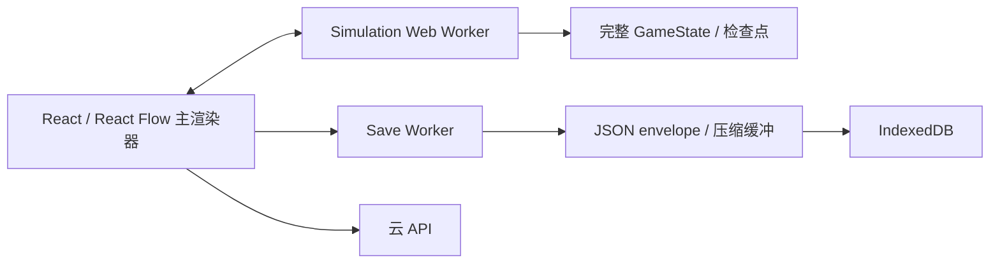
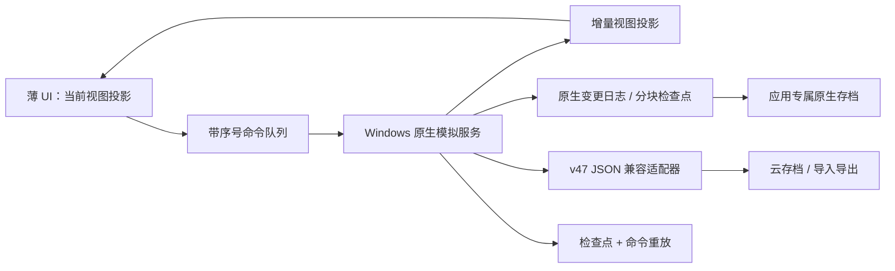
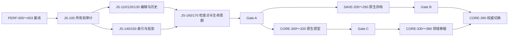
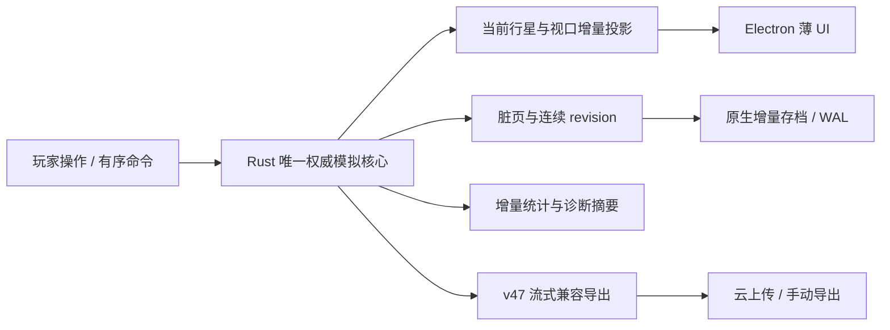

# DSP极简网络 Windows 高性能架构三层开发计划书

> 文档日期：2026-08-26；Windows 深度优化扩展：2026-08-27
> 文档性质：实施建议与开发交接，不代表功能已经实现、测试通过或已经发布。
> 当前角色：Feedback / 架构分析。本文只规划，不修改模拟、存档、Windows 制品或生产环境。
> 适用基线：1.1.8 内存优化候选、GameState v47、save envelope v2、cloud schema v8、SQLite layout v3。
> 目标平台：Windows 10/11 x64 为主要性能目标；Web/PWA 与 Android 保持功能和存档兼容。
> 2026-08-27 补充说明：第 19 节记录基于 1.2.1 Windows 开发候选观察得到的下一阶段优化包。1.2.1 的 Rust 核心仍是影子校验，不能把双重计算或单项原生基准误报为玩家可见的完整性能提升。
> 2026-08-28 实施说明：第 20～22 节记录 develop 角色在独立工作树中的实际落地与验证；它们不会把原计划预算、外部硬件 Gate 或 No-Go 自动改写为“完成”。当前最终开发包仍为 `authorityEligible=false`，未签名、未部署、未连接生产。

## 1. 执行摘要

本计划把 Windows 高性能架构分成三层，并要求按顺序推进：

1. **第一层：优化现有 JavaScript 架构**
   消除完整状态复制、编辑历史膨胀、无差别全量扫描和全量 UI 投影。它不依赖原生重写，是近期解决 5 GB 左右崩溃风险的最高优先级。
2. **第二层：原生增量存档**
   Windows 使用受限原生文件服务保存二进制分块、变更日志和校验清单；JSON v47 继续作为导入、导出、云同步和降级兼容格式。
3. **第三层：原生模拟核心**
   将权威模拟逐域迁移到隔离的 Windows 原生进程，Chromium 界面只接收当前视图投影和全局摘要。原生核心必须先以影子模式与 JavaScript 引擎逐步对照，不能一次性替换。

本计划不把“打包成 Electron”当作性能优化。当前 Electron 桌面端加载的是同一套 Vite、React、Web Worker 和 IndexedDB 代码，仅替换应用外壳不会消除主要内存占用。

### 1.1 详细投入和目标区间

| 层级 | 详细拆分后的投入 | 当前 4.90 GB 组合峰值的阶段目标 | 主要收益 |
| --- | ---: | ---: | --- |
| 阶段 0：基线与可观测性 | 4～7 工程师周 | 不直接承诺下降 | 建立可信口径、崩溃分类和 Go/No-Go 证据 |
| 第一层：JavaScript 架构 | 17～27 工程师周 | 2.8～3.8 GB | 编辑、模拟、UI 状态副本减少；建造/拉线吞吐提高约 1.3～2 倍 |
| 第二层：原生增量存档 | 17～25 工程师周 | 第一层基础上约 2.3～3.2 GB | 保存峰值再降约 20%～40%，保存耗时下降约 30%～70% |
| 第三层：原生模拟核心 | 47～76 工程师周 | 三层完成后约 1.5～2.5 GB | 总内存下降目标 40%～70%，模拟吞吐目标 1.5～3 倍 |
| 全项目 | 85～135 工程师周 | 由每层 Gate 决定是否继续 | 包含实现、差分验证、故障恢复和发布加固 |

这些是立项预算和验收目标，不是已经实测的承诺；各阶段收益相互重叠，禁止相加后对外宣传。

推荐团队为 4～5 人，预计 7～11 个日历月完成三层的可发布版本；3 人团队更接近 10～15 个月。单人实施包含兼容、测试和发布加固时，预计 20～34 个月。若第一层已经满足稳定性目标，可以暂停或缩小第三层，避免为“原生”本身进行无收益重写。

## 2. 已确认事实、待验证假设和目标

### 2.1 已确认事实

- 玩家压力存档约 76,898,141 字节，包含 80,674 个实体、155,746 条线路和约 36,754 个物流站实体。
- 1.1.8 最终 60 秒纯挂机测试中，全部隔离 Chrome 进程私有内存合计峰值约 2.49 GB；主渲染器约 2.16 GB。
- 1.1.8 最终 60 秒建造、拆除、重连、蓝图和自动保存组合测试中，全部进程私有内存合计峰值约 4.90 GB；主渲染器约 4.57 GB。
- 组合测试时主渲染器约占全部进程私有内存的 93%，浏览器、GPU 和工具进程合计约 0.33 GB。因此仅替换浏览器外壳不能根治峰值。
- 当前 Windows 客户端是 Electron `BrowserWindow`，仍加载相同 Vite 构建；游戏本地存档仍主要由渲染器中的 IndexedDB 管理。
- 当前权威模拟由 Web Worker 持有；检查点协议仍包含 `JSON.stringify`、`TextEncoder` 和重新 `JSON.parse` 的对象镜像。
- 当前保存 Worker 会投影持久状态、生成兼容 envelope、校验并压缩；Worker 可以减轻主线程阻塞，但不代表对象图天然共享。
- 1.1.8 的分块保存已证明后续写入量可以显著下降，但第一次种子和保存前的状态投影、扫描、序列化仍会产生峰值。
- 2026-08-26 只读检查时，香港公网 `version.json` 返回 1.1.6，而本地压力数据来自 1.1.8 候选。两者不能当作同版本 A/B。

### 2.2 尚未确认的假设

- 玩家约 5 GB 崩溃不一定是香港 VPS 内存造成。模拟在玩家浏览器内执行，VPS 主要提供静态资源和云 API；更可能的变量包括实际 Build ID、Service Worker 缓存、浏览器版本、系统提交限制、页面/Worker 崩溃和本机剩余内存。
- 本地 Chrome 显示 14.3 GB 仍不崩溃，只能证明该测试机和该运行条件拥有更高的可用提交空间，不能证明 14.3 GB 是合理目标，也不能证明线上版本必然存在固定 5 GB 硬限制。
- 原生模拟是否能达到 3 倍以上提升，取决于真实热点、IPC 数据量、内容包兼容和串行物流比例，必须由原型验证。

### 2.3 项目最终目标

- 超大存档运行不依赖“涨到危险水位后自动暂停”才能保持稳定。
- 任何保护或故障都不得静默回到旧画面状态；失败时应暂停、保留可验证日志并允许恢复或导出。
- 相同存档、内容注册表、命令序列和模拟时间必须得到相同权威结果。
- 建造、拆除、线路重连、蓝图和保存不再同时保留多份完整状态。
- Windows 原生增强失败时，玩家仍能读取 v47 JSON、切回 JavaScript 路径并继续游戏。
- Web、Windows、Android 和云端继续交换兼容的 v47/envelope v2 数据，除非另行批准格式升级。

## 3. 非目标

本计划不包含：

- 通过降低产量、减少模拟秒、删除线路或限制建筑堆叠解决性能问题。
- 通过清档、截断库存、丢弃在途货物或重建玩家工厂完成迁移。
- 一次性重写全部 React 界面或立即放弃 Web/Android。
- 在第一阶段直接修改香港/上海生产配置、数据库或下载页。
- 把开发服务器、生产构建、Chrome、360 浏览器和 Electron 的不同口径内存混在一个对比表中。
- 未经真实存档测试就对玩家承诺固定性能百分比或发布日期。
- 将 Windows 原生状态直接上传云端，从而让旧客户端无法读取。

## 4. 架构原则

### 4.1 数据所有权

最终只允许一个权威模拟状态所有者。UI、保存器和统计系统只能接收：

- 只读快照；
- 当前星球投影；
- 增量事件；
- 带 revision 的检查点；
- 可验证的二进制块。

禁止主线程、模拟 Worker、保存 Worker和原生进程长期各自保留一份可独立修改的完整 `GameState`。

### 4.2 确定性优先

性能优化不得改变：

- 生产顺序和结算边界；
- 库存、线路缓存、物流在途货物和制造 WIP 守恒；
- 电力分配、矿脉扣除、科研和戴森结算；
- 暂停、离线、时间扭曲和纯挂机语义；
- 内容包 ID、配方、建筑及线路定义。

如果原生语言的浮点行为与 JavaScript 不一致，必须先定义规范化整数/定点语义，不能用宽松误差掩盖存档结果分叉。

### 4.3 渐进替换

每一层必须满足：

- 新旧路径能够同机对照；
- 具有设备级或候选级功能开关；
- 可在不修改存档正文的情况下关闭；
- 有明确的 Go/No-Go 门槛；
- 新路径失败不会删除旧路径可读数据。

### 4.4 Windows 安全边界

原生文件和模拟服务只能通过窄 IPC 接口访问：

- 不允许渲染器传入任意文件路径；
- 文件必须位于应用专属数据目录或玩家显式选择的导入/导出位置；
- IPC 请求必须验证消息类型、大小、revision、校验和与调用窗口；
- 原生服务不接收云 token、账号密码或任意 shell 命令；
- 任何诊断不得包含玩家存档正文。

## 5. 当前与目标架构

### 5.1 当前路径



主要问题是完整对象、字符串和缓冲区在多个阶段重叠存在，编辑和撤销历史还会延长旧状态生命周期。

### 5.2 三层完成后的目标路径



Web 和 Android 继续使用 JavaScript 权威核心；共享规则夹具和差分测试保证跨平台结果一致。

### 5.3 现有模块归属和预计触点

| 责任域 | 当前主要模块 | 本计划中的责任 |
| --- | --- | --- |
| 应用协调/调度 | `src/App.tsx`、`src/FactoryRuntime.tsx` | revision、命令队列、投影安装、保存/模拟屏障、故障 UI |
| 权威模拟规则 | `src/game/engine.ts` | 第一层增量索引；第三层差分 oracle 和逐域移植来源 |
| 实时 Worker | `src/game/simulation.worker.ts` | 状态所有权、命令协议、影子模式和 JS 回退 |
| 检查点协议 | `src/game/simulationRuntimeProtocol.ts` | 移除重复完整对象镜像，定义版本化二进制/原生边界 |
| UI 投影 | `src/game/simulationProjection.ts`、`src/game/canvasRenderSnapshot.ts` | 当前行星/视口增量投影和引用稳定性 |
| 保存生成 | `src/game/save.worker.ts`、`src/game/storage.ts` | v47 兼容生成、校验、导入导出和云边界 |
| 本地持久化 | `src/game/localSaveStore.ts`、`src/game/chunkedSaveJournal.ts` | Web/Android 回退、Windows 双写和 revision 协调 |
| 权威持久化 Worker | `src/game/authoritativeSavePersistenceClient.ts`、`src/game/authoritativeSavePersistence.worker.ts` | proof/CAS 兼容、双写过渡、失败终态 |
| Windows 主进程 | `desktop/main.cjs`、`desktop/preload.cjs`、`src/desktop.ts` | 受限文件 IPC、原生服务生命周期、更新和诊断 |
| 内容包 | `src/game/contentPacks.ts`、相关目录注册模块 | 规范注册表快照、fingerprint 和原生核心同步 |
| 基准与测试 | `scripts/benchmark-long-memory.mjs`、Vitest、Playwright | 统一指标、真实档压力、确定性差分和故障注入 |

`src/App.tsx` 和 `src/game/engine.ts` 都是高冲突巨型模块。开发前应先建立窄协议和辅助模块，避免三层同时直接修改同一段调度代码。任何跨层修改都要指定唯一 owner，并通过小提交合并。

## 6. 阶段 0：冻结基线与可观测性

阶段 0 是三层共同前置条件，不能省略。

### 6.1 工作项

#### PERF-000：冻结四类测试夹具

- 小型功能档：快速验证规则和迁移。
- P50 终局合成档：日常性能回归。
- P95 超大合成档：持续集成中的高压回归。
- 玩家极限档的只读副本：只在受控本地基准中使用，不进入 Git、制品或服务器。

每个夹具记录文件字节数、实体数、线路数、物流站数、行星数、内容包 fingerprint 和 SHA-256；不记录账号或玩家身份。

#### PERF-001：统一内存口径

必须同时采集：

- OS 全进程树 Private Bytes；
- 主渲染器 Private Bytes / Working Set；
- JavaScript used heap 与 heap limit；
- Simulation Worker、Save Worker 和未来原生进程的独立内存；
- GPU 与浏览器主进程内存；
- 峰值、稳态、每分钟斜率和操作后回落值。

禁止只用 Chrome 标签页弹窗中的一个数字代表全部内存。

#### PERF-002：统一场景

每个候选至少运行：

1. 导入后暂停 60 秒；
2. 纯挂机 180 秒；
3. 纯挂机 30 分钟；
4. 连续三轮建造、拆除、重连和蓝图；
5. 三轮编辑和三次自动保存重叠压力；
6. 手动保存、导出、云上传准备；
7. 页面后台/恢复；
8. Worker 或原生服务故障注入。

#### PERF-003：版本和环境证明

每个报告必须包含：

- Git SHA、App Version、Build ID；
- 开发服务器或 production preview；
- Chrome/Electron 版本；
- Windows 版本、CPU、物理内存、页面文件配置；
- 内存保护开关和阈值；
- Service Worker 控制状态；
- 存档 SHA-256。

### 6.2 工期与交付物

| 工作 | 工程师周 |
| --- | ---: |
| 基准脚本与进程树采样 | 1.5～2.5 |
| 四类夹具和确定性摘要 | 1～1.5 |
| 崩溃/故障分类和报告模板 | 0.5～1 |
| 低内存测试机与 production preview 门禁 | 1～1.5 |
| 合计 | 4～6.5 |

交付物：冻结基线报告、机器清单、可重复命令、指标 JSON schema、崩溃分类表和对比报告模板。

### 6.3 完成标准

- 相同候选连续运行三次，主要峰值偏差可以解释；建议控制在 ±10%。
- 能区分保护暂停、页面崩溃、Worker 退出、OS 提交失败、V8 OOM 和浏览器进程被杀。
- 本地 14 GB 与线上约 5 GB 现象至少完成同 Build ID、同 production 构建的一次对照；否则保持为环境差异假设。

## 7. 第一层：优化现有 JavaScript 架构

### 7.1 目标

在不改变 GameState v47 和玩法语义的前提下，让内存主要与“实际变化区块和当前可见数据”相关，而不是与完整工厂大小乘以副本数量相关。

阶段目标：

- 组合场景全进程私有峰值从约 4.90 GB 降至 2.8～3.8 GB；
- 纯挂机 30 分钟没有持续线性增长；
- 连续建造/拉线吞吐提高约 1.3～2 倍；
- 操作后内存能够回落，不因撤销栈永久保留多份完整工厂；
- 内存保护默认仍保留，但正常基准不应依赖它才能跑完。

### 7.2 工作包

#### JS-100：状态所有权审计

- 绘制主线程、Simulation Worker、Save Worker、持久化 Worker 的对象生命周期图。
- 列出所有 `structuredClone`、`JSON.stringify`、`JSON.parse`、完整数组 spread/map 和完整 checkpoint 路径。
- 为每份大对象标注创建者、持有者、释放条件和最大允许并发数。
- 增加开发态断言：同一时刻最多一个完整保存检查点、一个待提交 Worker 状态和一个 UI 投影基线。

**估算：1～1.5 工程师周。**

#### JS-110：命令化编辑和单批 draft

- 建造、拆除、线路重连、蓝图部署改为带 revision 的领域命令。
- 同一用户批次只创建一次 mutable draft 或一次分块写集合。
- 批量操作不允许每条线路重复复制 80,000 个实体和 150,000 条线路。
- 命令返回精确 changed entity IDs、belt IDs、planet IDs 和库存差异。
- 主线程只发布一次最终状态和一次视图变更。

**估算：3～4 工程师周。**

#### JS-120：分块实体/线路容器

- 在运行时引入固定大小页或分块表，GameState v47 序列化边界仍输出普通数组。
- 修改一个实体只复制该实体所在分块和上层索引，不复制完整数组。
- 建立稳定 ID→chunk/offset 索引；拓扑变化只更新受影响星球和相邻线路。
- 首期可以只覆盖编辑热点，模拟引擎逐步接入，避免一次性改造全部规则。

**估算：3～5 工程师周。**

#### JS-130：撤销/重做差异日志

- 撤销项保存命令逆操作或前后差异，不保存完整 `GameState`。
- 设置按数量和估算字节双重限制。
- 清空 redo 时立即释放引用。
- 保存和 Worker 回执不得持有历史栈快照。
- 蓝图和批量操作作为一个原子历史项。

**估算：1.5～2.5 工程师周。**

#### JS-140：增量模拟索引和脏区块

- 维护实体、线路、物流、行星和电网 dirty set。
- 只重建发生拓扑、配方、库存源或策略变化的网络。
- 稳定网络继续使用运行时索引；新产出、线路接入或库存变化精确唤醒。
- 保存 dirty set 与模拟 dirty set 分开，不能互相清除。
- 保留旧全扫描路径作为测试 oracle 和紧急回退。

**估算：2.5～4 工程师周。**

#### JS-150：UI 投影和渲染隔离

- React 状态不再持有全量可编辑权威对象图。
- 只向当前行星、当前视口、选中对象和全局摘要发布投影。
- 节点拓扑、节点遥测、线路几何和流量动画分别更新。
- 不变节点和边保持引用稳定，避免 React Flow 全量提交。
- 统计页和侧栏按需请求聚合，关闭后释放缓存。

**估算：2.5～4 工程师周。**

#### JS-160：检查点和保存互斥收口

- 检查点以一个可转移二进制所有权为中心，不同时保留对象镜像和完整 JSON 字符串。
- 保存期间禁止产生第二份完整 checkpoint。
- Worker 回执后立即解除临时 buffer、Blob 和 source transfer 引用。
- 自动保存请求合并到最新 revision；旧 revision 只取消，不排队生成。
- 保存失败保持当前可见进度，进入明确 failed/paused 状态，不静默安装旧检查点。

**估算：2～3 工程师周。**

#### JS-170：缓存和生命周期治理

- 为投影、目录、诊断、统计和历史缓存设置拥有者和上限。
- 进入主页、切换存档和导入新档后验证旧 Worker、监听器和对象引用释放。
- DevTools heap snapshot 建立 retained-path 清单。
- 修复可以稳定复现的闭包、事件监听器或 Promise 队列滞留。

**估算：1～2 工程师周。**

上述工作包的详细投入合计约 16.5～26.5 工程师周，项目预算取整为 **17～27 工程师周**。并行只能缩短日历时间，不能减少工程师周。

### 7.3 第一层测试矩阵

- 领域单测：每个命令的正向、逆向、缺料、非法 revision 和原子失败。
- 差分测试：旧全扫描/旧编辑路径与新路径的状态哈希相同。
- 守恒测试：库存、缓存、在途、燃料、WIP、矿脉和施工库存。
- 历史测试：撤销/重做 100、1,000 次；历史字节上限和释放。
- 压力测试：10/100/1,000 次放置、拆除和重连。
- UI 测试：当前视口外节点不重建；选择、拖动、连线和缩放保持正确。
- 生命周期测试：导入→运行→主页→再次导入，Worker 数和内存回到基线。
- 生产构建长跑：纯挂机 30 分钟和编辑+保存 10 分钟。

### 7.4 第一层 Go/No-Go

**Go：**

- 状态哈希和守恒全部通过；
- 组合峰值至少降低 25%；
- 30 分钟纯挂机没有显著正斜率；
- 100 次编辑无回档、无未提交时间丢失；
- Web、Electron 和 Android 仍能读取/写出兼容 v47。

**No-Go：**

- 任何命令顺序导致结果分叉；
- 新容器进入存档并破坏旧客户端；
- 撤销导致库存复制或丢失；
- 峰值改善不足 15%，且成本转移到更长停顿；
- 保护关闭后仍存在程序主动安装旧检查点的路径。

## 8. 第二层：Windows 原生增量存档

### 8.1 目标

Windows 运行时不再为每次本地保存构造和提交完整 77 MB JSON。原生文件层保存分块快照和变更日志，同时保留 v47 JSON 兼容出口。

阶段目标：

- 在第一层基础上，编辑+保存峰值再降低约 20%～40%；
- 后续自动保存写盘量降低 80%～99%；
- 自动保存 P95 延迟降低约 30%～70%；
- 任意保存阶段杀进程后，可恢复到最后一个完整提交或重放已校验日志；
- 不产生损坏但看似成功的主档。

### 8.2 格式边界

建议新增 **Windows 内部运行格式 v1**，但不立即改变公开 JSON 格式：

```text
save-root/
  superblock-A
  superblock-B
  manifest/<generation>
  chunks/base/<chunk-id>
  chunks/entities/<page-id>
  chunks/belts/<page-id>
  chunks/systems/<system-id>
  wal/<segment-id>
  recovery/<checkpoint-id>
```

核心规则：

- 双 superblock 只指向已完成校验的 generation；
- manifest 记录格式版本、GameState 版本、内容包 fingerprint、chunk 清单、字节数和根校验；
- chunk 不在原地覆盖，写入新文件后再原子切换 manifest；
- WAL 记录命令序号、基础 revision、结果 revision 和 payload 校验；
- 合并只在空闲且没有保存/模拟屏障时运行；
- 旧 generation 在新 generation 读回验证后再按保留策略回收。

具体采用 CRC32C、SHA-256 或其他组合需要单独 ADR。根校验必须保持密码学强度；快速块校验不得取代完整根校验。

### 8.3 工作包

#### SAVE-200：格式 ADR 和威胁模型

- 定义文件布局、整数编码、字节序、版本字段和最大长度。
- 定义未知字段、未知 chunk、重复 ID 和截断文件的处理。
- 定义断电、磁盘满、杀进程、杀 Worker、杀 Electron 和杀原生服务的恢复结果。
- 定义 Windows Defender/杀毒软件锁文件、重命名失败和只读目录行为。

**估算：1.5～2.5 工程师周。**

#### SAVE-210：受限 Electron 文件服务

- 主进程只暴露 open/save/commit/read/export 等类型化 IPC。
- 所有运行时存档固定在 `app.getPath("userData")` 下的应用目录。
- 导入/导出只使用系统选择器返回的已授权句柄。
- 使用临时文件、flush、原子替换和目录级提交顺序。
- 限制单消息和单块大小，使用 MessagePort/流式传输。

**估算：2.5～4 工程师周。**

#### SAVE-220：分块编码器和脏块写入

- 将第一层 dirty set 映射为稳定 chunk ID。
- 实体、线路和系统状态使用紧凑二进制编码。
- 生成 manifest 和校验树，不先拼出完整 JSON。
- 支持零变化保存只提交元数据或不写数据块。
- 提供离线检查工具，能验证但不能修改玩家存档。

**估算：4～6 工程师周。**

#### SAVE-230：WAL 和崩溃恢复

- 每条编辑/模拟提交绑定单调 revision 和命令序号。
- WAL 先写后提交，重放必须幂等。
- 启动时只接受完整校验的 checkpoint + 连续 WAL。
- 发现缺段、重复、校验失败或基础 revision 不匹配时停止自动采用，保留候选并提供诊断。
- 绝不按“文件更新时间更晚”猜测胜者。

**估算：3～5 工程师周。**

#### SAVE-240：v47 JSON 双向适配器

- 首次读取旧 JSON 后创建内部格式，不覆盖原始导入文件。
- 手动导出、云上传和降级前生成兼容 v47/envelope v2。
- 从原生格式导出的 JSON 必须通过现有迁移器、checksum 和服务端验证。
- 降级到旧 Windows/Web 客户端时使用最后一次完整 JSON 基线，并明确提示可能不包含尚未合并的增量日志。

**估算：3～4.5 工程师周。**

#### SAVE-250：Web/Android 回退与双写期

- Web/Android 继续使用 IndexedDB 路径。
- Windows Beta 初期同时保留经过验证的 v47 JSON 恢复点。
- 双写必须从同一个权威 revision 生成，并验证两者摘要一致。
- 原生写成功、JSON 写失败或相反时，不允许悄悄宣称保存完成。

**估算：2～3 工程师周。**

#### SAVE-260：压缩、合并和保留策略

- 仅在收益明确时对冷 chunk 压缩；热 chunk 优先避免 CPU/内存峰值。
- 空闲合并使用有界速率和可取消任务。
- 保留至少两个已验证 generation 和最近恢复点。
- 磁盘水位不足时先停止合并/保存并提示，不删除最后有效存档。

**估算：1.5～2.5 工程师周。**

上述工作包合计约 16.5～24.5 工程师周，项目预算取整为 **17～25 工程师周**。

### 8.4 故障注入矩阵

至少在以下位置逐一杀进程或制造错误：

- chunk 写入前、写入一半、写入完成未 flush；
- manifest 写入一半；
- superblock 切换前后；
- JSON 兼容基线生成期间；
- WAL 写入和 checkpoint 合并期间；
- 磁盘剩余 0、权限拒绝、文件被占用；
- 原生服务重启、Electron renderer 崩溃、整个应用被任务管理器结束。

每个故障必须得到以下之一：

- 恢复到最后已验证 revision；
- 连续重放到最新已验证 revision；
- 明确停止自动恢复并保留所有候选供导出。

不得得到“打开成功但库存或线路已部分回退”的状态。

### 8.5 第二层 Go/No-Go

**Go：**

- 10,000 次随机故障注入没有不可检测损坏；
- v47 JSON 往返状态哈希一致；
- 第二次及以后保存写入量中位数降低至少 80%；
- 编辑+保存峰值在第一层基础上再降低至少 20%；
- 旧客户端可以读取兼容导出；
- Windows 覆盖升级不删除应用数据。

**No-Go：**

- 双写产生不一致 revision；
- 原生格式成为唯一副本但恢复工具尚未成熟；
- IPC 需要任意路径或扩大渲染器文件权限；
- 保存变快但首次加载、云上传或导出峰值反而超过旧路径；
- 杀毒软件锁文件时会覆盖最后有效 generation。

## 9. 第三层：Windows 原生模拟核心

### 9.1 推荐形态

推荐优先评估 **Rust 独立进程**，而不是直接把原生库加载到 Electron renderer：

- 独立进程崩溃不会直接击穿 UI 进程；
- 内存和 CPU 可以独立采样；
- 可以限制 IPC 和文件权限；
- 更容易实现检查点、重启和命令重放；
- Rust 的所有权和边界检查适合紧凑状态容器。

C++ 或 C# 仍可作为团队能力匹配的备选。语言必须通过 ADR 决定，不能仅因理论基准选择。WASM 可用于共享 Web/Windows 规则，但如果仍在 JS 堆和 WASM 内存之间复制完整状态，它不能自动解决主要峰值。

### 9.2 原生数据布局

目标运行时不直接复刻 JavaScript 对象图，而使用：

- 稳定 ID 表和 generation；
- Structure of Arrays 或分块紧凑结构；
- 索引化字符串/目录 ID；
- 每行星、每物流网络和每线路分量的运行索引；
- 明确整数宽度和溢出规则；
- 仅在规则确有需要时保留规范化小数累计器；
- dirty bitset 和增量事件队列。

### 9.3 IPC 协议

控制面使用小消息：

- `OpenSave`
- `ApplyCommands`
- `AdvanceSimulation`
- `RequestProjection`
- `CreateCheckpoint`
- `PrepareCompatibleExport`
- `Pause`
- `Shutdown`

数据面使用：

- 有界共享内存或可转移二进制块；
- 带 schema version、revision、sequence、byte length 和 checksum 的帧；
- UI 投影环形缓冲；
- 不允许每个模拟秒传回完整 GameState。

### 9.4 工作包

#### CORE-300：原生核心 ADR 和协议规范

- 比较 Rust/C++/C#、独立进程/native addon/WASM。
- 冻结控制协议、错误码、版本协商和最大消息大小。
- 定义原生服务启动、认证握手、退出和升级策略。
- 定义“无静默回档”故障行为。

**估算：2～3 工程师周。**

#### CORE-310：原生状态容器与 v47 只读加载

- 解析规范 v47 JSON 或第二层内部格式。
- 建立实体、线路、行星、物流、电网、科研、戴森和空间站紧凑表。
- 输出规范摘要和状态哈希，但暂不推进时间。
- 与 JavaScript 对同一夹具逐字段比较。

**估算：4～6 工程师周。**

#### CORE-320：影子模式基础设施

- JavaScript 继续权威运行；原生核心接收同一检查点和命令。
- 每个固定边界比较状态哈希、库存摘要、线路缓存、在途货物和阶段耗时。
- 发现差异只记录脱敏路径和第一处分叉，不覆盖玩家状态。
- 影子模式默认只用于开发/内测，不双倍消耗普通玩家资源。

**估算：3～4.5 工程师周。**

#### CORE-330：采集、普通生产与科研

- 移植矿脉、采集、配方生产、增产剂、缓存、科研和电力倍率消费。
- 覆盖缺料、满输出、断电、暂停、分段推进和大堆叠。
- 固定每个阶段的迭代顺序和取整规则。

**估算：5～8 工程师周。**

#### CORE-340：传送带和线路网络

- 移植线路容量、并联、端口、缓存、流量窗口和唤醒/休眠。
- 按行星或连通分量建立增量索引。
- 保持多条合法线路、物品约束和原有顺序。
- 加入极端 155,000+ 线路夹具。

**估算：6～10 工程师周。**

#### CORE-350：物流、电力和跨星球系统

- 移植本地/星际物流、量子库存、路线、载具、翘曲器和派遣公平性。
- 移植电网、电源、蓄电、燃料和跨星球汇总。
- 优先保持语义，再通过索引和分区优化；禁止为速度改写物资守恒。

**估算：8～13 工程师周。**

#### CORE-360：戴森、建筑制造、巨构和空间站

- 移植戴森发射/结构/功率、建筑制造递归计划、巨构工作量、空间站合同和轨道货运。
- 覆盖量子仓库直接供料、WIP、副产物和公平调度。
- 对百万堆叠使用批量算法，但保持现有工作秒语义。

**估算：6～10 工程师周。**

#### CORE-370：离线、纯挂机和时间扭曲

- 让实时、离线、纯挂机和时间扭曲调用同一个原生规则核心。
- 保留精确路径、宏观保守路径和取消语义。
- 长时间推进必须可分段、可取消、可恢复。

**估算：4～7 工程师周。**

#### CORE-380：内容包和自定义建筑

- 主线程向原生核心发送规范化内容注册表快照。
- 快照携带 revision/fingerprint；更新期间隔离旧响应。
- 支持自定义物品、配方、建筑和传送带定义。
- 缺失或不兼容内容包时安全拒绝模拟，不静默按核心目录代替。

**估算：4～6 工程师周。**

#### CORE-390：原生权威切换和恢复

- 只有影子模式长期一致后才允许原生核心成为权威。
- UI 命令先进入有序日志，原生核心确认后发布投影。
- 原生服务崩溃时从最新检查点重启并幂等重放已接受命令。
- 如果无法证明连续性，保持暂停并提供恢复/导出，不静默安装更旧状态。
- JavaScript 权威路径保留至少一个稳定版本周期。

**估算：5～8 工程师周。**

上述工作包合计约 47～75.5 工程师周，项目预算取整为 **47～76 工程师周**。

### 9.5 原生确定性验证

每个领域迁移都必须通过：

- 1 秒、60 秒、600 秒、8 小时和 30 天分段/整段等价；
- 1x、4x、11x 和时间扭曲；
- 不同 CPU 核心数和不同线程调度；
- Windows 10/11 的至少两代 x64 CPU；
- Debug/Release 构建；
- 内容包开启、更新、禁用和缺失；
- 相同命令不同分包方式；
- 原生进程重启和命令重放。

目标是规范状态哈希完全一致。若某个历史浮点字段无法跨语言逐位一致，必须先在共享规范中修正表示，并经过单独存档/规则评审；不允许只在测试中放宽误差。

### 9.6 第三层 Go/No-Go

**原型 Go：**

- P95 和玩家极限档至少达到 1.5 倍模拟吞吐；
- 数据交换后仍有净收益，IPC 不超过总帧时间的 20%；
- 连续 24 小时影子运行没有状态分叉；
- 原生状态 + UI 投影总内存显著低于 JavaScript 权威路径；
- 服务故障可恢复且无静默回档。

**原型 No-Go：**

- 热点循环很快，但完整链路因 IPC/投影没有净收益；
- 需要每秒把完整 GameState 返回 JavaScript；
- 内容包无法保持兼容；
- 状态哈希无法稳定一致；
- 原生服务崩溃恢复依赖丢弃未保存玩家操作。

**稳定版 Go：**

- 三类硬件、全部固定场景和 24 小时长跑通过；
- 总内存目标落在约 1.5～2.5 GB，或相比第一层至少再降低 30%；
- 模拟吞吐提高至少 1.5 倍；
- v47 JSON 导入、导出和云往返一致；
- Beta 崩溃率、保存失败率和恢复失败率不高于 JavaScript 对照。

## 10. 跨层测试与性能验收

### 10.1 硬件矩阵

| 档位 | 建议配置 | 目的 |
| --- | --- | --- |
| 低配 | 4 核、8 GB RAM、系统管理页面文件 | 复现玩家最容易崩溃的边界 |
| 主流 | 6～8 核、16 GB RAM | 默认体验和发布门槛 |
| 高配 | 12+ 核、32/64 GB RAM | 观察吞吐上限和超大存档 |

至少覆盖 Windows 10 22H2 和 Windows 11 当前受支持版本；GPU 选择集显卡和独显各一台。

### 10.2 软件矩阵

- Chrome 当前稳定版 production preview；
- Edge 当前稳定版；
- Electron 当前项目固定版本；
- 360/国产 Chromium 只作为兼容观察，不与 Chrome 数字直接混算；
- Web/PWA、Windows 安装包、Android WebView 的存档兼容回归。

### 10.3 核心指标

| 指标 | 定义 |
| --- | --- |
| 总峰值内存 | 整个应用进程树 Private Bytes 的时间序列最大值 |
| 稳态内存 | 预热后固定窗口 P50/P95 |
| 内存斜率 | 稳态窗口线性拟合的 MiB/分钟 |
| 回落率 | 操作峰值后 120 秒回落到峰值前基线的比例 |
| 模拟吞吐 | 每墙钟秒完成的权威模拟秒 |
| Worker/原生延迟 | 请求到权威 revision 确认的 P50/P95/P99 |
| UI 响应 | 输入到下一帧反馈、帧 P95、>50 ms 长任务数 |
| 保存延迟 | 请求到校验并持久提交的 P50/P95/P99 |
| 保存写入量 | 每次新增/改写的实际字节数 |
| 恢复时间 | 崩溃后到可验证可玩状态的时间 |
| 正确性 | 状态哈希、物资守恒、命令序号连续性 |

### 10.4 统一验收场景参数

- 纯挂机：180 秒快速门禁、30 分钟候选门禁、24 小时夜间门禁。
- 编辑：每轮 20 放置、20 拆除、20 重连、1 蓝图；快速 3 轮，压力 25 轮。
- 保存：编辑后立即保存、模拟中自动保存、页面隐藏保存、连续 10 次无变化保存。
- 恢复：每个关键提交点至少 100 次随机故障，正式候选总计至少 10,000 次。
- 云兼容：生成 v47 JSON、服务端离线校验、下载后重新导入并比较状态哈希。

## 11. 发布和灰度计划

### 11.1 分支与制品隔离

- 三层分别使用独立工作树和功能开关，不直接在正在发布的 stable 工作树开发。
- 第一层、第二层、第三层分别形成独立可回滚提交序列。
- Windows 原生服务、Web 资源和格式规范必须带同一 Build ID/协议版本证明。
- 不从 dirty 工作树构建正式制品。

### 11.2 建议通道

1. **开发诊断版**：只跑本地夹具，不连接官方云。
2. **内部 Alpha**：第一层开启；原生保存双写；原生模拟仅影子模式。
3. **邀请 Beta**：玩家明确选择，保留 v47 自动恢复点和一键回退 JavaScript 路径。
4. **稳定灰度**：5%→25%→100%，每阶段观察完整自动保存周期和至少 24 小时。

### 11.3 灰度监控

只允许上传脱敏聚合：

- Build ID、平台、内存区间、进程退出类型；
- 实体/线路/物流站数量区间；
- 保存阶段、字节区间和耗时区间；
- 原生服务重启次数、恢复结果和差分通过/失败代码；
- 不上传存档正文、坐标、库存详情、账号 token 或内容包正文。

### 11.4 回滚

- 第一层：关闭增量编辑/投影开关，继续读取同一 v47 状态。
- 第二层：使用最后已验证 v47 JSON 恢复点，原生文件只读保留，不自动删除。
- 第三层：暂停原生服务，从同 revision 的兼容检查点启动 JavaScript 权威路径；如果 revision 无法证明一致，要求玩家选择恢复点，不自动回退。
- 生产回滚只切代码/制品，不恢复或改写云数据库。

## 12. 人员配置和日历计划

### 12.1 推荐团队

| 角色 | 人数 | 主要责任 |
| --- | ---: | --- |
| 技术负责人/确定性规则 | 1 | 架构、状态语义、跨层决策、差分裁决 |
| 前端/JavaScript 运行时 | 1～2 | 第一层、UI 投影、Worker、性能诊断 |
| 系统/Rust 或 C++ | 1～2 | 原生存档、IPC、原生模拟和恢复 |
| QA/性能工程 | 1 | 夹具、长跑、故障注入、硬件矩阵 |
| 发布/安全工程 | 0.25～0.5 | Windows 打包、签名、灰度、制品门禁 |

### 12.2 推荐日历

| 月份/阶段 | 主要交付 |
| --- | --- |
| 第 1 月 | 阶段 0；冻结基线；第一层状态所有权和命令协议 |
| 第 2 月 | 第一层分块编辑、撤销差异、脏索引 |
| 第 3 月 | 第一层 UI 投影、检查点收口、长跑；第一层 Go/No-Go |
| 第 3～4 月 | 第二层格式 ADR、原生文件服务、分块编码器 |
| 第 4～5 月 | WAL、崩溃恢复、v47 适配、故障注入；第二层 Go/No-Go |
| 第 4～5 月并行 | 第三层 ADR、原生状态容器和影子模式原型 |
| 第 5～7 月 | 生产、线路、物流、电力、戴森等领域逐步移植 |
| 第 7～8 月 | 内容包、离线/纯挂机、故障恢复、原生权威 Beta |
| 第 8～9 月 | 多硬件长跑、邀请 Beta、灰度和发布加固 |

上表是 4～5 人推荐团队的理想依赖顺序，允许第二层后半段与第三层原型并行。3 人团队整体应按约 10～15 个月规划；关键人员被日常版本打断时应按实际可用比例顺延，不通过压缩确定性测试追赶日期。

### 12.3 决策检查点

#### Gate A：第一层结束

- 如果组合峰值已经低于 3 GB、30 分钟稳定且玩家崩溃率显著下降，可以先发布第一层并推迟完整原生模拟。
- 如果峰值仍主要来自保存，优先进入第二层。
- 如果峰值仍主要来自模拟权威对象和 UI 投影，继续第三层原型。

#### Gate B：第二层结束

- 如果保存峰值和崩溃已经满足目标，第三层只针对模拟吞吐，不再以“修保存”为理由扩大范围。
- 如果首次 JSON 兼容导出仍制造大峰值，先优化适配器，不提前切换原生权威。

#### Gate C：原生原型

- 只有净吞吐至少 1.5 倍、IPC 占比小于 20%、24 小时无差分，才批准完整移植。
- 未达到门槛时停止第三层扩张，把可复用索引/协议成果回收到第一层。

### 12.4 依赖关系和并行边界



- `SAVE-200～230` 可以在第一层接口稳定后与第三层影子原型并行。
- 原生领域移植可以并行开发，但每次只能由一个分支修改共享协议和确定性规范。
- `CORE-390` 同时依赖第二层可恢复检查点和第三层完整差分通过，不能提前。
- 发布、签名和生产灰度不与功能实现混在同一角色或同一未固定工作树中进行。

## 13. 风险登记表

| 风险 | 级别 | 表现 | 缓解 |
| --- | --- | --- | --- |
| 跨语言确定性分叉 | P0 | 产量、库存或哈希不同 | 影子模式、固定顺序、精确整数语义、旧 JS oracle |
| 原生存档损坏 | P0 | 无法读取或部分回退 | COW chunk、双 superblock、校验树、故障注入、v47 恢复点 |
| 静默回档 | P0 | 画面/运行时间突然倒退 | revision 证明、命令日志、失败暂停、禁止自动安装旧检查点 |
| IPC 抵消原生收益 | P1 | 核心快但整体不快 | 小控制消息、投影/共享内存、1.5 倍原型门槛 |
| 内存从 JS 转移到原生进程 | P1 | 总量不降但单进程看似下降 | 只看全进程树 Private Bytes，不只看 JS heap |
| 内容包不兼容 | P0 | 自定义建筑/配方模拟错误 | 规范注册表快照、fingerprint、缺失安全失败 |
| Web/Android 分叉 | P1 | 同存档结果不同 | 共享夹具、差分测试、v47 兼容适配器 |
| Defender/杀软锁文件 | P1 | 保存或升级失败 | 新 generation、重试、保留旧指针、真实机测试 |
| Electron 未签名 | P1 | SmartScreen/玩家信任问题 | 正式签名作为 stable 门禁；无证书时只发诊断版 |
| Service Worker 旧资源 | P1 | 玩家仍运行旧 Build ID | version/build 检查、更新隔离、生产烟测 |
| 范围持续扩大 | P1 | 工期失控 | 三个独立 Gate；性能不足才进入下一层 |
| 发布分支被干扰 | P0 | 正在发布版本混入实验代码 | 独立 worktree、不可变提交、Release Agent 单独接管 |

## 14. 必需的架构决策记录

开发开始前至少创建以下 ADR：

1. ADR-001：权威状态所有权与 revision 模型。
2. ADR-002：JavaScript 分块容器和 GameState v47 序列化边界。
3. ADR-003：Windows 内部存档格式、校验和原子提交。
4. ADR-004：原生语言和进程隔离方案。
5. ADR-005：IPC、共享内存和投影协议。
6. ADR-006：跨语言数值和确定性规范。
7. ADR-007：内容包注册表同步。
8. ADR-008：原生故障恢复与“无静默回档”策略。
9. ADR-009：Web/Android 回退和兼容支持周期。
10. ADR-010：隐私安全的性能遥测。

任何 ADR 改变 GameState、envelope、云 schema 或内容包格式时，必须作为新的高风险需求单独批准，不能隐藏在性能实现中。

## 15. 每层交付清单

### 第一层交付

- 状态生命周期图和内存保留报告；
- 命令协议、分块编辑容器、dirty index；
- 差异撤销/重做；
- UI 增量投影；
- 检查点/保存并发约束；
- 新旧路径差分测试；
- 同机性能对比报告。

### 第二层交付

- Windows 内部存档格式规范；
- 原生受限文件服务；
- 分块编码器、WAL、校验和恢复工具；
- v47 JSON 导入/导出/云适配器；
- 10,000 次故障注入报告；
- 覆盖升级和降级恢复报告。

### 第三层交付

- 原生核心源码和可复现构建；
- IPC schema 和版本协商；
- 原生状态容器和各领域引擎；
- 内容包同步；
- 影子差分和 24 小时长跑报告；
- 原生崩溃恢复报告；
- Windows Beta 安装包、SBOM、签名与更新清单；
- JavaScript 回退路径和支持周期说明。

## 16. 完成定义

三层项目只有同时满足以下条件才算完成：

- 功能：真实玩家极限档可以长时间挂机、建造、拉线、蓝图和保存。
- 性能：达到各 Gate 的最低实测改善，且报告使用统一进程树口径。
- 正确性：状态哈希、物资守恒、分段模拟和跨平台兼容全部通过。
- 数据安全：故障注入无不可检测损坏，无静默回档，原始导入文件不被覆盖。
- 兼容：v47/envelope v2 导入导出和云往返通过；旧客户端恢复边界明确。
- 安全：原生 IPC 不扩大渲染器权限，不暴露任意文件或命令执行能力。
- 发布：使用 clean commit、不可变制品、manifest、SBOM 和可验证 Build ID。
- 观察：Beta 和灰度完成约定观察期，崩溃/保存/恢复指标不劣于对照。
- 文档：架构、测试、原生应用、路线图和正式发布记录与观察事实一致。

## 17. 开发交接摘要

- **Task ID / title：** Windows Native Performance Architecture / Windows 高性能架构三层改造
- **Priority：** 第一层 P0；第二层 P1；第三层 P1/P2，受原型 Gate 控制
- **Source and attachments：** 1.1.8 长时内存报告、1.1.8 内存优化交接、玩家 14.3 GB Chrome 截图、香港约 5 GB 崩溃反馈
- **Reproduction or observed evidence：** 真实存档 80,674 实体、155,746 线路；1.1.8 纯挂机约 2.49 GB、编辑+保存约 4.90 GB；主渲染器占组合峰值约 93%
- **User-visible acceptance criteria：** 大档长时间运行不崩溃；建造/拉线/保存不回档；Windows 性能和内存显著优于现有浏览器路径；旧存档、云存档和内容包可继续使用
- **Compatibility and data-preservation constraints：** 保持 v47/envelope v2；不删档、不截断库存、不丢在途、不静默回档；原生增强可关闭和降级
- **Target platforms：** Windows 10/11 x64 主目标；Web/PWA/Android 兼容
- **Required tests：** 阶段 0 统一基准、确定性差分、守恒、故障注入、长跑、跨平台导入导出、Windows 覆盖升级和灰度
- **Release target and version：** 未指定。三层应分版本、分通道发布，不与当前 stable 发布任务混合
- **Known risks / rollback：** 确定性分叉、原生存档损坏、IPC 抵消收益、内容包不兼容、杀毒软件锁文件；每层保留旧路径和 v47 恢复点

## 18. 立即可启动的第一批任务

在不修改生产和正式制品的前提下，下一次开发任务建议只批准以下范围：

1. 建立阶段 0 的 production-build A/B 基准；
2. 对本地 1.1.8 和香港实际 Build ID 做同口径环境核对；
3. 输出完整大对象生命周期图；
4. 用 heap snapshot 找出编辑+保存峰值的前三条 retained path；
5. 为建造、拆除、重连和蓝图定义最小命令/差异协议；
6. 构建第一层原型，只覆盖隔离副本，不改存档格式；
7. 原型达到至少 25% 峰值下降后，再批准第一层完整开发。

这个启动批次预计 3～5 工程师周，完成后应生成新的实测报告和第一层正式开发交接，而不是直接开始原生核心重写。

## 19. 基于 1.2.1 的 Windows 本地版深度优化扩展

### 19.1 扩展目的与事实边界

本节把 1.2.1 Windows 开发候选暴露出的剩余瓶颈纳入三层计划。它是后续实施范围，不表示这些能力已经完成、默认启用或可以发布。

必须先区分三个概念：

1. **Electron 本地外壳**：仍然运行 Chromium、React 和 JavaScript，本身不会自动消除大型对象图、全量扫描或保存峰值。
2. **Rust 影子核心**：JavaScript 继续权威运行，Rust 接收同一检查点和命令进行差分校验；这是正确性工具，可能增加总 CPU 和内存，不能作为最终性能模式。
3. **Rust 原生权威**：只有 Rust 持有完整可修改状态，UI 只保留当前视图投影、选择状态和小型摘要；只有这一形态才能兑现 Windows 本地版的大幅内存与吞吐收益。

1.2.1 的隔离开发基准已经证明方向可行，但只可作为原型证据：

- 76.9 MB、80,674 实体、155,746 线路的只读极限档中，原生打开相对 1.2.0 开发基线约快 35.6%；
- 原生进程 Private Bytes 增量约少 13.8%；
- 原生一秒精确推进相对同次 JavaScript 对照约为 1.59 倍，状态差异为 0；
- 首次完整诊断约快 81.8%，同 revision 缓存诊断约 0.17 ms；
- 同一 Worker revision 的重复分块保存由约 1,758 ms / 158 records 降到约 3 ms / 1 record；
- 活动模拟的新 revision 仍需走完整确定性路径，每步仍观察到约 311,492 个线路方向检查。

这些数字不能直接外推为玩家实际帧率、总内存或稳定版收益。影子模式同时保留 JavaScript 与 Rust 状态，玩家可见权威尚未切换。

### 19.2 目标运行结构

三层完成后的 Windows 路径进一步收敛为：



最终所有权必须满足：

- Rust 进程是唯一完整、可修改的运行时状态所有者；
- Electron renderer 不长期保留第二份完整 `GameState`；
- JavaScript 回退只从同 revision 的已验证兼容检查点启动，不与 Rust 长期双跑；
- UI 只接收当前行星、当前视口、选中对象、必要全局摘要和有界变更；
- 保存器直接消费权威核心的脏页和 revision，不要求先构造 77 MB JSON；
- 统计、诊断和云导出不能反向迫使 renderer 获取完整状态。

### 19.3 深度优化工作包

#### WIN-400：Rust 原生权威与薄 UI（P0，关联 CORE-370 / CORE-390）

这是剩余收益最大的工作包，也是其他原生优化真正生效的前提。

- 完成实时、离线、纯挂机和时间扭曲对同一原生规则核心的调用，禁止不同模式各自维护一套不一致算法。
- JavaScript 命令先写入带 `sequence/baseRevision` 的有序日志；Rust 原子接受后返回 `resultRevision` 和有界投影。
- renderer 只安装当前星球、当前视口、选中对象及全局摘要，不再持有完整实体/线路数组作为长期可编辑权威。
- 原生进程崩溃后只允许从同 revision 检查点加连续命令日志恢复；无法证明连续性时暂停并提供导出，禁止安装较旧状态。
- 影子模式与原生权威模式必须互斥。影子模式用于测试，权威模式用于性能，不能让普通玩家长期承担双算成本。
- JavaScript 回退路径至少保留一个稳定版本周期，但只在明确切换或故障恢复时加载。

验收要求：

- `authorityEligible=true` 只能由构建期覆盖证明、24 小时无差分、多硬件 Gate C 和恢复门禁共同生成，不能由 UI 本地开关直接绕过；
- 原生权威运行时，renderer 与 Simulation Worker 中不得存在第二份完整工厂对象图；
- 同一命令序列、相同内容包 fingerprint 和相同时间预算的规范状态哈希必须与 JavaScript oracle 完全一致；
- 原生服务退出、IPC 中断、窗口刷新和更新重启均无静默回档。

#### WIN-410：活动 revision 的原生脏块保存（P0，关联 SAVE-220 / SAVE-230 / SAVE-260）

1.2.1 已优化“同 revision 重复保存”，下一步必须覆盖游戏持续运行、revision 每秒变化的普通场景。

- 原生核心对实体页、线路页、物流网络、戴森系统、统计桶和顶层状态维护独立 dirty bitset。
- 每次权威提交记录精确 changed entity IDs、belt IDs、system IDs 和 page IDs；保存只读取这些页。
- 脏标记只有在 manifest、chunk、WAL 与 superblock 全部提交并读回验证后才能清除。
- 保存 dirty set 与模拟唤醒 dirty set 分离；任何一方提交都不能误清另一方。
- 合并、压缩和历史 generation 回收在空闲低优先级线程执行，并可随时取消。
- 手动导出和云上传按需生成 v47，不把完整兼容 JSON 作为每次本地自动保存的前置条件。
- 同一 revision 的零变化保存继续只提交必要元数据；活动 revision 只写真正变化的页。

阶段目标：

- 后续自动保存实际新增写入量降低 80%～99%；
- 自动保存 P95 延迟降低 30%～70%；
- 在第一层基础上，编辑与保存重叠峰值再降低 20%～40%；
- 磁盘满、只读、文件锁和进程终止均保留最后有效 generation。

#### WIN-420：事件驱动传送带与物流唤醒（P0，关联 JS-140 / CORE-340 / CORE-350）

真实极限档每个模拟步仍检查约 311,492 个线路方向。简单把“源为空”或“目标已满”的线路永久跳过会漏产量，因此必须建立闭合唤醒证明。

- 为每条线路或稳定路由组记录 `ready/source-empty/target-full/power-limited/invalid` 状态。
- 建立反向依赖：源建筑产出、目标建筑消费、库存变化、配方变化、电力恢复、线路接入、物流到货和量子结算都能精确唤醒相关路由组。
- 使用按行星、连通分量和物品分区的 active queue，只扫描本步可转移或刚被唤醒的组。
- 同一源的并联线路继续按稳定原顺序、公平额度和容量预留结算；不能因队列化改变分配顺序。
- 每隔有界校验窗口用旧全扫描 oracle 对 active queue 结果做状态哈希和守恒对照，开发/内测可提高抽样频率。
- 活动组占比很高时必须自动退化为顺序扫描，避免维护队列的成本超过收益。
- 禁止通过降低结算频率、减少传送量、延迟生产或错误休眠线路制造性能数字。

验收要求：

- source-empty、target-full、断电、低供电、物流到货、量子入库、配方切换和拆线/接线都能在正确模拟边界唤醒；
- 1 秒/5 秒/60 秒/离线分段结果、线路缓存、总转移量和库存哈希完全一致；
- 报告同时给出活动组比例、唤醒次数、退化次数和实际跳过检查量，不能只报最快样本。

#### WIN-430：确定性原生多核调度（P1，关联 CORE-330～CORE-370）

- 优先按互不共享可变资源的行星、恒星系、物流连通分量或生产网络分区。
- 每个分区使用独立输入快照和输出事件缓冲；跨分区事件在固定阶段按稳定键合并。
- 量子库存、全局统计、银河出口、空间站合同和跨星物流等共享域保留明确串行提交点。
- 工作窃取只能影响执行时间，不能影响结算顺序、浮点累加顺序或公平性。
- 小档、单活跃行星或强耦合网络自动退回单线程，避免线程调度反而变慢。
- 线程数按 CPU、物理内存和实时 UI 负载自适应，并保留玩家可选上限。

验收要求：

- 1/2/4/8/最大线程数的规范状态哈希完全一致；
- 不同 CPU、Windows 10/11 和不同线程调度重复运行一致；
- 报告串行比例、并行效率和总进程树内存，不能只报告热点循环速度。

#### WIN-440：共享内存与有界增量投影（P0，关联 ADR-005）

- 控制面继续使用小型 IPC，数据面使用版本化共享内存环形缓冲或所有权可转移的二进制块。
- 每帧包含 schema、session、revision、sequence、payload length、checksum 和投影类型。
- UI 只订阅当前行星、视口、选中对象和已打开工作区所需字段；关闭工作区后解除订阅并释放缓存。
- 节点拓扑、节点遥测、线路几何、线路流量、统计摘要和通知事件使用独立频道，避免一个小数值变化复制全部对象。
- renderer 处理不及时时合并中间遥测，只保留最新 revision；命令确认、库存变化和拓扑变化不得丢弃。
- 共享内存不可包含任意指针、文件路径、token 或未初始化字节，所有偏移和长度必须在原生端与 renderer 两侧验证。
- 不支持共享内存或协议协商失败时，回退到有界 transferable chunk，而不是完整 JSON。

Gate C 要求 IPC、编码、解码和投影安装合计低于总帧时间的 20%；若必须每秒返回完整 `GameState`，本工作包判定 No-Go。

#### WIN-450：GPU/Canvas 工厂渲染与视口虚拟化（P1）

- 普通建筑、线路、流量和低细节标记由 OffscreenCanvas + Canvas2D、WebGL2 或经过验证的 WebGPU 渲染器批量绘制。
- React/DOM 只保留当前交互对象、选中对象、编辑器、无障碍语义和少量高细节卡片。
- 使用空间索引只提交视口及预取边界内的实例数据；视口外对象不创建 DOM 节点。
- 几何、拓扑、样式和遥测使用独立 GPU buffer；运行时流量变化不得重建静态几何。
- 指针命中通过稳定空间索引或 GPU picking 实现，并保持当前端口、拉线、框选、蓝图和触摸语义。
- GPU 上下文丢失时安全回退现有 Canvas/React Flow 路径，不修改存档或权威状态。
- GPU 只负责呈现和可选命中，不能承担权威生产、物流、库存或戴森模拟。

验收指标包括帧 P50/P95/P99、>50 ms 长任务、DOM 节点数、GPU buffer 字节、缩放/平移延迟、输入响应和上下文恢复时间。画面变流畅不等于模拟吞吐提高，两组指标必须分开报告。

#### WIN-460：原生增量统计与诊断（P1）

- 权威核心在结算时同步维护生产、消耗、物流、功率、戴森和空间站的滚动时间桶，不在打开页面时重新扫描整个工厂。
- 统计桶按 1 秒、1 分钟、10 分钟和 1 小时分层聚合；暂停时不产生虚假流量。
- 诊断摘要按 revision 缓存，并由相关 dirty domain 精确失效。
- 工作区只请求当前筛选、排序和时间窗口所需的页；关闭后释放详情缓存。
- 排行榜或云端完整性摘要由原生核心输出紧凑账本，但服务端仍只信任自己的验证结果，不能信任客户端自报。
- 统计和诊断故障不得阻塞权威模拟；可以降级为“暂不可用”，不能返回陈旧数据冒充当前 revision。

#### WIN-470：原生流式 v47 导出与云上传准备（P1，关联 SAVE-240）

- 从原生 chunk/状态表按规范字段顺序流式生成 v47 JSON/envelope，不先建立第二份完整对象图或字符串。
- checksum、UTF-8 字节数、gzip 和输出文件在同一有界流水线中计算，使用固定大小 buffer 和背压。
- 云上传只传递只读文件句柄或有界字节流给受限主进程；renderer 不接收完整正文。
- 取消、超时和网络状态未知时保留本地文件与 revision 证明，不自动重传或覆盖云端。
- 导入也使用流式范围解析和边界验证；只有需要迁移的字段进入有界适配器。
- Windows 内部格式可以使用适合热/冷页的不同压缩策略，但公开云正文和导出继续保持 v47/envelope v2 兼容。

验收要求：77 MB 及更大夹具导出/上传准备期间，renderer 不出现正文大小级别的额外 Private Bytes 峰值；导出后重新导入的规范状态哈希必须一致。

#### WIN-480：紧凑数据布局、内存映射与分配治理（P1，贯穿第二、三层）

- 热字段采用 Structure of Arrays、紧凑整数、bitset、字符串/目录 ID 驻留和稳定 generation，避免重复字符串和通用 JSON 对象开销。
- 不变记录使用共享不可变所有权；事务候选只分配变更页或变更列。
- 大型冷 chunk 通过只读内存映射或按需页缓存读取，设置明确 LRU/字节预算，不能让操作系统页缓存掩盖总内存。
- 热路径使用有界 arena/slab/scratch buffer；每步结束复用或归还，不形成持续增长的碎片。
- 对 allocator、mmap、页缓存、共享内存和 Chromium renderer 分别采样，最终仍以全进程树 Private Bytes 为主口径。
- 所有整数宽度、溢出、取整和跨语言浮点规则必须进入 ADR 与差分测试。

#### WIN-490：Electron 外壳替换评估（P2，默认不启动）

Tauri、WebView2、Qt 或纯原生 UI 只能在上述核心优化后重新评估。

- 1.1.8 组合压力中 renderer 约占总进程私有内存的 93%，其余浏览器/GPU/工具进程约 0.33 GB；仅替换外壳无法解决完整状态和保存副本问题。
- 如果 Rust 已成为唯一权威、UI 已变薄，而 Electron 固定开销仍占总量 15% 以上，再建立同功能原型比较启动、空闲内存、更新、输入法、无障碍和 GPU 兼容。
- 未达到该门槛时，不启动全 UI 重写；优先完成权威所有权、增量保存、物流唤醒和投影协议。

### 19.4 优先级、依赖和剩余投入建议

下表是基于 1.2.1 基础继续推进的粗略剩余投入，不与第 1.1 节的绿地总预算相加。完成真实 profiler 和 Gate B/C 审计后必须重新估算。

| 顺序 | 工作包 | 前置 | 粗略剩余投入 | 主要交付 |
| ---: | --- | --- | ---: | --- |
| 1 | WIN-410 活动脏块保存 | 现有 SAVE-200～260 | 3～6 工程师周 | 活动 revision 不再全量投影/哈希全部集合页 |
| 2 | WIN-420 事件驱动线路/物流 | JS-140、CORE-340/350 | 5～9 工程师周 | active queue、反向唤醒、全扫描 oracle |
| 3 | WIN-440 共享内存投影 | ADR-005、稳定投影 schema | 3～6 工程师周 | 小控制消息、增量数据面、背压与合并 |
| 4 | WIN-400 原生权威/薄 UI | CORE-370、Gate B/C | 7～12 工程师周 | 单一权威、命令日志、同 revision 恢复 |
| 5 | WIN-430 原生多核 | 稳定单线程原生权威 | 5～9 工程师周 | 确定性分区、固定阶段合并、自适应线程数 |
| 6 | WIN-450 GPU/Canvas 渲染 | 薄投影协议 | 4～7 工程师周 | 视口实例化、DOM 收缩、上下文恢复 |
| 7 | WIN-460 原生统计/诊断 | 原生领域事件 | 2～4 工程师周 | 增量时间桶、按需查询、缓存预算 |
| 8 | WIN-470 流式导出/上传 | SAVE-240、原生状态表 | 2～5 工程师周 | 无完整 renderer 正文的 v47 流水线 |
| 横切 | WIN-480 数据布局/分配治理 | 随各包实施 | 3～6 工程师周 | SoA、驻留、arena、mmap/LRU 预算 |
| 条件项 | WIN-490 外壳替换原型 | 核心完成后重新量化 | 2～4 工程师周原型 | 只用于 Go/No-Go，不代表批准重写 |

关键依赖：

- `WIN-400` 同时依赖可恢复的原生存档和完整原生规则覆盖，不能为了展示性能提前越过 `CORE-370`、Gate B 或 Gate C；
- `WIN-430` 必须建立在单线程原生结果已完全确定的基础上；
- `WIN-450` 必须消费薄投影，不能用 GPU 层掩盖 renderer 仍保留完整状态；
- `WIN-460` 和 `WIN-470` 不能反向引入完整状态复制；
- `WIN-420` 可以在影子期开发，但正式收益必须在单一权威链路重新测量。

### 19.5 性能目标与诚实报告规则

三层加本节扩展全部完成后的项目目标继续保持：

| 指标 | 原问题口径 | 最终目标 |
| --- | ---: | ---: |
| 编辑+保存组合峰值 | 1.1.8 约 4.90 GB 全进程树 Private Bytes | 约 1.5～2.5 GB，或相比第一层再降低至少 30% |
| 模拟吞吐 | JavaScript 权威同机基线 | 权威全链路 1.5～3 倍；最低 Go 门槛 1.5 倍 |
| 自动保存写入量 | 活动 revision 仍需扫描/投影大量集合 | 第二次及以后中位数降低 80%～99% |
| 保存 P95 | 完整投影、序列化、校验与写入重叠 | 降低 30%～70% |
| IPC 占比 | 影子/原生链路待完整测量 | 编码、传输、解码、投影安装合计低于总帧时间 20% |
| UI 长任务 | 高密度建造、拉线、蓝图、缩放 | P95 帧与 >50 ms 长任务显著优于 1.2.1 同机基线 |
| 长跑稳定性 | 5 GB 左右环境存在崩溃反馈 | 24 小时无持续正内存斜率、无静默回档、无状态分叉 |

报告规则：

- 所有百分比必须标注 Build ID、硬件、Windows/Electron 版本、存档 SHA、场景和开关；
- 影子关闭、影子开启和原生权威必须分成三个独立结果，禁止混算；
- 只看 Rust 进程、JS heap 或任务管理器单进程都不够，必须报告整个进程树 Private Bytes；
- 单个热点循环变快不等于玩家体验变快，必须同时报告 IPC、投影、保存、UI 帧和恢复；
- 目标区间不是承诺。未达到最低 Gate 时保留现状或回退，不降低产量、精度、结算频率或数据安全标准。

### 19.6 新增验证矩阵

#### A/B/C 三种运行形态

1. **A：JavaScript 权威、原生影子关闭**：玩家当前可见性能基线。
2. **B：JavaScript 权威、原生影子开启**：只测差分正确性和双算额外成本。
3. **C：Rust 原生权威、JavaScript 不持有完整状态**：只有此组用于验收最终 Windows 性能。

三组必须使用同一 production 构建配置、同一存档副本、同一命令脚本、同一模拟时间和相同页面可见状态。

#### 必测场景

- 导入后暂停 60 秒，记录冷加载、索引、首帧和稳态内存；
- 纯挂机 180 秒、30 分钟和 24 小时；
- 连续建造、拆除、重连、蓝图和撤销/重做；
- 活动模拟中连续 10 次自动保存、零变化保存和手动导出；
- 155,000+ 线路的 source-empty、target-full、断电、恢复供电、物流到货和量子入库唤醒；
- 多行星、多恒星系、银河物流、戴森发射、建筑制造巨构和空间站合同并发；
- 1/2/4/8/最大线程数与不同命令分包方式；
- renderer、Rust 进程、保存阶段、WAL、共享内存和网络上传准备故障；
- Windows 覆盖升级、降级兼容导出、Defender 锁文件、磁盘满和只读目录；
- 内容包自定义物品、配方、建筑和传送带的启用、更新、缺失和禁用。

#### 失败标准

出现以下任一情况即为 No-Go：

- 状态哈希、库存、线路缓存、物流在途、施工 WIP、火箭或太阳帆守恒分叉；
- 原生退出后自动安装较旧 revision；
- UI 显示的 revision 超过已提交权威 revision；
- 活跃线路因错误休眠少产或延迟结算；
- 多核结果随线程数或调度变化；
- 保存声称成功但 manifest、WAL、兼容 JSON 或云准备正文不属于同一 revision；
- 核心热点更快，但全进程树内存、IPC 或 UI 长任务使完整链路没有净收益。

### 19.7 不应优先或禁止采用的“优化”

- **只替换 Electron 外壳**：在 renderer 仍持有完整工厂时收益有限，不作为 P0。
- **让 Rust 影子长期默认开启**：双算用于验证，不是性能交付。
- **GPU 权威模拟**：不同 GPU 和并行归约容易破坏确定性；GPU 仅用于渲染和命中。
- **降低线路或生产结算频率**：会改变吞吐、缓存和公平性，禁止。
- **删除线路、限制建筑堆叠或降低玩家产量**：不属于性能优化。
- **每秒把完整 GameState 传回 UI**：会让 IPC 抵消原生收益，Gate C 直接失败。
- **把内存从 renderer 搬到 Rust 后只报告 renderer**：必须按全进程树核算。
- **用宽松浮点误差隐藏分叉**：先定义规范数值语义，再通过严格差分。
- **为了恢复自动回到旧检查点**：宁可明确暂停并导出，也不能静默回档。
- **让原生私有格式替代云/导入导出格式**：公开边界继续使用兼容 v47，除非另行批准迁移。

### 19.8 推荐交付切片

后续不应把所有优化压进一个不可回滚版本。建议按以下候选切片，每一片都保留独立功能开关、报告和 Go/No-Go：

1. **保存与故障候选**：完成 WIN-410、10,000 次故障注入、Defender/磁盘/升级矩阵；仍保持 JavaScript 权威。
2. **原生权威内部 Alpha**：完成 CORE-370、WIN-400、WIN-440；仅本地/内部，JavaScript 保留同 revision 手动回退。
3. **线路与多核邀请 Beta**：完成 WIN-420、WIN-430；通过 24 小时与三档硬件后才扩大范围。
4. **薄 UI 与统计候选**：完成 WIN-450、WIN-460，独立验收 UI 帧、DOM 数和统计准确性。
5. **兼容出口与稳定灰度**：完成 WIN-470、签名、覆盖升级、v47 云往返和 5%→25%→100% 观察。

任何切片失败都只关闭该能力，不修改、降低或回滚玩家的现有 GameState 数据。正式签名、下载页和生产发布仍由独立 Release Agent 在固定 clean SHA 与不可变 manifest 上执行。

### 19.9 本扩展完成定义

只有同时满足以下条件，才能对外描述为“Windows 本地版获得系统级大幅性能提升”：

- Rust 是唯一玩家可见权威，JavaScript 不再长期保留第二份完整状态；
- 活动 revision 自动保存由脏页驱动，不再扫描和传输全部实体/线路页；
- 线路与物流具备闭合唤醒证明，少扫描但不减少任何合法产量；
- IPC 与投影总成本低于 Gate C 门槛，renderer 只持有薄投影；
- 多核、渲染、统计和导出都没有破坏确定性、守恒或 v47 兼容；
- 低配、主流和高配 Windows 10/11 完成 24 小时长跑与故障恢复；
- 全进程树内存、权威模拟吞吐、保存 P95 和 UI 帧同时达到最低目标；
- 原生服务、renderer 或保存失败时无静默回档、无部分提交、无玩家数据损失；
- 邀请 Beta、签名候选和灰度观察完成，正式报告使用真实运行证据而不是计划目标。

## 20. 1.2.3 独立工作树实施结算（2026-08-27）

> 工作树：`D:/GameDev/DSPidle2-v123-windows-native-performance`
>
> 分支：`codex/1.2.3-windows-native-performance`
>
> 状态：开发候选；未签名、未部署、未连接生产。这里的“完成”仅指本工作树中可由单机开发和自动化验证闭合的代码，不把 24 小时、多硬件、签名或灰度冒充通过。

| 工作包 | 1.2.3 状态 | 本次实际落地 | 尚未关闭的门禁 |
| --- | --- | --- | --- |
| WIN-400 原生权威/薄 UI | 部分完成，继续 No-Go | 既有权威状态机、连续 revision/WAL、同 revision 恢复门禁保留；新增有界视口/统计投影和原生 v47 出口 | `pureIdleMacro` 与全部时间扭曲仍未形成完整原生覆盖；`authorityEligible=false`；24 小时、多硬件和真实 UI 单所有权未通过 |
| WIN-410 活动脏块保存 | 部分完成 | base、实体页、线路页、两类拓扑分别记脏；清洁页复用已验证 metadata；提交失败不清脏，durable commit ACK 后才清除 | 系统领域仍共享一个 base 脏位；可取消空闲 compaction、磁盘水位以及真实磁盘满/只读/Defender/升级矩阵未闭合 |
| WIN-420 事件驱动线路 | 部分完成 | 已实现安全的稀疏 route mask、稳定顺序、稠密自动全扫描及可观测计数；合成休眠档与 full-scan oracle 在 1/5/60 秒严格一致 | 每次仍遍历全部 route group，尚无完整路由状态机、反向依赖图和真正 O(active) 队列；不得称为闭合事件驱动网络 |
| WIN-430 确定性原生多核 | 部分完成 | 冷启动解析、稠密记录编码、普通机器、电力探针等热阶段已有稳定分片；本机 `1/2/4/8/auto` 矩阵保持同一规范哈希，小批量自动单线程 | 仍不是全领域权威并行；共享域、离线/纯挂机和跨分区提交没有全部迁移，也没有跨 CPU、Windows 10/11、不同调度和全进程树成本矩阵，禁止标记完成 |
| WIN-440 有界增量投影 | 协议原型完成，玩家链路部分完成 | `viewport-v1`、`statistics-v1`、最多 1 MiB 二进制 MessagePort 块、session/revision/sequence/长度/SHA-256 双侧校验和 ACK | `App.tsx` 尚未消费原生投影，renderer 仍持有完整 GameState；当前是有界二进制 clone，不是共享内存零拷贝 |
| WIN-450 GPU/Canvas 渲染 | 继承既有候选，部分完成 | 既有 Canvas 批绘、空间索引、视口虚拟化和 React 交互层回退继续保留；本次原生视口页可作为薄 UI 数据源 | 没有新建 WebGL/WebGPU 权威路径；真实 P50/P95/P99、GPU 丢失和多硬件门禁待测 |
| WIN-460 原生统计/诊断 | 部分完成 | 同 revision 规范摘要缓存；生产历史按筛选/时间窗/稳定游标分页，查询不扫描实体/线路 | 生产历史生成仍在采样边界扫描权威记录，尚未改成全部领域事件驱动的 1 秒/1 分/10 分/1 小时原生桶 |
| WIN-470 流式 v47/云准备 | 导入/导出开发切片完成，整体部分完成 | Rust 流式导入/导出当前 envelope v2/GameState v47；主进程选文件，renderer 不接收路径或正文；旧 checksum、字节数和 SHA-256 均验证 | 玩家普通导入入口、gzip/旧版迁移、实际云文件句柄上传和大档 renderer 峰值 Gate 未闭合；生产云往返不在开发角色授权范围内 |
| WIN-480 紧凑布局/分配 | 部分完成 | 原始记录 `Arc<str>` 共享、实体位置 SoA、索引驻留、只编码变化线路、压缩 chunk 流式解码、解析图复用规范证明 | 没有 mmap/LRU 冷页预算；精确推进仍需解析通用 JSON 记录；全进程树 24 小时内存斜率待测 |
| WIN-490 外壳替换 | 按计划 No-Go | 没有启动 Tauri/Qt/纯原生 UI 重写 | 薄 UI 后 Electron 固定开销是否超过 15% 尚无证据，未达到启动条件 |

### 20.1 真实存档只读证据

- 夹具：`76,898,141` 字节、`80,674` 实体、`155,746` 线路；源文件 SHA-256 前后均为 `ab869c2b52d5f89e1fcbd8bfcb715daa2f5e7b02b4b7d1bd553f12f566531554`。
- 本工作树多次同机运行观察到原生一秒精确推进约为 JavaScript 的 `1.65～2.20` 倍吞吐，规范状态与字段差异为 0；单次时延受同机负载影响，不承诺固定倍数。
- 最新可观测运行中，原生线路队列报告 `activeQueueEnabled=false`、`transferRouteChecks=311,492`、`stableRoutesSkipped=0`、`fullScanPasses=3`。这说明该真实档当时是稠密活动工厂，正确结果是完整扫描，不是强行休眠。
- 原生打开后进程 Private Bytes 增量多次约 `290～293 MiB`；这是原生子进程口径，不等于完整 Electron 进程树，也不能替代 24 小时 Gate C。
- 首次规范证明仍是昂贵全状态操作；同 revision 缓存复查约 `0.2～0.5 ms`。将推进与证明合并并复用已解析记录，相比先推进再重新解析证明的同次观察约减少 `10%～19%`。

### 20.2 不能在本工作树内宣称完成的事项

以下事项需要时间、硬件、凭据或生产授权，代码存在也不能写成“已通过”：

1. Windows 10/11、低配/主流/高配三档机器各 24 小时 A/B/C 长跑；
2. Rust 唯一玩家可见权威以及 renderer/Worker 不持有第二份完整状态；
3. 1/2/4/8/最大线程数的完整原生模拟确定性与跨 CPU 复核；
4. Defender、真实磁盘满、只读目录、覆盖升级/降级和真实 GPU 上下文丢失；
5. Windows Authenticode 签名、邀请 Beta、5%→25%→100% 灰度和观察期；
6. 生产云 v47 往返、下载页和 VPS 切换。

因此 1.2.3 的对外描述必须是“Windows 原生增量热路径开发候选”，不能写成“三层最终架构已全部验收”。正式发布仍由独立 Release Agent 在固定 clean SHA 上执行。

### 20.3 冻结历史门禁与候选身份（E5～E18 之前）

- 以下结果只属于冻结运行时代码 `6cdd86e7675d95da9834f3592b1d4c980830506e`（Build ID `1.2.3+6cdd86e7675d`），不能复用于当前 E18、e503 与后续安全修复的整合态。
- Vitest：196 文件通过/13 跳过，1,614 项通过/27 跳过；server 384/2 + station 4/4；ops 56/6。
- native JavaScript/工具 36/36；Rust workspace 24/24；长差分 37/37；10,000 次确定性故障注入通过。
- Chromium 431/27、durable 7/7、production preview 3/3，均 0 失败。
- TypeScript、Rust fmt/clippy、production build/startup budget、125 个许可证、根/server 0 漏洞和 `git diff --check` 通过。
- Windows x64 unpacked 为 75 文件、408,489,149 B；FileVersion 1.2.3、ProductVersion 1.2.3.0、Authenticode `NotSigned`；clean 包隔离启动通过。
- 详细实现、真实档原始数字、制品 SHA 和残余 Gate 见 [1.2.3 开发与实测报告](./releases/1.2.3-windows-native-performance-development-report-2026-08-27.md) 与 [1.2.3 候选说明](./releases/1.2.3-candidate.md)。

### 20.4 SHELL-RUNTIME-1：Electron 壳层安全基线与诊断（2026-08-27）

本批只处理不改变存档、模拟或云协议的壳层策略与只读诊断，仍是未部署开发候选：

- `desktop/shell-runtime-policy.cjs` 在 `app.ready` 前建立严格策略。默认不调用 `disableHardwareAcceleration()`，不追加 Chromium/V8 开关，不设置 `max-old-space-size`，也不修改进程优先级；因此默认硬件加速继续遵循 Chromium 自身选择，V8 堆继续按 Chromium 多进程模型管理。
- `DSP_DESKTOP_EXPERIMENTAL_DISABLE_HARDWARE_ACCELERATION=1` 是唯一软件渲染回退入口；它必须显式设置且完整重启才生效。其他非空值按 `invalid-ignored` 处理，不能变成隐蔽的自由格式命令行参数。
- `desktop/runtime-diagnostics.cjs` 提供 schema v1、5 秒单飞缓存的只读快照。GPU 仅保留固定 feature status 和最多 8 个设备的 vendor/device/driver 字段；Electron 进程最多返回 64 条、最多扫描 256 条，同时报告截断和 totals 是否完整；内存字段全部标明 KiB/bytes，V8 heap limit 只观测不改写。
- IPC 只接受当前主窗口 `webContents`，renderer 不传查询参数。输出不读取或返回命令行、`execArgv`、环境变量、路径、URL、存档、云 token、GPU machine model、任意 `auxAttributes` 或异常正文；失败只产生固定 unavailable code。
- Electron `app.getAppMetrics()` 不含单独 `spawn` 的 Rust Host。快照只列 Host PID 并设置 `includedInElectronProcessTree=false`；完整性能 Gate 仍必须用 50 ms 外部进程树采样器记录 Electron、renderer、GPU、utility 和 Rust Host 的 Private Bytes，不能把本接口的 Electron 小计包装成总峰值。

本批明确保持以下 No-Go：

1. 不因“已经是桌面应用”就替换 Electron；只有薄 UI 后 Electron 固定开销仍超过全进程树 15%，或同功能 UI 帧 P95 有实测材料收益，才能启动 WIN-490 原型。
2. 不让 GPU 参与库存、生产、物流、科研、戴森或排行榜权威；WebGL/WebGPU/wgpu 仍须完成上下文丢失、集显/独显、远程桌面和软件回退矩阵。
3. 不盲目扩大 V8 heap。提高单个 isolate 上限可能把失败从 V8 OOM 推迟成系统提交失败，并不能减少 renderer、GPU、utility 与 Rust Host 的总内存。
4. 不使用高/实时进程优先级。没有前后台响应、功耗、音频和系统交互 A/B 前，优先级提升可能造成系统饥饿；本批只通过 `os.getPriority()` 观测。
5. 不开放 renderer 传递任意 Chromium flags、环境变量、PID、路径或采样频率；所有高风险开关必须有具名、严格、默认关闭的独立合同。

SHELL-RUNTIME-1 落地时没有单独执行安装包构建；后续 E18/E1a 集成后已构建 fallback 预清洁未签名包并完成短时启动冒烟。该中间包的 Build ID 仍带 `.dirty`，必须在最终 clean 提交后重打，不得当作发布制品。本批没有改变 GameState v47、envelope v2、cloud schema v8 或 SQLite layout v3，也没有生产连接、签名或部署。薄壳 A/B、真实 GPU 丢失、三档硬件 24 小时和完整进程树峰值仍是未关闭门禁。

### 20.5 PERFORMANCE-EDITION-IDENTITY-1：可并存性能开发版（2026-08-27）

为避免本工作树的全性能 Windows 候选覆盖稳定版安装或玩家数据，1.2.3 的性能开发包使用一套冻结身份：

| 身份面 | 性能开发版 | 稳定版隔离依据 |
| --- | --- | --- |
| appId / AppUserModelID | `com.dspidle.network.performance` | 不等于 `com.dspidle.network`；NSIS GUID 继续由 appId 确定派生 |
| 产品/快捷方式/卸载项 | `DSP极简网络 Windows 性能开发版` | 安装目录和 Windows UI 名称独立 |
| EXE / setup | `dsp-idle-performance-edition.exe` / `dsp-idle-performance-edition-${version}-${arch}-setup.${ext}` | 即使文件被放到同一父目录也不复用稳定 EXE 名；包门禁拒绝稳定 EXE 残留 |
| 构建输出 | `release-performance-edition/` | `desktop/pack.cjs` 不再接受自由输出路径环境变量，不写 `release/` |
| userData | AppData 下 `DSPidle2-Performance-Edition` | 在 ready、单实例锁及首次 `getPath("userData")` 前显式设置 |
| sessionData | 上述目录的 `Chromium` 子目录 | IndexedDB、localStorage、Cookie、Cache 和云会话不读取稳定版 profile |
| 服务默认值 | `cloudApiBaseUrl=""`、`updateBaseUrl=""` | 本地性能测试默认不连接官方云和更新源 |

初始化只取得系统 `appData` 根，创建两个固定目录，再调用 `app.setName()` 与 `app.setPath()`；没有 renderer 参数、自由目录环境变量或稳定版路径探测。目录创建或 `setPath` 失败会中止启动，不能以“兼容”为名回退到稳定版数据。既有存档只能由玩家在稳定版显式导出 JSON/JSON.gz 后，再在性能版导入；本批没有自动复制、移动、删除、降级或迁移工具，卸载也固定不删除性能版应用数据。

源码 package、运行时 main、pack 后 ASAR/EXE 三层分别校验同一身份。单元门禁还直接调用 electron-builder schema 校验，锁定版本仍为 1.2.3，并检查 AppUserModelID 设置发生在窗口创建前。该门禁不能代替真实机器上稳定版+性能版双安装、各自启动、各自导入、卸载一方后另一方保档、签名和覆盖升级测试；这些仍由后续隔离 Release Gate 执行。后续 E18/E1a 已产生 fallback 预清洁包：77 个文件、412,739,247 B，EXE SHA-256 为 `748731b26a1864a0777097059caf6fe0517128da19b8417852c84a9556290458`，12 秒隔离 profile 启动冒烟通过。但它的 Build ID 为 `1.2.3+9778ba4cfe4a.dirty`，只是中间证据；最终 clean 提交后仍必须重打包和重做哈希/冒烟。本批没有连接生产、生成公开更新清单、签名或部署，也不改变 GameState v47、envelope v2、cloud schema v8 或 SQLite layout v3。

上述预清洁证据随后已由 clean 源提交 `460742f8648387f299f31ebd961d2742c5a3ded8` 的标准目录包取代：Build ID `1.2.3+460742f86483`，75 个文件、412,627,614 B，EXE SHA-256 `dff0a8f2acede83572977c8a8e5d5242874f3638cfd25c8be789ddae7af70bf7`，可测 ZIP SHA-256 `a0b54f712f993541ff733d943e5aed60972f429896ad80c6757e2568e3fd4bc9`；12 秒冒烟后包内进程残留为 0。它仍未签名且没有 installer、更新源或生产发布授权。

### 20.6 E5～E18：大档精确热路径继续收敛（2026-08-28）

本工作树在冻结 1.2.3 Host 之后继续完成以下可由单机差分证明的优化：

1. **E5～E8**：紧凑线路拓扑和稀疏调度工作区、精确行 ID 索引、实体原始记录写回、模拟与规范证明提交融合；
2. **E9～E12**：普通机器确定性并行、线路原始补丁并行、析构延后但同步闭合、检查点记录所有权转移；
3. **E13～E15**：机器库存既有键原位更新；规范/领域哈希借用字符串与稀疏 rank；线路动态和物料键不再反复克隆/重插；
4. **E16～E18**：量子库存/游标原位更新；生产历史以哈希累加后稳定排序；本地物流取消整站 snapshot，复用不可变 peer directory，只在拓扑命令或 5 秒电梯模式边界重建。

所有并行阶段使用固定输入索引私有输出和稳定顺序安装；失败选最小输入索引，候选在完整成功前不替换源状态。已有键原位更新均增加 Unicode、Mod key、插入顺序、缺字段、非有限数和负零回归。普通步骤的 `local-step-directory` 剖析中位为 `0.000 ms`，5 秒边界刷新中位约 `0.175 ms`。

76,898,141 字节真实档（80,674 实体、155,746 线路）的冻结输入 SHA-256 为 `ab869c2b52d5f89e1fcbd8bfcb715daa2f5e7b02b4b7d1bd553f12f566531554`。公开 1.2.3 Host `44a921…` 与 E18 Host `032534…` 的三轮交错 exact A/B：

| 指标 | 公开 1.2.3 中位 | E18 中位 | E18 变化 |
| --- | ---: | ---: | ---: |
| 打开 | 9,896.45 ms | 7,521.43 ms | 快 24.00% |
| 打开峰值 Private Bytes | 2,802,446,336 B | 1,812,520,960 B | 降低 35.32% |
| 一秒原生精确推进 | 2,631.08 ms | 1,651.42 ms | 快 37.23% |
| 推进峰值增量 | 1,327,386,624 B | 960,110,592 B | 降低 27.67% |

E17→E18 五轮交错 A/B 单独显示推进 `1,534.84 → 1,431.98 ms`（快 `6.70%`），代价是该轮推进峰值增量中位增加约 33.5 MB（`3.85%`）；因此 E18 是明确的速度/少量常驻目录内存取舍，不隐藏负向指标。线程矩阵 15/15 的中位为 `threads=1: 2,233.16 ms`、`2: 1,804.98 ms`、`4: 1,540.12 ms`、`8: 1,437.49 ms`、`auto: 1,415.05 ms`，全部输出同一规范哈希；auto 相对单线程快 `57.81%`。

公开基线在完整工作流的三次连续 1 秒推进中产生哈希分叉，A/B 工具因此于第一个基线样本 fail-closed，不能声称存在完整工作流对比百分比。E18 自身以三个独立进程完成 full 场景 3/3，覆盖 exact、融合证明、durable WAL、重复幂等、增量检查点和三连推进，全部与 JavaScript 一致且源档未变。该证据只证明当前规则覆盖和本机，不等于 24 小时或跨硬件 Gate C。

### 20.7 E1a：实验性权威单写者安全闭环（2026-08-28）

- Rust `SaveStore` 对 `normal-main` 的普通事务 admission 与 publication 双重检查，覆盖租约创建前已打开的事务；raw/idempotent WAL、compaction、generic core commit 和 checkpoint 同样受栅栏保护。
- 损坏或未知租约 fail-closed；缺失租约及 `speedrun-main` 不改变既有行为。
- 私有 exact commit 只接受 `runId + registryFingerprint`。Rust 从 durable pending tick 派生固定 command ID、base/result revision、`simulationSeconds=1`、`wallSeconds=1`、`advanceMode=exact` 与 `command=null`，并在 WAL/检查点发布时再次核对租约快照。
- activate、tick、recover、finalize 共用一个生命周期 gate；主进程启动在 Host hello 后检查租约，有效/blocked 时在 renderer 创建前退出并显示固定诊断。
- renderer/preload 没有新增 mutation API，普通 `coreCommitOperation` 即使可达也会被 Rust durable fence 拒绝。

E1a 只为未来的唯一权威晋升封闭双写风险；当前没有 main-owned catalog、public primary writer 与完整 renderer 薄化闭环，因此持续实时权威仍为 No-Go，`authorityEligible=false` 不变。

## 21. E18 与 e503 方案整合复核（2026-08-28）

> 工作树：`D:/GameDev/DSPidle2-windows-native-complete`
>
> 分支：`codex/windows-native-plan-completion`
>
> 状态：独立开发整合态；未签名、未部署、未连接生产，未修改玩家原文件。GameState v47、envelope v2、cloud schema v8、SQLite layout v3 和 package 版本 1.2.3 均不变。

本轮先逐项审计 `codex/windows-full-native-next` 的 E18 性能路径和 `codex/1.2.3-construction-offline-timewarp` 的 e503 玩法路径，再进行语义合并。结论是两者解决的是不同层面，不能互相替代：E18 负责紧凑线路、确定性多核、增量存档/WAL、原生 Host 和 Windows 进程边界；e503 负责玩家实际使用的 30 秒校准、稳态产量证书、逐恒星系火箭账本、建筑制造递归批处理与时间扭曲证书。整合保留两组能力，同时继续禁止把 shadow 原生核心冒充玩家权威。

### 21.1 离线、纯挂机和时间扭曲采用的方案

1. 纯挂机和快速离线仍只执行 `3 × 10` 个模拟秒的精确校准，不恢复会在极限档产生多份完整对象图的旧式 30 秒整段快照。
2. 普通生产只按三个窗口都能证明的最小闭合稳态速率结算；累计生产、全部持久物料所有权、合法奖励和活动配方依赖共同限制外推，预填缓存不能被循环复制。
3. 科研要求当前/队列/无限研究的每一种真实矩阵输入都有稳态来源；只有预填实验室缓存而没有可持续上游时，尾段冻结。
4. 火箭使用逐恒星系整数事件账本；结构点必须与合法发射一致。没有闭合账本的太阳帆、银河出口和合同尾段继续冻结。
5. 建筑制造在步骤开始前原子预留材料，量子库存可直接给制造中心供料；递归批处理采用“首轮完整本金、后续净消耗”，并以稳定相位上限防止副产物循环失控。
6. `fast-30s-v6-final-conservation-gate`、`pure-idle-macro-v10-final-conservation-gate` 和 `time-warp-rolling-v6-final-conservation-gate` 都在最终候选提交前检查普通库存、科研、火箭/结构、太阳帆、逐恒星系戴森统计和施工转换。失败候选整体丢弃，不做部分提交。
7. 时间扭曲的半秒探针改用微秒边界，避免把 `0.5 s` 四舍五入为 `1 s` 后重复放大物料；滚动证书后的科研与施工也重新进入同一最终门禁。
8. 施工校准隔离任务/WIP/量子物料变化，但不删除制造中心的电网需求；尾段只使用同一行星和电网三个窗口都证明的最低可再生余电与实测供电因子。有限燃料或储能对施工的贡献不能签发无限工作量。
9. 燃料电站尾段必须同时具备本地供料拓扑、完整 30 秒稳态物料来源、无逐物料有限寿命，并由合同生产率覆盖全部相关电站实测燃耗。矿脉、配方生产者和量子需求站只能证明本地接入；量子端点吞吐和缓存不能单独创造燃料额度。整数燃料/连续余热只允许每台严格小于一件的相位差。
10. 普通合同的安全整数与规范十进制路径携带未结算余数；量子施工精确回放在每份联合检查点中共享最多 30 模拟秒，初始校准不重复取得额度，只有真正采纳的后续精确检查点才能返还相应额度。

### 21.2 Windows 原生侧新增的守恒与导入边界

- Rust 纯挂机精确前缀增加 O(实体+线路) 的私有 `SettlementProof`，覆盖全部已知持久库存、合法生产/奖励/消费、火箭、太阳帆和逐恒星系戴森流量。验证失败时丢弃候选，公开 v47 不新增字段。
- Rust 建筑制造与 JavaScript 对齐首轮本金、后续净消耗、量子工作资金保留和有界副产物相位；普通精确模拟结果和稳定顺序不变。
- Windows 原生导入由主进程弹出文件选择，renderer 不接收路径或正文；Rust Host 对 256 MiB 上限、普通文件、symlink/reparse、打开前后身份、最终读取长度和 SHA-256 做失败关闭校验。
- envelope v2/GameState v47 采用范围解析；实体和线路逐条转成受限原始记录。旧 JavaScript UTF-16 FNV checksum 对 pretty JSON、Unicode/代理对、转义、`-0` 和指数数字保持兼容。
- 只有 envelope、checksum、catalog、完整 `CoreState` 和增量 checkpoint 都验证成功后才发布 generation 并创建 owner-bound shadow session；发布前故障不占用 session ID，也不留下可见 slot。
- Host 不可用时，主进程只检查固定性能版存档根中的 Rust lease；无法证明不存在、损坏、旧格式、I/O 失败或路径异常均阻止普通窗口，不能在不确定状态下启动第二写入者。
- Host hello、保存/WAL、核心打开/导入/摘要/投影/命令/推进/提交/checkpoint/导出/比较/关闭等 24 类回执在主进程按独立严格 schema 校验；未知字段、越界数量、身份不一致、嵌套 Host 诊断、路径或异常正文不能进入 renderer。该返回面收紧不等于玩家 UI 已切换到原生投影。

### 21.3 计划完成度纠正

本轮代码审计纠正了第 20 节中过宽的“完成”描述：

- WIN-410 只有 base、实体/线路页和拓扑脏位；系统领域独立 dirty bitset、可取消空闲 compaction 和磁盘水位策略仍未完成。
- WIN-420 当前是安全的稀疏 route mask。每步仍遍历全部 route group；没有完整 `ready/source-empty/target-full/power-limited/invalid` 状态、反向依赖图和真正 O(active) 队列，因此只能标记为部分完成。
- WIN-430 已有本机 `1/2/4/8/auto` 热阶段确定性矩阵，但并非全领域权威并行，也没有跨 CPU、Windows 10/11、不同调度、串行比例和全进程树成本闭环，因此仍是部分完成。
- WIN-440 已有受限投影协议，但 `App.tsx` 没有消费它，renderer 仍持有完整 GameState，也不是共享内存零拷贝。
- CORE-370 的 JavaScript e503 路径已经能产生保守但有收益的闭合尾段；Rust 当前仍是整个 session 只有 30 秒 exact、其后冻结物料。因为 `pureIdleMacro=false`、`offlineAndTimeWarp=false`、`authorityEligible=false`，该缺口目前不会改变玩家结果，但在移植 e503 证书前不得晋升原生权威。
- CORE-390/WIN-400 的 main-owned catalog、公开 primary writer、renderer 薄化和完整同 revision 恢复闭环仍未完成；Windows 最终原生形态仍是 No-Go。
- WIN-450 没有新的 GPU/Canvas 权威呈现与上下文恢复矩阵；WIN-460 没有全领域事件驱动的分层统计桶；WIN-470 没有普通玩家入口、gzip/旧版适配、真实云上传和 renderer 峰值门禁；WIN-480 没有 mmap/LRU 与 24 小时全进程内存预算。四项都不能标记完成。
- WIN-490 仍按计划保持 No-Go；在 Rust 唯一权威、薄 UI 和 Electron 固定成本比例被真实 A/B 证明之前，不启动外壳重写。

### 21.4 当前已取得的整合验证

供电/燃料闭环、量子回放、仿射余数和 renderer 结果边界新增回归后，clean 运行时提交 `f6923747c69b0be590a2b2e4c0681f1c41ecee75` 的新鲜门禁为：TypeScript 通过；完整 Vitest 201 文件通过/14 条件跳过、1,694 项通过/29 跳过/0 失败，最终重点回归 127/127；Server 384/2 加 station 4/4，Ops 56/6；Windows native 179/1/0；Rust workspace 220/220（core 149、Host 71），fmt 与 clippy `-D warnings` 通过。clean desktop build 1,982 modules，startup 总 gzip 179,922 B、JS 86,755 B、CSS 93,167 B、最大 JS 58,974 B、menu 253,546 B、forbidden 0；Chromium 最终 431/27/0，durable E2E 7/7；125 个运行时许可证及根/server 生产依赖 0 漏洞通过。Chromium 首轮 428/27/3 的三项失败均为 release note 更新后测试仍断言旧文案，修正测试后定向 3/3、完整复跑 431/27/0；首轮失败不删除。Build ID `1.2.3+f6923747c69b` 的 Windows 目录包为 75 文件、413,286,323 B；unsigned ZIP 为 157,799,939 B、SHA-256 `f3c3729b93a290cab861fc9caf8e0816080bd32f695a5d66dda26bc2d873b593`，75/75 条目逐文件一致，12 秒启动冒烟后残留进程为 0。

44,167,989 字节、45,904 实体、91,955 线路的只读 v47 玩家档在 15×、10 分钟墙钟纯挂机中，30 秒校准白矩阵增加 1,141,066,480，最终候选增加 335,450,292,523；火箭校准增加 23,804,542，最终按 8 个恒星系账本增加 7,007,145,985；建筑制造完成 13,076,629 件。三个窗口的全宇宙稳态因子精确为 `0.981143945`，最低效率为 `0.979864957`，最终供电边界重校准为 `0` 次。原始 e503、初次 E18 + e503 整合和当前最终算法的“总专项/宏观尾段”分别为 `39.728/1.094 s`、`114.899/74.138 s`、`40.639/1.266 s`：当前相对初次整合总耗时降低 `64.631%`、尾段降低 `98.292%`，相对原始 e503 总耗时增加 `2.293%`、尾段增加 `15.722%`。这组数据只证明已消除重复重校准回退并量化新增守恒门成本，不能包装成相对原始方案的性能提升。施工专项 64 秒完成 12,950,502 件约用 376.701 ms；8×、64 模拟秒时间扭曲使用 v6 并在约 6.084 秒内完成，储能只授权有界精确前缀且没有伪造宏观尾段。测试前后原文件大小、mtime 和 SHA-256 `f4d680c86b5528207753a96ba06df2b396af652c01da7c6e18dfb6c2e6551ee8` 均不变。

这些是当前整合源码与 clean Windows 诊断包的新鲜开发证据，已经覆盖完整 Vitest、server/ops、production build、完整 E2E、目录包、ZIP 哈希和启动冒烟，但不代替 24 小时多硬件、Defender/磁盘故障、签名、覆盖升级、真实云往返或灰度门禁。该包仍为 `NotSigned` 且没有 installer，不能作为稳定版发布。

## 22. 1.2.3 Windows 三层计划本地高价值收口（2026-08-28）

> 工作树：`D:/GameDev/DSPidle2-windows-native-complete`
>
> 分支：`codex/windows-native-plan-completion`
>
> 最终运行时/打包提交：`be80af000295a34208bdbee2a73cd42795eec999`
>
> 状态：本地开发候选；`authorityEligible=false`；未签名、未部署、未连接生产。GameState v47、envelope v2、cloud schema v8、SQLite layout v3 和 package 版本 1.2.3 均未改变。

### 22.1 本轮继续落地的实现

1. **私有检查点 v2 与失败关闭恢复**：base 拆成 core、logistics、Dyson、statistics、unknown-mod 五个域，实体页和线路页继续分别分块；v2 对全部 chunk 强制 SHA-256，v1 可读并在首次 v2 检查点惰性升级。只有 durable commit ACK 才清除脏标记；superblock 已替换但 ACK 丢失时允许同 session 对账，无法确认时阻止后续命令、推进和普通/精确提交，避免产生无法检查点化的新 revision。当前五个 base 域仍会在每次检查点先序列化并哈希再比较，不是完整 per-domain dirty bitset。
2. **线路稀疏热循环**：线路选择统一为 `All / Dense / Mask`；稀疏路径只对活动路由执行时钟、传输、后处理和重置，并按本步触及槽位清理，输出额度改为 O(1) 查找；活动路由达到 75% 时退化为稳定顺序的稠密全扫描。选择阶段仍遍历全部 route group，因此这不是完整 O(active) 反向唤醒网络。
3. **私有 24 小时分层生产历史**：原生 session 在不改变公开 v47 `productionHistory` 字节的前提下维护 1 秒、1 分钟、10 分钟和 1 小时层级，保留目标 24 小时；切桶使用前一库存，不读取未来库存。任意 base/命令修改会使缓存失效并安全重建或回退公开历史。该缓存不持久化，进程重启后只能从公开约一小时历史重新建立，采样边界仍需扫描权威记录。
4. **严格 `.json.gz` 原生导入**：在既有 `.json` current-v47 流式导入上增加单 gzip member 解码，压缩输入和解码正文均受 256 MiB 上限约束；损坏、截断、尾随数据、第二 member、校验错误、reparse/symlink 和打开期间身份变化均失败关闭。SHA-256 与字节数针对解码后的 JSON 证明，renderer 仍不接收路径或正文。旧版迁移和实际云文件句柄上传没有因此完成。
5. **推进语义与镜像一致性**：`advanceMode` 在分段请求、Beta 镜像、durable intent 和幂等重试中完整传播；保守纯挂机明确发送 `pure-idle-conservative-v2`，精确路径保持缺省 exact，避免影子核心把近似推进误记为精确推进。
6. **常驻容量收紧与 Beta 包通道**：实体/线路 SoA、动态列、拓扑索引、路线组和本地物流目录在建成后移除几何增长余量。最终 `desktop:pack` 在没有显式覆盖时继承 package 的 `beta`，不会把性能开发版静默标成 stable。

### 22.2 真实档内存门禁与确定性证据

只读夹具 `D:/360安全浏览器下载/dsp-idle-save-2026-08-26.json` 为 44,167,989 字节、45,904 个实体、91,955 条线路，文件 SHA-256 `f4d680c86b5528207753a96ba06df2b396af652c01da7c6e18dfb6c2e6551ee8`。全部测试前后 bytes、mtime 和 SHA-256 不变。

当前内存硬门禁为正文大小的 3 倍，即 132,503,967 B。冻结旧 Host 的三次打开都得到精确往返哈希，但估算常驻量 133,730,449 B，超过门禁 1,226,482 B，因此三个进程都按设计在 open 阶段失败，后续 exact/durable/checkpoint/burst 没有执行。不得把这份失败证据写成完整 A/B。最终包内 Host 的三次 full stress 为 3/3，通过估算 130,413,884 B，低于门禁 2,090,083 B；相对旧值减少 3,316,565 B（2.480%）。同口径打开后 Private Bytes 中位从 180,060,160 B 降到 168,476,672 B（6.433%），拓扑索引从 23,824,603 B 降到 21,798,899 B（8.503%）；打开峰值中位只降低 0.508%，打开耗时中位反而由 4,201.25 ms 增至 4,253.92 ms（慢 1.254%），负向指标不隐藏。

最终包内三轮 full stress 的一秒原生 exact 中位为 1,260.54 ms，同轮 JavaScript 中位 1,901.04 ms，约为 1.508 倍吞吐；三轮 exact 状态均为 `02fe0a388c5883cc4af53598bead7603189299c27a04316ba8db9ed78699721c`，三连推进均为 `69a8da6798a1ead4797fd3b55fa9bf14fff2aa789b3c398f02a8643913aba1dd`。最终包的 `1/2/4/8/auto × 3` 线程矩阵 15/15 产生相同 exact 哈希，证明本机确定性；其中 auto 样本出现明显抖动，中位 2,413.04 ms，因此这批 packaged matrix 只作为确定性证据，不用来宣传固定多核加速。较早的 `db763d3` 隔离矩阵中位依次为 1,706.71 / 1,439.52 / 1,314.38 / 1,278.88 / 1,275.27 ms，auto 相对单线程约 1.338 倍；它不是跨硬件结论。

### 22.3 最终本地自动化与包

- 最终 `be80af0` source 新跑 TypeScript、Vitest、server/station、Ops、native、Rust、build、完整 Chromium 和 durable E2E：Vitest 201 文件通过/14 条件跳过，1,696 项通过/29 跳过/0 失败；server 384/2 加 station 4/4；Ops 56/6；Windows native/desktop 179 通过/1 个 symlink 权限条件跳过/0 失败；Rust workspace 244/244（core 166、Host 78），fmt、clippy `-D warnings` 通过；125 个运行时许可证及根/server 生产依赖审计 0 漏洞。
- Chromium 为 431 通过/27 条件跳过/0 失败（458 总项、0 flaky、0 retry，381,422.982 ms）；durable E2E 为 7/0/0（45,963.117 ms），两项均为最终 source 直接通过，没有首次失败复跑。
- production build 为 1,982 modules；startup 总 gzip 179,916 B、JavaScript 86,749 B、CSS 93,167 B、最大启动 JS 58,974 B、menu 253,542 B、forbidden 0。
- Build ID `1.2.3+be80af000295` 的固定目录包为 75 文件、413,466,490 B；包内 `releaseChannel=beta`，EXE SHA-256 `7e3d9be2239ffbb9b157beb1b9dc73abdc970ea23202baf27f76d0804960f704`，ASAR SHA-256 `2b7c81cd296034e6c27067a6f382868d061f1593f51eeff1e2608f00ae051af1`，Host SHA-256 `6a9760dff92023b7a63bc76aa4b52e0365cd229dbfbfdca1666e6f2cf47b42d9`，75 文件聚合 SHA-256 `b7c1fcd3030b394d815310f085e1508a77e92bd20e3ca129111af83ba78ff26e`。
- unsigned ZIP 为 157,875,293 B，SHA-256 `cd625a80f3d4a94b153c907c25d5c1461ca845859a9a7b23bb4d305f85651d7f`。Authenticode 为 `NotSigned`，没有 installer、正式 API、更新源或下载页发布。
- 12 秒启动冒烟中，最终目录包主进程存活且可响应，原生 Host 可见，精确清理进程树后残留 0；但进程级临时 `APPDATA/LOCALAPPDATA` 没有改变 Electron `app.getPath("appData")`，程序使用既有专用性能版 profile `C:/Users/WINDOWS/AppData/Roaming/DSPidle2-Performance-Edition`。它没有触及 stable profile，但 `temporary-profile-isolation=false`，故 overall smoke 为失败；不得写成隔离启动通过，也不移动既有 profile 强行复测。

### 22.4 工作包最终诚实状态

| 工作包 | 1.2.3 本地结算 | 仍未关闭 |
| --- | --- | --- |
| WIN-400 原生权威/薄 UI | 部分完成，继续 No-Go | renderer/Worker 仍持有完整 GameState；原生 pure-idle/offline/time-warp 未覆盖；`authorityEligible=false` |
| WIN-410 活动脏块保存 | v2 SHA、域/页复用、ACK 对账和失败关闭完成 | base 域仍先全序列化/哈希；空闲 compaction、磁盘水位、Defender/磁盘故障与 24 小时未闭合 |
| WIN-420 事件驱动线路 | 稀疏热循环与 75% 稠密退化完成 | selection 仍扫描全部 route group；无完整反向依赖与真正 O(active) 队列 |
| WIN-430 确定性原生多核 | 本机热阶段 1/2/4/8/auto 哈希一致 | 非全领域权威并行；无多 CPU、Windows 10/11、跨调度 24 小时矩阵 |
| WIN-440 有界增量投影 | 协议与校验已有 | App UI 未消费；MessagePort 是有界二进制 clone，不是共享内存零拷贝 |
| WIN-450 GPU/Canvas | 继承既有候选，部分完成 | 无新 WebGL/WebGPU 权威路径、GPU 丢失/RDP/多硬件矩阵 |
| WIN-460 原生统计/诊断 | session 私有 24 小时分层缓存完成 | 重启不持久；采样仍扫描记录；非全领域事件桶 |
| WIN-470 流式 v47/云准备 | `.json`/严格 `.json.gz` 本地导入和流式导出完成 | 旧版适配、完整普通入口、实际云文件句柄上传和生产往返未闭合 |
| WIN-480 紧凑布局/分配 | Arc/SoA、变化写回、容量收紧完成 | 无 mmap/LRU 冷页预算与 24 小时全进程内存斜率 |
| WIN-490 外壳替换 | No-Go | 薄 UI 后 Electron 固定成本占比没有达到有证据的启动条件 |

本地可安全自动化闭合的高价值实现已经完成，但“Windows 三层计划全部完成”为 false。剩余 24 小时、多硬件、签名、覆盖升级、真实薄 UI、mmap/LRU、生产云文件句柄和灰度都需要独立环境、发布授权或更大架构阶段，不能由本工作树冒充通过。

## 23. a4a76e1 继续收口与最终本地候选（2026-08-28）

> 工作树：`D:/GameDev/DSPidle2-windows-native-complete`
>
> 分支：`codex/windows-native-plan-completion`
>
> 最终运行时/打包提交：`a4a76e1310ad7e61448b3ac694ae072353af62bd`
>
> Build ID：`1.2.3+a4a76e1310ad`
>
> 状态：Windows 本地性能开发候选；未签名、未部署、未连接生产，真实玩家存档只读。GameState v47、envelope v2、cloud schema v8、SQLite layout v3 和 package 版本 1.2.3 不变。

本节取代第 22 节中已被后续代码关闭或部分关闭的三项旧描述：磁盘水位不再是“未实现”，统计工作区已经消费 `statistics-v1` 窄读模型，私有 24 小时统计冷层也已经可跨重启持久化。它们仍不足以把 WIN-410、WIN-440 或 WIN-460 整体标记完成。

### 23.1 本轮增量实现

1. **保存写入双层磁盘门禁**：JavaScript 以精确 UTF-8 字节数预检固定保存根；Rust 在 chunk、WAL、manifest、superblock、统计 sidecar、实时 lease 和 v47 `.part` 的实际写入边界再次检查写入量加 64 MiB。API 明确不受支持时只返回 unchecked；空间不足、路径、I/O、回执和整数异常均失败关闭。v47 采用两遍流式编码取得精确长度，不引入完整正文副本。
2. **空闲保存合并与线路稀疏循环**：新 checkpoint/WAL 会取消并重排尚未开始的 15 秒 compaction；稀疏线路 reservation 只遍历已选 route 行，达到 75% 自动稳定退化全扫描。已经开始的 Host compaction 不可中断，route selection 仍扫描全部 group。
3. **统计窄读和持久 sidecar**：统计面板打开只发出一次 revision-verified `sync-statistics`，不索取完整 checkpoint，并仅在新 `historyRecordedAt` 边界刷新。Rust 的 1 秒/1 分/10 分/1 小时冷层绑定 checkpoint 与 SHA-256 持久化；恢复时校验规范、连续、无重叠/缺口且不超过 24 小时。
4. **本机线程确定性**：新增独立进程 `1/2/4/8` 实际 worker 矩阵，对完整状态、领域和守恒摘要 fail-closed；真实 v47 档 4/4 哈希一致。该结果不是跨硬件加速声明。
5. **原生守恒型纯挂机前缀**：私有 `pure-idle-macro-v10` 执行 `3 × 10` 秒 exact，并持久化 session credit 与最终 `SettlementProof`；无法证明的物料尾段冻结，只推进时间。JavaScript e503 仍是玩家路径并继续提供闭合、有收益的宏观尾段，Rust 尚未完整移植该 productive 证书，因此三个原生权威能力标志保持 false。
6. **可审计包冒烟**：beta/nightly 性能包使用显式临时 profile 和精确 PID 树；12 秒冒烟确认主进程响应、Rust Host 可见、profile 隔离和清理后残留 0。空残留数组固定序列化为 `[]`。

### 23.2 真实档性能与守恒证据

只读夹具 `D:/360安全浏览器下载/dsp-idle-save-2026-08-26.json` 为 44,167,989 字节、45,904 个实体、91,955 条线路；测试前后 bytes、mtime 与 SHA-256 `f4d680c86b5528207753a96ba06df2b396af652c01da7c6e18dfb6c2e6551ee8` 不变。

- 玩家 JavaScript 纯挂机 15×、600 秒墙钟：30 秒校准耗时 34,070 ms，宏观尾段 1,339 ms；白矩阵最终增加 335,450,292,523，合法火箭增加 7,007,145,985，建筑制造完成 13,076,629，8 个恒星系账本闭合，最终守恒门禁及序列化/重载通过。
- 原生 full stress 三轮中位：打开 4,179.85 ms；打开后 Private Bytes 增量约 160.7 MiB；打开峰值约 1,029.4 MiB；一秒 exact 1,234.03 ms，对应同轮 JavaScript 1,745.76 ms，约 1.44× 吞吐；checkpoint 378.99 ms、变化字节 2,255,510；三轮 exact 和三秒 burst 哈希分别一致。
- 真实历史档的通用 aggregate validator 仍因缺少 construction receipt 报告不可验证，所以不能宣称“通用 aggregate 守恒通过”；能证明的是原生完整状态严格等于 JavaScript oracle、确定性哈希一致，以及专用 settlement/conservation 摘要一致。
- 线程矩阵在实际 1/2/4/8 worker 下 4/4 得到相同 revision、规范状态哈希、领域哈希和守恒摘要；仅作为本机确定性门禁，不包装成固定性能倍数。

### 23.3 新鲜自动化与可测试包

- TypeScript 通过；Vitest 201 文件通过/14 条件跳过、1,702 项通过/29 跳过/0 失败；server 384/2 加 station 4/4；Ops 56/6；Windows native/desktop 195/1/0；Rust workspace 266/266（core 174、Host 92），fmt 与 clippy `-D warnings` 通过。
- Chromium 首轮 430/27/1 暴露统计入口重复窄读；修复后定向 1/1、完整复跑 431/27/0。durable E2E 7/7。首轮失败不删除。
- production build 为 1,982 modules；startup 总 gzip 179,912 B、JavaScript 86,745 B、CSS 93,167 B、最大启动 JS 58,974 B、menu 253,532 B、forbidden 0；125 个运行时许可证，根/server production audit 均为 0 漏洞。
- `win-unpacked` 为 75 文件、413,584,327 B；EXE 为 225,485,824 B，SHA-256 `2242a0b3e28881e4577ebaf7ea56a7949b9e501dddc0eae5be7ad59e921730ea`；包内 Host SHA-256 `e4ad68c30442bf17cd570dc44a06b0c52718a7504fc4f07e7169edcaac202ddc`；Authenticode `NotSigned`。
- unsigned ZIP 为 157,915,912 B，SHA-256 `a64b8d98ef8f8f5615bd2574049954796572902a641d97510626a666d7098aed`；75/75 条目逐文件一致。没有 installer、更新清单、下载页上传或生产发布。
- 新包使用独立的 `windows-performance-plan-completion-a4a76e1310ad-*` candidate、package、逐文件 SHA、SHA256SUMS 和 final gate 元数据，明确列出外部门禁；不得复用 `be80af0` 的旧 final gate 给本包背书。

完整实现、原始数字、制品路径、SHA 和未关闭门禁见 [a4a76e1 继续收口报告](./releases/1.2.3-windows-native-plan-completion-a4a76e1-development-report-2026-08-28.md)。

### 23.4 工作包状态更新

| 工作包 | a4a76e1 本地结算 | 仍未关闭 |
| --- | --- | --- |
| WIN-400 原生权威/薄 UI | 部分完成，继续 No-Go | renderer/Worker 仍持完整 GameState；Rust productive pure-idle/offline/time-warp 未覆盖；三个 authority flag 均为 false |
| WIN-410 活动脏块保存 | 双层磁盘门禁、ACK 安全与空闲合并调度已落地，整体部分完成 | base 域仍先全序列化/哈希；已启动 compaction 不可取消；真实磁盘/Defender/升级/24 小时未测 |
| WIN-420 事件驱动线路 | 稀疏热循环继续收敛，整体部分完成 | selection 仍扫描全部 route group；无完整反向依赖和真正 O(active) 队列 |
| WIN-430 确定性原生多核 | 本机 1/2/4/8 矩阵通过，整体部分完成 | 非全领域权威并行；无跨 CPU/Windows/调度/24 小时矩阵 |
| WIN-440 有界增量投影 | 统计消费者已接入，整体部分完成 | 工厂 viewport UI 未切换；renderer 仍持完整状态；MessagePort 不是共享内存零拷贝 |
| WIN-450 GPU/Canvas | 继承既有候选，部分完成 | 无新 WebGL/WebGPU 权威路径及 GPU 丢失/RDP/多硬件门禁 |
| WIN-460 原生统计/诊断 | 私有分层持久 sidecar 与窄读完成，整体部分完成 | 采样仍扫描记录；不是全领域事件桶 |
| WIN-470 流式 v47/云准备 | current-v47 json/gzip 导入和流式导出完成，整体部分完成 | 旧版适配、云文件句柄上传、取消/背压和生产往返未闭合 |
| WIN-480 紧凑布局/分配 | Arc/SoA、变化写回和容量收紧完成，整体部分完成 | 无 mmap/LRU、完整 allocator 预算和 24 小时全进程内存斜率 |
| WIN-490 外壳替换 | No-Go | Rust 唯一权威和真正薄 UI 尚未完成，也没有证据证明 Electron 固定开销超过 15% |

本工作树已完成当前单机可安全自动化闭合的高价值实现；“Windows 三层计划全部完成”仍为 false。剩余项目需要新的架构阶段、真实多硬件长跑、签名/云凭据或生产发布授权，不能以本地短测替代。

## 24. Rust 权威、薄 UI、活动物流与并行阶段继续开发（2026-08-29）

> 工作树：`D:/GameDev/DSPidle2-windows-native-complete`
>
> 分支：`codex/windows-native-plan-completion`
>
> 本节验证的运行时代码 HEAD：`c27879c257`；仍是本地开发候选，未签名、未部署、未连接生产。GameState v47、envelope v2、cloud schema v8、SQLite layout v3 和 package 版本 1.2.3 均未改变。

### 24.1 当前完成度口径

以下百分比是用于安排开发先后的工程估算，不是发布通过率，也不是性能提升倍数：

| 目标 | 估算进度 | 已闭合的主要切片 | 仍未闭合 |
| --- | ---: | --- | --- |
| Rust 唯一玩家可见权威 | 约 65% | main-owned 连续时钟、durable 命令回执和启动恢复、同 revision 投影、接管前完整覆盖门禁；普通闭合配方、科研、火箭和太阳帆的部分纯挂机守恒证书 | `authorityEligible=false`；完整 productive pure-idle/offline/time-warp、出口、合同、有限资源和全部玩家命令覆盖仍不足；renderer/Worker 仍保留完整 GameState |
| 完整薄 UI | 约 58% | 主画布、minimap、运行状态、星球导航、施工摘要/队列、选择工具栏、桌面/移动 inspector、多选与连接预览均可消费同 revision 有界 Rust 投影 | 科研、配方、星图、戴森、运营、银河、空间站等大工作区仍以完整 GameState 为主要输入；不是完整薄 renderer |
| 真正 `O(active)` 物流 | 约 62% | 线路活动调度、本地活动线路/缓冲唤醒、星际 peer directory、跨 revision active demand queue 与反向唤醒；75% 稠密时稳定退化全扫描 | station power map、warper refill、ready/congestion、轨道采集器、route-ledger 构建以及若干拓扑/全局阶段仍是 `O(S/E/R)` |
| 全领域确定性原生并行 | 约 55% | 普通机器和线路内核外，已并行或复用矿脉、物流 readiness/congestion、量子、施工、轨道终端、射线接收器、银河出口、任务指标和历史诊断等只读探针 | 共享状态的固定顺序提交、生产历史浮点累加、无采样任务扫描、完整离线/纯挂机及若干跨域阶段仍串行；尚无跨 CPU/Windows 版本的 24 小时矩阵 |
| 整体代码目标 | 约 72% | 上述切片已提交且有局部/完整回归 | 不能等同发布成熟度 |
| 可放心发布成熟度 | 约 48% | 本机类型、单元、native 边界、Rust core 和 build 门禁通过 | 完整 E2E/server 本 HEAD 新鲜矩阵、真实大档全进程 A/B、24 小时、多硬件、Defender/磁盘故障、签名和灰度均未完成 |

### 24.2 本轮关键实现

1. `d0eea76` 把 authority coverage、v47、normal、未暂停和 exact revision 检查提前到所有者转移之前；覆盖不完整时 renderer 继续持有原会话，不会先转移再把玩家卡在半接管状态。
2. `b6091a7`、`5b07ade` 让玩家命令的稳定 ID、连续 revision、变化实体/线路和 topology dirty 回执持久化并可在进程启动后恢复；响应丢失只重试同一个 durable 命令。
3. `3e89f3b`、`8c9b88f`、`5445d38` 让画布、选择/inspector/多选/连接，以及工厂运行、施工和星球导航直接读取 main-owned Rust 的同 revision 小投影。任何 session、revision、行数、截断或语义不一致都会整块回退，不拼接新旧权威。
4. `f206d44`、`3ca478c`、`fef8ca3`、`6b7cb65` 增加普通物料、科研、火箭与太阳帆的保守纯挂机物料证书；`f1b44e8` 用常量额外内存的周期检测替代会随窗口增长的状态集合。无法闭合的尾段继续冻结，不能仅靠倍率外推物料终端结果。
5. `c27879c` 把星际 peer directory 和需求队列保留到后续 revision，并按库存、容量、电力恢复、曲速器、路线/中继完成、量子/科研和拓扑事件反向唤醒；只有星际派发需求探测与 peer 查找达到稀疏稳态 `O(active changes + matching peers)`，没有将整体物流虚报为 `O(active)`。
6. `f167366` 在生产历史采样顺序扫描中顺带生成 campaign 只读指标，避免同一采样秒再次扫描全部实体和线路等级。4,097 实体合成夹具中该后处理提交为约 `51 µs`，对照回退约 `1,399 µs`；只代表这一小段，不外推整次模拟。

### 24.3 本 HEAD 新鲜验证

- TypeScript：通过。
- Vitest：220 文件通过、14 文件条件跳过；1,819 项通过、29 项跳过、0 失败。
- Production build：1,992 modules；startup gzip 179,983 B、JavaScript 86,816 B、CSS 93,167 B、最大启动 JS 58,974 B、menu 253,608 B、forbidden 0。
- Windows native/desktop JavaScript：272 通过、1 个目录 symlink 权限条件跳过、0 失败。
- Rust core：`321/321`，本机 `--test-threads=16` 新鲜通过；`cargo fmt --check` 与 clippy `--all-targets -D warnings` 通过。
- 星际活动需求专项：33/33；新增 waypoint hub 完成唤醒、power edge、peer reuse 和 full-scan oracle 均通过。
- 本轮没有在该 HEAD 重新运行 server/API、完整 Chromium E2E、durable E2E、真实大档全进程 A/B 或安装包构建，因此不得复用旧包 SHA 或旧 final gate 作为本 HEAD 发布证据。

### 24.4 28 线程测试主机异常边界

冻结测试 EXE 在本机 16 线程与 24 线程分别得到 316/316；28 线程、全部 P+E 核的 7 轮中只有 2 轮通过，5 轮随机崩在互不相关的标准库、`ntdll.dll` 或 `VCRUNTIME140.dll` 路径。仅 P 核或仅 E 核的对照可通过，且同一时间窗 `rustc.exe 1.96.1` 自身也出现 `0xC0000005`/`0xC0000409`。失败时系统仍有约 8.36 GB 可用物理内存和约 21.8 GB 提交余量，不符合 OOM 特征。

因此当前 Windows 常规源码门禁固定用 16 test threads，产品仍保留最多 8 workers，并继续使用 1/2/4/8 独立进程状态哈希矩阵。该证据只说明 28 线程故障更像本机硬件/BIOS/异构调度或 Rust/LLVM/Windows 工具链高负载问题；在第二台机器、Rust 版本和默认 BIOS 对照完成前，既不能把它归为产品内存安全 bug，也不能宣称主机硬件已确定损坏。

### 24.5 下一批开发顺序

1. 扩展原生物料/命令覆盖，只有所有玩家可达规则、离线和时间扭曲都通过守恒与确定性门禁后才允许 `authorityEligible=true`。
2. 把科研、配方、星图、戴森、运营、银河和空间站工作区逐个替换为有界同 revision 投影；完成前 renderer 仍不是完整薄 UI。
3. 将 station power、warper、ready/congestion、collector 和 route-ledger 改为闭合反向唤醒/活动队列，并持续与稳定 full-scan oracle 做 1/5/60 秒严格等价。
4. 对剩余跨域只读探针实施固定分片私有输出、稳定顺序提交；共享浮点和物料写入只有在逐线程规范哈希一致时才并行。
5. 在功能代码冻结后重新执行 server/API、完整 E2E、真实大档全进程峰值/吞吐/保存 P95、24 小时和多硬件矩阵；签名、云往返和发布仍交给独立 Release Agent。
