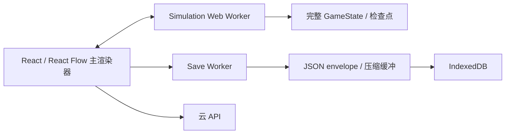
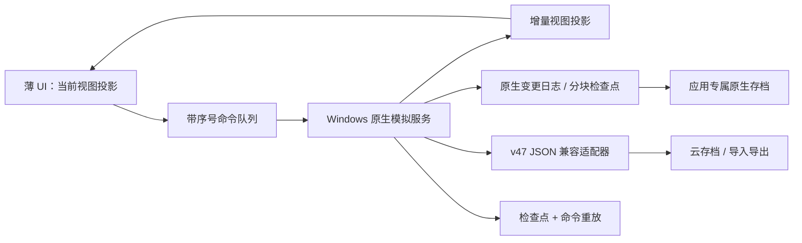
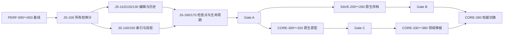
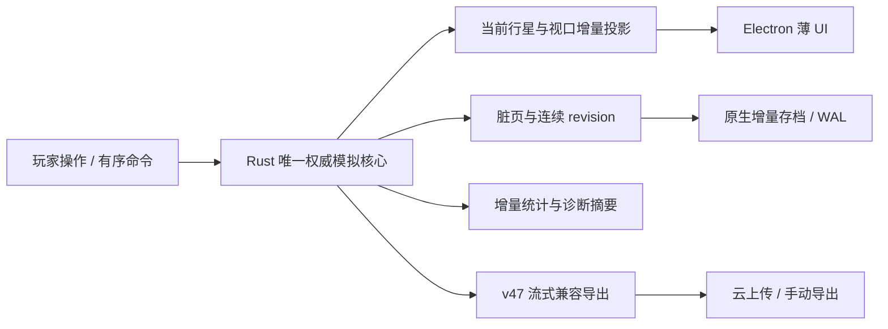

# DSP极简网络 Windows 高性能架构三层开发计划书

> 文档日期：2026-08-26；Windows 深度优化扩展：2026-08-27
> 文档性质：实施建议与开发交接，不代表功能已经实现、测试通过或已经发布。
> 当前角色：Feedback / 架构分析。本文只规划，不修改模拟、存档、Windows 制品或生产环境。
> 适用基线：1.1.8 内存优化候选、GameState v47、save envelope v2、cloud schema v8、SQLite layout v3。
> 目标平台：Windows 10/11 x64 为主要性能目标；Web/PWA 与 Android 保持功能和存档兼容。
> 2026-08-27 补充说明：第 19 节记录基于 1.2.1 Windows 开发候选观察得到的下一阶段优化包。1.2.1 的 Rust 核心仍是影子校验，不能把双重计算或单项原生基准误报为玩家可见的完整性能提升。
> 2026-08-28 实施说明：第 20～22 节记录 develop 角色在独立工作树中的实际落地与验证；它们不会把原计划预算、外部硬件 Gate 或 No-Go 自动改写为“完成”。当前最终开发包仍为 `authorityEligible=false`，未签名、未部署、未连接生产。

## 1. 执行摘要

本计划把 Windows 高性能架构分成三层，并要求按顺序推进：

1. **第一层：优化现有 JavaScript 架构**
   消除完整状态复制、编辑历史膨胀、无差别全量扫描和全量 UI 投影。它不依赖原生重写，是近期解决 5 GB 左右崩溃风险的最高优先级。
2. **第二层：原生增量存档**
   Windows 使用受限原生文件服务保存二进制分块、变更日志和校验清单；JSON v47 继续作为导入、导出、云同步和降级兼容格式。
3. **第三层：原生模拟核心**
   将权威模拟逐域迁移到隔离的 Windows 原生进程，Chromium 界面只接收当前视图投影和全局摘要。原生核心必须先以影子模式与 JavaScript 引擎逐步对照，不能一次性替换。

本计划不把“打包成 Electron”当作性能优化。当前 Electron 桌面端加载的是同一套 Vite、React、Web Worker 和 IndexedDB 代码，仅替换应用外壳不会消除主要内存占用。

### 1.1 详细投入和目标区间

| 层级 | 详细拆分后的投入 | 当前 4.90 GB 组合峰值的阶段目标 | 主要收益 |
| --- | ---: | ---: | --- |
| 阶段 0：基线与可观测性 | 4～7 工程师周 | 不直接承诺下降 | 建立可信口径、崩溃分类和 Go/No-Go 证据 |
| 第一层：JavaScript 架构 | 17～27 工程师周 | 2.8～3.8 GB | 编辑、模拟、UI 状态副本减少；建造/拉线吞吐提高约 1.3～2 倍 |
| 第二层：原生增量存档 | 17～25 工程师周 | 第一层基础上约 2.3～3.2 GB | 保存峰值再降约 20%～40%，保存耗时下降约 30%～70% |
| 第三层：原生模拟核心 | 47～76 工程师周 | 三层完成后约 1.5～2.5 GB | 总内存下降目标 40%～70%，模拟吞吐目标 1.5～3 倍 |
| 全项目 | 85～135 工程师周 | 由每层 Gate 决定是否继续 | 包含实现、差分验证、故障恢复和发布加固 |

这些是立项预算和验收目标，不是已经实测的承诺；各阶段收益相互重叠，禁止相加后对外宣传。

推荐团队为 4～5 人，预计 7～11 个日历月完成三层的可发布版本；3 人团队更接近 10～15 个月。单人实施包含兼容、测试和发布加固时，预计 20～34 个月。若第一层已经满足稳定性目标，可以暂停或缩小第三层，避免为“原生”本身进行无收益重写。

## 2. 已确认事实、待验证假设和目标

### 2.1 已确认事实

- 玩家压力存档约 76,898,141 字节，包含 80,674 个实体、155,746 条线路和约 36,754 个物流站实体。
- 1.1.8 最终 60 秒纯挂机测试中，全部隔离 Chrome 进程私有内存合计峰值约 2.49 GB；主渲染器约 2.16 GB。
- 1.1.8 最终 60 秒建造、拆除、重连、蓝图和自动保存组合测试中，全部进程私有内存合计峰值约 4.90 GB；主渲染器约 4.57 GB。
- 组合测试时主渲染器约占全部进程私有内存的 93%，浏览器、GPU 和工具进程合计约 0.33 GB。因此仅替换浏览器外壳不能根治峰值。
- 当前 Windows 客户端是 Electron `BrowserWindow`，仍加载相同 Vite 构建；游戏本地存档仍主要由渲染器中的 IndexedDB 管理。
- 当前权威模拟由 Web Worker 持有；检查点协议仍包含 `JSON.stringify`、`TextEncoder` 和重新 `JSON.parse` 的对象镜像。
- 当前保存 Worker 会投影持久状态、生成兼容 envelope、校验并压缩；Worker 可以减轻主线程阻塞，但不代表对象图天然共享。
- 1.1.8 的分块保存已证明后续写入量可以显著下降，但第一次种子和保存前的状态投影、扫描、序列化仍会产生峰值。
- 2026-08-26 只读检查时，香港公网 `version.json` 返回 1.1.6，而本地压力数据来自 1.1.8 候选。两者不能当作同版本 A/B。

### 2.2 尚未确认的假设

- 玩家约 5 GB 崩溃不一定是香港 VPS 内存造成。模拟在玩家浏览器内执行，VPS 主要提供静态资源和云 API；更可能的变量包括实际 Build ID、Service Worker 缓存、浏览器版本、系统提交限制、页面/Worker 崩溃和本机剩余内存。
- 本地 Chrome 显示 14.3 GB 仍不崩溃，只能证明该测试机和该运行条件拥有更高的可用提交空间，不能证明 14.3 GB 是合理目标，也不能证明线上版本必然存在固定 5 GB 硬限制。
- 原生模拟是否能达到 3 倍以上提升，取决于真实热点、IPC 数据量、内容包兼容和串行物流比例，必须由原型验证。

### 2.3 项目最终目标

- 超大存档运行不依赖“涨到危险水位后自动暂停”才能保持稳定。
- 任何保护或故障都不得静默回到旧画面状态；失败时应暂停、保留可验证日志并允许恢复或导出。
- 相同存档、内容注册表、命令序列和模拟时间必须得到相同权威结果。
- 建造、拆除、线路重连、蓝图和保存不再同时保留多份完整状态。
- Windows 原生增强失败时，玩家仍能读取 v47 JSON、切回 JavaScript 路径并继续游戏。
- Web、Windows、Android 和云端继续交换兼容的 v47/envelope v2 数据，除非另行批准格式升级。

## 3. 非目标

本计划不包含：

- 通过降低产量、减少模拟秒、删除线路或限制建筑堆叠解决性能问题。
- 通过清档、截断库存、丢弃在途货物或重建玩家工厂完成迁移。
- 一次性重写全部 React 界面或立即放弃 Web/Android。
- 在第一阶段直接修改香港/上海生产配置、数据库或下载页。
- 把开发服务器、生产构建、Chrome、360 浏览器和 Electron 的不同口径内存混在一个对比表中。
- 未经真实存档测试就对玩家承诺固定性能百分比或发布日期。
- 将 Windows 原生状态直接上传云端，从而让旧客户端无法读取。

## 4. 架构原则

### 4.1 数据所有权

最终只允许一个权威模拟状态所有者。UI、保存器和统计系统只能接收：

- 只读快照；
- 当前星球投影；
- 增量事件；
- 带 revision 的检查点；
- 可验证的二进制块。

禁止主线程、模拟 Worker、保存 Worker和原生进程长期各自保留一份可独立修改的完整 `GameState`。

### 4.2 确定性优先

性能优化不得改变：

- 生产顺序和结算边界；
- 库存、线路缓存、物流在途货物和制造 WIP 守恒；
- 电力分配、矿脉扣除、科研和戴森结算；
- 暂停、离线、时间扭曲和纯挂机语义；
- 内容包 ID、配方、建筑及线路定义。

如果原生语言的浮点行为与 JavaScript 不一致，必须先定义规范化整数/定点语义，不能用宽松误差掩盖存档结果分叉。

### 4.3 渐进替换

每一层必须满足：

- 新旧路径能够同机对照；
- 具有设备级或候选级功能开关；
- 可在不修改存档正文的情况下关闭；
- 有明确的 Go/No-Go 门槛；
- 新路径失败不会删除旧路径可读数据。

### 4.4 Windows 安全边界

原生文件和模拟服务只能通过窄 IPC 接口访问：

- 不允许渲染器传入任意文件路径；
- 文件必须位于应用专属数据目录或玩家显式选择的导入/导出位置；
- IPC 请求必须验证消息类型、大小、revision、校验和与调用窗口；
- 原生服务不接收云 token、账号密码或任意 shell 命令；
- 任何诊断不得包含玩家存档正文。

## 5. 当前与目标架构

### 5.1 当前路径



主要问题是完整对象、字符串和缓冲区在多个阶段重叠存在，编辑和撤销历史还会延长旧状态生命周期。

### 5.2 三层完成后的目标路径



Web 和 Android 继续使用 JavaScript 权威核心；共享规则夹具和差分测试保证跨平台结果一致。

### 5.3 现有模块归属和预计触点

| 责任域 | 当前主要模块 | 本计划中的责任 |
| --- | --- | --- |
| 应用协调/调度 | `src/App.tsx`、`src/FactoryRuntime.tsx` | revision、命令队列、投影安装、保存/模拟屏障、故障 UI |
| 权威模拟规则 | `src/game/engine.ts` | 第一层增量索引；第三层差分 oracle 和逐域移植来源 |
| 实时 Worker | `src/game/simulation.worker.ts` | 状态所有权、命令协议、影子模式和 JS 回退 |
| 检查点协议 | `src/game/simulationRuntimeProtocol.ts` | 移除重复完整对象镜像，定义版本化二进制/原生边界 |
| UI 投影 | `src/game/simulationProjection.ts`、`src/game/canvasRenderSnapshot.ts` | 当前行星/视口增量投影和引用稳定性 |
| 保存生成 | `src/game/save.worker.ts`、`src/game/storage.ts` | v47 兼容生成、校验、导入导出和云边界 |
| 本地持久化 | `src/game/localSaveStore.ts`、`src/game/chunkedSaveJournal.ts` | Web/Android 回退、Windows 双写和 revision 协调 |
| 权威持久化 Worker | `src/game/authoritativeSavePersistenceClient.ts`、`src/game/authoritativeSavePersistence.worker.ts` | proof/CAS 兼容、双写过渡、失败终态 |
| Windows 主进程 | `desktop/main.cjs`、`desktop/preload.cjs`、`src/desktop.ts` | 受限文件 IPC、原生服务生命周期、更新和诊断 |
| 内容包 | `src/game/contentPacks.ts`、相关目录注册模块 | 规范注册表快照、fingerprint 和原生核心同步 |
| 基准与测试 | `scripts/benchmark-long-memory.mjs`、Vitest、Playwright | 统一指标、真实档压力、确定性差分和故障注入 |

`src/App.tsx` 和 `src/game/engine.ts` 都是高冲突巨型模块。开发前应先建立窄协议和辅助模块，避免三层同时直接修改同一段调度代码。任何跨层修改都要指定唯一 owner，并通过小提交合并。

## 6. 阶段 0：冻结基线与可观测性

阶段 0 是三层共同前置条件，不能省略。

### 6.1 工作项

#### PERF-000：冻结四类测试夹具

- 小型功能档：快速验证规则和迁移。
- P50 终局合成档：日常性能回归。
- P95 超大合成档：持续集成中的高压回归。
- 玩家极限档的只读副本：只在受控本地基准中使用，不进入 Git、制品或服务器。

每个夹具记录文件字节数、实体数、线路数、物流站数、行星数、内容包 fingerprint 和 SHA-256；不记录账号或玩家身份。

#### PERF-001：统一内存口径

必须同时采集：

- OS 全进程树 Private Bytes；
- 主渲染器 Private Bytes / Working Set；
- JavaScript used heap 与 heap limit；
- Simulation Worker、Save Worker 和未来原生进程的独立内存；
- GPU 与浏览器主进程内存；
- 峰值、稳态、每分钟斜率和操作后回落值。

禁止只用 Chrome 标签页弹窗中的一个数字代表全部内存。

#### PERF-002：统一场景

每个候选至少运行：

1. 导入后暂停 60 秒；
2. 纯挂机 180 秒；
3. 纯挂机 30 分钟；
4. 连续三轮建造、拆除、重连和蓝图；
5. 三轮编辑和三次自动保存重叠压力；
6. 手动保存、导出、云上传准备；
7. 页面后台/恢复；
8. Worker 或原生服务故障注入。

#### PERF-003：版本和环境证明

每个报告必须包含：

- Git SHA、App Version、Build ID；
- 开发服务器或 production preview；
- Chrome/Electron 版本；
- Windows 版本、CPU、物理内存、页面文件配置；
- 内存保护开关和阈值；
- Service Worker 控制状态；
- 存档 SHA-256。

### 6.2 工期与交付物

| 工作 | 工程师周 |
| --- | ---: |
| 基准脚本与进程树采样 | 1.5～2.5 |
| 四类夹具和确定性摘要 | 1～1.5 |
| 崩溃/故障分类和报告模板 | 0.5～1 |
| 低内存测试机与 production preview 门禁 | 1～1.5 |
| 合计 | 4～6.5 |

交付物：冻结基线报告、机器清单、可重复命令、指标 JSON schema、崩溃分类表和对比报告模板。

### 6.3 完成标准

- 相同候选连续运行三次，主要峰值偏差可以解释；建议控制在 ±10%。
- 能区分保护暂停、页面崩溃、Worker 退出、OS 提交失败、V8 OOM 和浏览器进程被杀。
- 本地 14 GB 与线上约 5 GB 现象至少完成同 Build ID、同 production 构建的一次对照；否则保持为环境差异假设。

## 7. 第一层：优化现有 JavaScript 架构

### 7.1 目标

在不改变 GameState v47 和玩法语义的前提下，让内存主要与“实际变化区块和当前可见数据”相关，而不是与完整工厂大小乘以副本数量相关。

阶段目标：

- 组合场景全进程私有峰值从约 4.90 GB 降至 2.8～3.8 GB；
- 纯挂机 30 分钟没有持续线性增长；
- 连续建造/拉线吞吐提高约 1.3～2 倍；
- 操作后内存能够回落，不因撤销栈永久保留多份完整工厂；
- 内存保护默认仍保留，但正常基准不应依赖它才能跑完。

### 7.2 工作包

#### JS-100：状态所有权审计

- 绘制主线程、Simulation Worker、Save Worker、持久化 Worker 的对象生命周期图。
- 列出所有 `structuredClone`、`JSON.stringify`、`JSON.parse`、完整数组 spread/map 和完整 checkpoint 路径。
- 为每份大对象标注创建者、持有者、释放条件和最大允许并发数。
- 增加开发态断言：同一时刻最多一个完整保存检查点、一个待提交 Worker 状态和一个 UI 投影基线。

**估算：1～1.5 工程师周。**

#### JS-110：命令化编辑和单批 draft

- 建造、拆除、线路重连、蓝图部署改为带 revision 的领域命令。
- 同一用户批次只创建一次 mutable draft 或一次分块写集合。
- 批量操作不允许每条线路重复复制 80,000 个实体和 150,000 条线路。
- 命令返回精确 changed entity IDs、belt IDs、planet IDs 和库存差异。
- 主线程只发布一次最终状态和一次视图变更。

**估算：3～4 工程师周。**

#### JS-120：分块实体/线路容器

- 在运行时引入固定大小页或分块表，GameState v47 序列化边界仍输出普通数组。
- 修改一个实体只复制该实体所在分块和上层索引，不复制完整数组。
- 建立稳定 ID→chunk/offset 索引；拓扑变化只更新受影响星球和相邻线路。
- 首期可以只覆盖编辑热点，模拟引擎逐步接入，避免一次性改造全部规则。

**估算：3～5 工程师周。**

#### JS-130：撤销/重做差异日志

- 撤销项保存命令逆操作或前后差异，不保存完整 `GameState`。
- 设置按数量和估算字节双重限制。
- 清空 redo 时立即释放引用。
- 保存和 Worker 回执不得持有历史栈快照。
- 蓝图和批量操作作为一个原子历史项。

**估算：1.5～2.5 工程师周。**

#### JS-140：增量模拟索引和脏区块

- 维护实体、线路、物流、行星和电网 dirty set。
- 只重建发生拓扑、配方、库存源或策略变化的网络。
- 稳定网络继续使用运行时索引；新产出、线路接入或库存变化精确唤醒。
- 保存 dirty set 与模拟 dirty set 分开，不能互相清除。
- 保留旧全扫描路径作为测试 oracle 和紧急回退。

**估算：2.5～4 工程师周。**

#### JS-150：UI 投影和渲染隔离

- React 状态不再持有全量可编辑权威对象图。
- 只向当前行星、当前视口、选中对象和全局摘要发布投影。
- 节点拓扑、节点遥测、线路几何和流量动画分别更新。
- 不变节点和边保持引用稳定，避免 React Flow 全量提交。
- 统计页和侧栏按需请求聚合，关闭后释放缓存。

**估算：2.5～4 工程师周。**

#### JS-160：检查点和保存互斥收口

- 检查点以一个可转移二进制所有权为中心，不同时保留对象镜像和完整 JSON 字符串。
- 保存期间禁止产生第二份完整 checkpoint。
- Worker 回执后立即解除临时 buffer、Blob 和 source transfer 引用。
- 自动保存请求合并到最新 revision；旧 revision 只取消，不排队生成。
- 保存失败保持当前可见进度，进入明确 failed/paused 状态，不静默安装旧检查点。

**估算：2～3 工程师周。**

#### JS-170：缓存和生命周期治理

- 为投影、目录、诊断、统计和历史缓存设置拥有者和上限。
- 进入主页、切换存档和导入新档后验证旧 Worker、监听器和对象引用释放。
- DevTools heap snapshot 建立 retained-path 清单。
- 修复可以稳定复现的闭包、事件监听器或 Promise 队列滞留。

**估算：1～2 工程师周。**

上述工作包的详细投入合计约 16.5～26.5 工程师周，项目预算取整为 **17～27 工程师周**。并行只能缩短日历时间，不能减少工程师周。

### 7.3 第一层测试矩阵

- 领域单测：每个命令的正向、逆向、缺料、非法 revision 和原子失败。
- 差分测试：旧全扫描/旧编辑路径与新路径的状态哈希相同。
- 守恒测试：库存、缓存、在途、燃料、WIP、矿脉和施工库存。
- 历史测试：撤销/重做 100、1,000 次；历史字节上限和释放。
- 压力测试：10/100/1,000 次放置、拆除和重连。
- UI 测试：当前视口外节点不重建；选择、拖动、连线和缩放保持正确。
- 生命周期测试：导入→运行→主页→再次导入，Worker 数和内存回到基线。
- 生产构建长跑：纯挂机 30 分钟和编辑+保存 10 分钟。

### 7.4 第一层 Go/No-Go

**Go：**

- 状态哈希和守恒全部通过；
- 组合峰值至少降低 25%；
- 30 分钟纯挂机没有显著正斜率；
- 100 次编辑无回档、无未提交时间丢失；
- Web、Electron 和 Android 仍能读取/写出兼容 v47。

**No-Go：**

- 任何命令顺序导致结果分叉；
- 新容器进入存档并破坏旧客户端；
- 撤销导致库存复制或丢失；
- 峰值改善不足 15%，且成本转移到更长停顿；
- 保护关闭后仍存在程序主动安装旧检查点的路径。

## 8. 第二层：Windows 原生增量存档

### 8.1 目标

Windows 运行时不再为每次本地保存构造和提交完整 77 MB JSON。原生文件层保存分块快照和变更日志，同时保留 v47 JSON 兼容出口。

阶段目标：

- 在第一层基础上，编辑+保存峰值再降低约 20%～40%；
- 后续自动保存写盘量降低 80%～99%；
- 自动保存 P95 延迟降低约 30%～70%；
- 任意保存阶段杀进程后，可恢复到最后一个完整提交或重放已校验日志；
- 不产生损坏但看似成功的主档。

### 8.2 格式边界

建议新增 **Windows 内部运行格式 v1**，但不立即改变公开 JSON 格式：

```text
save-root/
  superblock-A
  superblock-B
  manifest/<generation>
  chunks/base/<chunk-id>
  chunks/entities/<page-id>
  chunks/belts/<page-id>
  chunks/systems/<system-id>
  wal/<segment-id>
  recovery/<checkpoint-id>
```

核心规则：

- 双 superblock 只指向已完成校验的 generation；
- manifest 记录格式版本、GameState 版本、内容包 fingerprint、chunk 清单、字节数和根校验；
- chunk 不在原地覆盖，写入新文件后再原子切换 manifest；
- WAL 记录命令序号、基础 revision、结果 revision 和 payload 校验；
- 合并只在空闲且没有保存/模拟屏障时运行；
- 旧 generation 在新 generation 读回验证后再按保留策略回收。

具体采用 CRC32C、SHA-256 或其他组合需要单独 ADR。根校验必须保持密码学强度；快速块校验不得取代完整根校验。

### 8.3 工作包

#### SAVE-200：格式 ADR 和威胁模型

- 定义文件布局、整数编码、字节序、版本字段和最大长度。
- 定义未知字段、未知 chunk、重复 ID 和截断文件的处理。
- 定义断电、磁盘满、杀进程、杀 Worker、杀 Electron 和杀原生服务的恢复结果。
- 定义 Windows Defender/杀毒软件锁文件、重命名失败和只读目录行为。

**估算：1.5～2.5 工程师周。**

#### SAVE-210：受限 Electron 文件服务

- 主进程只暴露 open/save/commit/read/export 等类型化 IPC。
- 所有运行时存档固定在 `app.getPath("userData")` 下的应用目录。
- 导入/导出只使用系统选择器返回的已授权句柄。
- 使用临时文件、flush、原子替换和目录级提交顺序。
- 限制单消息和单块大小，使用 MessagePort/流式传输。

**估算：2.5～4 工程师周。**

#### SAVE-220：分块编码器和脏块写入

- 将第一层 dirty set 映射为稳定 chunk ID。
- 实体、线路和系统状态使用紧凑二进制编码。
- 生成 manifest 和校验树，不先拼出完整 JSON。
- 支持零变化保存只提交元数据或不写数据块。
- 提供离线检查工具，能验证但不能修改玩家存档。

**估算：4～6 工程师周。**

#### SAVE-230：WAL 和崩溃恢复

- 每条编辑/模拟提交绑定单调 revision 和命令序号。
- WAL 先写后提交，重放必须幂等。
- 启动时只接受完整校验的 checkpoint + 连续 WAL。
- 发现缺段、重复、校验失败或基础 revision 不匹配时停止自动采用，保留候选并提供诊断。
- 绝不按“文件更新时间更晚”猜测胜者。

**估算：3～5 工程师周。**

#### SAVE-240：v47 JSON 双向适配器

- 首次读取旧 JSON 后创建内部格式，不覆盖原始导入文件。
- 手动导出、云上传和降级前生成兼容 v47/envelope v2。
- 从原生格式导出的 JSON 必须通过现有迁移器、checksum 和服务端验证。
- 降级到旧 Windows/Web 客户端时使用最后一次完整 JSON 基线，并明确提示可能不包含尚未合并的增量日志。

**估算：3～4.5 工程师周。**

#### SAVE-250：Web/Android 回退与双写期

- Web/Android 继续使用 IndexedDB 路径。
- Windows Beta 初期同时保留经过验证的 v47 JSON 恢复点。
- 双写必须从同一个权威 revision 生成，并验证两者摘要一致。
- 原生写成功、JSON 写失败或相反时，不允许悄悄宣称保存完成。

**估算：2～3 工程师周。**

#### SAVE-260：压缩、合并和保留策略

- 仅在收益明确时对冷 chunk 压缩；热 chunk 优先避免 CPU/内存峰值。
- 空闲合并使用有界速率和可取消任务。
- 保留至少两个已验证 generation 和最近恢复点。
- 磁盘水位不足时先停止合并/保存并提示，不删除最后有效存档。

**估算：1.5～2.5 工程师周。**

上述工作包合计约 16.5～24.5 工程师周，项目预算取整为 **17～25 工程师周**。

### 8.4 故障注入矩阵

至少在以下位置逐一杀进程或制造错误：

- chunk 写入前、写入一半、写入完成未 flush；
- manifest 写入一半；
- superblock 切换前后；
- JSON 兼容基线生成期间；
- WAL 写入和 checkpoint 合并期间；
- 磁盘剩余 0、权限拒绝、文件被占用；
- 原生服务重启、Electron renderer 崩溃、整个应用被任务管理器结束。

每个故障必须得到以下之一：

- 恢复到最后已验证 revision；
- 连续重放到最新已验证 revision；
- 明确停止自动恢复并保留所有候选供导出。

不得得到“打开成功但库存或线路已部分回退”的状态。

### 8.5 第二层 Go/No-Go

**Go：**

- 10,000 次随机故障注入没有不可检测损坏；
- v47 JSON 往返状态哈希一致；
- 第二次及以后保存写入量中位数降低至少 80%；
- 编辑+保存峰值在第一层基础上再降低至少 20%；
- 旧客户端可以读取兼容导出；
- Windows 覆盖升级不删除应用数据。

**No-Go：**

- 双写产生不一致 revision；
- 原生格式成为唯一副本但恢复工具尚未成熟；
- IPC 需要任意路径或扩大渲染器文件权限；
- 保存变快但首次加载、云上传或导出峰值反而超过旧路径；
- 杀毒软件锁文件时会覆盖最后有效 generation。

## 9. 第三层：Windows 原生模拟核心

### 9.1 推荐形态

推荐优先评估 **Rust 独立进程**，而不是直接把原生库加载到 Electron renderer：

- 独立进程崩溃不会直接击穿 UI 进程；
- 内存和 CPU 可以独立采样；
- 可以限制 IPC 和文件权限；
- 更容易实现检查点、重启和命令重放；
- Rust 的所有权和边界检查适合紧凑状态容器。

C++ 或 C# 仍可作为团队能力匹配的备选。语言必须通过 ADR 决定，不能仅因理论基准选择。WASM 可用于共享 Web/Windows 规则，但如果仍在 JS 堆和 WASM 内存之间复制完整状态，它不能自动解决主要峰值。

### 9.2 原生数据布局

目标运行时不直接复刻 JavaScript 对象图，而使用：

- 稳定 ID 表和 generation；
- Structure of Arrays 或分块紧凑结构；
- 索引化字符串/目录 ID；
- 每行星、每物流网络和每线路分量的运行索引；
- 明确整数宽度和溢出规则；
- 仅在规则确有需要时保留规范化小数累计器；
- dirty bitset 和增量事件队列。

### 9.3 IPC 协议

控制面使用小消息：

- `OpenSave`
- `ApplyCommands`
- `AdvanceSimulation`
- `RequestProjection`
- `CreateCheckpoint`
- `PrepareCompatibleExport`
- `Pause`
- `Shutdown`

数据面使用：

- 有界共享内存或可转移二进制块；
- 带 schema version、revision、sequence、byte length 和 checksum 的帧；
- UI 投影环形缓冲；
- 不允许每个模拟秒传回完整 GameState。

### 9.4 工作包

#### CORE-300：原生核心 ADR 和协议规范

- 比较 Rust/C++/C#、独立进程/native addon/WASM。
- 冻结控制协议、错误码、版本协商和最大消息大小。
- 定义原生服务启动、认证握手、退出和升级策略。
- 定义“无静默回档”故障行为。

**估算：2～3 工程师周。**

#### CORE-310：原生状态容器与 v47 只读加载

- 解析规范 v47 JSON 或第二层内部格式。
- 建立实体、线路、行星、物流、电网、科研、戴森和空间站紧凑表。
- 输出规范摘要和状态哈希，但暂不推进时间。
- 与 JavaScript 对同一夹具逐字段比较。

**估算：4～6 工程师周。**

#### CORE-320：影子模式基础设施

- JavaScript 继续权威运行；原生核心接收同一检查点和命令。
- 每个固定边界比较状态哈希、库存摘要、线路缓存、在途货物和阶段耗时。
- 发现差异只记录脱敏路径和第一处分叉，不覆盖玩家状态。
- 影子模式默认只用于开发/内测，不双倍消耗普通玩家资源。

**估算：3～4.5 工程师周。**

#### CORE-330：采集、普通生产与科研

- 移植矿脉、采集、配方生产、增产剂、缓存、科研和电力倍率消费。
- 覆盖缺料、满输出、断电、暂停、分段推进和大堆叠。
- 固定每个阶段的迭代顺序和取整规则。

**估算：5～8 工程师周。**

#### CORE-340：传送带和线路网络

- 移植线路容量、并联、端口、缓存、流量窗口和唤醒/休眠。
- 按行星或连通分量建立增量索引。
- 保持多条合法线路、物品约束和原有顺序。
- 加入极端 155,000+ 线路夹具。

**估算：6～10 工程师周。**

#### CORE-350：物流、电力和跨星球系统

- 移植本地/星际物流、量子库存、路线、载具、翘曲器和派遣公平性。
- 移植电网、电源、蓄电、燃料和跨星球汇总。
- 优先保持语义，再通过索引和分区优化；禁止为速度改写物资守恒。

**估算：8～13 工程师周。**

#### CORE-360：戴森、建筑制造、巨构和空间站

- 移植戴森发射/结构/功率、建筑制造递归计划、巨构工作量、空间站合同和轨道货运。
- 覆盖量子仓库直接供料、WIP、副产物和公平调度。
- 对百万堆叠使用批量算法，但保持现有工作秒语义。

**估算：6～10 工程师周。**

#### CORE-370：离线、纯挂机和时间扭曲

- 让实时、离线、纯挂机和时间扭曲调用同一个原生规则核心。
- 保留精确路径、宏观保守路径和取消语义。
- 长时间推进必须可分段、可取消、可恢复。

**估算：4～7 工程师周。**

#### CORE-380：内容包和自定义建筑

- 主线程向原生核心发送规范化内容注册表快照。
- 快照携带 revision/fingerprint；更新期间隔离旧响应。
- 支持自定义物品、配方、建筑和传送带定义。
- 缺失或不兼容内容包时安全拒绝模拟，不静默按核心目录代替。

**估算：4～6 工程师周。**

#### CORE-390：原生权威切换和恢复

- 只有影子模式长期一致后才允许原生核心成为权威。
- UI 命令先进入有序日志，原生核心确认后发布投影。
- 原生服务崩溃时从最新检查点重启并幂等重放已接受命令。
- 如果无法证明连续性，保持暂停并提供恢复/导出，不静默安装更旧状态。
- JavaScript 权威路径保留至少一个稳定版本周期。

**估算：5～8 工程师周。**

上述工作包合计约 47～75.5 工程师周，项目预算取整为 **47～76 工程师周**。

### 9.5 原生确定性验证

每个领域迁移都必须通过：

- 1 秒、60 秒、600 秒、8 小时和 30 天分段/整段等价；
- 1x、4x、11x 和时间扭曲；
- 不同 CPU 核心数和不同线程调度；
- Windows 10/11 的至少两代 x64 CPU；
- Debug/Release 构建；
- 内容包开启、更新、禁用和缺失；
- 相同命令不同分包方式；
- 原生进程重启和命令重放。

目标是规范状态哈希完全一致。若某个历史浮点字段无法跨语言逐位一致，必须先在共享规范中修正表示，并经过单独存档/规则评审；不允许只在测试中放宽误差。

### 9.6 第三层 Go/No-Go

**原型 Go：**

- P95 和玩家极限档至少达到 1.5 倍模拟吞吐；
- 数据交换后仍有净收益，IPC 不超过总帧时间的 20%；
- 连续 24 小时影子运行没有状态分叉；
- 原生状态 + UI 投影总内存显著低于 JavaScript 权威路径；
- 服务故障可恢复且无静默回档。

**原型 No-Go：**

- 热点循环很快，但完整链路因 IPC/投影没有净收益；
- 需要每秒把完整 GameState 返回 JavaScript；
- 内容包无法保持兼容；
- 状态哈希无法稳定一致；
- 原生服务崩溃恢复依赖丢弃未保存玩家操作。

**稳定版 Go：**

- 三类硬件、全部固定场景和 24 小时长跑通过；
- 总内存目标落在约 1.5～2.5 GB，或相比第一层至少再降低 30%；
- 模拟吞吐提高至少 1.5 倍；
- v47 JSON 导入、导出和云往返一致；
- Beta 崩溃率、保存失败率和恢复失败率不高于 JavaScript 对照。

## 10. 跨层测试与性能验收

### 10.1 硬件矩阵

| 档位 | 建议配置 | 目的 |
| --- | --- | --- |
| 低配 | 4 核、8 GB RAM、系统管理页面文件 | 复现玩家最容易崩溃的边界 |
| 主流 | 6～8 核、16 GB RAM | 默认体验和发布门槛 |
| 高配 | 12+ 核、32/64 GB RAM | 观察吞吐上限和超大存档 |

至少覆盖 Windows 10 22H2 和 Windows 11 当前受支持版本；GPU 选择集显卡和独显各一台。

### 10.2 软件矩阵

- Chrome 当前稳定版 production preview；
- Edge 当前稳定版；
- Electron 当前项目固定版本；
- 360/国产 Chromium 只作为兼容观察，不与 Chrome 数字直接混算；
- Web/PWA、Windows 安装包、Android WebView 的存档兼容回归。

### 10.3 核心指标

| 指标 | 定义 |
| --- | --- |
| 总峰值内存 | 整个应用进程树 Private Bytes 的时间序列最大值 |
| 稳态内存 | 预热后固定窗口 P50/P95 |
| 内存斜率 | 稳态窗口线性拟合的 MiB/分钟 |
| 回落率 | 操作峰值后 120 秒回落到峰值前基线的比例 |
| 模拟吞吐 | 每墙钟秒完成的权威模拟秒 |
| Worker/原生延迟 | 请求到权威 revision 确认的 P50/P95/P99 |
| UI 响应 | 输入到下一帧反馈、帧 P95、>50 ms 长任务数 |
| 保存延迟 | 请求到校验并持久提交的 P50/P95/P99 |
| 保存写入量 | 每次新增/改写的实际字节数 |
| 恢复时间 | 崩溃后到可验证可玩状态的时间 |
| 正确性 | 状态哈希、物资守恒、命令序号连续性 |

### 10.4 统一验收场景参数

- 纯挂机：180 秒快速门禁、30 分钟候选门禁、24 小时夜间门禁。
- 编辑：每轮 20 放置、20 拆除、20 重连、1 蓝图；快速 3 轮，压力 25 轮。
- 保存：编辑后立即保存、模拟中自动保存、页面隐藏保存、连续 10 次无变化保存。
- 恢复：每个关键提交点至少 100 次随机故障，正式候选总计至少 10,000 次。
- 云兼容：生成 v47 JSON、服务端离线校验、下载后重新导入并比较状态哈希。

## 11. 发布和灰度计划

### 11.1 分支与制品隔离

- 三层分别使用独立工作树和功能开关，不直接在正在发布的 stable 工作树开发。
- 第一层、第二层、第三层分别形成独立可回滚提交序列。
- Windows 原生服务、Web 资源和格式规范必须带同一 Build ID/协议版本证明。
- 不从 dirty 工作树构建正式制品。

### 11.2 建议通道

1. **开发诊断版**：只跑本地夹具，不连接官方云。
2. **内部 Alpha**：第一层开启；原生保存双写；原生模拟仅影子模式。
3. **邀请 Beta**：玩家明确选择，保留 v47 自动恢复点和一键回退 JavaScript 路径。
4. **稳定灰度**：5%→25%→100%，每阶段观察完整自动保存周期和至少 24 小时。

### 11.3 灰度监控

只允许上传脱敏聚合：

- Build ID、平台、内存区间、进程退出类型；
- 实体/线路/物流站数量区间；
- 保存阶段、字节区间和耗时区间；
- 原生服务重启次数、恢复结果和差分通过/失败代码；
- 不上传存档正文、坐标、库存详情、账号 token 或内容包正文。

### 11.4 回滚

- 第一层：关闭增量编辑/投影开关，继续读取同一 v47 状态。
- 第二层：使用最后已验证 v47 JSON 恢复点，原生文件只读保留，不自动删除。
- 第三层：暂停原生服务，从同 revision 的兼容检查点启动 JavaScript 权威路径；如果 revision 无法证明一致，要求玩家选择恢复点，不自动回退。
- 生产回滚只切代码/制品，不恢复或改写云数据库。

## 12. 人员配置和日历计划

### 12.1 推荐团队

| 角色 | 人数 | 主要责任 |
| --- | ---: | --- |
| 技术负责人/确定性规则 | 1 | 架构、状态语义、跨层决策、差分裁决 |
| 前端/JavaScript 运行时 | 1～2 | 第一层、UI 投影、Worker、性能诊断 |
| 系统/Rust 或 C++ | 1～2 | 原生存档、IPC、原生模拟和恢复 |
| QA/性能工程 | 1 | 夹具、长跑、故障注入、硬件矩阵 |
| 发布/安全工程 | 0.25～0.5 | Windows 打包、签名、灰度、制品门禁 |

### 12.2 推荐日历

| 月份/阶段 | 主要交付 |
| --- | --- |
| 第 1 月 | 阶段 0；冻结基线；第一层状态所有权和命令协议 |
| 第 2 月 | 第一层分块编辑、撤销差异、脏索引 |
| 第 3 月 | 第一层 UI 投影、检查点收口、长跑；第一层 Go/No-Go |
| 第 3～4 月 | 第二层格式 ADR、原生文件服务、分块编码器 |
| 第 4～5 月 | WAL、崩溃恢复、v47 适配、故障注入；第二层 Go/No-Go |
| 第 4～5 月并行 | 第三层 ADR、原生状态容器和影子模式原型 |
| 第 5～7 月 | 生产、线路、物流、电力、戴森等领域逐步移植 |
| 第 7～8 月 | 内容包、离线/纯挂机、故障恢复、原生权威 Beta |
| 第 8～9 月 | 多硬件长跑、邀请 Beta、灰度和发布加固 |

上表是 4～5 人推荐团队的理想依赖顺序，允许第二层后半段与第三层原型并行。3 人团队整体应按约 10～15 个月规划；关键人员被日常版本打断时应按实际可用比例顺延，不通过压缩确定性测试追赶日期。

### 12.3 决策检查点

#### Gate A：第一层结束

- 如果组合峰值已经低于 3 GB、30 分钟稳定且玩家崩溃率显著下降，可以先发布第一层并推迟完整原生模拟。
- 如果峰值仍主要来自保存，优先进入第二层。
- 如果峰值仍主要来自模拟权威对象和 UI 投影，继续第三层原型。

#### Gate B：第二层结束

- 如果保存峰值和崩溃已经满足目标，第三层只针对模拟吞吐，不再以“修保存”为理由扩大范围。
- 如果首次 JSON 兼容导出仍制造大峰值，先优化适配器，不提前切换原生权威。

#### Gate C：原生原型

- 只有净吞吐至少 1.5 倍、IPC 占比小于 20%、24 小时无差分，才批准完整移植。
- 未达到门槛时停止第三层扩张，把可复用索引/协议成果回收到第一层。

### 12.4 依赖关系和并行边界



- `SAVE-200～230` 可以在第一层接口稳定后与第三层影子原型并行。
- 原生领域移植可以并行开发，但每次只能由一个分支修改共享协议和确定性规范。
- `CORE-390` 同时依赖第二层可恢复检查点和第三层完整差分通过，不能提前。
- 发布、签名和生产灰度不与功能实现混在同一角色或同一未固定工作树中进行。

## 13. 风险登记表

| 风险 | 级别 | 表现 | 缓解 |
| --- | --- | --- | --- |
| 跨语言确定性分叉 | P0 | 产量、库存或哈希不同 | 影子模式、固定顺序、精确整数语义、旧 JS oracle |
| 原生存档损坏 | P0 | 无法读取或部分回退 | COW chunk、双 superblock、校验树、故障注入、v47 恢复点 |
| 静默回档 | P0 | 画面/运行时间突然倒退 | revision 证明、命令日志、失败暂停、禁止自动安装旧检查点 |
| IPC 抵消原生收益 | P1 | 核心快但整体不快 | 小控制消息、投影/共享内存、1.5 倍原型门槛 |
| 内存从 JS 转移到原生进程 | P1 | 总量不降但单进程看似下降 | 只看全进程树 Private Bytes，不只看 JS heap |
| 内容包不兼容 | P0 | 自定义建筑/配方模拟错误 | 规范注册表快照、fingerprint、缺失安全失败 |
| Web/Android 分叉 | P1 | 同存档结果不同 | 共享夹具、差分测试、v47 兼容适配器 |
| Defender/杀软锁文件 | P1 | 保存或升级失败 | 新 generation、重试、保留旧指针、真实机测试 |
| Electron 未签名 | P1 | SmartScreen/玩家信任问题 | 正式签名作为 stable 门禁；无证书时只发诊断版 |
| Service Worker 旧资源 | P1 | 玩家仍运行旧 Build ID | version/build 检查、更新隔离、生产烟测 |
| 范围持续扩大 | P1 | 工期失控 | 三个独立 Gate；性能不足才进入下一层 |
| 发布分支被干扰 | P0 | 正在发布版本混入实验代码 | 独立 worktree、不可变提交、Release Agent 单独接管 |

## 14. 必需的架构决策记录

开发开始前至少创建以下 ADR：

1. ADR-001：权威状态所有权与 revision 模型。
2. ADR-002：JavaScript 分块容器和 GameState v47 序列化边界。
3. ADR-003：Windows 内部存档格式、校验和原子提交。
4. ADR-004：原生语言和进程隔离方案。
5. ADR-005：IPC、共享内存和投影协议。
6. ADR-006：跨语言数值和确定性规范。
7. ADR-007：内容包注册表同步。
8. ADR-008：原生故障恢复与“无静默回档”策略。
9. ADR-009：Web/Android 回退和兼容支持周期。
10. ADR-010：隐私安全的性能遥测。

任何 ADR 改变 GameState、envelope、云 schema 或内容包格式时，必须作为新的高风险需求单独批准，不能隐藏在性能实现中。

## 15. 每层交付清单

### 第一层交付

- 状态生命周期图和内存保留报告；
- 命令协议、分块编辑容器、dirty index；
- 差异撤销/重做；
- UI 增量投影；
- 检查点/保存并发约束；
- 新旧路径差分测试；
- 同机性能对比报告。

### 第二层交付

- Windows 内部存档格式规范；
- 原生受限文件服务；
- 分块编码器、WAL、校验和恢复工具；
- v47 JSON 导入/导出/云适配器；
- 10,000 次故障注入报告；
- 覆盖升级和降级恢复报告。

### 第三层交付

- 原生核心源码和可复现构建；
- IPC schema 和版本协商；
- 原生状态容器和各领域引擎；
- 内容包同步；
- 影子差分和 24 小时长跑报告；
- 原生崩溃恢复报告；
- Windows Beta 安装包、SBOM、签名与更新清单；
- JavaScript 回退路径和支持周期说明。

## 16. 完成定义

三层项目只有同时满足以下条件才算完成：

- 功能：真实玩家极限档可以长时间挂机、建造、拉线、蓝图和保存。
- 性能：达到各 Gate 的最低实测改善，且报告使用统一进程树口径。
- 正确性：状态哈希、物资守恒、分段模拟和跨平台兼容全部通过。
- 数据安全：故障注入无不可检测损坏，无静默回档，原始导入文件不被覆盖。
- 兼容：v47/envelope v2 导入导出和云往返通过；旧客户端恢复边界明确。
- 安全：原生 IPC 不扩大渲染器权限，不暴露任意文件或命令执行能力。
- 发布：使用 clean commit、不可变制品、manifest、SBOM 和可验证 Build ID。
- 观察：Beta 和灰度完成约定观察期，崩溃/保存/恢复指标不劣于对照。
- 文档：架构、测试、原生应用、路线图和正式发布记录与观察事实一致。

## 17. 开发交接摘要

- **Task ID / title：** Windows Native Performance Architecture / Windows 高性能架构三层改造
- **Priority：** 第一层 P0；第二层 P1；第三层 P1/P2，受原型 Gate 控制
- **Source and attachments：** 1.1.8 长时内存报告、1.1.8 内存优化交接、玩家 14.3 GB Chrome 截图、香港约 5 GB 崩溃反馈
- **Reproduction or observed evidence：** 真实存档 80,674 实体、155,746 线路；1.1.8 纯挂机约 2.49 GB、编辑+保存约 4.90 GB；主渲染器占组合峰值约 93%
- **User-visible acceptance criteria：** 大档长时间运行不崩溃；建造/拉线/保存不回档；Windows 性能和内存显著优于现有浏览器路径；旧存档、云存档和内容包可继续使用
- **Compatibility and data-preservation constraints：** 保持 v47/envelope v2；不删档、不截断库存、不丢在途、不静默回档；原生增强可关闭和降级
- **Target platforms：** Windows 10/11 x64 主目标；Web/PWA/Android 兼容
- **Required tests：** 阶段 0 统一基准、确定性差分、守恒、故障注入、长跑、跨平台导入导出、Windows 覆盖升级和灰度
- **Release target and version：** 未指定。三层应分版本、分通道发布，不与当前 stable 发布任务混合
- **Known risks / rollback：** 确定性分叉、原生存档损坏、IPC 抵消收益、内容包不兼容、杀毒软件锁文件；每层保留旧路径和 v47 恢复点

## 18. 立即可启动的第一批任务

在不修改生产和正式制品的前提下，下一次开发任务建议只批准以下范围：

1. 建立阶段 0 的 production-build A/B 基准；
2. 对本地 1.1.8 和香港实际 Build ID 做同口径环境核对；
3. 输出完整大对象生命周期图；
4. 用 heap snapshot 找出编辑+保存峰值的前三条 retained path；
5. 为建造、拆除、重连和蓝图定义最小命令/差异协议；
6. 构建第一层原型，只覆盖隔离副本，不改存档格式；
7. 原型达到至少 25% 峰值下降后，再批准第一层完整开发。

这个启动批次预计 3～5 工程师周，完成后应生成新的实测报告和第一层正式开发交接，而不是直接开始原生核心重写。

## 19. 基于 1.2.1 的 Windows 本地版深度优化扩展

### 19.1 扩展目的与事实边界

本节把 1.2.1 Windows 开发候选暴露出的剩余瓶颈纳入三层计划。它是后续实施范围，不表示这些能力已经完成、默认启用或可以发布。

必须先区分三个概念：

1. **Electron 本地外壳**：仍然运行 Chromium、React 和 JavaScript，本身不会自动消除大型对象图、全量扫描或保存峰值。
2. **Rust 影子核心**：JavaScript 继续权威运行，Rust 接收同一检查点和命令进行差分校验；这是正确性工具，可能增加总 CPU 和内存，不能作为最终性能模式。
3. **Rust 原生权威**：只有 Rust 持有完整可修改状态，UI 只保留当前视图投影、选择状态和小型摘要；只有这一形态才能兑现 Windows 本地版的大幅内存与吞吐收益。

1.2.1 的隔离开发基准已经证明方向可行，但只可作为原型证据：

- 76.9 MB、80,674 实体、155,746 线路的只读极限档中，原生打开相对 1.2.0 开发基线约快 35.6%；
- 原生进程 Private Bytes 增量约少 13.8%；
- 原生一秒精确推进相对同次 JavaScript 对照约为 1.59 倍，状态差异为 0；
- 首次完整诊断约快 81.8%，同 revision 缓存诊断约 0.17 ms；
- 同一 Worker revision 的重复分块保存由约 1,758 ms / 158 records 降到约 3 ms / 1 record；
- 活动模拟的新 revision 仍需走完整确定性路径，每步仍观察到约 311,492 个线路方向检查。

这些数字不能直接外推为玩家实际帧率、总内存或稳定版收益。影子模式同时保留 JavaScript 与 Rust 状态，玩家可见权威尚未切换。

### 19.2 目标运行结构

三层完成后的 Windows 路径进一步收敛为：



最终所有权必须满足：

- Rust 进程是唯一完整、可修改的运行时状态所有者；
- Electron renderer 不长期保留第二份完整 `GameState`；
- JavaScript 回退只从同 revision 的已验证兼容检查点启动，不与 Rust 长期双跑；
- UI 只接收当前行星、当前视口、选中对象、必要全局摘要和有界变更；
- 保存器直接消费权威核心的脏页和 revision，不要求先构造 77 MB JSON；
- 统计、诊断和云导出不能反向迫使 renderer 获取完整状态。

### 19.3 深度优化工作包

#### WIN-400：Rust 原生权威与薄 UI（P0，关联 CORE-370 / CORE-390）

这是剩余收益最大的工作包，也是其他原生优化真正生效的前提。

- 完成实时、离线、纯挂机和时间扭曲对同一原生规则核心的调用，禁止不同模式各自维护一套不一致算法。
- JavaScript 命令先写入带 `sequence/baseRevision` 的有序日志；Rust 原子接受后返回 `resultRevision` 和有界投影。
- renderer 只安装当前星球、当前视口、选中对象及全局摘要，不再持有完整实体/线路数组作为长期可编辑权威。
- 原生进程崩溃后只允许从同 revision 检查点加连续命令日志恢复；无法证明连续性时暂停并提供导出，禁止安装较旧状态。
- 影子模式与原生权威模式必须互斥。影子模式用于测试，权威模式用于性能，不能让普通玩家长期承担双算成本。
- JavaScript 回退路径至少保留一个稳定版本周期，但只在明确切换或故障恢复时加载。

验收要求：

- `authorityEligible=true` 只能由构建期覆盖证明、24 小时无差分、多硬件 Gate C 和恢复门禁共同生成，不能由 UI 本地开关直接绕过；
- 原生权威运行时，renderer 与 Simulation Worker 中不得存在第二份完整工厂对象图；
- 同一命令序列、相同内容包 fingerprint 和相同时间预算的规范状态哈希必须与 JavaScript oracle 完全一致；
- 原生服务退出、IPC 中断、窗口刷新和更新重启均无静默回档。

#### WIN-410：活动 revision 的原生脏块保存（P0，关联 SAVE-220 / SAVE-230 / SAVE-260）

1.2.1 已优化“同 revision 重复保存”，下一步必须覆盖游戏持续运行、revision 每秒变化的普通场景。

- 原生核心对实体页、线路页、物流网络、戴森系统、统计桶和顶层状态维护独立 dirty bitset。
- 每次权威提交记录精确 changed entity IDs、belt IDs、system IDs 和 page IDs；保存只读取这些页。
- 脏标记只有在 manifest、chunk、WAL 与 superblock 全部提交并读回验证后才能清除。
- 保存 dirty set 与模拟唤醒 dirty set 分离；任何一方提交都不能误清另一方。
- 合并、压缩和历史 generation 回收在空闲低优先级线程执行，并可随时取消。
- 手动导出和云上传按需生成 v47，不把完整兼容 JSON 作为每次本地自动保存的前置条件。
- 同一 revision 的零变化保存继续只提交必要元数据；活动 revision 只写真正变化的页。

阶段目标：

- 后续自动保存实际新增写入量降低 80%～99%；
- 自动保存 P95 延迟降低 30%～70%；
- 在第一层基础上，编辑与保存重叠峰值再降低 20%～40%；
- 磁盘满、只读、文件锁和进程终止均保留最后有效 generation。

#### WIN-420：事件驱动传送带与物流唤醒（P0，关联 JS-140 / CORE-340 / CORE-350）

真实极限档每个模拟步仍检查约 311,492 个线路方向。简单把“源为空”或“目标已满”的线路永久跳过会漏产量，因此必须建立闭合唤醒证明。

- 为每条线路或稳定路由组记录 `ready/source-empty/target-full/power-limited/invalid` 状态。
- 建立反向依赖：源建筑产出、目标建筑消费、库存变化、配方变化、电力恢复、线路接入、物流到货和量子结算都能精确唤醒相关路由组。
- 使用按行星、连通分量和物品分区的 active queue，只扫描本步可转移或刚被唤醒的组。
- 同一源的并联线路继续按稳定原顺序、公平额度和容量预留结算；不能因队列化改变分配顺序。
- 每隔有界校验窗口用旧全扫描 oracle 对 active queue 结果做状态哈希和守恒对照，开发/内测可提高抽样频率。
- 活动组占比很高时必须自动退化为顺序扫描，避免维护队列的成本超过收益。
- 禁止通过降低结算频率、减少传送量、延迟生产或错误休眠线路制造性能数字。

验收要求：

- source-empty、target-full、断电、低供电、物流到货、量子入库、配方切换和拆线/接线都能在正确模拟边界唤醒；
- 1 秒/5 秒/60 秒/离线分段结果、线路缓存、总转移量和库存哈希完全一致；
- 报告同时给出活动组比例、唤醒次数、退化次数和实际跳过检查量，不能只报最快样本。

#### WIN-430：确定性原生多核调度（P1，关联 CORE-330～CORE-370）

- 优先按互不共享可变资源的行星、恒星系、物流连通分量或生产网络分区。
- 每个分区使用独立输入快照和输出事件缓冲；跨分区事件在固定阶段按稳定键合并。
- 量子库存、全局统计、银河出口、空间站合同和跨星物流等共享域保留明确串行提交点。
- 工作窃取只能影响执行时间，不能影响结算顺序、浮点累加顺序或公平性。
- 小档、单活跃行星或强耦合网络自动退回单线程，避免线程调度反而变慢。
- 线程数按 CPU、物理内存和实时 UI 负载自适应，并保留玩家可选上限。

验收要求：

- 1/2/4/8/最大线程数的规范状态哈希完全一致；
- 不同 CPU、Windows 10/11 和不同线程调度重复运行一致；
- 报告串行比例、并行效率和总进程树内存，不能只报告热点循环速度。

#### WIN-440：共享内存与有界增量投影（P0，关联 ADR-005）

- 控制面继续使用小型 IPC，数据面使用版本化共享内存环形缓冲或所有权可转移的二进制块。
- 每帧包含 schema、session、revision、sequence、payload length、checksum 和投影类型。
- UI 只订阅当前行星、视口、选中对象和已打开工作区所需字段；关闭工作区后解除订阅并释放缓存。
- 节点拓扑、节点遥测、线路几何、线路流量、统计摘要和通知事件使用独立频道，避免一个小数值变化复制全部对象。
- renderer 处理不及时时合并中间遥测，只保留最新 revision；命令确认、库存变化和拓扑变化不得丢弃。
- 共享内存不可包含任意指针、文件路径、token 或未初始化字节，所有偏移和长度必须在原生端与 renderer 两侧验证。
- 不支持共享内存或协议协商失败时，回退到有界 transferable chunk，而不是完整 JSON。

Gate C 要求 IPC、编码、解码和投影安装合计低于总帧时间的 20%；若必须每秒返回完整 `GameState`，本工作包判定 No-Go。

#### WIN-450：GPU/Canvas 工厂渲染与视口虚拟化（P1）

- 普通建筑、线路、流量和低细节标记由 OffscreenCanvas + Canvas2D、WebGL2 或经过验证的 WebGPU 渲染器批量绘制。
- React/DOM 只保留当前交互对象、选中对象、编辑器、无障碍语义和少量高细节卡片。
- 使用空间索引只提交视口及预取边界内的实例数据；视口外对象不创建 DOM 节点。
- 几何、拓扑、样式和遥测使用独立 GPU buffer；运行时流量变化不得重建静态几何。
- 指针命中通过稳定空间索引或 GPU picking 实现，并保持当前端口、拉线、框选、蓝图和触摸语义。
- GPU 上下文丢失时安全回退现有 Canvas/React Flow 路径，不修改存档或权威状态。
- GPU 只负责呈现和可选命中，不能承担权威生产、物流、库存或戴森模拟。

验收指标包括帧 P50/P95/P99、>50 ms 长任务、DOM 节点数、GPU buffer 字节、缩放/平移延迟、输入响应和上下文恢复时间。画面变流畅不等于模拟吞吐提高，两组指标必须分开报告。

#### WIN-460：原生增量统计与诊断（P1）

- 权威核心在结算时同步维护生产、消耗、物流、功率、戴森和空间站的滚动时间桶，不在打开页面时重新扫描整个工厂。
- 统计桶按 1 秒、1 分钟、10 分钟和 1 小时分层聚合；暂停时不产生虚假流量。
- 诊断摘要按 revision 缓存，并由相关 dirty domain 精确失效。
- 工作区只请求当前筛选、排序和时间窗口所需的页；关闭后释放详情缓存。
- 排行榜或云端完整性摘要由原生核心输出紧凑账本，但服务端仍只信任自己的验证结果，不能信任客户端自报。
- 统计和诊断故障不得阻塞权威模拟；可以降级为“暂不可用”，不能返回陈旧数据冒充当前 revision。

#### WIN-470：原生流式 v47 导出与云上传准备（P1，关联 SAVE-240）

- 从原生 chunk/状态表按规范字段顺序流式生成 v47 JSON/envelope，不先建立第二份完整对象图或字符串。
- checksum、UTF-8 字节数、gzip 和输出文件在同一有界流水线中计算，使用固定大小 buffer 和背压。
- 云上传只传递只读文件句柄或有界字节流给受限主进程；renderer 不接收完整正文。
- 取消、超时和网络状态未知时保留本地文件与 revision 证明，不自动重传或覆盖云端。
- 导入也使用流式范围解析和边界验证；只有需要迁移的字段进入有界适配器。
- Windows 内部格式可以使用适合热/冷页的不同压缩策略，但公开云正文和导出继续保持 v47/envelope v2 兼容。

验收要求：77 MB 及更大夹具导出/上传准备期间，renderer 不出现正文大小级别的额外 Private Bytes 峰值；导出后重新导入的规范状态哈希必须一致。

#### WIN-480：紧凑数据布局、内存映射与分配治理（P1，贯穿第二、三层）

- 热字段采用 Structure of Arrays、紧凑整数、bitset、字符串/目录 ID 驻留和稳定 generation，避免重复字符串和通用 JSON 对象开销。
- 不变记录使用共享不可变所有权；事务候选只分配变更页或变更列。
- 大型冷 chunk 通过只读内存映射或按需页缓存读取，设置明确 LRU/字节预算，不能让操作系统页缓存掩盖总内存。
- 热路径使用有界 arena/slab/scratch buffer；每步结束复用或归还，不形成持续增长的碎片。
- 对 allocator、mmap、页缓存、共享内存和 Chromium renderer 分别采样，最终仍以全进程树 Private Bytes 为主口径。
- 所有整数宽度、溢出、取整和跨语言浮点规则必须进入 ADR 与差分测试。

#### WIN-490：Electron 外壳替换评估（P2，默认不启动）

Tauri、WebView2、Qt 或纯原生 UI 只能在上述核心优化后重新评估。

- 1.1.8 组合压力中 renderer 约占总进程私有内存的 93%，其余浏览器/GPU/工具进程约 0.33 GB；仅替换外壳无法解决完整状态和保存副本问题。
- 如果 Rust 已成为唯一权威、UI 已变薄，而 Electron 固定开销仍占总量 15% 以上，再建立同功能原型比较启动、空闲内存、更新、输入法、无障碍和 GPU 兼容。
- 未达到该门槛时，不启动全 UI 重写；优先完成权威所有权、增量保存、物流唤醒和投影协议。

### 19.4 优先级、依赖和剩余投入建议

下表是基于 1.2.1 基础继续推进的粗略剩余投入，不与第 1.1 节的绿地总预算相加。完成真实 profiler 和 Gate B/C 审计后必须重新估算。

| 顺序 | 工作包 | 前置 | 粗略剩余投入 | 主要交付 |
| ---: | --- | --- | ---: | --- |
| 1 | WIN-410 活动脏块保存 | 现有 SAVE-200～260 | 3～6 工程师周 | 活动 revision 不再全量投影/哈希全部集合页 |
| 2 | WIN-420 事件驱动线路/物流 | JS-140、CORE-340/350 | 5～9 工程师周 | active queue、反向唤醒、全扫描 oracle |
| 3 | WIN-440 共享内存投影 | ADR-005、稳定投影 schema | 3～6 工程师周 | 小控制消息、增量数据面、背压与合并 |
| 4 | WIN-400 原生权威/薄 UI | CORE-370、Gate B/C | 7～12 工程师周 | 单一权威、命令日志、同 revision 恢复 |
| 5 | WIN-430 原生多核 | 稳定单线程原生权威 | 5～9 工程师周 | 确定性分区、固定阶段合并、自适应线程数 |
| 6 | WIN-450 GPU/Canvas 渲染 | 薄投影协议 | 4～7 工程师周 | 视口实例化、DOM 收缩、上下文恢复 |
| 7 | WIN-460 原生统计/诊断 | 原生领域事件 | 2～4 工程师周 | 增量时间桶、按需查询、缓存预算 |
| 8 | WIN-470 流式导出/上传 | SAVE-240、原生状态表 | 2～5 工程师周 | 无完整 renderer 正文的 v47 流水线 |
| 横切 | WIN-480 数据布局/分配治理 | 随各包实施 | 3～6 工程师周 | SoA、驻留、arena、mmap/LRU 预算 |
| 条件项 | WIN-490 外壳替换原型 | 核心完成后重新量化 | 2～4 工程师周原型 | 只用于 Go/No-Go，不代表批准重写 |

关键依赖：

- `WIN-400` 同时依赖可恢复的原生存档和完整原生规则覆盖，不能为了展示性能提前越过 `CORE-370`、Gate B 或 Gate C；
- `WIN-430` 必须建立在单线程原生结果已完全确定的基础上；
- `WIN-450` 必须消费薄投影，不能用 GPU 层掩盖 renderer 仍保留完整状态；
- `WIN-460` 和 `WIN-470` 不能反向引入完整状态复制；
- `WIN-420` 可以在影子期开发，但正式收益必须在单一权威链路重新测量。

### 19.5 性能目标与诚实报告规则

三层加本节扩展全部完成后的项目目标继续保持：

| 指标 | 原问题口径 | 最终目标 |
| --- | ---: | ---: |
| 编辑+保存组合峰值 | 1.1.8 约 4.90 GB 全进程树 Private Bytes | 约 1.5～2.5 GB，或相比第一层再降低至少 30% |
| 模拟吞吐 | JavaScript 权威同机基线 | 权威全链路 1.5～3 倍；最低 Go 门槛 1.5 倍 |
| 自动保存写入量 | 活动 revision 仍需扫描/投影大量集合 | 第二次及以后中位数降低 80%～99% |
| 保存 P95 | 完整投影、序列化、校验与写入重叠 | 降低 30%～70% |
| IPC 占比 | 影子/原生链路待完整测量 | 编码、传输、解码、投影安装合计低于总帧时间 20% |
| UI 长任务 | 高密度建造、拉线、蓝图、缩放 | P95 帧与 >50 ms 长任务显著优于 1.2.1 同机基线 |
| 长跑稳定性 | 5 GB 左右环境存在崩溃反馈 | 24 小时无持续正内存斜率、无静默回档、无状态分叉 |

报告规则：

- 所有百分比必须标注 Build ID、硬件、Windows/Electron 版本、存档 SHA、场景和开关；
- 影子关闭、影子开启和原生权威必须分成三个独立结果，禁止混算；
- 只看 Rust 进程、JS heap 或任务管理器单进程都不够，必须报告整个进程树 Private Bytes；
- 单个热点循环变快不等于玩家体验变快，必须同时报告 IPC、投影、保存、UI 帧和恢复；
- 目标区间不是承诺。未达到最低 Gate 时保留现状或回退，不降低产量、精度、结算频率或数据安全标准。

### 19.6 新增验证矩阵

#### A/B/C 三种运行形态

1. **A：JavaScript 权威、原生影子关闭**：玩家当前可见性能基线。
2. **B：JavaScript 权威、原生影子开启**：只测差分正确性和双算额外成本。
3. **C：Rust 原生权威、JavaScript 不持有完整状态**：只有此组用于验收最终 Windows 性能。

三组必须使用同一 production 构建配置、同一存档副本、同一命令脚本、同一模拟时间和相同页面可见状态。

#### 必测场景

- 导入后暂停 60 秒，记录冷加载、索引、首帧和稳态内存；
- 纯挂机 180 秒、30 分钟和 24 小时；
- 连续建造、拆除、重连、蓝图和撤销/重做；
- 活动模拟中连续 10 次自动保存、零变化保存和手动导出；
- 155,000+ 线路的 source-empty、target-full、断电、恢复供电、物流到货和量子入库唤醒；
- 多行星、多恒星系、银河物流、戴森发射、建筑制造巨构和空间站合同并发；
- 1/2/4/8/最大线程数与不同命令分包方式；
- renderer、Rust 进程、保存阶段、WAL、共享内存和网络上传准备故障；
- Windows 覆盖升级、降级兼容导出、Defender 锁文件、磁盘满和只读目录；
- 内容包自定义物品、配方、建筑和传送带的启用、更新、缺失和禁用。

#### 失败标准

出现以下任一情况即为 No-Go：

- 状态哈希、库存、线路缓存、物流在途、施工 WIP、火箭或太阳帆守恒分叉；
- 原生退出后自动安装较旧 revision；
- UI 显示的 revision 超过已提交权威 revision；
- 活跃线路因错误休眠少产或延迟结算；
- 多核结果随线程数或调度变化；
- 保存声称成功但 manifest、WAL、兼容 JSON 或云准备正文不属于同一 revision；
- 核心热点更快，但全进程树内存、IPC 或 UI 长任务使完整链路没有净收益。

### 19.7 不应优先或禁止采用的“优化”

- **只替换 Electron 外壳**：在 renderer 仍持有完整工厂时收益有限，不作为 P0。
- **让 Rust 影子长期默认开启**：双算用于验证，不是性能交付。
- **GPU 权威模拟**：不同 GPU 和并行归约容易破坏确定性；GPU 仅用于渲染和命中。
- **降低线路或生产结算频率**：会改变吞吐、缓存和公平性，禁止。
- **删除线路、限制建筑堆叠或降低玩家产量**：不属于性能优化。
- **每秒把完整 GameState 传回 UI**：会让 IPC 抵消原生收益，Gate C 直接失败。
- **把内存从 renderer 搬到 Rust 后只报告 renderer**：必须按全进程树核算。
- **用宽松浮点误差隐藏分叉**：先定义规范数值语义，再通过严格差分。
- **为了恢复自动回到旧检查点**：宁可明确暂停并导出，也不能静默回档。
- **让原生私有格式替代云/导入导出格式**：公开边界继续使用兼容 v47，除非另行批准迁移。

### 19.8 推荐交付切片

后续不应把所有优化压进一个不可回滚版本。建议按以下候选切片，每一片都保留独立功能开关、报告和 Go/No-Go：

1. **保存与故障候选**：完成 WIN-410、10,000 次故障注入、Defender/磁盘/升级矩阵；仍保持 JavaScript 权威。
2. **原生权威内部 Alpha**：完成 CORE-370、WIN-400、WIN-440；仅本地/内部，JavaScript 保留同 revision 手动回退。
3. **线路与多核邀请 Beta**：完成 WIN-420、WIN-430；通过 24 小时与三档硬件后才扩大范围。
4. **薄 UI 与统计候选**：完成 WIN-450、WIN-460，独立验收 UI 帧、DOM 数和统计准确性。
5. **兼容出口与稳定灰度**：完成 WIN-470、签名、覆盖升级、v47 云往返和 5%→25%→100% 观察。

任何切片失败都只关闭该能力，不修改、降低或回滚玩家的现有 GameState 数据。正式签名、下载页和生产发布仍由独立 Release Agent 在固定 clean SHA 与不可变 manifest 上执行。

### 19.9 本扩展完成定义

只有同时满足以下条件，才能对外描述为“Windows 本地版获得系统级大幅性能提升”：

- Rust 是唯一玩家可见权威，JavaScript 不再长期保留第二份完整状态；
- 活动 revision 自动保存由脏页驱动，不再扫描和传输全部实体/线路页；
- 线路与物流具备闭合唤醒证明，少扫描但不减少任何合法产量；
- IPC 与投影总成本低于 Gate C 门槛，renderer 只持有薄投影；
- 多核、渲染、统计和导出都没有破坏确定性、守恒或 v47 兼容；
- 低配、主流和高配 Windows 10/11 完成 24 小时长跑与故障恢复；
- 全进程树内存、权威模拟吞吐、保存 P95 和 UI 帧同时达到最低目标；
- 原生服务、renderer 或保存失败时无静默回档、无部分提交、无玩家数据损失；
- 邀请 Beta、签名候选和灰度观察完成，正式报告使用真实运行证据而不是计划目标。

## 20. 1.2.3 独立工作树实施结算（2026-08-27）

> 工作树：`D:/GameDev/DSPidle2-v123-windows-native-performance`
>
> 分支：`codex/1.2.3-windows-native-performance`
>
> 状态：开发候选；未签名、未部署、未连接生产。这里的“完成”仅指本工作树中可由单机开发和自动化验证闭合的代码，不把 24 小时、多硬件、签名或灰度冒充通过。

| 工作包 | 1.2.3 状态 | 本次实际落地 | 尚未关闭的门禁 |
| --- | --- | --- | --- |
| WIN-400 原生权威/薄 UI | 部分完成，继续 No-Go | 既有权威状态机、连续 revision/WAL、同 revision 恢复门禁保留；新增有界视口/统计投影和原生 v47 出口 | `pureIdleMacro` 与全部时间扭曲仍未形成完整原生覆盖；`authorityEligible=false`；24 小时、多硬件和真实 UI 单所有权未通过 |
| WIN-410 活动脏块保存 | 部分完成 | base、实体页、线路页、两类拓扑分别记脏；清洁页复用已验证 metadata；提交失败不清脏，durable commit ACK 后才清除 | 系统领域仍共享一个 base 脏位；可取消空闲 compaction、磁盘水位以及真实磁盘满/只读/Defender/升级矩阵未闭合 |
| WIN-420 事件驱动线路 | 部分完成 | 已实现安全的稀疏 route mask、稳定顺序、稠密自动全扫描及可观测计数；合成休眠档与 full-scan oracle 在 1/5/60 秒严格一致 | 每次仍遍历全部 route group，尚无完整路由状态机、反向依赖图和真正 O(active) 队列；不得称为闭合事件驱动网络 |
| WIN-430 确定性原生多核 | 部分完成 | 冷启动解析、稠密记录编码、普通机器、电力探针等热阶段已有稳定分片；本机 `1/2/4/8/auto` 矩阵保持同一规范哈希，小批量自动单线程 | 仍不是全领域权威并行；共享域、离线/纯挂机和跨分区提交没有全部迁移，也没有跨 CPU、Windows 10/11、不同调度和全进程树成本矩阵，禁止标记完成 |
| WIN-440 有界增量投影 | 协议原型完成，玩家链路部分完成 | `viewport-v1`、`statistics-v1`、最多 1 MiB 二进制 MessagePort 块、session/revision/sequence/长度/SHA-256 双侧校验和 ACK | `App.tsx` 尚未消费原生投影，renderer 仍持有完整 GameState；当前是有界二进制 clone，不是共享内存零拷贝 |
| WIN-450 GPU/Canvas 渲染 | 继承既有候选，部分完成 | 既有 Canvas 批绘、空间索引、视口虚拟化和 React 交互层回退继续保留；本次原生视口页可作为薄 UI 数据源 | 没有新建 WebGL/WebGPU 权威路径；真实 P50/P95/P99、GPU 丢失和多硬件门禁待测 |
| WIN-460 原生统计/诊断 | 部分完成 | 同 revision 规范摘要缓存；生产历史按筛选/时间窗/稳定游标分页，查询不扫描实体/线路 | 生产历史生成仍在采样边界扫描权威记录，尚未改成全部领域事件驱动的 1 秒/1 分/10 分/1 小时原生桶 |
| WIN-470 流式 v47/云准备 | 导入/导出开发切片完成，整体部分完成 | Rust 流式导入/导出当前 envelope v2/GameState v47；主进程选文件，renderer 不接收路径或正文；旧 checksum、字节数和 SHA-256 均验证 | 玩家普通导入入口、gzip/旧版迁移、实际云文件句柄上传和大档 renderer 峰值 Gate 未闭合；生产云往返不在开发角色授权范围内 |
| WIN-480 紧凑布局/分配 | 部分完成 | 原始记录 `Arc<str>` 共享、实体位置 SoA、索引驻留、只编码变化线路、压缩 chunk 流式解码、解析图复用规范证明 | 没有 mmap/LRU 冷页预算；精确推进仍需解析通用 JSON 记录；全进程树 24 小时内存斜率待测 |
| WIN-490 外壳替换 | 按计划 No-Go | 没有启动 Tauri/Qt/纯原生 UI 重写 | 薄 UI 后 Electron 固定开销是否超过 15% 尚无证据，未达到启动条件 |

### 20.1 真实存档只读证据

- 夹具：`76,898,141` 字节、`80,674` 实体、`155,746` 线路；源文件 SHA-256 前后均为 `ab869c2b52d5f89e1fcbd8bfcb715daa2f5e7b02b4b7d1bd553f12f566531554`。
- 本工作树多次同机运行观察到原生一秒精确推进约为 JavaScript 的 `1.65～2.20` 倍吞吐，规范状态与字段差异为 0；单次时延受同机负载影响，不承诺固定倍数。
- 最新可观测运行中，原生线路队列报告 `activeQueueEnabled=false`、`transferRouteChecks=311,492`、`stableRoutesSkipped=0`、`fullScanPasses=3`。这说明该真实档当时是稠密活动工厂，正确结果是完整扫描，不是强行休眠。
- 原生打开后进程 Private Bytes 增量多次约 `290～293 MiB`；这是原生子进程口径，不等于完整 Electron 进程树，也不能替代 24 小时 Gate C。
- 首次规范证明仍是昂贵全状态操作；同 revision 缓存复查约 `0.2～0.5 ms`。将推进与证明合并并复用已解析记录，相比先推进再重新解析证明的同次观察约减少 `10%～19%`。

### 20.2 不能在本工作树内宣称完成的事项

以下事项需要时间、硬件、凭据或生产授权，代码存在也不能写成“已通过”：

1. Windows 10/11、低配/主流/高配三档机器各 24 小时 A/B/C 长跑；
2. Rust 唯一玩家可见权威以及 renderer/Worker 不持有第二份完整状态；
3. 1/2/4/8/最大线程数的完整原生模拟确定性与跨 CPU 复核；
4. Defender、真实磁盘满、只读目录、覆盖升级/降级和真实 GPU 上下文丢失；
5. Windows Authenticode 签名、邀请 Beta、5%→25%→100% 灰度和观察期；
6. 生产云 v47 往返、下载页和 VPS 切换。

因此 1.2.3 的对外描述必须是“Windows 原生增量热路径开发候选”，不能写成“三层最终架构已全部验收”。正式发布仍由独立 Release Agent 在固定 clean SHA 上执行。

### 20.3 冻结历史门禁与候选身份（E5～E18 之前）

- 以下结果只属于冻结运行时代码 `6cdd86e7675d95da9834f3592b1d4c980830506e`（Build ID `1.2.3+6cdd86e7675d`），不能复用于当前 E18、e503 与后续安全修复的整合态。
- Vitest：196 文件通过/13 跳过，1,614 项通过/27 跳过；server 384/2 + station 4/4；ops 56/6。
- native JavaScript/工具 36/36；Rust workspace 24/24；长差分 37/37；10,000 次确定性故障注入通过。
- Chromium 431/27、durable 7/7、production preview 3/3，均 0 失败。
- TypeScript、Rust fmt/clippy、production build/startup budget、125 个许可证、根/server 0 漏洞和 `git diff --check` 通过。
- Windows x64 unpacked 为 75 文件、408,489,149 B；FileVersion 1.2.3、ProductVersion 1.2.3.0、Authenticode `NotSigned`；clean 包隔离启动通过。
- 详细实现、真实档原始数字、制品 SHA 和残余 Gate 见 [1.2.3 开发与实测报告](./releases/1.2.3-windows-native-performance-development-report-2026-08-27.md) 与 [1.2.3 候选说明](./releases/1.2.3-candidate.md)。

### 20.4 SHELL-RUNTIME-1：Electron 壳层安全基线与诊断（2026-08-27）

本批只处理不改变存档、模拟或云协议的壳层策略与只读诊断，仍是未部署开发候选：

- `desktop/shell-runtime-policy.cjs` 在 `app.ready` 前建立严格策略。默认不调用 `disableHardwareAcceleration()`，不追加 Chromium/V8 开关，不设置 `max-old-space-size`，也不修改进程优先级；因此默认硬件加速继续遵循 Chromium 自身选择，V8 堆继续按 Chromium 多进程模型管理。
- `DSP_DESKTOP_EXPERIMENTAL_DISABLE_HARDWARE_ACCELERATION=1` 是唯一软件渲染回退入口；它必须显式设置且完整重启才生效。其他非空值按 `invalid-ignored` 处理，不能变成隐蔽的自由格式命令行参数。
- `desktop/runtime-diagnostics.cjs` 提供 schema v1、5 秒单飞缓存的只读快照。GPU 仅保留固定 feature status 和最多 8 个设备的 vendor/device/driver 字段；Electron 进程最多返回 64 条、最多扫描 256 条，同时报告截断和 totals 是否完整；内存字段全部标明 KiB/bytes，V8 heap limit 只观测不改写。
- IPC 只接受当前主窗口 `webContents`，renderer 不传查询参数。输出不读取或返回命令行、`execArgv`、环境变量、路径、URL、存档、云 token、GPU machine model、任意 `auxAttributes` 或异常正文；失败只产生固定 unavailable code。
- Electron `app.getAppMetrics()` 不含单独 `spawn` 的 Rust Host。快照只列 Host PID 并设置 `includedInElectronProcessTree=false`；完整性能 Gate 仍必须用 50 ms 外部进程树采样器记录 Electron、renderer、GPU、utility 和 Rust Host 的 Private Bytes，不能把本接口的 Electron 小计包装成总峰值。

本批明确保持以下 No-Go：

1. 不因“已经是桌面应用”就替换 Electron；只有薄 UI 后 Electron 固定开销仍超过全进程树 15%，或同功能 UI 帧 P95 有实测材料收益，才能启动 WIN-490 原型。
2. 不让 GPU 参与库存、生产、物流、科研、戴森或排行榜权威；WebGL/WebGPU/wgpu 仍须完成上下文丢失、集显/独显、远程桌面和软件回退矩阵。
3. 不盲目扩大 V8 heap。提高单个 isolate 上限可能把失败从 V8 OOM 推迟成系统提交失败，并不能减少 renderer、GPU、utility 与 Rust Host 的总内存。
4. 不使用高/实时进程优先级。没有前后台响应、功耗、音频和系统交互 A/B 前，优先级提升可能造成系统饥饿；本批只通过 `os.getPriority()` 观测。
5. 不开放 renderer 传递任意 Chromium flags、环境变量、PID、路径或采样频率；所有高风险开关必须有具名、严格、默认关闭的独立合同。

SHELL-RUNTIME-1 落地时没有单独执行安装包构建；后续 E18/E1a 集成后已构建 fallback 预清洁未签名包并完成短时启动冒烟。该中间包的 Build ID 仍带 `.dirty`，必须在最终 clean 提交后重打，不得当作发布制品。本批没有改变 GameState v47、envelope v2、cloud schema v8 或 SQLite layout v3，也没有生产连接、签名或部署。薄壳 A/B、真实 GPU 丢失、三档硬件 24 小时和完整进程树峰值仍是未关闭门禁。

### 20.5 PERFORMANCE-EDITION-IDENTITY-1：可并存性能开发版（2026-08-27）

为避免本工作树的全性能 Windows 候选覆盖稳定版安装或玩家数据，1.2.3 的性能开发包使用一套冻结身份：

| 身份面 | 性能开发版 | 稳定版隔离依据 |
| --- | --- | --- |
| appId / AppUserModelID | `com.dspidle.network.performance` | 不等于 `com.dspidle.network`；NSIS GUID 继续由 appId 确定派生 |
| 产品/快捷方式/卸载项 | `DSP极简网络 Windows 性能开发版` | 安装目录和 Windows UI 名称独立 |
| EXE / setup | `dsp-idle-performance-edition.exe` / `dsp-idle-performance-edition-${version}-${arch}-setup.${ext}` | 即使文件被放到同一父目录也不复用稳定 EXE 名；包门禁拒绝稳定 EXE 残留 |
| 构建输出 | `release-performance-edition/` | `desktop/pack.cjs` 不再接受自由输出路径环境变量，不写 `release/` |
| userData | AppData 下 `DSPidle2-Performance-Edition` | 在 ready、单实例锁及首次 `getPath("userData")` 前显式设置 |
| sessionData | 上述目录的 `Chromium` 子目录 | IndexedDB、localStorage、Cookie、Cache 和云会话不读取稳定版 profile |
| 服务默认值 | `cloudApiBaseUrl=""`、`updateBaseUrl=""` | 本地性能测试默认不连接官方云和更新源 |

初始化只取得系统 `appData` 根，创建两个固定目录，再调用 `app.setName()` 与 `app.setPath()`；没有 renderer 参数、自由目录环境变量或稳定版路径探测。目录创建或 `setPath` 失败会中止启动，不能以“兼容”为名回退到稳定版数据。既有存档只能由玩家在稳定版显式导出 JSON/JSON.gz 后，再在性能版导入；本批没有自动复制、移动、删除、降级或迁移工具，卸载也固定不删除性能版应用数据。

源码 package、运行时 main、pack 后 ASAR/EXE 三层分别校验同一身份。单元门禁还直接调用 electron-builder schema 校验，锁定版本仍为 1.2.3，并检查 AppUserModelID 设置发生在窗口创建前。该门禁不能代替真实机器上稳定版+性能版双安装、各自启动、各自导入、卸载一方后另一方保档、签名和覆盖升级测试；这些仍由后续隔离 Release Gate 执行。后续 E18/E1a 已产生 fallback 预清洁包：77 个文件、412,739,247 B，EXE SHA-256 为 `748731b26a1864a0777097059caf6fe0517128da19b8417852c84a9556290458`，12 秒隔离 profile 启动冒烟通过。但它的 Build ID 为 `1.2.3+9778ba4cfe4a.dirty`，只是中间证据；最终 clean 提交后仍必须重打包和重做哈希/冒烟。本批没有连接生产、生成公开更新清单、签名或部署，也不改变 GameState v47、envelope v2、cloud schema v8 或 SQLite layout v3。

上述预清洁证据随后已由 clean 源提交 `460742f8648387f299f31ebd961d2742c5a3ded8` 的标准目录包取代：Build ID `1.2.3+460742f86483`，75 个文件、412,627,614 B，EXE SHA-256 `dff0a8f2acede83572977c8a8e5d5242874f3638cfd25c8be789ddae7af70bf7`，可测 ZIP SHA-256 `a0b54f712f993541ff733d943e5aed60972f429896ad80c6757e2568e3fd4bc9`；12 秒冒烟后包内进程残留为 0。它仍未签名且没有 installer、更新源或生产发布授权。

### 20.6 E5～E18：大档精确热路径继续收敛（2026-08-28）

本工作树在冻结 1.2.3 Host 之后继续完成以下可由单机差分证明的优化：

1. **E5～E8**：紧凑线路拓扑和稀疏调度工作区、精确行 ID 索引、实体原始记录写回、模拟与规范证明提交融合；
2. **E9～E12**：普通机器确定性并行、线路原始补丁并行、析构延后但同步闭合、检查点记录所有权转移；
3. **E13～E15**：机器库存既有键原位更新；规范/领域哈希借用字符串与稀疏 rank；线路动态和物料键不再反复克隆/重插；
4. **E16～E18**：量子库存/游标原位更新；生产历史以哈希累加后稳定排序；本地物流取消整站 snapshot，复用不可变 peer directory，只在拓扑命令或 5 秒电梯模式边界重建。

所有并行阶段使用固定输入索引私有输出和稳定顺序安装；失败选最小输入索引，候选在完整成功前不替换源状态。已有键原位更新均增加 Unicode、Mod key、插入顺序、缺字段、非有限数和负零回归。普通步骤的 `local-step-directory` 剖析中位为 `0.000 ms`，5 秒边界刷新中位约 `0.175 ms`。

76,898,141 字节真实档（80,674 实体、155,746 线路）的冻结输入 SHA-256 为 `ab869c2b52d5f89e1fcbd8bfcb715daa2f5e7b02b4b7d1bd553f12f566531554`。公开 1.2.3 Host `44a921…` 与 E18 Host `032534…` 的三轮交错 exact A/B：

| 指标 | 公开 1.2.3 中位 | E18 中位 | E18 变化 |
| --- | ---: | ---: | ---: |
| 打开 | 9,896.45 ms | 7,521.43 ms | 快 24.00% |
| 打开峰值 Private Bytes | 2,802,446,336 B | 1,812,520,960 B | 降低 35.32% |
| 一秒原生精确推进 | 2,631.08 ms | 1,651.42 ms | 快 37.23% |
| 推进峰值增量 | 1,327,386,624 B | 960,110,592 B | 降低 27.67% |

E17→E18 五轮交错 A/B 单独显示推进 `1,534.84 → 1,431.98 ms`（快 `6.70%`），代价是该轮推进峰值增量中位增加约 33.5 MB（`3.85%`）；因此 E18 是明确的速度/少量常驻目录内存取舍，不隐藏负向指标。线程矩阵 15/15 的中位为 `threads=1: 2,233.16 ms`、`2: 1,804.98 ms`、`4: 1,540.12 ms`、`8: 1,437.49 ms`、`auto: 1,415.05 ms`，全部输出同一规范哈希；auto 相对单线程快 `57.81%`。

公开基线在完整工作流的三次连续 1 秒推进中产生哈希分叉，A/B 工具因此于第一个基线样本 fail-closed，不能声称存在完整工作流对比百分比。E18 自身以三个独立进程完成 full 场景 3/3，覆盖 exact、融合证明、durable WAL、重复幂等、增量检查点和三连推进，全部与 JavaScript 一致且源档未变。该证据只证明当前规则覆盖和本机，不等于 24 小时或跨硬件 Gate C。

### 20.7 E1a：实验性权威单写者安全闭环（2026-08-28）

- Rust `SaveStore` 对 `normal-main` 的普通事务 admission 与 publication 双重检查，覆盖租约创建前已打开的事务；raw/idempotent WAL、compaction、generic core commit 和 checkpoint 同样受栅栏保护。
- 损坏或未知租约 fail-closed；缺失租约及 `speedrun-main` 不改变既有行为。
- 私有 exact commit 只接受 `runId + registryFingerprint`。Rust 从 durable pending tick 派生固定 command ID、base/result revision、`simulationSeconds=1`、`wallSeconds=1`、`advanceMode=exact` 与 `command=null`，并在 WAL/检查点发布时再次核对租约快照。
- activate、tick、recover、finalize 共用一个生命周期 gate；主进程启动在 Host hello 后检查租约，有效/blocked 时在 renderer 创建前退出并显示固定诊断。
- renderer/preload 没有新增 mutation API，普通 `coreCommitOperation` 即使可达也会被 Rust durable fence 拒绝。

E1a 只为未来的唯一权威晋升封闭双写风险；当前没有 main-owned catalog、public primary writer 与完整 renderer 薄化闭环，因此持续实时权威仍为 No-Go，`authorityEligible=false` 不变。

## 21. E18 与 e503 方案整合复核（2026-08-28）

> 工作树：`D:/GameDev/DSPidle2-windows-native-complete`
>
> 分支：`codex/windows-native-plan-completion`
>
> 状态：独立开发整合态；未签名、未部署、未连接生产，未修改玩家原文件。GameState v47、envelope v2、cloud schema v8、SQLite layout v3 和 package 版本 1.2.3 均不变。

本轮先逐项审计 `codex/windows-full-native-next` 的 E18 性能路径和 `codex/1.2.3-construction-offline-timewarp` 的 e503 玩法路径，再进行语义合并。结论是两者解决的是不同层面，不能互相替代：E18 负责紧凑线路、确定性多核、增量存档/WAL、原生 Host 和 Windows 进程边界；e503 负责玩家实际使用的 30 秒校准、稳态产量证书、逐恒星系火箭账本、建筑制造递归批处理与时间扭曲证书。整合保留两组能力，同时继续禁止把 shadow 原生核心冒充玩家权威。

### 21.1 离线、纯挂机和时间扭曲采用的方案

1. 纯挂机和快速离线仍只执行 `3 × 10` 个模拟秒的精确校准，不恢复会在极限档产生多份完整对象图的旧式 30 秒整段快照。
2. 普通生产只按三个窗口都能证明的最小闭合稳态速率结算；累计生产、全部持久物料所有权、合法奖励和活动配方依赖共同限制外推，预填缓存不能被循环复制。
3. 科研要求当前/队列/无限研究的每一种真实矩阵输入都有稳态来源；只有预填实验室缓存而没有可持续上游时，尾段冻结。
4. 火箭使用逐恒星系整数事件账本；结构点必须与合法发射一致。没有闭合账本的太阳帆、银河出口和合同尾段继续冻结。
5. 建筑制造在步骤开始前原子预留材料，量子库存可直接给制造中心供料；递归批处理采用“首轮完整本金、后续净消耗”，并以稳定相位上限防止副产物循环失控。
6. `fast-30s-v6-final-conservation-gate`、`pure-idle-macro-v10-final-conservation-gate` 和 `time-warp-rolling-v6-final-conservation-gate` 都在最终候选提交前检查普通库存、科研、火箭/结构、太阳帆、逐恒星系戴森统计和施工转换。失败候选整体丢弃，不做部分提交。
7. 时间扭曲的半秒探针改用微秒边界，避免把 `0.5 s` 四舍五入为 `1 s` 后重复放大物料；滚动证书后的科研与施工也重新进入同一最终门禁。
8. 施工校准隔离任务/WIP/量子物料变化，但不删除制造中心的电网需求；尾段只使用同一行星和电网三个窗口都证明的最低可再生余电与实测供电因子。有限燃料或储能对施工的贡献不能签发无限工作量。
9. 燃料电站尾段必须同时具备本地供料拓扑、完整 30 秒稳态物料来源、无逐物料有限寿命，并由合同生产率覆盖全部相关电站实测燃耗。矿脉、配方生产者和量子需求站只能证明本地接入；量子端点吞吐和缓存不能单独创造燃料额度。整数燃料/连续余热只允许每台严格小于一件的相位差。
10. 普通合同的安全整数与规范十进制路径携带未结算余数；量子施工精确回放在每份联合检查点中共享最多 30 模拟秒，初始校准不重复取得额度，只有真正采纳的后续精确检查点才能返还相应额度。

### 21.2 Windows 原生侧新增的守恒与导入边界

- Rust 纯挂机精确前缀增加 O(实体+线路) 的私有 `SettlementProof`，覆盖全部已知持久库存、合法生产/奖励/消费、火箭、太阳帆和逐恒星系戴森流量。验证失败时丢弃候选，公开 v47 不新增字段。
- Rust 建筑制造与 JavaScript 对齐首轮本金、后续净消耗、量子工作资金保留和有界副产物相位；普通精确模拟结果和稳定顺序不变。
- Windows 原生导入由主进程弹出文件选择，renderer 不接收路径或正文；Rust Host 对 256 MiB 上限、普通文件、symlink/reparse、打开前后身份、最终读取长度和 SHA-256 做失败关闭校验。
- envelope v2/GameState v47 采用范围解析；实体和线路逐条转成受限原始记录。旧 JavaScript UTF-16 FNV checksum 对 pretty JSON、Unicode/代理对、转义、`-0` 和指数数字保持兼容。
- 只有 envelope、checksum、catalog、完整 `CoreState` 和增量 checkpoint 都验证成功后才发布 generation 并创建 owner-bound shadow session；发布前故障不占用 session ID，也不留下可见 slot。
- Host 不可用时，主进程只检查固定性能版存档根中的 Rust lease；无法证明不存在、损坏、旧格式、I/O 失败或路径异常均阻止普通窗口，不能在不确定状态下启动第二写入者。
- Host hello、保存/WAL、核心打开/导入/摘要/投影/命令/推进/提交/checkpoint/导出/比较/关闭等 24 类回执在主进程按独立严格 schema 校验；未知字段、越界数量、身份不一致、嵌套 Host 诊断、路径或异常正文不能进入 renderer。该返回面收紧不等于玩家 UI 已切换到原生投影。

### 21.3 计划完成度纠正

本轮代码审计纠正了第 20 节中过宽的“完成”描述：

- WIN-410 只有 base、实体/线路页和拓扑脏位；系统领域独立 dirty bitset、可取消空闲 compaction 和磁盘水位策略仍未完成。
- WIN-420 当前是安全的稀疏 route mask。每步仍遍历全部 route group；没有完整 `ready/source-empty/target-full/power-limited/invalid` 状态、反向依赖图和真正 O(active) 队列，因此只能标记为部分完成。
- WIN-430 已有本机 `1/2/4/8/auto` 热阶段确定性矩阵，但并非全领域权威并行，也没有跨 CPU、Windows 10/11、不同调度、串行比例和全进程树成本闭环，因此仍是部分完成。
- WIN-440 已有受限投影协议，但 `App.tsx` 没有消费它，renderer 仍持有完整 GameState，也不是共享内存零拷贝。
- CORE-370 的 JavaScript e503 路径已经能产生保守但有收益的闭合尾段；Rust 当前仍是整个 session 只有 30 秒 exact、其后冻结物料。因为 `pureIdleMacro=false`、`offlineAndTimeWarp=false`、`authorityEligible=false`，该缺口目前不会改变玩家结果，但在移植 e503 证书前不得晋升原生权威。
- CORE-390/WIN-400 的 main-owned catalog、公开 primary writer、renderer 薄化和完整同 revision 恢复闭环仍未完成；Windows 最终原生形态仍是 No-Go。
- WIN-450 没有新的 GPU/Canvas 权威呈现与上下文恢复矩阵；WIN-460 没有全领域事件驱动的分层统计桶；WIN-470 没有普通玩家入口、gzip/旧版适配、真实云上传和 renderer 峰值门禁；WIN-480 没有 mmap/LRU 与 24 小时全进程内存预算。四项都不能标记完成。
- WIN-490 仍按计划保持 No-Go；在 Rust 唯一权威、薄 UI 和 Electron 固定成本比例被真实 A/B 证明之前，不启动外壳重写。

### 21.4 当前已取得的整合验证

供电/燃料闭环、量子回放、仿射余数和 renderer 结果边界新增回归后，clean 运行时提交 `f6923747c69b0be590a2b2e4c0681f1c41ecee75` 的新鲜门禁为：TypeScript 通过；完整 Vitest 201 文件通过/14 条件跳过、1,694 项通过/29 跳过/0 失败，最终重点回归 127/127；Server 384/2 加 station 4/4，Ops 56/6；Windows native 179/1/0；Rust workspace 220/220（core 149、Host 71），fmt 与 clippy `-D warnings` 通过。clean desktop build 1,982 modules，startup 总 gzip 179,922 B、JS 86,755 B、CSS 93,167 B、最大 JS 58,974 B、menu 253,546 B、forbidden 0；Chromium 最终 431/27/0，durable E2E 7/7；125 个运行时许可证及根/server 生产依赖 0 漏洞通过。Chromium 首轮 428/27/3 的三项失败均为 release note 更新后测试仍断言旧文案，修正测试后定向 3/3、完整复跑 431/27/0；首轮失败不删除。Build ID `1.2.3+f6923747c69b` 的 Windows 目录包为 75 文件、413,286,323 B；unsigned ZIP 为 157,799,939 B、SHA-256 `f3c3729b93a290cab861fc9caf8e0816080bd32f695a5d66dda26bc2d873b593`，75/75 条目逐文件一致，12 秒启动冒烟后残留进程为 0。

44,167,989 字节、45,904 实体、91,955 线路的只读 v47 玩家档在 15×、10 分钟墙钟纯挂机中，30 秒校准白矩阵增加 1,141,066,480，最终候选增加 335,450,292,523；火箭校准增加 23,804,542，最终按 8 个恒星系账本增加 7,007,145,985；建筑制造完成 13,076,629 件。三个窗口的全宇宙稳态因子精确为 `0.981143945`，最低效率为 `0.979864957`，最终供电边界重校准为 `0` 次。原始 e503、初次 E18 + e503 整合和当前最终算法的“总专项/宏观尾段”分别为 `39.728/1.094 s`、`114.899/74.138 s`、`40.639/1.266 s`：当前相对初次整合总耗时降低 `64.631%`、尾段降低 `98.292%`，相对原始 e503 总耗时增加 `2.293%`、尾段增加 `15.722%`。这组数据只证明已消除重复重校准回退并量化新增守恒门成本，不能包装成相对原始方案的性能提升。施工专项 64 秒完成 12,950,502 件约用 376.701 ms；8×、64 模拟秒时间扭曲使用 v6 并在约 6.084 秒内完成，储能只授权有界精确前缀且没有伪造宏观尾段。测试前后原文件大小、mtime 和 SHA-256 `f4d680c86b5528207753a96ba06df2b396af652c01da7c6e18dfb6c2e6551ee8` 均不变。

这些是当前整合源码与 clean Windows 诊断包的新鲜开发证据，已经覆盖完整 Vitest、server/ops、production build、完整 E2E、目录包、ZIP 哈希和启动冒烟，但不代替 24 小时多硬件、Defender/磁盘故障、签名、覆盖升级、真实云往返或灰度门禁。该包仍为 `NotSigned` 且没有 installer，不能作为稳定版发布。

## 22. 1.2.3 Windows 三层计划本地高价值收口（2026-08-28）

> 工作树：`D:/GameDev/DSPidle2-windows-native-complete`
>
> 分支：`codex/windows-native-plan-completion`
>
> 最终运行时/打包提交：`be80af000295a34208bdbee2a73cd42795eec999`
>
> 状态：本地开发候选；`authorityEligible=false`；未签名、未部署、未连接生产。GameState v47、envelope v2、cloud schema v8、SQLite layout v3 和 package 版本 1.2.3 均未改变。

### 22.1 本轮继续落地的实现

1. **私有检查点 v2 与失败关闭恢复**：base 拆成 core、logistics、Dyson、statistics、unknown-mod 五个域，实体页和线路页继续分别分块；v2 对全部 chunk 强制 SHA-256，v1 可读并在首次 v2 检查点惰性升级。只有 durable commit ACK 才清除脏标记；superblock 已替换但 ACK 丢失时允许同 session 对账，无法确认时阻止后续命令、推进和普通/精确提交，避免产生无法检查点化的新 revision。当前五个 base 域仍会在每次检查点先序列化并哈希再比较，不是完整 per-domain dirty bitset。
2. **线路稀疏热循环**：线路选择统一为 `All / Dense / Mask`；稀疏路径只对活动路由执行时钟、传输、后处理和重置，并按本步触及槽位清理，输出额度改为 O(1) 查找；活动路由达到 75% 时退化为稳定顺序的稠密全扫描。选择阶段仍遍历全部 route group，因此这不是完整 O(active) 反向唤醒网络。
3. **私有 24 小时分层生产历史**：原生 session 在不改变公开 v47 `productionHistory` 字节的前提下维护 1 秒、1 分钟、10 分钟和 1 小时层级，保留目标 24 小时；切桶使用前一库存，不读取未来库存。任意 base/命令修改会使缓存失效并安全重建或回退公开历史。该缓存不持久化，进程重启后只能从公开约一小时历史重新建立，采样边界仍需扫描权威记录。
4. **严格 `.json.gz` 原生导入**：在既有 `.json` current-v47 流式导入上增加单 gzip member 解码，压缩输入和解码正文均受 256 MiB 上限约束；损坏、截断、尾随数据、第二 member、校验错误、reparse/symlink 和打开期间身份变化均失败关闭。SHA-256 与字节数针对解码后的 JSON 证明，renderer 仍不接收路径或正文。旧版迁移和实际云文件句柄上传没有因此完成。
5. **推进语义与镜像一致性**：`advanceMode` 在分段请求、Beta 镜像、durable intent 和幂等重试中完整传播；保守纯挂机明确发送 `pure-idle-conservative-v2`，精确路径保持缺省 exact，避免影子核心把近似推进误记为精确推进。
6. **常驻容量收紧与 Beta 包通道**：实体/线路 SoA、动态列、拓扑索引、路线组和本地物流目录在建成后移除几何增长余量。最终 `desktop:pack` 在没有显式覆盖时继承 package 的 `beta`，不会把性能开发版静默标成 stable。

### 22.2 真实档内存门禁与确定性证据

只读夹具 `D:/360安全浏览器下载/dsp-idle-save-2026-08-26.json` 为 44,167,989 字节、45,904 个实体、91,955 条线路，文件 SHA-256 `f4d680c86b5528207753a96ba06df2b396af652c01da7c6e18dfb6c2e6551ee8`。全部测试前后 bytes、mtime 和 SHA-256 不变。

当前内存硬门禁为正文大小的 3 倍，即 132,503,967 B。冻结旧 Host 的三次打开都得到精确往返哈希，但估算常驻量 133,730,449 B，超过门禁 1,226,482 B，因此三个进程都按设计在 open 阶段失败，后续 exact/durable/checkpoint/burst 没有执行。不得把这份失败证据写成完整 A/B。最终包内 Host 的三次 full stress 为 3/3，通过估算 130,413,884 B，低于门禁 2,090,083 B；相对旧值减少 3,316,565 B（2.480%）。同口径打开后 Private Bytes 中位从 180,060,160 B 降到 168,476,672 B（6.433%），拓扑索引从 23,824,603 B 降到 21,798,899 B（8.503%）；打开峰值中位只降低 0.508%，打开耗时中位反而由 4,201.25 ms 增至 4,253.92 ms（慢 1.254%），负向指标不隐藏。

最终包内三轮 full stress 的一秒原生 exact 中位为 1,260.54 ms，同轮 JavaScript 中位 1,901.04 ms，约为 1.508 倍吞吐；三轮 exact 状态均为 `02fe0a388c5883cc4af53598bead7603189299c27a04316ba8db9ed78699721c`，三连推进均为 `69a8da6798a1ead4797fd3b55fa9bf14fff2aa789b3c398f02a8643913aba1dd`。最终包的 `1/2/4/8/auto × 3` 线程矩阵 15/15 产生相同 exact 哈希，证明本机确定性；其中 auto 样本出现明显抖动，中位 2,413.04 ms，因此这批 packaged matrix 只作为确定性证据，不用来宣传固定多核加速。较早的 `db763d3` 隔离矩阵中位依次为 1,706.71 / 1,439.52 / 1,314.38 / 1,278.88 / 1,275.27 ms，auto 相对单线程约 1.338 倍；它不是跨硬件结论。

### 22.3 最终本地自动化与包

- 最终 `be80af0` source 新跑 TypeScript、Vitest、server/station、Ops、native、Rust、build、完整 Chromium 和 durable E2E：Vitest 201 文件通过/14 条件跳过，1,696 项通过/29 跳过/0 失败；server 384/2 加 station 4/4；Ops 56/6；Windows native/desktop 179 通过/1 个 symlink 权限条件跳过/0 失败；Rust workspace 244/244（core 166、Host 78），fmt、clippy `-D warnings` 通过；125 个运行时许可证及根/server 生产依赖审计 0 漏洞。
- Chromium 为 431 通过/27 条件跳过/0 失败（458 总项、0 flaky、0 retry，381,422.982 ms）；durable E2E 为 7/0/0（45,963.117 ms），两项均为最终 source 直接通过，没有首次失败复跑。
- production build 为 1,982 modules；startup 总 gzip 179,916 B、JavaScript 86,749 B、CSS 93,167 B、最大启动 JS 58,974 B、menu 253,542 B、forbidden 0。
- Build ID `1.2.3+be80af000295` 的固定目录包为 75 文件、413,466,490 B；包内 `releaseChannel=beta`，EXE SHA-256 `7e3d9be2239ffbb9b157beb1b9dc73abdc970ea23202baf27f76d0804960f704`，ASAR SHA-256 `2b7c81cd296034e6c27067a6f382868d061f1593f51eeff1e2608f00ae051af1`，Host SHA-256 `6a9760dff92023b7a63bc76aa4b52e0365cd229dbfbfdca1666e6f2cf47b42d9`，75 文件聚合 SHA-256 `b7c1fcd3030b394d815310f085e1508a77e92bd20e3ca129111af83ba78ff26e`。
- unsigned ZIP 为 157,875,293 B，SHA-256 `cd625a80f3d4a94b153c907c25d5c1461ca845859a9a7b23bb4d305f85651d7f`。Authenticode 为 `NotSigned`，没有 installer、正式 API、更新源或下载页发布。
- 12 秒启动冒烟中，最终目录包主进程存活且可响应，原生 Host 可见，精确清理进程树后残留 0；但进程级临时 `APPDATA/LOCALAPPDATA` 没有改变 Electron `app.getPath("appData")`，程序使用既有专用性能版 profile `C:/Users/WINDOWS/AppData/Roaming/DSPidle2-Performance-Edition`。它没有触及 stable profile，但 `temporary-profile-isolation=false`，故 overall smoke 为失败；不得写成隔离启动通过，也不移动既有 profile 强行复测。

### 22.4 工作包最终诚实状态

| 工作包 | 1.2.3 本地结算 | 仍未关闭 |
| --- | --- | --- |
| WIN-400 原生权威/薄 UI | 部分完成，继续 No-Go | renderer/Worker 仍持有完整 GameState；原生 pure-idle/offline/time-warp 未覆盖；`authorityEligible=false` |
| WIN-410 活动脏块保存 | v2 SHA、域/页复用、ACK 对账和失败关闭完成 | base 域仍先全序列化/哈希；空闲 compaction、磁盘水位、Defender/磁盘故障与 24 小时未闭合 |
| WIN-420 事件驱动线路 | 稀疏热循环与 75% 稠密退化完成 | selection 仍扫描全部 route group；无完整反向依赖与真正 O(active) 队列 |
| WIN-430 确定性原生多核 | 本机热阶段 1/2/4/8/auto 哈希一致 | 非全领域权威并行；无多 CPU、Windows 10/11、跨调度 24 小时矩阵 |
| WIN-440 有界增量投影 | 协议与校验已有 | App UI 未消费；MessagePort 是有界二进制 clone，不是共享内存零拷贝 |
| WIN-450 GPU/Canvas | 继承既有候选，部分完成 | 无新 WebGL/WebGPU 权威路径、GPU 丢失/RDP/多硬件矩阵 |
| WIN-460 原生统计/诊断 | session 私有 24 小时分层缓存完成 | 重启不持久；采样仍扫描记录；非全领域事件桶 |
| WIN-470 流式 v47/云准备 | `.json`/严格 `.json.gz` 本地导入和流式导出完成 | 旧版适配、完整普通入口、实际云文件句柄上传和生产往返未闭合 |
| WIN-480 紧凑布局/分配 | Arc/SoA、变化写回、容量收紧完成 | 无 mmap/LRU 冷页预算与 24 小时全进程内存斜率 |
| WIN-490 外壳替换 | No-Go | 薄 UI 后 Electron 固定成本占比没有达到有证据的启动条件 |

本地可安全自动化闭合的高价值实现已经完成，但“Windows 三层计划全部完成”为 false。剩余 24 小时、多硬件、签名、覆盖升级、真实薄 UI、mmap/LRU、生产云文件句柄和灰度都需要独立环境、发布授权或更大架构阶段，不能由本工作树冒充通过。

## 23. a4a76e1 继续收口与最终本地候选（2026-08-28）

> 工作树：`D:/GameDev/DSPidle2-windows-native-complete`
>
> 分支：`codex/windows-native-plan-completion`
>
> 最终运行时/打包提交：`a4a76e1310ad7e61448b3ac694ae072353af62bd`
>
> Build ID：`1.2.3+a4a76e1310ad`
>
> 状态：Windows 本地性能开发候选；未签名、未部署、未连接生产，真实玩家存档只读。GameState v47、envelope v2、cloud schema v8、SQLite layout v3 和 package 版本 1.2.3 不变。

本节取代第 22 节中已被后续代码关闭或部分关闭的三项旧描述：磁盘水位不再是“未实现”，统计工作区已经消费 `statistics-v1` 窄读模型，私有 24 小时统计冷层也已经可跨重启持久化。它们仍不足以把 WIN-410、WIN-440 或 WIN-460 整体标记完成。

### 23.1 本轮增量实现

1. **保存写入双层磁盘门禁**：JavaScript 以精确 UTF-8 字节数预检固定保存根；Rust 在 chunk、WAL、manifest、superblock、统计 sidecar、实时 lease 和 v47 `.part` 的实际写入边界再次检查写入量加 64 MiB。API 明确不受支持时只返回 unchecked；空间不足、路径、I/O、回执和整数异常均失败关闭。v47 采用两遍流式编码取得精确长度，不引入完整正文副本。
2. **空闲保存合并与线路稀疏循环**：新 checkpoint/WAL 会取消并重排尚未开始的 15 秒 compaction；稀疏线路 reservation 只遍历已选 route 行，达到 75% 自动稳定退化全扫描。已经开始的 Host compaction 不可中断，route selection 仍扫描全部 group。
3. **统计窄读和持久 sidecar**：统计面板打开只发出一次 revision-verified `sync-statistics`，不索取完整 checkpoint，并仅在新 `historyRecordedAt` 边界刷新。Rust 的 1 秒/1 分/10 分/1 小时冷层绑定 checkpoint 与 SHA-256 持久化；恢复时校验规范、连续、无重叠/缺口且不超过 24 小时。
4. **本机线程确定性**：新增独立进程 `1/2/4/8` 实际 worker 矩阵，对完整状态、领域和守恒摘要 fail-closed；真实 v47 档 4/4 哈希一致。该结果不是跨硬件加速声明。
5. **原生守恒型纯挂机前缀**：私有 `pure-idle-macro-v10` 执行 `3 × 10` 秒 exact，并持久化 session credit 与最终 `SettlementProof`；无法证明的物料尾段冻结，只推进时间。JavaScript e503 仍是玩家路径并继续提供闭合、有收益的宏观尾段，Rust 尚未完整移植该 productive 证书，因此三个原生权威能力标志保持 false。
6. **可审计包冒烟**：beta/nightly 性能包使用显式临时 profile 和精确 PID 树；12 秒冒烟确认主进程响应、Rust Host 可见、profile 隔离和清理后残留 0。空残留数组固定序列化为 `[]`。

### 23.2 真实档性能与守恒证据

只读夹具 `D:/360安全浏览器下载/dsp-idle-save-2026-08-26.json` 为 44,167,989 字节、45,904 个实体、91,955 条线路；测试前后 bytes、mtime 与 SHA-256 `f4d680c86b5528207753a96ba06df2b396af652c01da7c6e18dfb6c2e6551ee8` 不变。

- 玩家 JavaScript 纯挂机 15×、600 秒墙钟：30 秒校准耗时 34,070 ms，宏观尾段 1,339 ms；白矩阵最终增加 335,450,292,523，合法火箭增加 7,007,145,985，建筑制造完成 13,076,629，8 个恒星系账本闭合，最终守恒门禁及序列化/重载通过。
- 原生 full stress 三轮中位：打开 4,179.85 ms；打开后 Private Bytes 增量约 160.7 MiB；打开峰值约 1,029.4 MiB；一秒 exact 1,234.03 ms，对应同轮 JavaScript 1,745.76 ms，约 1.44× 吞吐；checkpoint 378.99 ms、变化字节 2,255,510；三轮 exact 和三秒 burst 哈希分别一致。
- 真实历史档的通用 aggregate validator 仍因缺少 construction receipt 报告不可验证，所以不能宣称“通用 aggregate 守恒通过”；能证明的是原生完整状态严格等于 JavaScript oracle、确定性哈希一致，以及专用 settlement/conservation 摘要一致。
- 线程矩阵在实际 1/2/4/8 worker 下 4/4 得到相同 revision、规范状态哈希、领域哈希和守恒摘要；仅作为本机确定性门禁，不包装成固定性能倍数。

### 23.3 新鲜自动化与可测试包

- TypeScript 通过；Vitest 201 文件通过/14 条件跳过、1,702 项通过/29 跳过/0 失败；server 384/2 加 station 4/4；Ops 56/6；Windows native/desktop 195/1/0；Rust workspace 266/266（core 174、Host 92），fmt 与 clippy `-D warnings` 通过。
- Chromium 首轮 430/27/1 暴露统计入口重复窄读；修复后定向 1/1、完整复跑 431/27/0。durable E2E 7/7。首轮失败不删除。
- production build 为 1,982 modules；startup 总 gzip 179,912 B、JavaScript 86,745 B、CSS 93,167 B、最大启动 JS 58,974 B、menu 253,532 B、forbidden 0；125 个运行时许可证，根/server production audit 均为 0 漏洞。
- `win-unpacked` 为 75 文件、413,584,327 B；EXE 为 225,485,824 B，SHA-256 `2242a0b3e28881e4577ebaf7ea56a7949b9e501dddc0eae5be7ad59e921730ea`；包内 Host SHA-256 `e4ad68c30442bf17cd570dc44a06b0c52718a7504fc4f07e7169edcaac202ddc`；Authenticode `NotSigned`。
- unsigned ZIP 为 157,915,912 B，SHA-256 `a64b8d98ef8f8f5615bd2574049954796572902a641d97510626a666d7098aed`；75/75 条目逐文件一致。没有 installer、更新清单、下载页上传或生产发布。
- 新包使用独立的 `windows-performance-plan-completion-a4a76e1310ad-*` candidate、package、逐文件 SHA、SHA256SUMS 和 final gate 元数据，明确列出外部门禁；不得复用 `be80af0` 的旧 final gate 给本包背书。

完整实现、原始数字、制品路径、SHA 和未关闭门禁见 [a4a76e1 继续收口报告](./releases/1.2.3-windows-native-plan-completion-a4a76e1-development-report-2026-08-28.md)。

### 23.4 工作包状态更新

| 工作包 | a4a76e1 本地结算 | 仍未关闭 |
| --- | --- | --- |
| WIN-400 原生权威/薄 UI | 部分完成，继续 No-Go | renderer/Worker 仍持完整 GameState；Rust productive pure-idle/offline/time-warp 未覆盖；三个 authority flag 均为 false |
| WIN-410 活动脏块保存 | 双层磁盘门禁、ACK 安全与空闲合并调度已落地，整体部分完成 | base 域仍先全序列化/哈希；已启动 compaction 不可取消；真实磁盘/Defender/升级/24 小时未测 |
| WIN-420 事件驱动线路 | 稀疏热循环继续收敛，整体部分完成 | selection 仍扫描全部 route group；无完整反向依赖和真正 O(active) 队列 |
| WIN-430 确定性原生多核 | 本机 1/2/4/8 矩阵通过，整体部分完成 | 非全领域权威并行；无跨 CPU/Windows/调度/24 小时矩阵 |
| WIN-440 有界增量投影 | 统计消费者已接入，整体部分完成 | 工厂 viewport UI 未切换；renderer 仍持完整状态；MessagePort 不是共享内存零拷贝 |
| WIN-450 GPU/Canvas | 继承既有候选，部分完成 | 无新 WebGL/WebGPU 权威路径及 GPU 丢失/RDP/多硬件门禁 |
| WIN-460 原生统计/诊断 | 私有分层持久 sidecar 与窄读完成，整体部分完成 | 采样仍扫描记录；不是全领域事件桶 |
| WIN-470 流式 v47/云准备 | current-v47 json/gzip 导入和流式导出完成，整体部分完成 | 旧版适配、云文件句柄上传、取消/背压和生产往返未闭合 |
| WIN-480 紧凑布局/分配 | Arc/SoA、变化写回和容量收紧完成，整体部分完成 | 无 mmap/LRU、完整 allocator 预算和 24 小时全进程内存斜率 |
| WIN-490 外壳替换 | No-Go | Rust 唯一权威和真正薄 UI 尚未完成，也没有证据证明 Electron 固定开销超过 15% |

本工作树已完成当前单机可安全自动化闭合的高价值实现；“Windows 三层计划全部完成”仍为 false。剩余项目需要新的架构阶段、真实多硬件长跑、签名/云凭据或生产发布授权，不能以本地短测替代。

## 24. Rust 权威、薄 UI、活动物流与并行阶段继续开发（2026-08-29～30）

> 工作树：`D:/GameDev/DSPidle2-windows-native-complete`
>
> 分支：`codex/windows-native-plan-completion`
>
> 24.1～24.4 的产品/测试冻结基线为 `3654552`；24.5 与 24.7 分别记录其后切片的独立新鲜证据；24.8 记录 2026-08-31 当前开发候选。各小节数字只证明各自明示的源码状态，不能混成同一个冻结提交。在空间站、建筑制造语义命令和薄 UI 之后，集成态闭合了“只消费已有施工库存”的 30 秒规范块保守纯挂机尾段、Rust 蓝图重命名及只读 durable receipt 对账；传送带冲突组件并行候选因真实性能退化只合入 No-Go 证据，产品原型全部撤销。24.8 只报告该节实际新跑的门禁，不复用更早数字。release-style 的最终完整 E2E 与耐久 E2E 已在 24.8 闭合；24 小时、多硬件、真实磁盘/Defender、安装/覆盖升级、签名与灰度仍未闭合。它仍是本地开发候选，未签名、未部署、未连接生产。GameState v47、envelope v2、cloud schema v8、SQLite layout v3 和 package 版本 1.2.3 均未改变，`authorityEligible=false` 继续保持关闭。

### 24.1 当前完成度口径

以下百分比是用于安排开发先后的固定能力分母工程估算，不是发布通过率，也不是性能提升倍数。早期按已列小任务数量得到的“当前开发机可闭合工作 98% / 四项目标综合代码 96%”从本节起正式停用；它漏算了剩余跨域权威、全领域并行和真实发布门禁，不能再与当前能力加权进度混用：

| 目标 | 估算进度 | 已闭合的主要切片 | 仍未闭合 |
| --- | ---: | --- | --- |
| Rust 唯一玩家可见权威 | 约 85% | main-owned 连续时钟、durable 命令回执、耐久暂停/继续和启动恢复、同 revision 投影、接管前完整覆盖门禁；公开存档/云/恢复边界已在 native ownership 下失败关闭；普通蓝图 capture/import/export/direct-deploy/queue/fund/deploy/cancel 生命周期和恒星系空间站七类可达 intent 均由 Rust 验证并耐久提交；响应丢失只做 main-owned 只读 receipt 对账，renderer 不重发 mutation；普通闭合配方、科研、火箭、太阳帆和“已有施工库存”具备部分纯挂机守恒证书 | `authorityEligible=false`；完整 productive pure-idle/offline/time-warp、出口合同、运营、银河、MOD、戴森完整几何、公开主档写回和全部玩家命令覆盖仍不足；接管前 legacy fallback 仍必须保留完整 GameState，因此不能把“单一写入机制”写成“全游戏已经 Rust 权威” |
| 完整薄 UI | 约 97% | 主画布、minimap、运行状态、行星导航、科研、配方、生产缓存、星际工业、量子库存、普通建筑/线路及库存交互、星图、戴森、制造中心、普通蓝图完整生命周期和内置恒星系空间站均可消费同 revision 有界 Rust 投影或提交最小意图；写面等待 durable ACK、只读 reconciliation 和新投影，renderer 不乐观改写权威状态 | orbital contract、运营、银河、MOD/其他批量操作和戴森完整几何仍未迁移；微型黑洞端口编辑及毁灭账本也未迁移；失败关闭不等于功能迁移完成，renderer 仍不是完整薄客户端 |
| 真正 `O(active)` 物流 | 约 97% | 线路活动调度、本地/星际 ready 与 dispatch、peer directory、跨 revision demand queue、量子普通 flush/休眠 download、量子五秒上传和模式过渡均使用持久活动/待处理集合与反向唤醒；持久有序 active-route 索引使无脏变化线路选择为 `O(A)`；ordinary storage/splitter bridge 也使用 writer-closed wake queue；所有稀疏路径保留 75% 稠密退化和 MOD/失配失败关闭 | network parse/write 仍遍历部分库存键；拓扑重编、连续生产、material-delivery hubs、量子高扇出、自然稠密和 fail-closed 路径按语义仍会全扫；冲突组件物料应用并行原型实测退化后已拒绝而非冒充完成 |
| 全领域确定性原生并行 | 约 74% | 既有普通机器、线路、矿脉、物流、量子、施工、轨道终端、银河出口、任务指标和历史阶段之外，冷启动八类缓存与每模拟步 ready-station/vein/machine 三类电力需求已接入固定 4/8 异构只读 prepare；所有分区完整 join 后按历史顺序检查错误并串行提交，1/2/4/8 的核心工厂状态/规范/领域/守恒哈希一致 | 共享 inventory/production/Dyson 写入、belt conflict 与全部物流 commit、完整 pure-idle/offline/time-warp 仍串行；尚无跨 CPU、Windows 10/11、不同调度和 24 小时矩阵 |
| 四目标能力加权本地开发 | 约 89% | 原生权威基础设施、薄 UI、活动物流、确定性并行、内存压缩、存档保护、耐久暂停、ordinary 蓝图完整生命周期和恒星系空间站写面均有可回归提交 | 尚余约 11% 能力缺口，主要是剩余跨域 Rust 权威、玩家可达写面、物流末端全扫热点和共享状态确定性并行；不包含下行单列的真实发布门禁 |
| 可放心发布成熟度 | 约 60% | 本机类型、完整单元、native 边界、Rust core/Host、production build、启动预算、最终完整 E2E `433/27/0` 和耐久 E2E `7/7` 已有新鲜结果 | 真实大档全进程 24 小时、多硬件、Defender/磁盘故障、安装/覆盖升级、签名和灰度均未完成 |

以上六行从本节起采用固定分母：四个困难目标、四目标能力加权本地开发和发布成熟度分别只与自身比较。旧 `98% / 96%` 是已经停用的小任务计数历史估算，不是当前进度基线；截至 2026-09-01，经普通蓝图完整生命周期、恒星系空间站可达写面、ordinary buffer wake queue 与固定异构 prepare 独立复审后，当前能力加权本地开发为约 `89%`、尚余约 `11%`。发布成熟度仍为 `60%`，因为代码进度不能替代 24 小时、多硬件、安装、签名和灰度。

### 24.2 本轮关键实现

1. `d0eea76` 把 authority coverage、v47、normal、未暂停和 exact revision 检查提前到所有者转移之前；覆盖不完整时 renderer 继续持有原会话，不会先转移再把玩家卡在半接管状态。
2. `b6091a7`、`5b07ade` 让玩家命令的稳定 ID、连续 revision、变化实体/线路和 topology dirty 回执持久化并可在进程启动后恢复。main-owned runtime 只能按既有稳定 command ID 幂等恢复已经暂存的命令；renderer 不拥有重试权。后续蓝图链进一步要求响应丢失时只执行 read-only receipt lookup，绝不再次 dispatch/retry mutation。
3. `3e89f3b`、`8c9b88f`、`5445d38` 让画布、选择/inspector/多选/连接，以及工厂运行、施工和星球导航直接读取 main-owned Rust 的同 revision 小投影。任何 session、revision、行数、截断或语义不一致都会整块回退，不拼接新旧权威。
4. `f206d44`、`3ca478c`、`fef8ca3`、`6b7cb65` 增加普通物料、科研、火箭与太阳帆的保守纯挂机物料证书；`f1b44e8` 用常量额外内存的周期检测替代会随窗口增长的状态集合。无法闭合的尾段继续冻结，不能仅靠倍率外推物料终端结果。
5. `c27879c` 把星际 peer directory 和需求队列保留到后续 revision，并按库存、容量、电力恢复、曲速器、路线/中继完成、量子/科研和拓扑事件反向唤醒；只有星际派发需求探测与 peer 查找达到稀疏稳态 `O(active changes + matching peers)`，没有将整体物流虚报为 `O(active)`。
6. `e8aabad` 为轨道采集器建立持久的稳定实体行拓扑索引；稀疏工厂每步只访问采集器行，达到 75% 时退化为旧稳定全扫描，非标准/MOD 采集器形状或索引失配也回退全扫描。1/5/60 秒专项与旧 oracle 字节严格一致；该提交只关闭采集器发现扫描，不代表 station power、warper、ready/congestion 或 route-ledger 已达到 `O(active)`。
7. `f167366` 在生产历史采样顺序扫描中顺带生成 campaign 只读指标，避免同一采样秒再次扫描全部实体和线路等级。4,097 实体合成夹具中该后处理提交为约 `51 µs`，对照回退约 `1,399 µs`；只代表这一小段，不外推整次模拟。
8. 本轮把本地/星际 ready 外层改为跨 revision 保留的 ready 集合与反向待处理队列；星际派遣与 readiness 分队列，保证 readiness 之后的量子、皮带和 warper 写入不会被同一步派遣探测提前排空。构建期完整校验 key/rank/order，活动拓扑每个缓存只校验一次；稳态候选达到 75%、遇到 opaque/MOD、非法 pending 或目录失配时按稳定全序失败关闭。1/5/60 秒字节 oracle 只覆盖 readiness/功率/派遣/线路推进切片，不冒充完整 `simulate_step` 五秒量子边界证明。
9. 本轮继续把本地 dispatch 的旧全站外层改为 revision 私有需求队列：需求侧容量/载具变化直接唤醒自身，供应侧库存/载具/路线变化按本地 `(planet, item)` 反向目录展开，ready 候选和功率恢复边分别补入同一稳定实体顺序。缓存只在整批派遣成功后提交；候选达到全部本地站 75%、opaque/MOD 路线、非法 pending 或构建期精确 key/rank/order 失配时仍走旧完整站序。逐秒 dispatch + local route 专项在 1/5/60 秒与 full-station oracle 字节严格一致；该证据不包含完整 `simulate_step` 的量子五秒边界，也不证明剩余量子/全局预留阶段为 `O(active)`。
10. 本轮为量子物流建立 revision 私有 `QuantumLogisticsDirectory`。塔/采集器堆叠、上传/下载 slot 与 station/item 反向键只在打开、科技/玩家命令或拓扑变化时重编；普通 flush 使用持久 pending 集合，容量为零的下载计划休眠，库存/容量、belt credit、本地/星际路线写回、量子库存释放和模式/拓扑变化精确唤醒。共享 `StationRouteLedger` 同一次路线解析生成量子专用 raw-cargo/all-scope 预留与在途视图，保持未知 scope、小数 cargo“累加后取整”的旧语义。正容量需求即使仓库无货也保持活动，以保留共享带宽公平性；75% 稠密、非 ASCII/MOD slot、精确 key/rank/slot 或拓扑失配按稳定全序失败关闭。普通步与五秒边界只把实际库存写入站反向唤醒，不再无条件唤醒全部量子端点。Rust full-scan oracle 逐秒覆盖 1～60 秒并校验每个五秒下载边界，完整 JS↔Rust 差分覆盖 1/4/5/10/60/600 秒；本阶段仍串行提交，线程数不参与量子分配顺序。
11. `26b205d` 与 `78cbf24` 增加完整、有界、分页的 `star-map-catalog-v1`，并让星图恒星系、行星、资源与特征目录在原生权威模式只读取该投影。session、revision、registry fingerprint、分页链或 MOD/UTF-8 校验失败时整页失败关闭，星图修改操作继续只读。
12. `451a38f` 把生产历史刷新改为固定 2,048 行私有分片和主线程原顺序提交，不改变 IEEE-754、舍入或负零语义。76,898,141 字节、80,674 个实体、155,746 条线路的真实只读存档中，生产历史阶段中位从 84.272 ms 降至 28.593 ms（2.95×），库存/速率阶段从 50.912 ms 降至 21.091 ms（2.41×），完整模拟秒从 1,751.84 ms 降至 1,165.17 ms（1.50×）；1/2/4/8/16 线程与 JavaScript oracle 的规范哈希一致。该结果仍未达到“现实 1 秒推进 1 个模拟秒”。
13. `79f3d2b` 与 `16be03f` 封住原生权威持久化边界：native ownership 下的本地自动保存只接受并读回 Rust durable checkpoint，手动导出走原生 v47 流；公开云自动同步、导入/恢复、槽位/快照、内容包替换和返回主菜单在缺少完整原生公开写回与恢复链时失败关闭。它优先避免陈旧 renderer GameState 覆盖 Rust 状态，不把“按钮暂时不可用”伪装成保存成功。
14. `b33e143`、`a10fd74` 与 `e9aeafe` 增加 `dyson-workspace-v1` 六类独立分页投影和完整只读薄 UI，显示全局/逐恒星系结构、火箭、太阳帆、功率、壳层、轨道、节点、框架、壳面与工程指标。只有恒星系选择和关闭可交互；全部设计/发射修改在原生命令闭合前禁用，loading 或旧 revision 不显示保留帧，也不读取旧 JavaScript 戴森状态。
15. `af4d308` 与 `52165fc` 为原生科研开放已证明闭合的小范围命令：向已有有限科研追加队列、移出队列并级联移除失去前置的后续项、切换无限科研自动续研。开始/选择/暂停/取消/恢复和无限科研目标选择仍在 UI 明确禁用；Rust 对旧 revision、完成边界、未知科技、依赖次序和跨域夹带全部失败关闭。
16. `eb7ee8a` 把五秒量子上传边界也接入持久 active/pending 集合、station/item/collector 反向索引和稳定公平次序。安静 48 行目录首次校准后选中 0 行，单采集器唤醒选中 1 行，3/4 活动时精确稠密退化；MOD、未知或签名漂移回到旧全序扫描。分段推进、目录重建与 full-scan oracle 逐字节一致；未接纳请求保持 active，候选失败不提交目录状态。
17. `42c4514` 收紧真实运行时的物流拓扑内存：共享不可变字符串和容量、去除重复的 owned key 与全量临时集合，同时保留精确往返和旧格式兼容。44 MB 真实存档的估算运行时占用从 150,678,461 B 降至 130,839,639 B（-13.17%），低于 3× 原文件预算 1,664,328 B；其中物流拓扑从 42,051,591 B 降至 22,212,769 B（-47.18%）。打开后的 Private Bytes 约下降 29.16 MB；解析峰值仍约 1.076 GB，因此该提交不能被描述为消除了启动峰值。
18. `4251e7b`、`30bb5e2`、`3e1a1ab` 与 `d170545` 闭合第一批 Rust 行星切换和薄 UI 安全边界。renderer 不再从旧 `game.activePlanetId` 猜原生路线，只提交带 base revision 的活动行星命令；收到 durable receipt 后仍要等 workspace 与 canvas 同 session/revision/target 双重确认才显示。普通同星球 revision 的短读窗口会保留同 session 的确认路线，不再每秒取消长按/平移；真实切星球、会话 rebound 或未知结果会提升 gesture epoch、释放 pointer capture、清空连接/框选/选择/放置等全部行星局部状态。检查器在 native ownership 下只显示逐字段完全匹配的 Rust 摘要；托盘、施工栏、蓝图、批量编辑、制造页、手机旧壳和旧引导没有原生命令时全部失败关闭。失败关闭仅保护数据，不代表这些功能已经迁移完成。
19. `e2cc8f0` 把传送带预留容量探测按固定 1,024 行分片交给最多 8 个线程；worker 只读并使用私有量子会话，库存扣减、浮点累计和结果提交仍按原稳定顺序。真实 76.9 MB 存档在 1/2/4/8 线程的规范状态哈希均为 `5cdb3da983444e3166866290deb1124a4bab1d55591937c2ce677e032014ddc1`。8 线程线路预留阶段中位从 42.571 ms 降至 30.688 ms（-27.91%），完整模拟秒中位从 1,133.41 ms 降至 1,116.16 ms（-1.52%），峰值内存基本持平；显式 1 线程完整秒中位从 1,708.05 ms 增至 1,734.17 ms（+1.53%），因此本切片只按默认多核收益接纳，不宣称单线程加速。
20. `a084809`、`db8588e`、`f76affa`、`6424758`、`eae8b3a`、`b1282d3`、`fc50d99`、`2a87cce`、`c369215` 与 `7e7ca5e` 把 renderer、Worker、存储和 main-owned Rust 权威之间的异步缝隙改为带 lease、run/session/revision 与 durable journal 的显式交接。旧异步回调、启动恢复、保存、宏观结算完成或清理回执均不能越过已更换的所有者；恢复失败保留最后有效检查点，不用旧 JavaScript 全量状态覆盖 Rust。该批只关闭双写/竞态风险，没有把 `authorityEligible` 打开。
21. `cc1849b`、`65b4e32`、`c8368c4`、`0b528aa`、`5706bf0`、`cb3feca`、`e1aaf54`、`431050d6`、`f1ae391`、`d2fc7f4`、`0cca132` 与 `74e20f7` 将施工中心、施工量子需求、电力依赖、系统空间站发现/模式过渡、量子库存写回和活动请求顺序继续收敛到运行时私有索引。稀疏集合只在成功 revision 后安装，候选失败不消费 wake；持续活跃、MOD、索引漂移或达到 75% 时稳定退化旧全序，不能把自然稠密场景包装成固定比例收益。
22. `46b6ba8`、`385e077`、`c56cbe5`、`e1911e3`、`28f9c3c`、`3b6a181`、`941260b`、`8d79c36`、`256d4e5`、`5fb3328`、`23ea55a`、`baefd31`、`2a972d2`、`07aa2f6`、`716120d`、`c5f0f34`、`fbcc9b5`、`aeebc05` 把工厂库存/施工库存读面和普通建筑放置、移除、堆叠、普通线路放置、移除、优先级、线道数接到同 revision Rust 命令。每个命令只携带必要叶字段和精确上下文，durable ACK 后重读投影；预览不预测物料或建筑状态，未知/MOD/旧 revision/跨行星/夹带字段全部失败关闭。
23. `3cf06a1`、`2268b9f`、`41cd25d`、`b354d19`、`975a580`、`e35b6cd`、`d973166`、`02fa990`、`99485bf`、`deeabf7`、`66c8dff`、`2d9c3cc`、`832ba50` 与 `ab758bd` 继续把玩家可见 renderer 薄化：统计、页头、命令搜索、星图、检查器、选择锁和配方焦点只消费有界 Rust 投影；native ownership 下旧 overlays、旧诊断和无原生命令的 workspace 失败关闭，并释放 renderer 全状态镜像。普通 Web 路径保持原行为，展示偏好仍可留在本地 UI，但生产、库存、位置和选择持久字段不得从旧 `gameRef` 读取。
24. `5c355c6`、`3930c87` 与 `af22528` 为 Rust 保守纯挂机补上施工 receipt 和动态射线供电的永久可再生证明。施工产出只有精确内部候选携带同 revision receipt 才可记账；射线尾段必须逐电网证明风、光、地热及已经守恒的戴森结构/壳面足以覆盖需求，燃料、储能、旧在轨帆和跨电网借电均不能伪装成无限电源。无法证明时整段冻结；600 秒单次、1/5/60 秒分段和 runtime cache 重建保持一致。
25. `40ce353` 复用每个精确模拟步内的戴森发射状态，避免在多个终端阶段重复解析和聚合相同大型结构。44 MB、45,904 实体、91,955 线路真实只读档中，电力/机器/矿机阶段由约 930.427 ms 降至 60.472 ms（-93.50%，15.39×），完整 state simulate 由约 1,740.101 ms 降至 870.263 ms（-49.99%），完整 advance 由约 1,835.565 ms 降至 965.653 ms（-47.39%）；1/2/4/8 线程与 JavaScript oracle 的规范哈希一致。该收益来自该真实档的戴森密集形状，不外推所有存档。
26. `434b23a`、`bb56d5b` 将行星相机和戴森发射调度纳入薄 UI 写路径。相机保存与跨行星目的视角只用 Rust `planetViewports` 投影；戴森发射开关、均衡/太阳帆/火箭模式和 25/50/75/100% 节流只提交精确 `dysonEngineering` 叶命令。两者都绑定当前 revision，pending 时禁用重复操作，ACK 后等待新投影。`41fed97` 进一步为活动壳层、活动太阳帆轨道及轨道半径/倾角/经度建立同 revision 命令 helper 和 MOD/跨恒星系/范围校验；该提交只关闭命令生成底座，尚未把对应 UI 控件计作迁移完成。
27. `a77187f` 为量子 attachment/mode 过渡增加运行时私有活动索引。在 1,024 行安静合成网络中仅探测 2 行，减少约 99.80%，1/5/60 秒与旧全扫描结果逐字节一致；75% 稠密、MOD、漂移、目录缺失和候选失败均安全回退或保持旧索引。四线程与串行 core 当时分别为 582/582；该提交仍会在五秒边界从活动/opaque 需求构造一次反向视图，因此“整个量子网络真正 O(active)”仍需最后收口。
28. `24d2657` 在 44 MB、45,904 实体、91,955 条线路的真实只读档上继续拆分线路容量探测。四线程完整原生推进中位由 615.02 ms 降至 564.65 ms（-8.19%），推进峰值 Private Bytes 约由 715.9 MB 降至 713.1 MB；1/2/4/8 线程规范哈希、完整哈希和 JavaScript/full-scan oracle 全部一致。该档有 75,559 条线路发生变化，属于自然稠密场景，所以本提交没有伪造高比例休眠收益。
29. `a634e5d` 把量子模式过渡使用的反向路线依赖保留在成功 revision 的运行时目录中，不再于每个五秒边界从候选请求重建整张反向视图。1,024 行稀疏夹具只探测 2 个候选并验证 1 个活动请求，反向视图重建次数为 0；1/5/60 秒、目录重建和 full-scan oracle 严格一致。MOD、漂移、稠密和候选失败仍失败关闭，因此该结果仍不等于量子领域已 100% `O(active)`。
30. `b8c3d31` 与 `b1e0ea2` 闭合普通内置配方建筑的库存双向交互：玩家可把 Rust 投影中的建筑输入/输出取到手持或托盘，也可从同 revision 手持/托盘放入合法输入。容量、配方、物品、活动行星和 MOD registry 都由 Rust 原子重验；命令 durable ACK 后才重读，不在 renderer 预测物料数量。站点、燃料、未知/MOD 建筑和跨行星操作继续关闭。
31. `41fed97` 与 `835d109` 将戴森活动壳层、活动太阳帆轨道及轨道半径、倾角、经度控件接到同 revision Rust 命令。界面只显示 Rust 投影，pending 时禁止重复提交，ACK 后等待新投影；跨恒星系、未知/MOD 轨道、越界参数和夹带字段全部失败关闭。它与既有发射开关、模式和节流命令一起覆盖当前可安全证明的戴森计划控制面，但新建/删除完整几何设计仍未迁移。
32. `c5b2775` 在 native ownership 下切断遗留 achievement 与 campaign 进度同步 effect，避免旧 renderer GameState 在 Rust 接管后继续形成隐蔽的第二写入源。普通 Web 路径不变；该提交只消除双写残留，没有改变存档格式，也没有打开接管门禁。
33. `13c7b95` 为保守纯挂机尾段增加有界手工制造账本：只使用活动行星真实托盘起始库存，最多结算 4,096 个完整批次，每批明确扣输入、加输出并写入队列、库存和 `totalProduced` 收据；库存不足、输出堵塞、跨行星队首、异常或超限时冻结。8×/12×/15×/16×、单段/多段和 reload 哈希一致。在该提交当时，施工、银河出口、合同和其余无法证明守恒的物料终端仍冻结；后续第 76 项只为“已有施工库存 + 永久可再生供电”增加窄 construction-only 例外，银河出口与合同仍不外推。
34. `1e20b63` 将 14 类内置普通用电建筑的 `powerPriority` 与内置四向分流器的 `distributionMode` 接到 Rust 精确命令；session/run/revision/活动行星、建筑目录、锁定状态和当前叶值全部重验。`energyMode` 会清空或退款库存、移除线路并重置配方/进度，不能用单叶命令等价表达，所以继续 No-Go；站点、MOD、燃料、配方和批量配置也没有被冒充为完成。
35. `ce3bf6a` 与 `7e0b034` 补齐星际工业薄 UI 中可由既有 Rust station validator 精确证明的配置：最低装载率、直达/优先中转/强制中转策略及 1～4 跳翘曲器预算。投影新增“目标是否为主槽位”布尔值，以便仅在真正主槽位原子同步旧 `stationMinimumLoad` 兼容叶；未知槽位、普通行星站上的星际字段、锁定/MOD/旧 revision 和夹带修改均失败关闭。界面只在 durable ACK 后重读，不先显示预测值。
36. `e590754` 把量子 flush 计划的只读合法性探测按固定 1,024 行分片并行，主线程仍按持久计划次序选择最早失败项，带宽、公平游标、BigUint、浮点与库存写入继续串行稳定提交；小批量自动保持单线程。44 MB 真实只读档的四线程 5 次候选中位为 527.43 ms，对照中位 559.16 ms（-5.67%）；推进峰值中位增加约 42.6 MB，但最大值 759.0→759.8 MB 基本持平。1/2/4/8 线程 exact 与 full 矩阵共 8/8 单元完成，规范哈希分别固定为 `02fe0a388c5883cc4af53598bead7603189299c27a04316ba8db9ed78699721c` 和 `69a8da6798a1ead4797fd3b55fa9bf14fff2aa789b3c398f02a8643913aba1dd`，JavaScript oracle 与输入 SHA-256 均保持不变。
37. `4f27a96`、`8b0b10c` 与 `c9f8879` 把玩家暂停/继续接入 main-owned Rust 耐久事务。renderer 只能提交 `{ paused: boolean }` 意图，不能提交 session、revision、deadline、checkpoint 或 command ID；main 先结清请求锚点前已经到期的模拟秒，再按 stage → WAL → checkpoint → change receipt → lease ACK 顺序提交暂停。暂停后无计时器，保存仍可读取同一已确认检查点，普通玩法命令保持关闭；继续使用新的主进程墙钟锚点，57 秒暂停时间不会变成待补算积压。相同请求和丢失回执按派生 ID 幂等恢复，进程在五个持久边界中的任一点退出都由 Rust 启动恢复；普通泛用命令在 TS、main broker 与 Rust 三层继续禁止修改 `paused`。如果暂停前最后一个普通 tick 的回执本身不确定，程序会失败关闭并明确要求重启恢复，不会切回旧 JavaScript 状态或用检查点主动回退画面。
38. `2a6031c` 修复真实存档线程矩阵的施工守恒诊断误报。JavaScript oracle 仍原样调用 `advanceSimulationBudget`，但施工前后账本和模块私有 branded receipt 由 `offlineApproximation` 内部捕获、签发并立即消费；外部不能提交任意候选或取得收据，普通 `validateAggregateConservation` 无收据时仍失败关闭。矩阵 verifier 也改为任何非空守恒错误都直接失败，不能再把“四个线程一致报错”算成通过。纯模拟耗时与额外守恒扫描耗时分字段记录，避免美化 native/JS 比值。
39. `b1f6f2f` 闭合 Rust 工厂库存投影与 Electron 严格过滤层之间遗漏的 `productionBufferLimit` 合同。新 Host 已返回该字段、TypeScript 也已声明，但旧过滤层会因多字段把整页拒绝；现在按 1,000～100,000,000 的游戏边界精确校验并透传，缺失、多余或越界仍失败关闭。首次 native 全套真实暴露该问题为 405 通过、1 失败、1 条件跳过；修复后定向边界 23/23、真实 Host 集成 1/1、完整 native 406 通过、1 条件跳过、0 失败。
40. `53ebe6e` 将 `productionBufferLimit` 从只读投影补成 Rust 权威设置。renderer 只提交 1,000～100,000,000 的精确叶意图，Rust 重验当前 revision、单叶 patch shape、整数边界、同值和混合字段；该全局设置没有额外宣称 built-in catalog 限制。durable ACK 后 UI 才读取新投影。`2bb4fb6` 仅补齐该批测试的 rustfmt，没有修改运行语义。
41. `8f2cd4c` 闭合 built-in catalog 下有限科研的开始、选择、暂停、恢复、取消、完成奖励与队列推进，以及无限科研的开始、切换、暂停/停止语义；所有 `matrix_research` 进度重置由 Rust 从最小意图确定性展开并可由通用 WAL 重放。stale、MOD、未知科技、依赖不满足、跨域夹带和展开后失败均保持源 revision/hash 不变。
42. `e754293` 将科技树标准/精简布局改为 `settings.technologyLayout` 精确叶命令；Rust 在 built-in catalog、当前 revision、合法枚举、同值和混合字段上失败关闭，原生 UI 单飞等待 ACK，普通 Web 行为不变。整合审查发现“按整个 settings 根分流”会误拦生产缓存设置，最终改为按精确字段分流，并以既有生产缓存回归确认两者可共存。
43. `cbe1a43` 把线路源快照探测按固定 1,024 行分片并行，1 worker 保留旧路径；最早缺失 symbol 错误、partial 边界和所有共享库存/线路写入仍按旧稳定 group 顺序提交。76.9 MB、80,674 实体、155,746 线路真实只读档的该阶段由 35.590 ms 降至 12.161 ms（2.93×，-65.8%）；dense/sparse 的 1/2/4/8 worker 状态、规范/领域哈希和守恒摘要与 JavaScript 严格一致。该数字只代表源快照阶段，不是整秒或整应用加速倍数。
44. `388fdb6` 把本地物流站缓冲计划改为固定 1,024 站私有分片和原站序回放；重复物料槽、输入到输出、最早错误以及 legacy 已发生的 partial-mutation 边界保持不变，不能误写成“任何失败都不提交”。真实大档 1/8 worker 的该阶段中位由 45.338 ms 降至 27.857 ms（-38.6%，1.63×），完整状态、哈希与守恒一致；8 worker 峰值 1,249,038,336 B，未高于 1 worker 的 1,260,457,984 B。
45. `06a4f58` 只把 `selected_indices=None` 时 legacy full-scan/fail-closed 曲速器路线预留的只读准备阶段改为固定 1,024 实体分片；正常 sparse ledger 不会因此重新全扫实体。1 worker 仍直走旧函数，多 worker 私有收集后按原实体/route 顺序串行回放，因此 IEEE-754 累加、首次 key 插入、Unicode/MOD/null/负零和共享写入边界不变。真实大档交错 1/8 worker 各三次共 6/6 与 JavaScript 及跨线程规范哈希一致；8 worker `local-dispatch` 由 37.304 ms 降至 30.513 ms（约 -18.2%），完整模拟秒由 467.32 ms 降至 460.55 ms（约 -1.45%）。
46. 本轮为量子活动请求排序连续实现并测量了两套候选，逐值、BigUint、公平游标、dirty 集与 full-scan oracle 均通过，但性能门禁都失败并完整撤销。第一套在 4,096 个同物料请求上中位退化 9.90%，17 物料形状中位只改善 0.68%；第二套首轮同物料/17 物料分别为 +0.025%/-3.39%，确认轮分别为 +3.07%/-4.85%。`quantum_logistics.rs`、临时基准和测试计数器均恢复为零差异。该负向证据说明当前剩余 `O(A log A)` 不能只靠预计算排序 key 或小型基数排序消除，不能用“写过代码”提高 `O(active)` 完成度。
47. `38d2dab` 把已经闭合的 main-owned 耐久暂停/继续事务接到玩家可见页头。原生接管时按钮不再走旧 `setGame`，而是等待 durable receipt；普通 Web 路径保持旧行为。该提交只开放既有事务入口，没有降低积压或内存保护门槛，也没有恢复任何会主动回滚检查点的旧策略。
48. `9d38bb9` 把内置能量枢纽的充电/放电模式切换改为 Rust 语义意图。Rust 在同 revision 重验活动行星、built-in 目录、实体类型、锁定和当前模式，并按旧规则原子清空或退款相关缓存、移除并退款相连线路以及重置配方/进度；renderer 不拼装这些副作用。旧 revision、同值、MOD、跨行星和混合字段均失败关闭，WAL 冷重放得到同一展开结果。
49. `ab810e3` 将生产历史的记录重放改为固定分片私有探针和原行序提交，保留 IEEE-754、负零、BigInt/数量格式及“最早非法记录”边界；小批量自动保留串行路径。后续同一真实档单次 profile 中 `history-probe-replay` 为 15.651 ms、`advance-production-history` 为 31.948 ms；该数字与施工/量子提交共同存在，不作为隔离 A/B 倍数发布。
50. `f1c9db4` 让施工运行时把成功 revision 的活动中心行直接交给量子施工需求阶段，避免在稀疏稳态重新发现全部施工中心；索引缺失、MOD、签名漂移、候选失败和 75% 稠密门槛仍走稳定全序。后续真实档单次 profile 的 `construction` 为 24.830 ms、`quantum-supply-buffers` 为 18.378 ms；同样只作为热点定位证据，不冒充隔离收益。
51. `4cca590` 把手工采矿接到 Rust 权威命令。renderer 只提交目标矿点与操作意图；Rust 重验活动行星、矿脉剩余量、科技/倍率、托盘容量、有限/无限资源模式和 revision，原子扣减矿量并记入托盘与累计生产。旧 revision、跨行星、堵塞、未知/MOD 资源和夹带修改保持源状态不变；Host 冷重放及普通 Web 回归均覆盖。
52. `2645578` 把量子供给只读合法性探测按固定分片并行，主线程仍按旧稳定请求次序做共享库存扣减、BigUint/浮点累计和最终写回；1 worker 保留原路径，小批量不强制并行。它只并行可证明无副作用的探针，不把量子公平分配本身改成非确定性并发。
53. `a66fc29` 把火力发电站、微型聚变发电站和人造恒星三类内置燃料建筑的燃料类型切换改为 Rust 语义意图。Rust 从 built-in 目录重验允许燃料、当前槽位、活动行星与锁定状态，并按旧 JavaScript 规则处理燃烧进度、剩余能量、相连线路及库存退款；renderer 不能直接提交燃料库存或能量叶。MOD、未知燃料、旧 revision、同值和混合补丁均失败关闭，WAL/Host 冷重放不触碰累计产出或无关库存。
54. `373116f` 与 `06e3fca` 修复真实大档中 Rust 施工和 JavaScript 的首个完整状态分叉：planet-wide 普通预算严格为 256 次迭代/24 次计划构建，extended 为 512/512；中心间公平分配会归还未使用预算；同一次 simulate call 的 direct-buffer 目标缓存可在物料变化时失效重建；无 job 的递归 raw-blocker 及已有 job 的剩余五秒批次都会按旧规则从量子库存预取。新增三个跨语言差分测试覆盖递归预取、已有任务批次与 guarded plan cache；真实 44,566,548 字节档的 1/2/4/8 线程均与 JavaScript 完整状态一致。
55. `ae3a75e` 修复同一真实档仅剩的 `generationKw` 4 单位差异。JavaScript 会分别按实体原序累加风、光、地热、射线，以及换能器、燃料、蓄电池，再以固定左结合顺序合并；Rust 现在显式镜像该 IEEE-754 顺序，而不是按持久实体混合顺序或并行归约。两个最小 bits 差分、真实档 JavaScript oracle 和 1/2/4/8 线程均一致，没有硬编码补偿值。
56. `a940633` 把内置微型黑洞连接器的暂停、首次二次确认启动和再次启动接到 Rust 权威命令。renderer 只提交 `{ paused, confirmActivation }` 意图；Rust 重验活动行星、内置目录、实体类型、锁定、当前两项标志和 revision，持久 WAL 只保存语义意图，冷重放再确定性展开 `blackHolePaused` 与首次确认位。端口、累计毁灭量和 MOD 连接器不会被命令携带或修改；普通泛用命令直接写两个叶字段也被明确拒绝。该切片没有迁移黑洞端口编辑或毁灭账本展示。
57. 对 `power-demand-index` 普通机器只读探针实现过固定 1,024 行私有分片候选，但严格 A/B 未达到接纳门槛并已完整撤销。32,905 行/24,679 probes 的 17 对交错样本中位仅由 6.732700 ms 到 6.714600 ms（+0.268837%）；44 MB 真实档 exact 1 秒各五次交错中位反而由 500.89 ms 到 509.85 ms（-1.788816%），峰值最大值增加 5.919144%。10/10 JavaScript/native 哈希一致不能抵消性能失败，因此源码、临时夹具与测试全部回退；未用这次尝试提高并行完成度。
58. `efc5763` 把时间扭曲全局开关/倍率和电磁弹射器目标轨道接到 Rust 权威。时间扭曲 renderer 只提交控制器 ID 加目标开关或倍率，Rust 重验 built-in 目录、活动行星、控制器类型、锁定、当前状态和 revision，并确定性展开全部派生字段；弹射器只提交 `targetDysonOrbitId`，目标只能来自最多 8 行的同 revision 有界戴森轨道投影。WAL 保存语义意图并在冷启动重新展开；该切片没有开放更换时间扭曲控制器或创建、删除、编辑太阳帆轨道。
59. `47f66f7` 清理施工模块三处不改变语义的 Clippy 门禁：移除已由下界保证的冗余 clamp、合并嵌套条件和保持旧批次计算。施工定向 72 项与 core `-D warnings` 通过；这只是让最终 Rust 静态门禁可审计，不作为性能提升或功能进度单独计数。
60. `e2ce7c3` 修复空间站舰队卸载的库存去向：物流无人机和运输船现在只在 `portableFleet` 与目标物流站之间守恒移动，绝不会退回普通行星托盘。ILS/PLS、忙碌本地/星际路线、部分便携库存、忙碌数量下限、托盘哨兵、peer 进度、路线不变和 live/generic WAL 重放均由共享最小夹具覆盖。该 P0 只修复 Rust 账本和 validator；玩家可见舰队/翘曲器最小意图以及完整空间站投影正在后续切片收口。
61. `5ea1356` 为物流无人机/运输船目标和空间站翘曲器装卸增加最小语义意图。renderer 只能提交站 ID、舰队种类与目标数，或一个带符号的翘曲器增减量；Rust 从当前 revision 重验活动行星、built-in 目录、锁定、容量、忙碌载具下限、`portableFleet` 或所属行星托盘，并决定部分装载后的真实结果。WAL 保存意图，generic replay、冷启动和 5 个持久化边界都重新从权威状态展开；恢复 receipt 会包含实际受影响的 peer progress，且两类命令明确不制造 topology dirty。开发首跑曾暴露 AfterStage receipt 漏 peer、AfterWal marker 被误报 topology dirty，两项均修复并保留回归；该提交只提供 Rust/Host/TS 底座，尚未接玩家 UI。
62. `0adbce0` 增加严格有界的空间站配置读模型和第一批薄 UI。Rust 只为当前活动行星、当前选择、built-in PLS/ILS 生成固定 5 槽配置；MOD、跨行星或不一致镜像失败关闭。renderer 的 generic/viewport v1/v2 投影移除完整 `stationRoutes`，只接收同 session/run/revision 的有界字段；checkpoint、导出和规范哈希不变。玩家可写的优先级、最低装载、槽位库存上下限、ILS 路线策略/翘曲预算以及 warp/hub 标量仍提交最小意图并等待 durable ACK；槽位物品/模式、舰队数量和站内翘曲器在本提交保持只读。开发首轮 Rust 全套曾因测试夹具已经规范化、却仍发送同值 legacy repair 叶而失败；产品 validator 没有放宽，测试改为先精确制造旧格式漂移再验证修复，定向和完整套件随后通过。
63. 本地物流 `dispatch-power-wake` 候选完成 14 对真实 44,566,548 字节档交错 A/B 后被拒绝并完整撤销。候选把局部 `local-dispatch` 中位由 32.367 ms 降到 25.184 ms，节省 7.183 ms，但完整 `nativeAdvance` 中位由 635.99 ms 升到 644.48 ms（-1.335%），P95 由 645.58 ms 升到 668.54 ms（-3.556%），两项均退化；候选局部绝对值也没有达到不高于 17.8 ms 的接纳门槛。14/14 规范/领域/守恒哈希完全一致，fixture SHA-256 前后不变；按最终规定的最大峰值口径，内存只增加约 1.969 MiB、该单项通过。开发中曾用“峰值样本中位差 +16.38 MiB”快速口径误报内存失败，最终报告已经纠正，不能复用错误口径。由于整体速度和 P95 失败，该候选没有提交，也没有继续运行后置 1/2/4/8 矩阵。

这次拒绝后的下一轮 `O(active)` 工作必须按以下六个可独立撤销的切片推进，禁止重新合成一个大改动后再猜收益：

- A / Snapshot-only：以稳定 rank 的常驻 bit/byte power state 和事务化 change journal 取代每秒完整 powered `Vec` 快照；保留现有 `HashMap`、依赖展开和 dispatch 语义，单独测量是否消除全量 clone/alloc。
- B / PowerView-only：用借用式 `StationPowerView` 取代 `station_powers HashMap` 和稠密 station list materialization；collector、显式 power factor、planet/grid factor 的旧优先级及 NaN/缺项失败关闭不变。
- C / Lazy-scan-only：把 `dispatch_scan` 的 `to_vec`/clone/sort 改为借用 Full/Pending/MergeUnique 计划；不同时修改供电检测。
- D / CSR-wake-only：预计算 grid/station 到 demand 的稳定 rank CSR，并使用常驻 generation scratch；只在供电恢复合成档和真实档上验证 reverse expansion。
- E / Event-source：由电网 factor 和显式 override 输出 changed domains；事件不完整、MOD/opaque 或拓扑签名漂移时永久失败关闭到 full scan。这一片才是从 `O(stations)` 到 `O(changed domains + active)` 的关键。
- F / Combined：仅在 A–E 各自通过功能、原子性、7 对真实档 A/B 和内存门禁后组合；随后重跑 1/2/4/8、JavaScript、full-scan oracle、规范/领域/守恒哈希矩阵。任何单片不通过都只撤销该片，不用其他片的收益掩盖。
64. `87788ff` 增加空间站槽位模式与物品的最小语义意图，并保留旧 direct full-diff validator 兼容。renderer 只可提交 `{slotIndex, scope, mode}` 或 `{slotIndex, itemId}` marker；Rust 重验 built-in 注册表、活动行星、锁定、固定 5 槽、物品目录/兼容性和重复项，再独立派生路线取消、peer 进度、旧物料退款、无人机/飞船便携舰队、线路施工材料、载具所属站翘曲器及溢出行星托盘。路线 cargo 只释放 reservation，不再次退款或复制；真实量子网络和未知 payload 保持不变。generic WAL 冷重放只保存 marker，Host 五个 durable 故障边界保持源状态原子。该提交尚未开放槽位 UI；更换物品需要后续同 revision 目录选择和明确破坏性确认。
65. `5c2d8b3` 把 PLS/ILS 无人机、ILS 运输船和站内翘曲器接到玩家可见薄 UI。按钮支持 -10/-1/归零/+1/+10/填满，但 renderer 只根据同 session/run/revision/活动选择的 Rust `stationConfiguration` 生成既有 fleet/warper marker；不发送 `stationDrones`、`stationVessels`、`stationWarpers`、`portableFleet`、托盘或路线叶。Rust 仍按忙碌载具下限、容量、便携舰队和活动行星翘曲器库存裁定真实结果。pending、stale、锁定和未解锁科技均禁用；界面不预演，只有新 durable revision 投影才显示钳制后的数量。普通 Web handler、Rust/Host、schema/version 均未改变。
66. `b19072d` 完成空间站槽位物品和本地/星际模式薄 UI。Rust 为 built-in PLS/ILS 投影固定排序、最多 128 行的兼容物品目录；超过上限时，当前槽位的页外物品仍可在原槽显示和清空，但不能被其他槽位重新分配。renderer 只提交 `87788ff` 已验证的语义 marker；更换物品必须经过显式破坏性确认，selection、session、run、revision、活动行星、锁定或 pending 任一变化都会取消确认。路线取消、cargo reservation、建筑输入输出、线路施工材料、无人机/运输船、翘曲器、托盘和 peer progress 仍完全由 Rust 当前状态展开；界面不预测，只有 durable ACK 后的新投影会显示结果。第二人只读审计未发现 P0/P1 问题；当前物品恰为排序后第 129 项的 Rust 回归已经补齐并以 1/1 通过，证明目录截断不会隐藏或改变既有槽位绑定。真实 Host→main→preload→renderer 的 Electron station fixture 仍作为冻结前 P2 证据补强保留。
67. `WIN-420 A / Snapshot-only` 在隔离提交 `6afedddb` 实现稳定 rank 常驻 power byte state、固定事务 journal 和复用 dependency buffer，定向 Rust 43/43、fmt 与 strict clippy 均通过，但真实档快速 A/B 触发预先声明的终止门禁，因此没有合入共享分支。三对交错样本中，`nativeAdvance` 中位由 640.08 ms 降到 633.98 ms，只改善 0.953%，低于 3% 门槛；P95 由 646.58 ms 增至 665.44 ms，退化 2.917%；完整 durable authority 中位改善 0.736%，P95 仍由 2046.00 ms 增至 2049.96 ms。全工作流最大 Private Bytes 由 1,082,494,976 B 降到 1,082,437,632 B，差 57,344 B，近似持平。全部进程、打开往返、JavaScript 差分、集成证明、durable 幂等、增量检查点、连续 burst 和 Windows 峰值样本均通过，真实 fixture SHA-256 前后不变；正确不代表值得合并。由于快速筛选已经同时失败“中位至少 3%”与“P95 不退化”，没有再浪费约 14 分钟运行七对确认样本，也没有用局部临时分配下降掩盖整段尾延迟。
68. `6e18bc9` 增加 Rust v47 蓝图/版本/施工队列只读工作区。蓝图库与队列各按持久数组顺序每页 32 行，renderer 一帧只并发读取当前两页，选中当前页模板时才增加一次详情读取；Rust 仍在分页前校验最多 4,096 条的完整源目录、重复 ID 和顶层 shape，页外坏数据不能借分页绕过。详情上限固定为 512 个建筑、1,024 条线路、256 个资源锚点和 256 个外部端口，总投影超过 1 MiB 或语义未获 built-in 目录证明时只返回空明细及精确 `truncated/unsupported` 原因。队列按版本 ID 解析但始终 `actionable:false`；该提交当时不接捕获、导入、重命名、变换、删除、部署、撤销、取消或导出等写回调，后续第 78 项只取代其中的“重命名未迁移”状态，其余写面仍关闭。隔离提交完整 Rust 841/0、Node 410/7/0、Vitest 2,377/69/0，TypeScript、生产构建、启动预算、fmt、strict clippy 和静态审计通过；合并空间站 UI 后交叉 Vitest 48/48、Electron 边界 27/27、TypeScript 继续通过。
69. `WIN-420 B / PowerView-only` 在隔离提交 `6eaca9c` 用连续 `Vec<f64>` 和零堆分配借用视图取代每步临时 station power `HashMap`，local/interstellar 仅增加窄查询 trait，专项/旧 oracle 9/9、fmt 与 strict clippy 均通过；但真实档快速 A/B 明确失败，未合入共享分支。44,566,548 字节真实档的三对交错 full scenario 中，原生单秒推进中位由 668.81 ms 退化到 1,011.96 ms（慢 51.31%），nearest-rank P95 由 777.12 ms 退化到 1,081.72 ms（慢 39.20%）；durable authority 中位由 2,281.94 ms 退化到 2,370.51 ms（慢 3.88%），P95 由 2,338.56 ms 退化到 3,222.86 ms（慢 37.81%）。完整测量流程峰值中位只下降 466,944 B（0.043%），最大值反而增加 233,472 B，但仍低于 +8 MiB 内存上限。全部进程、打开往返、JavaScript/native 全状态、集成证明、durable 幂等、增量检查点、连续 burst 和 Windows 峰值采样均通过，fixture SHA-256 前后不变；正确和少一次 HashMap 分配不能抵消每次二分查询的热路径代价。由于同时失败“中位至少改善 3%”和“P95 不退化”，按预声明 quick screen 停止，没有运行七对确认样本。
70. `a805dad` 将建筑制造自动补足开关、量子仓库直供开关和单个目标库存接入 Rust 语义命令。renderer/WAL 只携带一个最小意图，Rust 从当前 revision、built-in 目录、科技、制造中心和库存重新展开；把目标降到已有库存时，只取消同目标任务，但会按既有 JavaScript 语义退还全部制造中心量子预留。v47 没有保存对象插入顺序，因此取消前先以 `BigUint` 按物品汇总并在临时量子网络中证明退款顺序无关：零接收、全接收或同一退款行星的部分接收可提交；跨行星、同物品且量子只能部分接收时在任何写入前失败关闭，revision、规范哈希和物料不变。Core、Host live/replay/recovery 与 renderer 对三种意图均保守发出 `topologyDirty=true`。开发期间两轮独立审计先后发现“目标归零没有取消/退款”和“恢复 topology 标志不一致、跨星球部分接收顺序不可恢复”两组 P1；候选没有掩盖或猜测顺序，而是在单提交中修复后通过第三审。共享合并态新跑 Core 5/5、Host 2/2、Vitest 27/27、Electron 边界 27/27 与 TypeScript；跨星球部分接收仍是明确的可用性限制，不是守恒或兼容性破坏。
71. `29988fa` 增加建筑制造中心的有界只读薄 UI，并复用既有 `factory-read-model-v1` 与 Host→main→preload 操作，不新建第二条 IPC。Rust 只在 built-in 注册表精确匹配时生成工作区，完整验证全部目标、科技、配方、成本、中心、任务、材料、量子缓存和副产物后才截断为目标 128、中心/任务各 64、材料/量子/副产物各 256、单目标成本 32 行，整个工厂 atom 继续受 1 MiB 门禁。renderer 强绑定 session/run/revision/活动行星；原生组件不接 GameState、旧制造组件或 mutation callback，全部写控件明确禁用。独立审计发现 present-invalid 的暂停、量子直供、量子缓存和量子网络字段最初会被静默显示为 false/empty；合并前改为仅兼容缺失旧可选字段，而任何已存在的错误类型都令整个 slice 为 null，并新增五种损坏状态 hash 不变回归。最终第二审 P0/P1/P2 均为零；共享态 Rust 8/8、真实 Release Host 5/5、Node 29/29、Vitest 57/57、TypeScript、fmt 与差异检查通过。当前写按钮仍未连接 `a805dad` 的语义命令，不能把只读迁移虚报为完整制造控制面。
72. `WIN-420 C / Lazy-scan-only` 在隔离提交 `acdc7d5` 把 local dispatch 的物化 clone/stable-sort/dedup 改为借用 `Full/Pending/MergeUnique` 计划，并让 interstellar probe/full rows 借用原目录；供电、事件源、reservation、ledger 和算法均未改变。专项 5/5、较宽 dispatch 21/21、check、strict clippy、fmt 与只读复审通过，但冻结真实档 quick A/B 只将 `nativeAdvance` 中位从 1,058.54 ms 降到 1,041.52 ms，改善 1.6079%，低于 3% 门槛，因此拒绝且未合并。P95 从 1,080.41 ms 降到 1,059.80 ms、完整流程最大峰值只增加 712,704 B，两项门禁通过；6/6 进程、8 项正确性、18 项 Windows 峰值和 fixture SHA 均通过。正确但收益太小，按预声明停止，没有运行七对确认，也没有让 C 与其他候选叠加后掩盖单片收益。下一片必须是独立 D / CSR-wake-only。
73. `WIN-430 / 非物流下一并行片` 在隔离基线 `8f321cb` 对第二份 44,566,548 字节真实只读档完成热点剖析和 1/2/4/8 线程确定性矩阵后判定 No-Go，产品差异保持 0，也没有制造一个“实验性提交”混入共享历史。该档 19,896 台普通机器被科研、火箭、太阳帆等 550 个全局顺序屏障切成 536 段，只有 1 段达到安全并行阈值，覆盖 5.34%；最大候选串行段“机器原序上下文捕获”中位 39.715 ms，而八线程完整推进中位 1,020.57 ms、P95 1,085.04 ms，预计整步收益只有约 0.208%，远低于 3% 接纳门槛。1/2/4/8 四格仍全部与 JavaScript 完整状态一致，规范、领域、守恒哈希分别固定为 `c4ea336fb581125baae31d21be4976e718c954b3a79a1003aff5d1ecccf11f2d`、`2ae45c211717b5baf1a7e3980aeb06308d559071a1b0ea2e4f8ac154b877990e`、`ef9f323ca51a53378af418a970f35ead35183e147286c272749073f032f189dd`；输入 SHA-256 前后不变。结论不是“并行已完成”，而是不能跨越这些共享物料/浮点顺序屏障冒险并行；下一片必须选择占完整推进至少 3% 且能用私有输出、稳定提交证明确定性的更大领域。
74. `9075f80` 将建筑制造自动补足、量子直供和单目标库存三个既有 Rust 语义意图接入同 revision 薄 UI。Rust command 与 read-model 现在共用 `writeAvailable` 资格判定，同源重验 built-in registry、catalog、制造科技及全行星至少一个未锁定、正安全机器数的制造中心；它复用打开存档时已证明的 `construction_center_indices`，每次投影只扫描制造中心而不是全部实体。desktop 与 TypeScript 对缺失/错误类型严格失败关闭，组件与 App 三个 callback 都在提交前复验；降低任意目标必须确认，降到已有库存以下会明确提示取消同目标任务并守恒退款。Enter 触发降低后随后的 blur 不再撤销确认，同值 Enter 也不会先清确认。renderer 不做乐观写入，只在 durable receipt 后等待同 session/run/行星且 revision 不小于 receipt 的新投影。隔离候选 `b8c6aad` 最终 Rust 15/15、Node 20/20、focused Vitest 62/62、TypeScript、fmt、strict clippy 与差异检查通过，独立终审没有 P1/P2；首次 RED 的 Rust 7/9、Node 19/20、Vitest 10/14 仍按事实保留。本条未新增 GameState、envelope、cloud、SQLite 或 public Host operation，也未开放非原子的批量目标；共享合并态新鲜专项已按下节所列数字独立补跑，不复用隔离结果。
75. `WIN-420 D / CSR-wake-only` 在隔离提交 `0414a31` 预计算本地/星际 grid/station 到 dispatch demand 的稳定 rank CSR，并以常驻 generation scratch 展开供电恢复唤醒；普通 revision 复用图，目录 key-order、topology、catalog 或 registry 变化会重建，MOD/opaque、失配、达到 75% 或候选失败均失败关闭到旧全扫，scratch 只在完整 state commit 后安装。新增 CSR 专项 6/6、相关 1/5/60 oracle、fmt、check、strict clippy 均通过，两个独立 Release Host 和第二份 44,566,548 字节只读真实档的 3 对 full A/B 也有 6/6 完整正确性，输入 SHA-256 前后不变；但 `nativeAdvance` 中位从 576.16 ms 退化到 589.62 ms，慢 2.3362%，明确失败“至少改善 3%”门禁，因此拒绝且未合并。P95 613.46→613.08 ms、最大峰值 1,084,612,608→1,084,493,824 B 两项通过也不能抵消中位退化；按预声明没有再跑七对或 1/2/4/8。首次 A/B 在 0/6 前因隔离 worktree 缺少 Vitest 依赖退出，partial 被保留；核对 package/lock 哈希后只建立 ignored junction 并从 0/6 写新报告，结束时仅删除链接且共享依赖仍在。下一片 E / Event-source 只有在不依赖被拒绝 D 产品代码、独立达到同一门禁时才可接纳。
76. `0c6b843`、`d16e6eb` 将 Rust 保守纯挂机的施工收益收敛为 construction-only 规范块。它只消费精确前缀边界已经归属施工的真实库存，不下载新的量子材料，也不授予普通生产、物流、科研、戴森、出口或合同收益；每个中心必须有永久可再生电网下界，手工/放置施工队列并存、身份漂移、电力证明失败或库存/目标边界都会冻结或原子丢弃。固定 30 秒规范块和小于 30 秒的私有 carry 使任意请求分段、内部 checkpoint/reload 与一个长窗口得到同一块序列；carry 不进入公开 v47 或规范哈希。18 个 Rust 测试形成 48 个矩阵格；30 天一中心中位约 812.51 ms，5 个共享中心约 2,708.59 ms，接近真实形状的 221 实体/44,311 堆叠夹具因库存耗尽只执行 378 次并在约 19.36 ms 停止。该结果允许少发收益，不允许借未来产量复制物料。
77. `53609bc` 只合入传送带冲突组件并行实验的 14,148 B No-Go 证据，SHA-256 `14cd3cb43851983e4557ce8ae0c36d81063d41dcd4caeeaf95cfc98b89ac49a3`。候选 24/24 语义矩阵与 full-scan baseline 逐字段一致，但 `nativeAdvance` 中位 `569.44 → 625.62 ms`（慢 `9.8658%`）、P95 `575.62 → 642.09 ms`（慢 `11.5475%`）；峰值中位只增加 8,192 B 不能抵消时间退化。产品原型全部撤销、产品 diff 为零，不能把理论 profiler 上界或“语义正确”写成全领域并行已完成。
78. `279404e`、`fd5add7`、`4163e94`、`73ed077`、`db5f8e7` 闭合 Rust 蓝图重命名、稳定草稿和不确定提交对账。Rust/Host 只接受最小 `{kind,id,name}` marker，并在 live/WAL 重放中重验全目录、目标原行、UTF-16 名称和当前 revision；同 lineage 的 UI 保留同一 input DOM、草稿和 IME。丢失响应后 renderer 消费原 source 并只向 main-owned broker 查询已缓存的 exact receipt，绝不重发 mutation；committed/pending/not-committed/conflict 四态均严格 schema 化，receipt 必须绑定 session/run/command/base revision 且 revision 恰好 `+1`。bounded retry 每个 authority 状态世代最多 8 次，只有依赖世代变化才开启新轮。独立复审 P0/P1 为零；最后一个 P2 连续 revision 门也已补齐，equal、`+2`、无安全后继和非安全整数均拒绝。

### 24.3 当前开发链新鲜验证

- 当前产品/测试冻结基线 `3654552` 新跑 Rust Core `695/695`、Host `174/174`，共 `869/869`；Windows native/Electron Node `422` 通过、`1` 条件跳过、`0` 失败；完整 Vitest 为 `315` 文件通过、`14` 文件条件跳过，`2,471` 项通过、`29` 项条件跳过、`0` 失败。TypeScript、`cargo fmt --check`、workspace check、strict clippy `-D warnings`、production build 和 startup budget 均通过；启动闭包总 gzip `180,336 B`、JavaScript `86,806 B`、CSS `93,530 B`、最大启动 JavaScript `58,974 B`、menu `257,704 B`、forbidden module `0`。
- 首次集成完整 Vitest 真实记录为 `314` 文件通过、`14` 文件条件跳过、`1` 文件失败，`2,447` 项通过、`29` 项条件跳过、`24` 项失败。重建 Release Host 后定向仍为 `15/24/1`，排除旧二进制；根因是 `coreProjection` 按 `0adbce0` 的薄 UI 契约删除 `stationRoutes`，而历史差分测试仍直接比较完整实体，首个断言退出又未执行 `coreClose`，造成 session-limit 级联。`3654552` 只让 renderer 投影期望删除该私有账本，34 处投影断言统一使用 helper；完整状态 canonical fields/SHA、domain 与守恒对照继续覆盖未删减权威状态。定向修复后 `39/39` 通过、`1` 条件跳过，随后整套从零重跑得到上条全绿结果；失败历史没有被删除或伪装成一次通过。
- 历史共享工作树完整客户端门禁位于 `a940633`：TypeScript 0 错误；完整 Vitest 为 299 文件通过、14 文件条件跳过、0 失败，2,368 项通过、29 项跳过、0 失败，Vitest 耗时 59.91 秒。微型黑洞 TS/UI 定向 14/14、main-owned command broker 21/21、Rust 黑洞事务与 Host 冷重放 6/6 也均通过；该数字只证明历史提交，不替代上方当前冻结基线。
- 时间扭曲/弹射器切片在隔离工作树新跑完整 Vitest 2,337 通过/69 跳过/0 失败、Rust workspace 809/0、Windows native/desktop JavaScript 402 通过/7 条件跳过/0 失败，TypeScript、production build/startup、fmt 和差异检查均通过。空间站便携舰队守恒切片在隔离工作树新跑完整 Vitest 2,329/69/0、Rust core 646 + Host 162、Windows native/desktop JavaScript 401/7/0；这些结果证明各自提交，不代替后续合并 HEAD 的最终整套复跑。
- `5ea1356` 的空间站舰队/翘曲器语义意图切片新跑完整 Vitest 2,341 通过/69 跳过/0 失败（300 文件通过/16 条件跳过）、Rust core 653 + Host 166 = 819/0、Windows native/desktop JavaScript 402 通过/7 条件跳过/0 失败；TypeScript、production build/startup、fmt、strict clippy `-D warnings` 和差异检查通过。开发期间的新 Host 边界测试首跑失败已按上条记录修复，不能从审计历史中删除；最终数字仍只证明该隔离提交，合并 HEAD 的冻结整套门禁要在剩余功能代码完成后重新执行。
- `0adbce0` 的有界空间站配置读模型和第一批薄 UI 新跑完整 Vitest 2,347 通过/69 跳过/0 失败、Rust core 653 + Host 164 = 817/0、Windows native/desktop JavaScript 402 通过/7 条件跳过/0 失败；TypeScript、production build/startup、fmt、strict clippy `-D warnings` 和差异检查均通过。第一次完整 Rust 运行的 652/653 失败及其夹具根因按上条记录保留；该结果仍只证明隔离提交，后续槽位和舰队 UI 合并后必须重跑冻结套件。
- `87788ff` 的槽位语义意图在隔离提交新跑 focused TS 3/3、focused Rust core 10 + Host 2、完整 Vitest 2,344 通过/69 跳过/0 失败、Rust core 657 + Host 168 = 825/0、Windows native/desktop JavaScript 402 通过/7 条件跳过/0 失败；TypeScript、production build/startup（总 gzip 180,347 B，JS 86,817 B，CSS 93,530 B，forbidden 0）、fmt 和 strict clippy 均通过。首次 focused Rust 曾因新测试 fixture 用索引访问不存在的顶层键而得到 9/10，改用 `Map::insert` 后 12/12；该失败历史保留。此数字证明基于 `5ea1356` 的隔离提交，合到 `0adbce0` 后仍须在最终冻结套件重新验证交互。
- `5c2d8b3` 的舰队/翘曲器薄 UI 在隔离提交新跑 focused TS 24/24、完整 Vitest 2,353 通过/69 跳过/0 失败、既有 Rust 语义意图专项 fleet 7 + warper 4 = 11/11、Windows native/desktop JavaScript 402 通过/7 条件跳过/0 失败；TypeScript、production build/startup（startup gzip 180,342 B，menu 257,715 B）、fmt、strict clippy 和差异检查均通过。该提交没有修改 Rust/Host 产品代码，因此没有把旧 817 项 workspace 数字伪装成新跑完整结果；最终合并 HEAD 仍会执行统一 Rust 套件。
- `b19072d` 的空间站槽位物品/模式薄 UI 在隔离提交新跑 focused Vitest 39/39、renderer boundary Node 20/20、focused Rust 5/5；完整 Vitest 为 303 文件通过/16 条件跳过、2,359 项通过/69 条件跳过/0 失败，Rust core 665 + Host 169 = 834/0，Windows native/desktop JavaScript 402 通过/7 条件跳过/0 失败。TypeScript、production build（2,040 modules）、startup budget（startup gzip 180,344 B，JS 86,814 B，CSS 93,530 B，最大 JS 58,974 B，menu 257,709 B，forbidden 0）、fmt、strict clippy 和差异检查均通过。开发首轮先遇到缺少 node_modules，安装后首个真实 focused 为 16/24，修复旧 fixture/marker 后 39/39；首次完整 Vitest 又由 UI 文案字面量触发 2 项静态 guard，改为不引用完整状态名后最终全绿。失败历史保留，不能把最终数字写成一次通过。
- 被拒绝的 Snapshot-only 决策报告位于 `D:/GameDev/DSPidle2-native-power-state-snapshot/artifacts/native-power-state-snapshot-ab/rejected-snapshot-only-0adbce0-6afedddb-2026-08-30.json`，SHA-256 为 `6084da4212bc787b0cc5e30f5ff154413cfa15e132aa4d8b7b08ebd3418e1e13`；三对原始交错报告位于 `D:/GameDev/DSPidle2-native-power-state-ab/results/snapshot-only-quick-3x.json`，SHA-256 为 `f40c8918c0774ebd3532768b33a2d1ef93993c0b8b51d52d858c6717394c1784`。基线/候选 Release Host SHA-256 分别为 `87a7e71f46688e1af75017962aad9b91f2cd3566f714636531d8b8f0b96c0416`、`253e30ce2782c50fcba606451b3e730d11fc020a0e73cec4e463442a4b9d9d92`，证明不是同一缓存二进制。对应实验工作树保持在 `6afedddb`，共享分支没有该产品代码。
- 被拒绝的 PowerView-only 决策报告位于 `D:/GameDev/DSPidle2-native-power-view/artifacts/native-power-view-ab/rejected-power-view-b19072d-6eaca9c-2026-08-30.json`，SHA-256 为 `0b01048a79c793650e17976e4002c105746ea3d177109134d5096527405e99f0`；三对原始 full A/B 报告位于 `D:/GameDev/DSPidle2-native-power-view-ab/results/power-view-quick-3x.json`，SHA-256 为 `1523248265f86dc25c856fe3830e401f8d4b7001a0e9f997a74d2d2aebdb89bf`。基线/候选使用两个独立 `CARGO_TARGET_DIR` 构建，Release Host SHA-256 分别为 `4eb53f1ab9a043ef5fd8b979324dde874b85c1d27236421e0728436a2bc1e80a`、`33850d54334dfccb0a80a2b4d44193e06db4a8742c99fe3ea5892e84f271cb09`；候选分支保留审计，共享分支没有该产品代码。
- 建筑制造语义命令隔离候选为 `b344329a2a390366da9bdb72842899f52b2b4c51`，合并提交为 `a805dad`。第三人只读审计复跑 Core 5/5、Host 2/2、Vitest 14/14、TypeScript、fmt 与差异检查，未发现 P0/P1/P2；共享合并态再跑 Core 5/5、Host 2/2、跨蓝图/空间站/建筑制造 Vitest 27/27、Electron 边界 27/27 和 TypeScript。隔离 Host 的两项测试内部覆盖 enabled/quantum/target 三类命令与五个持久化故障点，WAL 冷重放、重复请求、receipt、lease ACK、物料和规范哈希均保持原子一致。
- 建筑制造中心薄 UI 隔离候选由 `5b2a6ef` 在审计 P2 修复后 amend 为 `ab08a7e9d12947c13675ff7d7faab6438ef06bd9`，合并提交为 `29988fa`。隔离最终为 Rust 8/8、Node 22/22、Vitest 45/45、TypeScript/fmt/diff 通过；第二人复审又运行 Rust 8/8、边界 20/20、相关 Vitest 12/12，P0/P1/P2 为零。共享 HEAD 构建优化 Host 后，五项原先条件跳过的真实 Electron↔Rust integration 全部通过；跨建筑制造、蓝图和空间站再跑 Node 29/29、Vitest 57/57、Rust 8/8 与 TypeScript，均为零失败。协议残余是 main/renderer 对截断集合的隐藏父外键依赖 Rust 全源证明；当前 built-in 目标 44<128 且 Rust 在 `take` 前全扫，未发现可利用绕过，后续仍应增加超上限隐藏坏行和单 slice 1 MiB 专项。
- 建筑制造写 UI 隔离候选 `b8c6aad94ce5c9cef49fd216477ef01e7513ffdb` 合并为 `9075f80`。隔离首轮 RED 为 Rust 7/9、Node 19/20、Vitest 10/14；修复资格假写入、Enter/blur 和全实体扫描后，最终为 factory projection 10/10、command 5/5、Node 20/20、focused Vitest 62/62、TypeScript、fmt、strict clippy、diff 全过，独立终审 P1/P2 为零。共享合并态新跑 factory projection 10/10、command 5/5、Host live/冷重放/耐久故障 2/2、renderer boundary 20/20、同一 10 文件 Vitest 62/62、TypeScript、fmt 与 strict clippy，均零失败；另一次较窄五文件 Vitest 23/23 也通过。补充 Rust 命令首轮曾因从仓库根目录遗漏 `--manifest-path native/Cargo.toml` 在测试启动前退出，修正路径后 1/1 通过，不能把调用错误删成“一次全绿”。
- 被拒绝的 Lazy-scan-only 原始三对报告位于 `D:/GameDev/DSPidle2-native-lazy-scan-ab/results/lazy-scan-quick-3x.json`，SHA-256 为 `b54dc3780394aaa0fae46d709a6bcea5d2e7d090a8cb26e6f4035726a05f516d`；拒绝决策位于同目录 `rejected-lazy-scan-38f3a2b-acdc7d5-2026-08-30.json`，SHA-256 为 `85c47df51549c6213c5c4c5fa8252fa094a384e79ebcdd96780c30d5bae301ec`。基线/候选 Release Host SHA-256 分别为 `c041e25b5c3bd23630931e0ad4599f679b8d377d0047e8135e4a85d299bb96d4`、`b3d6a8c48dbf981e9a5eb631b8972c785fcdaf9891ca745965e506ffecb3706c`；fixture 前后 SHA-256 均为 `77aca1697a336bf84f8305e3c049620852ebabe6b7dd5622f3c84be4ec3d956d`。隔离工作树保持 clean，共享分支没有该产品代码。
- 被拒绝的非物流下一并行片没有产品提交；完整 No-Go 决策位于 `D:/GameDev/DSPidle2-native-parallel-nonlogistics-8f321cb/artifacts/native-parallel-no-go/nonlogistics-next-slice-8f321cb-2026-08-30-decision.json`，大小 10,983 B，SHA-256 为 `9aea6cec17834fce1bb23d3902315b0d284cd5f0cd164b9dfe0bd7ce14cc509d`。文件包含五次八线程 profile 原始值、536 段/550 屏障统计、1/2/4/8 四格、三种哈希、fixture/基线 Host/审计 Host SHA、3% 与 P95 门禁及 `productDiffBytes=0`；已由 `.gitignore` 排除，隔离工作树 HEAD 仍为 `8f321cb67d4ffccc2448a39a7d0e46afa569bdd3` 且 clean。
- 被拒绝的 CSR-wake-only 完整 raw 位于 `D:/GameDev/DSPidle2-native-csr-wake-ab/results/csr-wake-quick-3x-rerun.json`，SHA-256 为 `ee4e3a7667e0e922d61d55520d31452e517d5d8db8eae0c047d1979eb93d5f7b`；拒绝决策为同目录 `rejected-csr-wake-8f321cb-0414a31-2026-08-30.json`，SHA-256 为 `844ce48acaea8fbc5b2d22e0b50703de0d351854f43c23da740a5a872a67edaa`。0/6 环境失败 partial SHA-256 为 `680b9aaeadc86fcfbaf5213aa7ca10ff43323cc0c03cf1d0d2428462be154389`；基线/候选 Host SHA-256 分别为 `07a6253b93655c98a3542bf706c81974c6b2bd16bbb8e80b65fc3a2d5041d81b`、`973fa6490318c0ace86ea9e1e762f876254dfc45fee5baf4b4ce01006fe5ebc2`，fixture SHA-256 为 `77aca1697a336bf84f8305e3c049620852ebabe6b7dd5622f3c84be4ec3d956d`。候选工作树保持在 `0414a319fe2dc5c8736e5bfaab1340f7460031ef` 且 clean，共享分支没有该产品代码。
- 被拒绝的 `dispatch-power-wake` A/B 决策报告位于隔离工作树 `D:/GameDev/DSPidle2-native-local-power-wake/artifacts/native-local-power-wake-ab/rejected-local-dispatch-power-wake-a940633-2026-08-30.json`，SHA-256 为 `a006bf5b6a7eae2ca8b89a8b223ab6cd5674dc2e64c6e8665a31c59f901f35f5`；原始 14 对报告 SHA-256 为 `55a50aa98728be43a54e4b834cb1fc8f8261cd877ca84a097facf602dbec005`。对应工作树已恢复到 `a940633` 且状态干净，没有产品代码提交。
- `a940633` 的 clean production build 为 2,036 modules；startup 总 gzip 180,332 B、JavaScript 86,802 B、CSS 93,530 B、最大启动 JavaScript 58,974 B、menu 257,695 B、forbidden 0，预算通过。后续源码或证据文档提交都会改变 Build ID，因此最终候选必须重新构建，不能把本次开发 build 冒充成发布包。
- 较早 `a940633` Release Rust Host 以单 build job 编译通过；当时 Windows native/desktop JavaScript 为 406 通过、1 个目录 symlink 权限不足 `EPERM` 条件跳过、0 失败。当前 `3654552` 的对应新鲜数字已由本节首条 `422/1/0` 取代。
- Rust `cargo fmt --check` 通过。Clippy 首轮只发现科研测试的一处不必要 clone，`662d9cd` 修复后 `--workspace --all-targets -D warnings` 通过，定向科研生命周期 1/1。16 test threads 的 workspace 运行在 core 中途复现本机 `0xc0000005`，没有断言失败汇总；按既定边界以单 build job、单 test thread 完整复验为 core 617/617、Host 157/157，总计 774/774、0 失败。该异常证据保留，不能写成 16 线程完整通过。
- 当前 Server/API/SQLite 主套件已新跑 384 通过、2 条件跳过；空间站 4/4；运维 56 通过、6 条 Linux/systemd/权限条件跳过，全部 0 失败，且没有连接生产。根项目和 server 的 production dependency audit 均为 0 漏洞；125 个运行时包许可证清单一致。
- 最近一次较早共享基线的完整 Chromium E2E 为 432 通过、27 条件跳过、1 失败、0 retry、0 flaky；durable E2E 为 7/7、0 retry、0 flaky。唯一失败是被动 WAL 一小时压力的 `longTaskCount <= 1` 得到 2；此前 450 次 pending/journal/head、零 checkpoint、零 transfer-checkpoint 和 WAL 小于 8 MiB 的功能/容量断言均已通过。首次失败不删除、不改写成全绿。随后只对该项做一次诊断复测为 1/1：WAL 1,839,996 B、transfer-checkpoint 0、耗时 898.70 ms、long task 1。`3654552` 尚未重跑完整 E2E，因此该历史结果不能作为当前 release-style 闭合证据。
- 第三方许可证：125 个运行时包一致；根项目和 server 的 production dependency audit 均为 0 漏洞。
- 原生行星导航、手势、只读检查器和 factory thin-view 定向：10 文件、64/64 通过。
- 44,167,989 字节真实大档在当前 runtime/Release Host 上统一重跑实际 1/2/4/8 worker：4/4 complete，完整状态与 JavaScript oracle 严格一致，规范哈希均为 `02fe0a388c5883cc4af53598bead7603189299c27a04316ba8db9ed78699721c`，领域哈希均为 `c486e945446c2ff3e2f7abc640e035e22481a692c812453e281758d4f44e428b`，守恒摘要均为 `3eb2b180ca7a1314a584070edae44349614cdd2656406edd4389009e6d09bce7`，`conservationValidationFailure=null`。源文件 44,167,989 B、mtime 与 SHA-256 `f4d680c86b5528207753a96ba06df2b396af652c01da7c6e18dfb6c2e6551ee8` 前后不变；Release Host 也保持 SHA-256 `99905e8cd23f731fe8111da9df50a7c88a6e917bc9a76ce57d9fb4dce5d0824b`。证据为 `artifacts/native-real-save-thread-matrix/662d9cd-2026-08-30-final-runtime.json`。
- 施工与功率次序修复合并后的 `06e3fca` 使用新 Release Host（SHA-256 `55edd794dd87cbdca659dbc0e47f2c3471bf586f33854004e9a9d85676197c19`）重跑第二份 44,566,548 字节真实只读档。请求 1/2/4/8 线程的 4/4 单元全部 complete 且与 JavaScript 完整状态严格一致；规范、领域和守恒哈希分别固定为 `c4ea336fb581125baae31d21be4976e718c954b3a79a1003aff5d1ecccf11f2d`、`2ae45c211717b5baf1a7e3980aeb06308d559071a1b0ea2e4f8ac154b877990e`、`ef9f323ca51a53378af418a970f35ead35183e147286c272749073f032f189dd`，守恒错误为空。该次未开启 profile，故只证明不同线程设置下结果一致，不把未记录的 observed worker count 冒充成证据。输入 SHA-256 `77aca1697a336bf84f8305e3c049620852ebabe6b7dd5622f3c84be4ec3d956d` 前后不变；证据为 `artifacts/native-real-save-thread-matrix/06e3fca-2026-08-30-aug27-combined.json`。
- 同一 Host 对原 44,167,989 字节档的回归请求 1/2/4/8 线程也为 4/4 complete、JavaScript 完整状态严格一致；规范、领域和守恒哈希分别为 `02fe0a388c5883cc4af53598bead7603189299c27a04316ba8db9ed78699721c`、`c486e945446c2ff3e2f7abc640e035e22481a692c812453e281758d4f44e428b`、`3eb2b180ca7a1314a584070edae44349614cdd2656406edd4389009e6d09bce7`。输入 SHA-256 `f4d680c86b5528207753a96ba06df2b396af652c01da7c6e18dfb6c2e6551ee8` 前后不变；证据为 `artifacts/native-real-save-thread-matrix/06e3fca-2026-08-30-aug26-regression.json`。
- 真实大档内存门禁：1/1 通过；精确 round trip 成立，输入文件 SHA-256 前后不变。量子专项 21/21、本地物流专项 34/34、当时完整 core 459/459 均通过。
- Windows 高并发 Rust 测试仍保留两类未归因抖动：一次进程级 `0xc0000005`，一次 transition 并行矩阵失败；对应测试隔离运行通过，完整 core 串行通过。该证据不得删除，也不能用来宣称多硬件门禁已经完成。
- 本轮没有完成 24 小时全进程长跑、多硬件矩阵、Defender/磁盘满/只读目录/覆盖升级、最终安装包构建、Authenticode 签名或真实云往返，因此不得复用旧包 SHA 或旧 final gate 作为本 HEAD 发布证据。

### 24.4 28 线程测试主机异常边界

冻结测试 EXE 在本机 16 线程与 24 线程分别得到 316/316；28 线程、全部 P+E 核的 7 轮中只有 2 轮通过，5 轮随机崩在互不相关的标准库、`ntdll.dll` 或 `VCRUNTIME140.dll` 路径。仅 P 核或仅 E 核的对照可通过，且同一时间窗 `rustc.exe 1.96.1` 自身也出现 `0xC0000005`/`0xC0000409`。失败时系统仍有约 8.36 GB 可用物理内存和约 21.8 GB 提交余量，不符合 OOM 特征。

因此当前 Windows 常规源码验收固定使用 `CARGO_BUILD_JOBS=1` 和单 test thread；16/24 线程数字只保留为冻结 316-test EXE 的诊断样本，不能复用为当前 workspace 通过证据。产品仍最多使用 8 workers，并继续用 1/2/4/8 独立进程状态哈希矩阵证明确定性。该证据只说明 28 线程故障更像本机硬件/BIOS/异构调度或 Rust/LLVM/Windows 工具链高负载问题；在第二台机器、Rust 版本和默认 BIOS 对照完成前，既不能把它归为产品内存安全 bug，也不能宣称主机硬件已确定损坏。

### 24.5 pure-idle v14 ordinary→五秒量子→施工闭合（2026-08-30，当前共享开发树）

本阶段把先前只能消费精确前缀既有库存的 construction-only v12 尾段收窄后扩展为 `native-pure-idle-macro-v10-closed-ledger-construction-quantum-v14`。它没有增加第二套普通生产算法，而是在同一个 disposable candidate 内串接既有闭合 ordinary 合同、真实五秒量子下载和固定 30 秒施工规范块：

1. ordinary 宏观结算先按完整闭合配方、有限资源、科研与终端门禁写入候选；量子共享库存相对 ordinary 前的逐物料正增量被记为 construction pending credit，而不是默认成区间起点已经存在的库存。施工应用会先从复制的量子库存 hold back 这些归属，再按 ordinary 证书的逐秒安全整数产率，在每个绝对五秒边界仅释放当时成熟的部分，调用真实 `settle_construction_macro_download_boundary` 后才让 construction runtime 继续工作。真实下载是显式 wake event；receipt bridge 保持连续 revision 证明，不能通过重建 runtime 丢失精确阶段回执。由此长窗口、`30+570`、`10+20+540`、checkpoint/reload 与不同倍率必须产生同一 canonical state，且 30 秒信用不能在首个五秒边界一次性消费。
2. bounded quantum replay 对一个连续 macro-v10 session 总计最多 30 模拟秒。原生 internal manifest 私有保存 `pureIdleMacroConstructionQuantumReplayRemainingSeconds` 与 `pureIdleMacroConstructionQuantumPendingCredits`；前者只允许 `0..=30`，后者是非空物料 ID 到 JavaScript safe integer `u64` 的确定性表。显式 replay 只接受当前 macro-v10 session，pending key 本身还要求 replay 大于零；完整/增量 checkpoint 均往返，旧 manifest 缺字段分别默认 `30` 与空表。无 session、conservative/orphan、manifest session revision 不匹配、空 ID、负数、字符串、`null`、超范围或超过 safe integer 都失败关闭；运行中后来发生的 committed revision 漂移通过 getter 恢复 `30`/空表，切换到 conservative session 会清空 attribution。公开 GameState v47、v47 envelope、canonical hash、envelope v2、cloud schema v8 与 SQLite layout v3 不含这些私有字段。
3. capacity horizon 明确失败关闭。ordinary 结算一旦因量子逐物料容量而截断，本候选立即把施工 replay 置零并清空 pending attribution；施工下载即使随后释放空间，也不能回头扩张已经签发的 ordinary 产量。已经证明并写入容量以内的 ordinary 结果与本地已有施工库存可以保留，但不再执行这次联合量子回放。该规则刻意少发收益来保证 one-shot、分段和 reload 一致，不能被描述为吞吐优化。
4. 本轮修复期间，联合 split/reload 专项先后真实暴露“重建 construction runtime 丢失 recipe input receipt”和“reload 后 ordinary future credit 被当作旧库存”的两次诊断失败；前者改为保留 receipt bridge 并以下载事件 wake，后者增加 pending holdback/按五秒释放，最终专项 `1/1` 通过。容量审计随后补上“施工释放容量重开 ordinary horizon”的分段风险并按上一条关闭。失败历史保留，不能把本阶段写成从第一次运行就全绿。
5. pending attribution 不能脱离当前 ordinary 产率证书独立存在。应用施工尾段前会逐物料要求当前证书中仍有正的安全整数 release rate；缺失或为零时 disposable candidate 在任何状态安装前原子拒绝，source revision 与 canonical hash 不变。专项覆盖“保存了 pending、但当前 ordinary rate map 为空”的陈旧证书场景，防止私有 checkpoint 余额被误当作无来源库存。
6. construction macro tail 不得把小数时钟向上取整。候选要求尾段开始与结束微秒都整除一秒；任一 fractional boundary 都以“fractional work remains exact-only”失败关闭，由 exact path 处理，不能凑成一个额外整秒或固定 30 秒施工块。专项以 `0.25 → 59.8` 秒证明拒绝前后 revision/canonical hash 不变。
7. 量子物流内部 owner identity 改为命名空间、实体 ID、物料 ID 各自带 UTF-8 字节长度的结构化 key，避免冒号分隔在 MOD/Unicode ID 下产生别名。历史 `order_key` 仅保留确定性分配顺序，不再用作聚合身份；结构化 key 同时提供碰撞自由身份和最终 tie-break。守恒专项构造旧分隔符下相同的 station/construction key，最终普通 owner 获得 100、施工 owner 获得 1、总下载和库存扣减均为 101，即 `101 = 100 + 1`，并验证 construction-only 排他边界仍会原子拒绝混合 owner。

当前工件的新鲜验证如下；focused 数字均是 Core 全量的子集，不能相加冒充额外覆盖：

- Rust Core 单线程最终全量 `716/716`、Rust Host 最终全量 `174/174`，均为 `0` 失败、`0` 跳过；`cargo check -p dsp-native-core --all-targets` 与 `cargo fmt --check` 通过。
- 较早 focused 运行包括 construction macro `7/7`、量子物流 `62/62`、pure-idle construction `6/6`、joint split/reload 最终 `1/1`、state `76/76`（其中 pending checkpoint 严格/往返 `2/2`）；上述数字是最终 Core 全量的子集且早于三项审计回归。最终 `716/716` 已包含 pending-current-rate 原子拒绝、fractional exact-only 和 MOD/Unicode/冒号 owner 的 `101 = 100 + 1` 守恒测试，不能把 focused 数字与全量相加。
- fresh Release Host 下以 `DSP_RUN_NATIVE_CORE_LONG_DIFFERENTIAL=1` 运行完整 Vitest：`315` 文件通过、`14` 文件条件跳过，`2,472` 项通过、`28` 项条件跳过、`0` 失败，201.81 秒；long differential 已执行，真实玩家档条件用例未执行。`npm run typecheck` 通过。
- 发布编排修订后重跑 `npm run test:native` 为 `453` 总项、`452` 通过、`1` 个 Windows symlink 权限条件跳过、`0` 失败，7.437 秒。脚本现已补入此前漏列的 `native-player-authority-state-delivery`、`native-player-authority-pause-ipc`、`native-construction-belt-lane-context`、`native-construction-belt-placement-context`、`native-dyson-workspace-projection-ipc` 和 `account-archive-download` 六个文件，并加入标准/fallback 打包目录与 update feed 失败传播回归；较早的 `422/1/0` 只属于扩容前诊断史，不是当前门禁。
- CI 的 unit job 在完整 Vitest 前构建 Release Host，CI 的 server-ops-native job 以及 desktop/Android release 在 `test:native` 前构建 Release Host，release-gate 则在完整 Vitest 与 native integration 两者之前构建；对应顺序回归已加入 release-gate 脚本测试。这避免 Host 缺失时条件跳过差分用例，也避免复用陈旧二进制。`npm run build` 通过并处理 2,048 modules；startup 总 gzip `180,339 B`、JavaScript `86,809 B`、CSS `93,530 B`、最大启动 JavaScript `58,974 B`、menu `257,706 B`、forbidden module `0`。
- 本阶段没有新跑完整 E2E、24 小时全进程、多硬件、Defender/磁盘满/只读目录、原生打包/安装/覆盖升级、Authenticode、真实云往返或灰度；不得把 source build 或工作流顺序改动写成 E2E/包已通过。

这项工作只闭合了“已证明 ordinary 生产如何按时间进入量子、再供 construction”这一条跨域账本，并补齐对应原生私有 checkpoint。它不等于四大目标全部完成：剩余玩家可达命令、薄 UI、MOD/opaque 形状、完整离线/时间扭曲权威、全领域确定性、24 小时、多硬件、签名与发布门禁仍按下节推进；`authorityEligible=false` 保持不变。

### 24.6 下一批开发顺序

1. 扩展原生物料/命令覆盖，只有所有玩家可达规则、离线和时间扭曲都通过守恒与确定性门禁后才允许 `authorityEligible=true`。
2. 科研全生命周期、配方、托盘/手持物与普通建筑交互、星图、戴森只读面、全局行星切换和蓝图重命名已经迁移；下一步迁移蓝图捕获/导入/变换/删除/部署、运营、银河、合同、剩余空间站、MOD/燃料/批量/`energyMode` 和戴森完整几何。完成前 renderer 仍不是完整薄 UI；当前失败关闭的按钮不能计作功能完成。
3. 五秒量子上传预算已转为活动集合；下一步只接纳对同物料高扇出与多物料形状都不退化的新活动分配方案，并继续收敛施工量子需求、库存表解析/写回和模式过渡等跨域边界。继续用稳定 full-scan oracle 做 1/5/60 秒严格等价回归；两套排序候选已经用 A/B 证明不应保留，不能把 `O(A log A)`、连续生产、高扇出自然稠密或 fail-closed 场景包装成 `O(active)` 完成。
4. 对剩余跨域只读探针实施固定分片私有输出、稳定顺序提交；共享浮点和物料写入只有在逐线程规范哈希一致时才并行。
5. 在功能代码冻结后重新执行 server/API、完整 E2E、真实大档全进程峰值/吞吐/保存 P95、24 小时和多硬件矩阵；签名、云往返和发布仍交给独立 Release Agent。

### 24.7 Rust 工厂节点展示 sidecar 与遗留写入口封堵（2026-08-30）

`d6066d2` 先把原生 ownership 下的遗留 `commitGame` 通用 JavaScript 写入口改为在读取 hollow `gameRef` 或执行 updater 之前立即拒绝。`d966b5d` 随后关闭画布最直接的一组“Rust 实体 + JavaScript 空壳推导”错误：

1. `viewport-v2` 保留 schemaVersion 2 和旧响应，只有显式请求 `entityPresentationVersion:1` 且 Host hello 发布 `native-core-viewport-entity-presentation-v1` 时，Rust 才增加同序、同数量 `entityPresentation`。支持行给出状态、供电因子、资源储量、输出容量、周期速率、有界输入/输出物料和太阳帆轨道标签；当前均诚实标为 `coverage:"conservative"`。非默认注册表、未知物料、超过 32 项或无法证明语义的行严格退化为 `{entityId,supported:false}`，不伪造零值。
2. sidecar 只存在于 projection：不写入 `FactoryEntity`、命令、WAL、checkpoint、v47 或 canonical hash。旧 Rust API 的签名和无 opt-in JSON 逐字保持；新增字段仍计入 1 MiB 响应上限。Host、main 和 renderer 分别校验能力、owner、session/revision、请求上下文、SHA-256、精确字段、数值范围、行数和 entity ID 对齐。
3. `NativeFactoryThinViewStore` 只在同一 revision 收齐所有独立分页后发布；重复 pin 的实体与 presentation 必须逐字一致。缺 sidecar、错序、错数量、跨页漂移、额外字段、错误 cursor 或旧 revision 会保留上一完整帧/进入不可用状态，不安装部分页。`NativeAuthoritativeFactoryCanvasFrame` 再次独立校验并把 sidecar 存成单独 Map，永远不 spread 进实体。
4. App 的远距静态卡和近距动态卡都先读取 Rust presentation；静态缓存签名包含完整 sidecar 语义，因此从 Web 切换到 Rust 或 revision 更新时不能沿用旧卡。native ownership 下不再创建全量 JavaScript display lookup，也不再用 hollow GameState 计算这组状态；unsupported 行只显示无端口、不可连线的只读拓扑卡。Web/PWA 继续走原 helper，行为不变。
5. 这仍只是完整薄 UI 的一个 P0 切片。全局科研、完成科技、戴森/太阳帆总量、时间扭曲、电力环境倍率、完整端口与线路计数、物流活动、告警、上下游追踪和若干 workspace 仍未形成同 revision Rust presentation；原生交互层仍有受限的混合只读 `GameState` 兼容接口。它们必须继续迁移，不能把本节描述为“完整薄 UI 已完成”。`authorityEligible=false` 保持关闭，公开 GameState v47、envelope v2、cloud schema v8、SQLite layout v3 和 package 版本 1.2.3 均不变。

本切片的新鲜验证：

- Rust Core 单线程全量 `720/720`、Host `176/176`，总计 `896/896`；core/Host all-target strict clippy、fmt 与 diff check 通过。一次默认并发 workspace 在既有 Rayon worker 上 stack overflow/`STATUS_ACCESS_VIOLATION`，随后单 test thread 从零完成上述全量；失败历史保留。
- 完整 Vitest `316` 文件通过、`14` 文件条件跳过，`2,479` 项通过、`29` 项条件跳过、`0` 失败，214.92 秒。
- `npm run test:native` 为 `455` 通过、`1` 个 Windows symlink 权限条件跳过、`0` 失败；新增直接边界/分页/App 专项另有 desktop `49/49` 与 Vitest `49/49`，它们已包含在相应完整套件中，不能重复相加。
- TypeScript 与 production build 通过；build 处理 2,048 modules，startup 总 gzip `180,342 B`、JavaScript `86,812 B`、CSS `93,530 B`、最大启动 JavaScript `58,974 B`、menu `257,701 B`、forbidden module `0`。
- 未执行完整 E2E、24 小时、多硬件、Defender/磁盘满/只读目录、安装/覆盖升级、打包、Authenticode、云往返或灰度；未连接生产，也未修改真实玩家存档。

24.7 写下的顺序是先迁移画布全局 presentation/端口/拓扑 trace，再关闭普通生产者一跳反向唤醒造成的常醒线路；其中后一项已由 24.8 完成。剩余 presentation 迁移继续推进，下一项确定性并行领域仍只有在实测有收益且保持稳定提交顺序时才可接纳。

### 24.8 普通生产者反向唤醒与 clone-safe 线路工作区（2026-08-31，开发候选）

本切片完成了 24.7 末尾所列的普通生产者一跳反向唤醒，并同时修复了 disposable clone 会抽干已提交线路工作区的失败原子性问题；它尚未证明真实大档墙钟收益，因此不提高 `O(active)` 或发布成熟度估算。

1. 只有内置默认内容目录的普通生产配方进入新的休眠证明。过去输出组会因“配方可能生产该物料”永久常醒；现在它必须具有现有输出/输入、运行时信号、一个完整输入周期或明确反向唤醒。MOD、opaque、特殊/全局配方和无法证明的目录形状仍走保守常醒，75% 稠密阈值及稳定全扫描退化保持不变。
2. 输入线路实际写入生产者时，会按配方反向目录唤醒该生产者的全部已路由输出。完整输入周期也在选择边界播种输出组，语义继续使用既有 `EPSILON` 和整数 floor 规则。若写入发生在本步 transfer 活动集合已经截取之后，新唤醒且未被原集合覆盖的普通输出组会在 reservation 前补齐同一步线路时钟；这样不会额外延迟一个模拟步，也不会改变历史稳定提交顺序。未路由/未 intern 的副产物安全跳过。
3. `BeltActivitySnapshot` 不再独占并可被 clone 取走一个 `Mutex<Option<...>>`。精确拓扑现在共享一个单槽复用池，活动索引使用共享不可变所有权；候选借用失败或在发布前丢弃时，`BeltRuntime` 的销毁边界会清空全部逻辑状态并把保留容量的缓冲归还。重叠候选在池为空时各自分配，归还采用 first-return-wins；后完成的 clone 不覆盖已经回池的缓冲。真实 `Barrier` 双线程回归会阻止任一候选在另一候选完成 checkout 前发布，验证同一时刻只有一个候选复用驻留工作区、另一个使用独立分配，且两者不共享可变缓冲；回池后下一借用也会清除获胜来源的旧活动位。
4. sparse selection 的 group/route 两个临时向量在 `Result` 失败时也会归还；pending wake 在 finalize 失败前恢复；完整失败 reset 保留工厂尺度分配但清除活动位、post action、目标容量、逐组候选和待唤醒集合。纯挂机连续三个 disposable window、直接写回失败和重叠 clone 回归都证明 live snapshot 仍可复用，且下一候选不会继承失败活动状态。
5. `stableRoutesSkipped` 只统计 transfer/reservation pass 没有扫描的拓扑线路。新反向唤醒组仍可能执行一次有界时钟补齐，所以该计数不能描述成“整条线路在该 revision 完全未接触”。

本切片的新鲜验证：

- Rust Core 单线程全量 `729/729`（`209.61s`）、Host `176/176`，均 `0` 失败；重建 Release Host 后的 native differential 为 `40` 通过、`1` 个条件跳过、`0` 失败；最终源状态完整 Vitest 为 `316` 个文件通过、`14` 个文件条件跳过，`2,480` 项通过、`29` 项条件跳过、`0` 失败（`220.32s`）；server 为 `388/2/0`；重建 Host 后 native JavaScript/桌面边界为 `455` 通过、`1` 个 Windows symlink 权限条件跳过、`0` 失败。workspace strict clippy、Rust fmt、TypeScript 与 diff check 通过。
- 完整 Vitest 首轮 stale Host 断言失败、第二轮一个 fork 异常退出的失败证据均保留；另一工作树停止重型 Playwright 后，第三轮独占诊断复跑为 `2,480/29/0`（`222.19s`），最终源状态随后以 `220.32s` 取得上条同计数门禁。production build 处理 `2,048 modules`，startup 总 gzip `180,342 B`、JavaScript `86,812 B`、CSS `93,530 B`、最大启动 JavaScript `58,974 B`、menu `257,709 B`、forbidden module `0`。
- 96 个休眠普通生产者的合成夹具中，route pass 检查数为：`1 s 309 → 6`（减少 98.06%）、`5 s 1545 → 48`（减少 96.89%）、`60 s 18540 → 1034`（减少 94.42%）。JavaScript active、JavaScript forced full scan 与 Rust exact 的有界实体/线路投影、分段和完整 canonical hash 在 `1/5/60` 秒保持一致。
- 同一小型合成夹具的完整测试墙钟约 `+2%`，候选没有实测时间优势；route scan 数下降没有转化为这个形状的整体吞吐提升。真实大档中其他阶段可能占主导，因此在完成独立全进程 A/B 前不作性能收益承诺。
- GameState v47、envelope v2、cloud schema v8、SQLite layout v3、package 版本 1.2.3 和 `authorityEligible=false` 均未改变。完整 E2E 失败史保留：收紧 v103 离线报告门禁后的首轮为 `431/27/2`；v33 银河出口单 Worker 原样通过，v144 堆叠失败由合法 2 秒精确报告令画布保持 `inert` 引起。v144 助手改为只接受 1～10 秒、原始=提交、全程精确、未用宏观外推、0% 误差、`deterministic-exact`、收益已验证、状态精确且无警告的报告，定向 `3/3` 通过。下一轮完整结果为 `432/27/1`；唯一 v108 失败来自 Playwright 对离屏 hub 的隐式滚动与 React Flow 滚动复位竞态。原样单 Worker `1/1`、连续 `3/3` 均通过；测试现先执行真实 Fit View，等待节点完整入窗且中心 topmost 后再普通点击，并将旧的无条件离线报告 handler 替换为同样的 fail-closed 精确门禁，v108 全文件 `5/5` 通过。当前最终完整 E2E 为 `433/27/0`（`7.1m`），耐久 E2E 为 `7/7`（`48.9s`）。24 小时、多硬件、签名、安装/覆盖升级或部署未执行，也未连接生产。

下一步只允许把“按实体生成私有 mutation journal、再按原线路顺序提交”的 replacement-style 候选作为隔离实验；共享目标或冲突组件不能直接并行写入。它必须先在真实大档 A/B 中证明墙钟收益并通过同一 1/5/60、分段、失败原子性与 `1/2/4/8` 确定性矩阵，否则只保留 No-Go 证据，不合入产品代码。

### 24.9 制造中心批量建筑目标原子意图（2026-08-31，开发候选）

本切片关闭 24.1 中制造中心唯一明确列出的批量写面，但固定百分比仍按原分母和整数估算保持 `Rust 83% / 薄 UI 96%`，不因一个小切片人为跳点：

1. renderer 只发送 `{ kind: "batchBuildingTargetStock", target }`，不发送建筑 ID、任务、库存或退款目录。Rust 在同一 authoritative revision 中重新验证 built-in registry、制造科技、可用制造中心和当前科技库存上限，再从 `construction_planner::targets` 的稳定顺序自行筛选已解锁 `building` 目标。`target` 必须为 `1..=stockLimit`，不夹紧；额外字段、MOD/目录漂移、无已解锁建筑和无实际变化都在写入前拒绝。
2. 批量操作严格复用历史 Web 规则的“策略变更”语义，而不复用单目标降低时的取消/退款策略。Rust 只写发生变化的 `constructionAutomation.targetStock.<id>`；现有 jobs、WIP、量子预留、托盘、随身库存、非建筑 fleet 目标和未知 opaque 键逐值保留。live 应用和 WAL 重放得到同一 revision、结果与规范哈希，失败时源 revision、规范哈希和基对象不变。
3. 薄 UI 要求完整未截断的同 session/run/revision/活动行星目标投影，每次应用都先显示影响、变化和降低数量并要求显式确认。确认期间 projection、行集合、计数或 pending 状态变化会使确认失效；提交后所有制造写控件保持锁定，等待 durable ACK 和新 revision 投影。界面不乐观改写任何目标，也不会循环多条单目标命令伪装原子操作。
4. 本切片没有新增 IPC、持久字段或迁移。GameState v47、envelope v2、cloud schema v8、SQLite layout v3、package 版本 1.2.3 与 `authorityEligible=false` 均不变；Web/PWA 的既有批量策略路径保持原行为。
5. 原生建筑制造中心现进入 native command palette 的专用允许列表，并由 App 正常路由到既有 `NativeConstructionCenterWorkspace`；Web 命令列表不新增该入口，继续由历史“已放置制造中心”可见性控制。该入口不会绕过同 revision projection、确认、durable ACK 或 pending 锁。本轮命令入口与 App 边界 focused 为 `6/6`。
6. 制造中心不再在相邻权威 revision 的投影读取间隙卸载整页。renderer 只在 session/run/活动行星完全相同且旧 frame revision 不大于最新权威 revision 时，保留上一份已验证 frame 作为**只读显示缓存**；搜索、分类、输入草稿、DOM 实例、焦点与 IME 状态因此不会随普通模拟 revision 抖动。缓存期间没有精确同 revision frame，启停、量子直供、步进、预设、批量应用、Enter 和失焦提交全部锁死；目标与批量文本框只允许继续编辑本地草稿。run 或活动行星切换会同步移除旧 frame，绝不跨身份显示或回退到 JavaScript。新增组件和 App 身份边界回归连同命令入口共 `19/19` 通过，TypeScript 通过。

本切片的独立新鲜验证：Rust construction automation 专项 `7/7`、Core 单线程全量 `731/731`、新增批量降低专项 `2/2`、Host live/cold-WAL/五故障点专项 `2/2`，strict clippy、check 与 fmt 通过；首次并发全量在无关本地物流测试处出现一次 Windows `STATUS_ACCESS_VIOLATION`，随后按本计划固定的单 test thread 从零全量通过，异常记录不删除。组件、App 边界、intent workflow 与命令 helper 聚焦 Vitest 为 `4` 文件、`26/26`，TypeScript 和 production build/startup budget 通过；build 处理 `2,048` modules，startup 总 gzip `180,345 B`、JavaScript `86,815 B`、CSS `93,530 B`、最大启动 JavaScript `58,974 B`、menu `257,713 B`、forbidden module `0`。交叉终审先发现“App 无法证明确认”和“历史高目标不能合法降低”两项边界，以及“降低夹具其实在提高”和“真实 Host WAL 未覆盖 marker”两项 P1 测试缺口；合并前分别以三项确认计数同 revision 复核、兼容历史 safe integer 目标、真实降低夹具和第五条 ID-free WAL marker 关闭，复审 P0/P1/P2 为零。完整组合 Vitest、native Node、server、E2E、24 小时、多硬件、安装/覆盖升级、签名和灰度仍需在后续组合源码冻结后新跑；本节不复用 24.8 的结果，也未连接生产或修改玩家存档。

### 24.10 内置 legacy PLS/ILS 物品级 belt-source `O(active)`（2026-08-31，开发候选）

本切片把内置旧式行星/星际物流站的传送带供货端从“站点整座常醒”收窄到 `(source station, item)` 物品组；只接管 built-in 默认 registry、固定五槽且身份、目录和拓扑都能完整证明的 legacy PLS/ILS。进度继续按能力缺口而不是“改过多少文件”计算：`Rust 唯一权威约 83% / 完整薄 UI 约 96% / 真正 O(active) 物流约 95% / 全领域确定性原生并行约 72% / 四项目标能力加权综合约 87% / 可放心发布成熟度约 60%`。此前“整体代码 96%”是按已列任务数量计数，会把体量最大的原生并行和发布门禁低估，现已停止作为总完成度口径；因此当前仍约有 `13%` 开发能力缺口和约 `40%` 发布验证缺口，而不是进度倒退。

1. legacy 站点中没有现货、时钟余额、待完成线路或其他运行时信号的空物品组可以休眠；唤醒目录按 `(station, item)` 建立，而不是把同站五种物品绑成一组。站点库存 writer 给出精确 changed station 后，Rust 只唤醒该站当前 `outputs[item] > EPSILON` 的已路由物品组；同站其他空物品不会因一次无关写入进入 selection clock 或抢占共享目标容量。
2. 普通传送带写入物流站时增加的是 `inputs`，不会在本步伪装成可立即发出的 `outputs`，因此不做同一步 station clock catch-up；只有真实 local-buffer promotion 和航线完成把货物写入输出侧时，才按当前有输出的物品证据唤醒相应组，并由既有稳定线路顺序参与下一合法结算边界。缺少正向选择证据时失败关闭，不猜测一个可能产出的物品。
3. quantum 模式物流站、MOD/opaque registry、特殊站、轨道采集器/电梯和任何形状或身份不可证明的站点继续 `always-awake`。量子下载、上传、翘曲器补充或其他旁路不会被包装成 legacy 物品级证明；保守常醒是语义门禁，不是待宣传的优化收益。
4. 实际 `quantumMode`/站点运行模式改变时，外层以稀有 `O(all)` 路径重新编译 `PreparedRoutes` 并原地重分类活动集合；普通 Active 量子桥刷新不触发重复重编。重编先验证旧/新拓扑身份与稳定线路字段，保留线路动态列、dirty/touched 状态和稳定提交顺序。候选暂借旧 snapshot 的大型工作区；只有状态提交并安装新 activity 后才发布到新 pool，任何检查、写回或提交失败都会把同一工作区归还旧 snapshot。重叠候选仍采用 first-return-wins，不形成 rollback pool 链，也不同时持有第二份工厂级缓冲。
5. 全局共享目标容量严格按传送带持久化行顺序结算；同一 `(source, item)` 内的公平次序固定为 UTF-8 字节顺序，与 Rust `str::cmp` 一致。旧 JavaScript `localeCompare` 会让合法的大小写、Unicode 或 MOD opaque 线路 ID 与 Rust 选中不同下游，现已用 `Z/a` 同源竞争夹具让旧实现稳定失败，并验证 JavaScript indexed、no-index fallback 与 Rust 三方状态、领域哈希和有界投影一致。该 fallback 仍共享“跳过已证明休眠组”的逻辑，因此不把它冒充独立 `O(all)` oracle；新增竞争组本身处于活动态，不影响 UTF-8 回归结论。缺失的 legacy 默认值继续兼容：槽位 `localMode`、`remoteMode`、`routePolicy` 的 missing/null 按 legacy 默认处理；其他非字符串或非法枚举失败关闭。`stationOperationMode`、`quantumMode` 的 null/非字符串/非法枚举以及 `minimumLoad` 的 null/非精确目录值一律退出可休眠证明并常醒，但不拒绝玩家加载存档。
6. 以上活动目录、反向索引、候选位和 pool 身份都只属于 Rust session runtime，不进入 v47、WAL 的公开状态、导出正文或 canonical hash。本切片没有持久字段或迁移；GameState v47、envelope v2、cloud schema v8、SQLite layout v3、package 版本 1.2.3 与 `authorityEligible=false` 均不变。

本切片在最终组合源码上的新鲜门禁为：Rust Core 单线程 `745/745`、Host `176/176`，合计 `921/921`、零失败零跳过；完整 native differential `49` 通过、`1` 个显式 opt-in 长测跳过、零失败；完整 Vitest `316` 个文件通过、`14` 个条件跳过，`2,495` 项通过、`29` 项跳过、零失败；Windows native/desktop `455` 通过、`1` 个 symlink 权限条件跳过、零失败；Server `384/2/0` 加 station `4/0/0`；完整 Chromium E2E `433` 通过、`27` 个条件跳过、零失败（`6.8m`）。TypeScript、workspace check、strict clippy、Rust fmt、`git diff --check` 和 production build/startup budget 全部通过；build 处理 `2,048` modules，startup 总 gzip `180,343 B`、JavaScript `86,813 B`、CSS `93,530 B`、最大启动 JavaScript `58,974 B`、menu `257,724 B`、forbidden module `0`。

只读真实夹具仍为 `44,167,989 B / 45,904 entities / 91,955 belts`，测试前后 mtime、大小和 SHA-256 `f4d680c86b5528207753a96ba06df2b396af652c01da7c6e18dfb6c2e6551ee8` 不变。冻结基线 Host 为 `399c8f3e578f5050f57aa2331ad5cc72e3c2f5d04f12ffed595b4aa19ff1fa03`，候选 Host 为 `6cd7d700d1992e46686525ad6e5b0516061bbccaae1ca816ae6d2d87fc21409b`。外层 Windows launcher 请求 P 核 affinity `FFFF`、高优先级和 8 workers；已跟踪的报告 schema 只记录 workers/scenario/order，没有记录 affinity 或 priority，故这里把前两项视为运行命令说明，而不是报告可独立复核的门禁。Full `B,C,C,B` 报告在 `artifacts/performance/native-station-source-oactive-pcore-full-20260831-042346.json`：所有 open、JavaScript 对照、守恒、集成 proof、durable WAL、增量 checkpoint、三连 burst 和内存采样门禁均通过。该真实档没有可跟踪 legacy station source，scheduler 正确退化全扫描，所以它只用于无回退门禁；两组 native advance 配对分别为候选快 `1.10%` 与 `12.32%`，但候选自身前后漂移 `12.56%`，不能把中位 `6.67%` 写成可信加速。补跑 4 轮 Exact 交错报告 `artifacts/performance/native-station-source-oactive-pcore-exact-20260831-042845.json` 的中位为候选快 `3.68%`，四组配对却为 `-0.76% / +5.24% / -8.74% / +8.60%`，同样只证明没有稳定复现的候选回退或收益；不得用该数字宣传性能提升。先前固定顺序 Full 报告中约 `75%` 的差异跨越整机速度档，已判无效，不再作为结论。两份去路径 JSON 与 Full Markdown 已作为可追踪 evidence 强制纳入本提交；SHA-256 分别为 `337e8abda7e42ff7092fe6e8ad0a9624299d566256ed292358dee7b009283c5e`、`610ed0d1080c0d53d593edf88e9a4b1227b4e978d03d98cf48bde33acccbf0d7` 与 `731f57367b37987cbd5cdcc8c8c8895205a80e0e5670783872667d2517101d76`，候选源码由包含这些证据的同一提交固定，不再依赖不可追溯的 dirty worktree 描述。

本切片只做到“每一步只访问活动线路行”，恢复全局持久顺序时 JavaScript 与 Rust 仍需排序，稀疏复杂度为 `O(A log A)`，尚未达到严格数学意义的 `O(active)`。下一步需要把稳定有序活动 route index 作为 runtime 结构增量维护，在 wake/sleep 时更新，并新增不复用 dormant-filter 的独立 flat `O(all)` oracle；没有该结构与独立 oracle 前不把 95% 提高到 100%。本轮完整 E2E 已通过；24 小时、多硬件、安装/覆盖升级、签名和灰度仍待最终冻结后执行。

产品当前不存在受支持的 quantum detach（quantum→legacy）流程，所以不能伪造一条产品集成用例来关闭该方向；受支持的 legacy→quantum 和 elevator→legacy 过渡已经覆盖，底层反向合成重分类只证明 runtime 防御性，不能写成玩家可用的 detach 功能。该切片仍是未发布开发候选，未连接生产，也未修改真实玩家存档。

### 24.11 持久有序 active-route 索引与独立 flat `O(all)` oracle（2026-08-31，开发候选）

本切片关闭 24.10 明确留下的“稀疏线路每步重新排序”和“对照路径复用休眠过滤器”两项缺口。进度仍按同一能力分母估算为：`Rust 唯一权威约 83% / 完整薄 UI 约 96% / 真正 O(active) 物流约 96% / 全领域确定性原生并行约 72% / 四项目标能力加权综合约 88% / 可放心发布成熟度约 60%`。线路选择热段已从 `O(A log A)` 收敛为无脏变化时的 `O(A)`，但整个物流系统仍含库存键解析/写回、活动组更新、稠密/失败关闭与连续生产等合法全扫路径，因此不能把总目标写成 100%。

1. `BeltRuntime` 与已提交 `BeltActivitySnapshot` 现在持有严格递增、无重复、按传送带持久化行号排序的 `active_route_indices`。冷启动或拓扑重编只做一次 `O(all routes)` 播种；普通 wake/sleep 只记录脏来源组，下一 selection 按稳定组序生成去重 route delta，再与旧活动线路做一次稳定合并。没有脏组时不排序、不重建，也不分配新的线路向量；指针与容量稳定性由回归直接证明。
2. 脏组协调发生在 75% Dense/Mask 判定之前；selection 独占本 pass 的不可变线路切片，中途出现的 wake 按既有语义延迟到下一 pass，不会改变当前共享目标容量顺序。重复 toggle、Dense→Mask、快照携带、拓扑漂移、候选失败和共享 pool 回滚都验证了严格有序、去重、活动组/线路一一对应及旧 revision 不被候选污染。运行时活动线路、脏组和复用缓冲仍不进入 GameState v47、WAL 公开状态或 canonical hash。
3. JavaScript 新增只供测试显式启用的 `forceFlatRouteOracle`。该路径不创建或读取 indexed lookup、active/dormant 目录或 fallback selection，而是从原始实体状态和全部持久化线路做两遍 `O(all)`：第一遍按 `(source entity, item)` 汇总“源输出、任一兄弟线路信号、任一兄弟 allowance”，第二遍按原始线路行逐条结算。只要同物料任一 sibling 有信号，整个组必须醒着；这条 shared-target 回归会让旧的逐线路休眠实现产生规范哈希分歧。
4. 对照 profiler 明确要求每个物流 pass 访问全部行、`stableRoutesSkipped=0`；UTF-8 `Z/a` 同源竞争、同物料 sibling 共享容量、96 条休眠线路、75% 稠密退化、量子边界、模式重分类与普通生产者反向唤醒均由 JavaScript active、JavaScript flat `O(all)` 与 Rust 三方比较。完整 native differential 为 `50` 通过、`1` 个显式 opt-in 长测跳过、`0` 失败。
5. 新 Release Host 为 `13,330,432 B`，SHA-256 `af5d990292abc878f667b3cb6d0dd88867eeacd180c2fadee186740535189152`。当前组合源码的新鲜门禁为 Rust Core 单线程 `749/749`、Host `176/176`（合计 `925/925`）；完整 Vitest `316` 文件通过、`14` 文件条件跳过，`2,496` 项通过、`29` 项条件跳过、`0` 失败；Windows native/desktop `455/1/0`；Server `384/2/0` 加 station `4/0/0`；TypeScript、workspace check、strict clippy、Rust fmt、diff check 与 production build/startup budget 均通过。build 处理 `2,048 modules`，startup 总 gzip `180,344 B`、JavaScript `86,814 B`、CSS `93,530 B`、最大启动 JavaScript `58,974 B`、menu `257,714 B`、forbidden module `0`。
6. 完整 Chromium 首轮为 `432/27/1`：唯一失败在蓝图夹具导入时发生 Chromium `Target crashed`，同一时段另一个只读性能任务正在编译 Rust 基线。没有删除该失败或修改产品/阈值；安静环境单 Worker 原样连续 `3/3` 通过，随后从零完整复跑为 `433/27/0`（`6.7m`）。交叉终审在修正 flat oracle 的 sibling 组语义后判定 P0/P1/P2 均为零。

固定 P 核合成稀疏 A/B 最终判为 **No-Result**，不接受表面加速数字，也不据此拒绝候选。runner 使用 `baseline → candidate → candidate → baseline → baseline → candidate`，6/6 进程、P 核 affinity `0xFFFF`、8 workers、Host 退出、稀疏诊断和五个 warmed 60 秒推进均成功；场景均为 525 entities、65,543 routes、517 groups，其中 16,384 条活动、49,152 条休眠 legacy-station route，每个测量步跳过约 884.7 万条稳定线路检查。但 runner 在每个进程内重新生成 GameState，导致 6 个 fixture SHA 与 warm/逐步 canonical hash 全部不同；三组表面候选降幅 `1.812% / 4.129% / 4.723%` 因输入字节不一致全部作废。去路径证据为 `artifacts/performance/native-station-active-route-pcore-ab-20260831/synthetic-pcore-ab-no-result.sanitized.json` 与 `.md`，SHA-256 分别为 `2823ecbe7edc288ed527b6dba74b9f18b603cfc80602cca5271a6ca0e9edebeb`、`58427b9ca60428144cfd0a57e0e780c3bc5541b25476c331df3b03ceccd6e959`。下一次必须先持久化同一 synthetic v47 envelope，并在计时前强制 fixture 与 pre-step canonical hash 全等。

旧 `6cd7…` 提交前候选 Host 已不存在；本轮基线由 detached clean `5cc95ca` 独立构建，SHA-256 `48f097027b90481b37631a2845cb38fcab96ff0db9aedd4b7dbb9e0c9739dc03`，只作为源码里程碑身份，不冒充 bit-identical 旧二进制。真实 `91,955` 线路玩家夹具没有可跟踪 legacy station source，只能继续作为稠密非退化与文件哈希门禁，不能用来证明本结构的稀疏收益。本切片因此只接纳经过完整正确性和复杂度回归证明的 runtime 结构，不作墙钟性能宣传；后续固定输入 A/B 若发现退化，仍必须撤销或返修。

### 24.12 单建筑配方语义意图与 fixed-affinity A/B 合同（2026-08-31，开发候选）

本切片迁移一个玩家可达的普通生产建筑写面，并把 24.11 中因每进程重新生成输入而作废的性能实验改造成默认失败关闭的固定输入证据链。它没有正式重跑耗时 A/B，因此不产生新的性能结论；固定进度口径仍为 `Rust 唯一权威约 83% / 完整薄 UI 约 96% / 真正 O(active) 物流约 96% / 全领域确定性原生并行约 72% / 四项目标能力加权综合约 88% / 可放心发布成熟度约 60%`。

1. renderer 对单建筑更换配方只发送 `{entityId,targetRecipeId}`，其余 top-level/entity/belt patch 必须全空。Rust 在当前 revision 重验 built-in registry、活动陆地行星、目标实体、锁定状态、建筑族、当前/目标配方、所需科技、机器数和全部缓存；射线接收站、能量枢纽、喷涂机、MOD/opaque 目录、跨星球、旧 revision、no-op 或畸形状态全部在写入前拒绝。
2. Rust 从同一权威状态退款输入和输出；无人机/运输船沿用便携舰队，其余物料回行星托盘，并复用 JavaScript `floor(current + amount + 0.0001)` 规则。所有相邻传送带按持久化行顺序删除，按 tier/lane 退款施工材料；随后清空 `inputs/outputs/progress/proliferatorBonusProgress` 并设置新配方。缓存行最多 4,096、相邻线路最多 16,384、展开变化最多 65,536；溢出或任一验证失败时候选、revision 和规范哈希均不变。
3. live、generic replay 与冷 WAL 恢复使用同一语义 marker，公开 v47 导出不包含 `entityRecipe` 临时节点。交叉审计发现合法线路 ID 可超过 durable receipt 的 512-byte 单 ID 上限；live/replay 回执因此统一压缩为 `changedEntityIds=[entityId]`、`changedBeltIds=[]`、`topologyDirty=true`。真实线路退款/删除不变，renderer 收到回执后重读完整拓扑，避免“状态已提交但回执过大令 checkpoint 后失败”的 P1。
4. 薄 UI 的候选目录来自同 revision 的内置配方投影，确认身份同时绑定 session、run、revision、registry、活动行星、实体 ID、建筑、锁和当前配方。更换会明确提示退款缓存、拆除相邻线路并重置进度；pending、选择、目录、当前配方或 revision 漂移都会取消确认。界面不读取旧 JavaScript GameState 推导科技，不发送派生退款，也不乐观显示结果。
5. 新的 tracked `benchmark:native-core-fixed-affinity-ab` 只接受预先持久化、有效 checksum 的 envelope-v2/GameState-v47 文件；runner 和所有子进程都不生成输入。fixture 必须是非符号链接普通文件，写入 helper 使用复制快照、同目录独占临时文件、`fsync`、hard-link 原子发布并禁止覆盖；每个子进程与最终阶段都重新验证同一个 byte SHA-256。
6. `preflight baseline/candidate + 6 个交错 measured sample` 全部严格绑定 fixture SHA、open/pre-step/measured canonical/domain SHA、Node/Host affinity、显式 priority、requested/effective/observed/writeBack workers、profile 状态、正计时结果和对应 baseline/candidate 二进制初始 SHA；结束后再复核两个 Host 文件。环境只继承操作系统运行所需 allowlist 和 runner 明确管理的证据变量，`NODE_OPTIONS` 及环境残留不会进入子进程。任一进程、字段、文件或 hash 漂移都只生成带原因码的 `NO_RESULT`，不会保留部分速度摘要。
7. 该工具明确称为 `fixed-affinity`，因为十六进制 mask 不能证明 CPU 性能核类型；不得再把它写成 P-core 证据。非 Windows 或逻辑处理器超过 64、processor group 归属无法证明时直接 `NO_RESULT`。本切片只完成工具合同和自动化假进程验证，尚未执行真实 `2 + 6` 个耗时 Host 进程，所以 24.11 的旧 No-Result 仍是唯一性能事实。

本切片的新鲜验证为：Rust Core 单线程 `753/753`、Host `177/177`，合计 `930/930`；最终组合源码完整 Vitest `318` 文件通过、`14` 文件条件跳过，`2,504` 项通过、`29` 项跳过、`0` 失败（`231.11s`）；固定输入合同聚焦 `13/13`；Windows native/desktop Node 在接入三组新测试后为 `468` 通过、`1` 个条件跳过、`0` 失败；Server `384/2/0` 加 station `4/0/0`；完整 Chromium E2E `433/27/0`（`6.8m`）。TypeScript、workspace check、strict clippy、Rust fmt、diff check 与 production build/startup budget 通过；build 处理 `2,049` modules，startup 总 gzip `180,342 B`、JavaScript `86,812 B`、CSS `93,530 B`、最大启动 JavaScript `58,974 B`、menu `257,705 B`、forbidden module `0`。固定输入 helper 接入后的 TypeScript、聚焦 `13/13`、完整 Node `468/1/0`、完整 Vitest 与 diff check 均为更新后源码新跑；Rust、Server、E2E 与 build 是配方产品代码冻结后、仅增加测试证据采集前完成。未把未执行的正式 A/B 冒充通过。

GameState v47、envelope v2、cloud schema v8、SQLite layout v3、package 版本 1.2.3 与 `authorityEligible=false` 均不变。本切片未连接生产、未部署、未签名，也未读取或修改真实玩家存档。下一项玩家权威写面优先选择单蓝图 `rotation + mirror` 的 target-state 语义意图；并行方面只先增加 legacy local-dispatch 的按行星工作量 profiler，只有理论净收益超过完整推进 3.5% 且真实固定输入 A/B 通过后才允许实现多核产品候选。

### 24.13 response-bound 调度证据与蓝图删除闭环（2026-08-31，开发候选）

本切片完成 24.12 所列的两个直接后续：把 local-dispatch profiler 从可受 stderr 到达时序影响的旁路日志收口为同一响应帧证据；把 Rust 权威蓝图工作区从 rename/transform 延伸到 delete。它闭合的是证据原子性和一个玩家可见写面，不代表“全领域并行”已经完成，也没有执行正式固定输入 A/B。固定进度口径保持 `Rust 唯一权威约 83% / 完整薄 UI 约 96% / 真正 O(active) 物流约 96% / 全领域确定性原生并行约 72% / 四项目标能力加权综合约 88% / 可放心发布成熟度约 60%`。

1. Rust profile evidence 使用 thread-local、有界 collector，只有显式 profile operation 才构造 accumulator；普通路径通过缓存的环境开关直接跳过，也不克隆 observer payload。`LocalDispatchScan.profile` 为 boxed optional payload，并有普通对象尺寸上限回归。
2. `coreAdvance` 在一次 stdout response frame 内返回 `profileEvidence`。Host 绑定 exact request/session SHA、base/measured revision、purpose 和恰好一条 record；stderr 退回纯诊断，旧的 150 ms quiescence 等待与结构化 stderr parser 已删除，迟到或重复 stderr 不可能替换当前请求的证据。
3. 计时 session 使用普通 `dispatch`，结构 session 使用 `dispatch_profiled`；二者从同一 checkpoint 启动且 canonical/domain/revision 必须相等。纳秒原值与显示毫秒交叉校验，理论门禁只计算 `stageShare × parallelizableRatio`，低于 `35,000 ppm`、形状漂移、缺失/重复 evidence 或任一身份不一致都输出 `NO_GO`，summary/candidate reduction 保持 `null`，CLI 非零退出。
4. 该门禁只回答“是否值得继续实现候选”，不证明产品加速。本轮没有执行正式 `2 + 6` 固定输入 A/B，也没有将 profiled proxy work 当成完整推进计时，因而没有速度百分比、通过宣称或并行产品代码混入。
5. 蓝图 delete marker 精确为 `{kind:"delete",id,revision}`；Rust 重验完整 public-v47 blueprint directory、行数上限、每行结构、唯一 ID、目标 revision 和 JavaScript safe integer。目标行 revision 可以等于 MAX_SAFE，因为删除不递增该行；全局 revision 无法再加一时前端和 Core 均失败关闭。
6. 删除展开现在返回不透明的 Core-only `delete_index` 计划；普通 rename/transform 仍走叶级 patches。事务候选从现有状态统一 clone 一次后，在其 `blueprints` 数组执行 `remove(index)`；不再构造 retained array，也不再由通用 set patch 再复制一遍整库。通用 `apply_value_patch()` 继续拒绝 `Index + delete`，新增回归证明 raw 数组删除失败且 revision/hash 不变。
7. 删除只改变当前蓝图目录：`blueprintVersions`、`constructionQueue`、施工任务库存、实体、线路、物流和 allocator 逐字保留，已排队订单继续消费不可变版本。WAL 只保存 marker，不保存下标或正文；live、generic replay、cold reopen、重复 command ID、五个 Host durable fault boundary 与 v47 export 均证明 marker 不泄漏且 hash 一致。live 和 cold recovery receipt 都以空 entity/belt IDs 加 `topologyDirty=true` 触发 bounded workspace 重读。
8. 薄 UI 在 dispatch 前再次绑定 session/run/revision/registry/selection/row revision/library total。没有 optimistic splice；成功 ACK 后也只进入 awaiting-projection。未知 transport outcome 固定执行六次只读 reconcile（`0/100/250/500/1000/2000 ms`），没有任何 apply/resend 分支；明确 not-committed 才解锁，conflict、无效 receipt、超时或不可用继续锁定。
9. 删除确认只接受同 lineage、authority/frame 同 revision、不早于 ACK、library total 恰减一、target ID 缺席和 selection 为 null。queue total 不作为确认条件：后续精确 tick 可合法推进施工队列，但这不能否定已经耐久提交的蓝图目录删除。session/run handoff 会退役旧 pending，迟到 promise 不会在新 lineage 生效。

冻结组合源码的新鲜验证为：Rust Core 串行 `767/767`（`198.57s`）、Host 串行 `181/181`（`18.59s`），合计 `948/948`；完整 Vitest `327` 文件通过、`13` 文件条件跳过，`2,563` 项通过、`29` 项跳过、`0` 失败（`231.56s`）；Windows native/desktop Node `483` 通过、`1` 个权限条件跳过、`0` 失败；Server `384/2/0` 加 station `4/0/0`；完整 Chromium E2E `433/27/0`（`6.9m`）。蓝图聚焦为 Vitest `80/80`、Core `19/19`、Host `7/7`，另有两次独立只读审查未发现 P0/P1。TypeScript、workspace check、strict clippy、Rust fmt、diff check 与 production build/startup budget 均通过；build 处理 `2,057` modules，startup 总 gzip `180,347 B`、JavaScript `86,817 B`、CSS `93,530 B`、最大启动 JavaScript `58,974 B`、menu `257,721 B`、forbidden module `0`。

GameState v47、envelope v2、cloud schema v8、SQLite layout v3、package 版本 1.2.3 与 `authorityEligible=false` 均未改变。本切片未连接生产、未部署、未签名，未读取或修改真实玩家存档；完整 E2E 的 27 个跳过项仍是显式可选真实存档、durable 故障注入或生产预览基准，不能冒充已通过。后续优先级仍是扩大 Rust 玩家可见写面，随后才依据合法固定输入 profile gate 选择值得做的原生并行阶段；24 小时、多硬件、安装/覆盖升级、磁盘满/Defender、签名与灰度继续属于发布门禁。

### 24.14 量子物流形状证据与施工队列取消退款（2026-08-31，开发候选）

本切片在提交 `188f406` 和 `4ea78d5` 中分别关闭两个小而独立的边界：为量子物流剩余 `O(active)` 热点建立响应绑定的结构证据；让玩家从 Windows 薄 UI 打开蓝图工作区，并由 Rust 权威取消一条施工队列订单、完整返还仍被该订单占用的施工物料。它们没有完成全部量子物流、蓝图部署或全领域原生并行，固定进度口径继续保持 `Rust 唯一权威约 83% / 完整薄 UI 约 96% / 真正 O(active) 物流约 96% / 全领域确定性原生并行约 72% / 四项目标能力加权综合约 88% / 可放心发布成熟度约 60%`。

1. 新的 opt-in purpose `quantum-oactive-shape-v1` 把 selected/total owner、网络解析 selected/total、dirty/total/dense write、签名、零归一化、线性/全量排序、比较次数和有界逐物料 fanout 作为一条聚合 record 放进同一个 `coreAdvance` 响应。证据绑定 request/session hash、base/measured revision 与 purpose；`1/5/60` 秒一次 advance 都必须恰好一条记录。普通非 profile 路径不构造 payload，既有 comparator 与确定性提交顺序不变。本轮没有执行正式固定输入 `2 + 6` A/B，也没有速度收益结论；这些计数只用于决定下一处值得优化的量子热段。
2. 原生蓝图入口已加入顶栏与 overflow 菜单。施工队列行提供“取消并返还”，但 renderer 只发送 `{kind:"cancel",id,revision}`；退款物料、目标下标、蓝图版本和库存结果都由 Rust 从当前 v47 权威状态重新验证并计算。`reservedConstruction` 返回 `construction`，`reservedFleet` 返回 `portableFleet`，整数 floor、非负夹紧和 JavaScript safe-integer 溢出行为与旧 Web 规则一致。队列行与不再被任何订单引用的 blueprint version 在同一事务中删除；已放置建筑、实体和线路不回滚。当前按钮没有第二层确认对话框，这是仍保留的 UX 边界，不改变退款和提交的原子性。
3. WAL 只保存三字段 marker，不保存退款正文或私有下标。live、generic replay、冷 WAL、重复 request ID 与五个 durable fault boundary 使用同一语义展开；候选失败不修改源状态。回执固定为空 entity/belt ID 且 `topologyDirty=true`，迫使界面重新读取有界工作区；GameState v47、公开 envelope/cloud/SQLite schema 与 canonical hash 规则均未增加字段。
4. UI 没有 optimistic queue splice。传输结果不确定时固定执行六次只读对账（`0/100/250/500/1000/2000 ms`），绝不重发 mutation。提交确认不再依赖当前 32 行分页或“总数恰减一”，而是请求 Rust 在同 revision 校验完整蓝图/版本/队列目录后，对目标 stable ID 给出全队列存在/缺席证明；因此目标跨页以及 ACK 后其他订单同时完成都不会误确认或永久误锁。
5. 两轮独立复审先后发现并关闭两个 P1。第一项是仅看当前页会把移动到第 33 行以后的目标误当缺席，且总数多减会误锁；现在由完整队列 membership proof 取代。第二项是 proof 读取期间每秒 tick 可把 revision R 推进到 R+1；现在 flight 同时绑定 token/revision/目标/source，旧 R 的 proof、`null` 或异常只会被丢弃，新 revision 会重新只读查询，当前 revision 的畸形结果仍失败关闭。两种 deferred 竞态回归都证明写命令始终只有一次。最终快速复审未发现剩余 P0/P1。

最终组合源码已从零完成与当前 HEAD 绑定的门禁：Rust Core 串行 `774/774`，Host library `183/183`、Host main `1/1`，合计 `958/958`；fresh Release Host 且 `DSP_RUN_NATIVE_CORE_LONG_DIFFERENTIAL=1` 的完整 Vitest 为 `330` 文件通过、`13` 文件条件跳过，`2,580` 项通过、`28` 项跳过、`0` 失败（`403.99s`）；Windows native/desktop Node 为 `484/1/0`；Server `384/2/0` 加 station `4/0/0`；完整 Chromium E2E `433/27/0`（`6.5m`），耐久 WAL E2E `7/7`（`48.1s`）。TypeScript、workspace check、strict clippy、Rust fmt、diff check 与 production build/startup budget 均通过；build 处理 `2,060` modules，startup 总 gzip `180,334 B`、JavaScript `86,804 B`、CSS `93,530 B`、最大启动 JavaScript `58,974 B`、menu `257,702 B`、forbidden module `0`。量子 profile 和施工取消聚焦数字仍只作为诊断子集，不与上述完整套件重复相加。

本切片没有连接生产、部署、签名或读取/修改真实玩家存档。`authorityEligible=false`、GameState v47、envelope v2、cloud schema v8、SQLite layout v3 与 package 1.2.3 全部保持不变。上述完整自动化通过不替代 24 小时、多硬件、Win10/11、Defender/磁盘故障、安装/覆盖升级、签名和灰度。接下来仍优先关闭剩余玩家可达 Rust 写面和量子解析/写回/零归一化热点；全领域并行只有在结构证据超过门槛且真实固定输入 A/B 通过后才进入产品代码。

### 24.15 量子脏键证明与蓝图配方覆盖权威（2026-08-31，开发候选）

本切片分别收敛一个量子稀疏热段和一个玩家可达蓝图写面。它没有执行新的真实固定输入性能 A/B，也没有关闭全领域原生并行或正式发布门禁；固定口径继续为 `Rust 唯一权威约 83% / 完整薄 UI 约 96% / 真正 O(active) 物流约 96% / 全领域确定性原生并行约 72% / 四项目标能力加权综合约 88% / 可放心发布成熟度约 60%`。

1. 提交 `c9be64f` 让量子网络稀疏写回后的证明只访问本步真实 dirty inventory key，不再为了证明少量变化而重新枚举整张库存表。既有三分之四稠密退化、非规范/MOD 失败关闭、稳定键顺序、候选原子性和 `1/5/60` 秒 full-oracle 一致性保持不变；新增计数回归证明未触及键不会进入稀疏证明。本切片没有新的可信墙钟 A/B，因此不把复杂度收敛宣传成确定百分比加速。
2. 蓝图详情投影新增按源配方分组的 `recipeOverrideGroups`。分组顺序取蓝图实体首次出现顺序，候选选项取当前 Rust catalog 顺序，并同时校验源/目标配方、完成科技以及全部匹配建筑模板的 registry-backed building family；内置与有明确 family 的 MOD 建筑可用，未知/锁定/不兼容目录失败关闭。可选 v47 `recipeOverrides` 缺失或为 null 仍可读，不要求迁移存档。
3. renderer 每次只提交 `{kind:"recipe-override",id,sourceRecipeId,targetRecipeId}`。Rust 重验完整最多 4,096 行的蓝图目录、目标行、源模板、catalog、科技、building family、当前覆盖和安全整数 revision；设置只写一个目标键，恢复默认只删除一个键。首次非默认覆盖可原子创建一项 map；已有 4,096 项时禁止扩成 4,097。其余蓝图字段、版本、队列、实体、线路、物流和存档版本保持不变，失败前后源 revision 与规范哈希不变。
4. UI 使用受控选择框且不乐观改写；pending 时锁住蓝图工作区的其他写操作。未知 transport outcome 固定执行 `0/100/250/500/1000/2000 ms` 六次只读 receipt/projection reconciliation，绝不重发 mutation。普通写选择器在目标行达到 `Number.MAX_SAFE_INTEGER` 时关闭；只读对账选择器仍可确认由 `MAX_SAFE-1` 合法提交得到的最终 `MAX_SAFE` 行，避免成功事务永久锁死。
5. Rust 在构造配方选项前同时限制单组、跨组总 option 数和保守序列化估算：跨组最多 4,096 项、配方区域构造预算最多 512 KiB，超限直接返回空的 unsupported detail。TypeScript IPC parser 同样要求跨组总数不超过 4,096，并对所有 opaque 字段先验证真实 string 类型；伪造数字字段或 4,097 项不能穿过 renderer 边界并生成百万级 `<option>`。
6. 当前源码新跑 Rust workspace 串行 Core `786/786`、Host library `183/183`、Host main `1/1`，合计 `970/970`；蓝图配方聚焦为 Rust 投影 `13/13`、权威命令 `6/6`、Vitest `70/70`。fresh Release Host 且 `DSP_RUN_NATIVE_CORE_LONG_DIFFERENTIAL=1` 的完整 Vitest 为 `333` 文件通过、`13` 文件条件跳过，`2,598` 项通过、`28` 项条件跳过、`0` 失败（`403.05s`）；Windows native/desktop Node 为 `484` 通过、`1` 个权限条件跳过、`0` 失败；完整 Chromium E2E 为 `433/27/0`（`6.6m`），耐久 WAL E2E 为 `7/7`（`46.8s`）。TypeScript、Rust fmt、workspace strict clippy、diff check 与 production build/startup budget 通过；build 处理 `2,063` modules，startup 总 gzip `180,398 B`、JavaScript `86,811 B`、CSS `93,587 B`、最大启动 JavaScript `58,974 B`、menu `257,772 B`、forbidden module `0`。

该切片未连接生产、未部署、未签名，也未读取或修改真实玩家存档。GameState v47、envelope v2、cloud schema v8、SQLite layout v3、package 1.2.3 与 `authorityEligible=false` 均未改变。仍未迁移的蓝图捕获、导入、部署及其余队列操作继续失败关闭或使用接管前 legacy fallback；24 小时、多硬件、真实磁盘/Defender、安装/覆盖升级、签名和灰度仍是独立发布门禁。

### 24.16 Rust 权威 queue-only 蓝图入队与画布定位闭环（2026-08-31，开发候选）

本切片把上一节仍缺失的第一条“蓝图进入施工队列”玩家写面迁到 Rust 权威路径，但有意只闭合 queue-only 入队，不把筹资、预留、施工或部署混进同一事务。固定能力分母不因这一个切片重新估算，继续使用 `Rust 唯一权威约 83% / 完整薄 UI 约 96% / 真正 O(active) 物流约 96% / 全领域确定性原生并行约 72% / 四项目标能力加权综合约 88% / 可放心发布成熟度约 60%`；源码冻结后的组合门禁已经补录，包括完整 Chromium 与 durable WAL E2E。

1. 原生蓝图工作区只在完整、未截断、同 session/run/revision/registry 的受支持详情上显示“加入待建施工”。按钮只进入独立画布定位态，不在工作区点击时写入队列；画布点击只提供经过有限数校验的吸附坐标。点击当刻再向 Rust 请求 `blueprint-enqueue-context-v1`，请求绑定 expected revision、registry fingerprint、blueprint ID 和 blueprint row revision；活动行星、`construction_${nextId}` 预期队列 ID、目录支持结论及其失败原因全部由当前权威状态推导，renderer 不猜测。
2. mutation 只允许在 `constructionQueue.intent` 写入精确 marker：`{kind:"enqueue", blueprintId, blueprintRevision, position:{x,y}, revision}`。marker 不携带 planet ID、queue ID、名称、rotation、mirror、queuedAt、immutable version、蓝图正文、库存或退款结果；Rust 在应用和重放时再次从同一 revision 推导这些字段，校验完整蓝图/版本/队列目录、活动陆地行星、allocator、安全整数、队列上限、现有实体与同星球 `pending-materials` 订单的精确坐标重叠，并固定 `allowExactOverlap=false`。
3. 第一阶段只允许能够由内置目录完整证明的 ordinary 蓝图。MOD/命名空间物料或建筑、resource anchor、external port、special building、无法证明的既有同星球 pending 队列、目录漂移和畸形版本均失败关闭；不能因为 renderer 能展示详情就绕过 Rust 的更窄入队证明。合法旧 v47 中缺失或为 `null` 的 `blueprintVersions` 按空目录读取，并在同一原子事务中创建数组和不可变版本快照；非空且非数组的损坏形状继续拒绝，不做静默迁移。
4. 成功事务只新增一条 `status:"pending-materials"` 的订单、必要的 immutable blueprint version，并递增 `nextId` 与 authority revision。`reservedConstruction`、`reservedFleet` 和 `placedEntityIdsByKey` 初始为空；本步骤不扣 construction/portable fleet/托盘/量子库存，不创建实体或线路，也不宣称已经筹资或部署。后续施工循环仍按既有规则独立筹资、等待舰队和放置。
5. renderer 对一次定位只允许调用一次 mutation。正常路径必须取得恰好 `R+1` 的 durable ACK；传输结果不确定时只按 `0/100/250/500/1000/2000 ms` 执行六次 main-owned 只读 receipt reconciliation，绝不 resend/apply。ACK 后不依赖当前 32 行分页或 total 猜测，而是在不早于 ACK 的同 lineage revision 上读取 `expectedQueueId` 的完整队列 membership proof；只有 `present=true` 才解除 pending。revision 前进会废弃旧 proof 并在新 revision 重读，session/run 变化会安全退役旧事务。
6. live apply、generic replay 和 Host 冷启动 WAL 恢复使用同一个最小 marker，冷恢复重新推导相同 queue ID、不可变版本、订单内容和规范哈希；WAL 不保存 renderer 派生的 queue row。任何验证、持久提交或恢复失败都丢弃候选并保持源 revision/hash，不安装半条订单。
7. 本切片不等于完整蓝图 capture/import/fund/deploy，也没有开放 resource anchor、external port、special building 或 MOD 入队。GameState v47、envelope v2、cloud schema v8、SQLite layout v3、package 1.2.3 与 `authorityEligible=false` 均保持不变；它仍是本地开发候选，未签名、未部署、未连接生产，也未读取或修改真实玩家存档。
8. 冻结源码后新跑 typecheck 通过，前端专项 8 文件、124 项通过。启用 `DSP_RUN_NATIVE_CORE_LONG_DIFFERENTIAL=1` 的完整 Vitest 为 350 文件总计（337 通过、13 条件跳过）、2,695 项总计（2,667 通过、28 条件跳过、0 失败），用时 553.36 秒。Rust fmt、strict clippy 与全量通过：Core `791/791`、Host library `186/186`、Host main `1/1`，合计 `978/978`；最终 native/desktop 为 490 总项、489 通过、1 个 Windows symlink 权限条件跳过、0 失败。production build 与 startup budget 通过：startup 总 gzip `180,401 B`、menu `257,770 B`、forbidden module `0`。普通 Chromium E2E 为 460 总项、433 通过、27 条件跳过、0 失败（7.2 分钟）；durable WAL E2E 为 7 总项、7 通过、0 跳过、0 失败（51.8 秒）。

并发开发期间的失败史保留：前端在 props/fixture 尚未合拢时出现两次 TypeScript 失败；App 集成测试有一条旧 fallback 断言；Host 合成 fixture 有两条旧 checksum 失败；Rust strict clippy 曾拒绝过大的命令枚举；蓝图工作区测试有一条错误断言。fresh Release Host 能力检查还曾以 `34/35` 揭露磁盘上的 Host 过旧；第一次 native 全量有两条旧 projection 枚举断言失败。它们均已分别通过补齐精确 props/边界、更新旧断言、重算 fixture checksum、缩小/装箱枚举、重建 Host 及更新旧枚举预期按根因处理，并由后续对应门禁覆盖；失败历史没有被最终绿灯抹去。当前源码门禁通过仍不等于 24 小时、多硬件、安装、签名或灰度发布门禁通过。

### 24.17 Rust 权威待建施工领料事务（2026-08-31，开发候选）

本切片紧接 24.16，把 queue-only 订单从“只能入队/取消”推进到“可以由 Rust 权威领取并预留材料”。它有意仍不在同一事务部署实体或线路，以便先单独证明库存守恒、WAL 重放和未知传输结果不会重复扣料。固定能力百分比暂不因这个中间切片重估；ordinary 部署闭环完成后再统一审计分母。

1. renderer 只允许在 `constructionQueue.intent` 写入 `{kind:"fund",id,scope,revision}`，其中 scope 只能为 `construction/fleet/all`。marker 不含蓝图正文、需求表、库存余额、预留数、行下标、planet 或 allocator；Rust 每次从当前 v47 权威状态、immutable blueprint version 或合法 live definition 重新推导。
2. 当前只承接 24.16 已证明的内置 ordinary 子域。需求按模板顺序累计 building `machineCount`、每个 `sprayCoaterInstalled=true` 模板一个 `spray_coater`，以及每条 belt 的 tier→construction 映射乘 lanes；所有求和、扣取和返还都受 JavaScript 安全整数上限约束。MOD、资源锚点、外部端口、特殊建筑、损坏引用或非 `pending-materials` 行失败关闭。
3. `construction` 只规范并补充施工件；`fleet` 只处理载具；`all` 顺序执行两者。ordinary 子域不含 station，因此载具目标严格为零，fleet/all 只把历史 reserved fleet 守恒返还 `portableFleet`，不能由 renderer 指定新目标。缺料允许部分预留；超出需求或不再属于需求的施工预留守恒返还。合法旧 v47 缺失/null `blueprintVersions` 可按空版本目录解析 live blueprint，missing/null reservation map 按空记录处理；损坏非对象/非数组仍拒绝。
4. 成功候选只更新 `construction`、`portableFleet` 和目标行 reservation，并递增一次 authority revision。它不创建/修改/删除实体或线路，不改变队列 status，不部署，不清理版本。完全 no-op 明确拒绝，重复点击不会制造空 revision；任何晚期失败都丢弃克隆候选，源 revision/hash 与工厂拓扑保持不变。
5. 前端绑定点击时可见的 session/run/revision/registry、队列 ID、页游标、队列总数、pending 状态和两类初始预留总数。mutation 只 dispatch 一次；响应未知时只按六个固定延迟查询 durable receipt。receipt 必须是连续 `R+1`、实体/线路 dirty ID 为空且 `topologyDirty=true`；确认投影可位于 R+1 或同 lineage 更晚 revision，以避免模拟时钟推进造成永久锁，但必须与当前 authority revision 完全一致、仍在同页找到同 ID pending 行，并证明至少一类预留总数变化。旧投影继续等待，分页/行/语义漂移或 totals 未变保持锁定。
6. 本切片不升级 GameState v47、envelope v2、cloud schema v8 或 SQLite layout v3；package 仍为 1.2.3，`authorityEligible=false` 保持关闭。它尚不等于自动队列调度、ordinary deploy、蓝图 capture/import 或 direct deploy；未签名、未部署、未连接生产，也未读取或修改真实玩家存档。
7. 当前源码实际新跑 typecheck 与 diff check 通过；前端领料专项 `30/30`、App 组合专项 `14/14`；启用 long differential 的完整 Vitest 为 353 文件总计（340 通过、13 条件跳过）、2,706 项总计（2,678 通过、28 条件跳过、0 失败，543.73 秒）。Rust 领料专项 `6/6`、fmt、strict clippy 与 Core 串行全量 `797/797` 通过。默认并行 Core 曾在既有 interstellar logistics 稀疏线路测试触发 BTree unsafe-precondition 进程中止，同一源码串行重跑该项及全量均通过；该失败历史保留。本切片没有复用上一节的 Host/native、build、E2E 或发布结果，这些门禁需在 ordinary deployment 合拢后重新执行。

### 24.18 Rust 权威 ordinary 待建施工部署闭环（2026-08-31，开发候选）

本切片承接 24.16 的 queue-only 入队和 24.17 的权威领料，首次把受支持的 ordinary 订单闭合为“入队 → 领料 → 部署”。它不等于全部蓝图生命周期或自动施工队列已经迁移；固定能力百分比继续使用 `Rust 唯一权威约 83% / 完整薄 UI 约 96% / 真正 O(active) 物流约 96% / 全领域确定性原生并行约 72% / 四项目标能力加权综合约 88% / 可放心发布成熟度约 60%`，待更广写面审计后再统一调整分母。

1. renderer 只在 Rust 队列投影给出 `actionable=true` 时发送 `{kind:"deploy",id,revision}`。marker 不含 blueprint body、planet、reservation、inventory、entity/belt body、ID 或 `nextId`；Rust 在 live apply 和 WAL replay 中都从当前 v47 权威状态重新派生。
2. ready 证明限定内置 ordinary `pending-materials`：construction reservation 必须与 catalog 推导需求精确相等、fleet reservation 必须为零，禁止 MOD、station/fleet、resource anchor、external port、special building、exact overlap、已部分放置、目录漂移和无法证明的 optional 语义。部署目标固定取持久 `row.planetId`，不受当前 active planet 切换影响。
3. 提交时以 `O(实体 + 队列 + 蓝图)` 扫描同星球实体、其他订单和候选内部位置。ID 从当前 `nextId` 按实体在前、belt 在后的稳定顺序分配；编译结果保留合法 recipe override、spray、Dyson orbit、storage/fuel、power grid/priority/generation priority，以及 belt tier/lanes/priority/stack/monitor/route。任何重叠、碰撞、耗尽或物料目标冲突都会在发布候选前拒绝。
4. 成功事务写入规范实体/线路，删除目标队列行并随行消费 reservation，只清理由其他订单不再引用的 immutable version，更新 `nextId` 并递增一次 authority revision。所有变更在克隆候选上完成；晚期失败丢弃候选，不部分部署、退款或修改源 hash。
5. live、generic replay、冷 WAL 和 Host 故障恢复共享最小 marker。部署回执主动清空 changed entity/belt IDs 并设 `topologyDirty=true`，让消费者重新读取完整拓扑。Host 新增 generic cold-WAL 完整状态/hash 一致回归，以及 `AfterStage/AfterWal/AfterCheckpoint/AfterReceipt/AfterLeaseAcknowledge` 五边界幂等恢复；同一 command ID 重开后只能取得 duplicate，不能重复建造。
6. UI 不乐观删除订单，也不根据当前 32 行分页猜测成功。每个事务只 dispatch 一次；响应未知只按 `0/100/250/500/1000/2000 ms` 查询 durable receipt。连续 `R+1` ACK 后仍需同 lineage/registry、当前或更晚 revision 的 exact queue membership `present=false`；旧 proof 会退役重读，present/mismatch 保持锁定，lineage 变化安全结束旧事务，绝不 resend mutation。
7. 当前源码新跑 typecheck、diff check、Rust fmt 和 Core/Host strict clippy 通过；前端相关 12 文件 `95/95`、desktop projection `8/8`；启用 long differential 的完整 Vitest 为 356 文件总计（343 通过、13 条件跳过）、2,732 项总计（2,704 通过、28 条件跳过、0 失败，545.22 秒）。Rust Core `803/803`、Host library `188/188`、Host main `1/1`，合计 `992/992`；新增 Host deploy 定向 `2/2`。Windows native/desktop 为 490 总项（489 通过、1 个 Windows symlink 权限条件跳过、0 失败）；production build 为 2,073 modules，startup 总 gzip `180,401 B`、menu `257,769 B`、forbidden module `0`；完整 Chromium 为 `433/27/0`（7.0 分钟），durable E2E 为 `7/7`（50.7 秒）。合成 v47 Host 夹具最初以 `20.0/30.0` 产生 JavaScript checksum 数字表示不一致，改为语义等价整数后通过，该失败历史保留。发布制品仍需在冻结提交后独立生成和验证。
8. 本切片没有连接生产、部署、签名或读取/修改真实玩家存档。GameState v47、envelope v2、cloud schema v8、SQLite layout v3、package 版本 1.2.3 不变，`authorityEligible=false` 继续关闭。blueprint capture/import/direct deploy、自动队列调度、MOD/空间站/特殊建筑，以及 24 小时、多硬件、真实 Defender/磁盘故障、安装/覆盖升级、签名与灰度仍未闭合。

### 24.19 Rust 权威 ordinary 蓝图直接部署（2026-08-31，开发候选）

本切片在 24.16～24.18 的 queue-only 入队、领料与队列部署之外，新增一条独立的 ordinary live-blueprint 直接部署路径。它让玩家在原生蓝图工作区选择位置后由 Rust 一次完成全额扣料与建造，但不把失败请求静默变成施工订单，也不代表 capture/import、MOD/空间站/特殊建筑或自动调度已经迁移。固定能力百分比暂不因这一小段重新估算，继续使用 `Rust 唯一权威约 83% / 完整薄 UI 约 96% / 真正 O(active) 物流约 96% / 全领域确定性原生并行约 72% / 四项目标能力加权综合约 88% / 可放心发布成熟度约 60%`。

1. 蓝图工作区的“直接部署”只进入独立画布定位。玩家落点时 renderer 以当前 session/run/revision、registry fingerprint、选中蓝图 ID/行 revision 和有限 `{x,y}` 请求 `blueprint-direct-deploy-context-v1`；Rust 在同 revision 重新验证完整目录和当前活动陆地行星，并只返回有界 support/reason，不投影蓝图正文、材料数、余额、allocator 或生成 ID。
2. context 通过后唯一允许的 durable marker 精确为 `{kind:"direct-deploy",blueprintId,blueprintRevision,position:{x,y},revision}`。marker 不含 planet、蓝图名称/正文、construction 需求或余额、实体/线路正文、派生 ID、`nextId`、queue ID 或 fallback mode；live apply、generic replay 和 cold WAL 都必须重新从当前 v47 权威状态展开同一语义。
3. 当前只支持默认内置 registry 的 ordinary live blueprint。Rust 重新验证蓝图行 revision、完成科技、建筑/配方/喷涂/Dyson orbit/storage/fuel/power 语义及 belt tier/lanes/priority/stack/monitor/route。MOD/命名空间内容、非陆地活动行星、resource anchor、external port、特殊建筑、目录或 catalog 漂移与无法证明的 optional 字段全部失败关闭。
4. 直接部署从权威 `construction` 计算建筑堆叠、每个已安装喷涂模块和每条 belt tier×lanes 的完整需求，要求一次付清并在同一事务全额扣除。缺少任一材料、小数/负数/非安全整数或目录不完整都会保持原库存；不允许部分扣料、部分建造，也没有隐式 queue-only 回退。成功和失败都不创建 `constructionQueue` 行或 immutable queue version，既有队列逐字保留。
5. Rust 在提交时重验候选内部、活动行星 live entity 与全部既有施工订单的精确位置重叠，并检查生成 ID 不与 entity、belt 或 queue ID 碰撞。合法候选从当前 `nextId` 按“全部实体在前、全部线路在后”的稳定顺序分配 ID，写入规范记录、更新 `nextId` 并让 authority revision 只增加一次；任何晚期验证、编译、插入或持久化失败都会丢弃候选，不修改源 hash、库存、队列或拓扑。
6. UI 不乐观插入实体，也不在 context 拒绝、材料不足或写入结果未知时改走 enqueue。每次定位最多调用一次 mutation；未知 transport outcome 固定按 `0/100/250/500/1000/2000 ms` 做六次 main-owned 只读 durable receipt 对账，绝不 resend。回执必须为连续 `R+1`、空 entity/belt dirty IDs 与 `topologyDirty=true`；随后只在同 lineage/registry 且 topology revision 不早于 ACK 时解锁，旧 revision 继续等待，畸形或冲突保持锁定。
7. generic cold-WAL reopen 与 live 结果必须保持完整 v47 状态和 canonical hash 一致；WAL 只保存 direct-deploy marker，不保存扣料表或展开拓扑。Host 对 `AfterStage/AfterWal/AfterCheckpoint/AfterReceipt/AfterLeaseAcknowledge` 五个 durable fault boundary 逐一恢复，同一 command ID 只能观察一次扣料和一次建造，重开后的 duplicate 不得再次应用。
8. 本切片专项实际结果为 Rust Core `809/809`、Host `193/193`、focused Vitest `100/100`、Node `37/37`、renderer boundary `41/41`，以及重建 Release Host 后的真实 Host integration `5/5`。失败历史保留：focused Vitest 首轮因一条夹具缺少新增 direct-deploy 字段而为 `98/99`；真实 Host integration 首轮使用尚无新 context capability 的旧 Host 得到 `4/5`，重建后才取得 `5/5`。当前源码随后新跑的完整 Vitest 为 360 文件总计（347 通过、13 条件跳过）、2,771 项总计（2,743 通过、28 条件跳过、0 失败，410.11 秒）；Windows native/desktop 为 490 总项（489 通过、1 个 Windows symlink 权限条件跳过、0 失败）；production build 为 2,077 modules，startup 总 gzip `180,401 B`、menu `257,771 B`、forbidden module `0`；完整 Chromium 为 `433/27/0`（6.7 分钟），durable E2E 为 `7/7`（47.0 秒）。打包、签名和发布仍是独立未通过门禁。
9. GameState v47、envelope v2、cloud schema v8、SQLite layout v3、package 1.2.3 与 `authorityEligible=false` 均保持不变。本切片未连接生产、未部署、未签名、未发布，也未读取或修改真实玩家存档；24 小时、多硬件、真实 Defender/磁盘故障、安装/覆盖升级、签名与灰度仍是独立未闭合门禁。

### 24.20 Rust 权威 ordinary 蓝图捕获与直接放置交接（2026-08-31，开发候选）

本切片把原生接管模式下 SelectionToolbar 的 Copy 从 legacy `createBlueprint` / `commitGame` 改为 Rust 权威 ordinary capture，并在捕获确认后直接交给 24.19 的 Rust direct-deploy 定位。它没有把捕获和部署合成一个事务：capture 只原子新增蓝图库成员，玩家点击落点时必须重新取得 fresh direct-deploy context，随后才允许发送独立的 direct-deploy marker。Web/PWA 继续保留既有复制行为；ordinary import/export 正在同一开发批次继续实现，本节不把它们写成已完成。

1. renderer 只能从同一原生权威 session/run/revision、registry fingerprint、活动行星和未截断 pinned selection 形成捕获请求，实体 ID 顺序必须与 Rust 投影完全一致。`blueprint-capture-context-v1` 只返回有界 support/reason、预期 blueprint ID/name/revision 和公开 limits，不返回选区实体、线路、蓝图正文、allocator 或 `nextId`；选区、session/run、revision、registry 或 planet 在 context 在途期间变化都会淘汰旧请求，不能提交 stale context。
2. 唯一合法 durable marker 精确为 `{kind:"capture",entityIds:[...],revision}`。它不含 session/run、planet、blueprint ID/name/revision、entity/belt body、recipe/目录、`nextId` 或 fallback mode；live apply、generic replay 和 cold WAL 都由 Rust 从当前 v47 权威状态重新展开。native capture 路径不会调用旧 `createBlueprint` 或 `commitGame`，也不会在拒绝或未知结果时静默回退到 legacy 写入。
3. Rust 只接受默认内置目录下、当前活动陆地行星中可完整证明的 ordinary 选区；它重新验证实体唯一性、关联线路、目录与 recipe、position overlap、蓝图库 64 项容量以及 `nextId` 安全边界，并确定性生成预期 ID、名称和 revision 1。MOD/命名空间内容、resource anchor、external port、station/特殊建筑、目录不完整、重叠、library full 或 ID 耗尽均在发布候选前失败关闭；失败时不改实体、线路、队列、蓝图库、revision 或 canonical hash。
4. capture 的 WAL 只保存上面的语义 marker；成功只新增规范蓝图并让 authority revision 连续增加一次，原选区实体、线路与施工队列保持不变。Host 验证 live、generic cold-WAL reopen 和五个 `AfterStage/AfterWal/AfterCheckpoint/AfterReceipt/AfterLeaseAcknowledge` 故障边界得到同一完整状态/canonical hash，同一 command ID 重开后不得重复新增蓝图。
5. UI 每个 capture 事务只 dispatch 一次。未知 transport outcome 只按 `0/100/250/500/1000/2000 ms` 做六次 main-owned durable receipt 只读对账，绝不 resend；回执必须绑定原 session/run/command/base revision，严格为 `R+1`、空 changed entity/belt IDs 且 `topologyDirty=true`。随后还必须取得同 lineage/registry 的 `library-membership` 投影，查询参数固定为目标 blueprint ID、cursor `0`、limit `32`，rows 只能为 `{id}`，并在当前权威 revision 证明 `present=true`；旧 proof 重读，畸形、缺失或漂移保持锁定。
6. membership proof 成功后，UI 用 context 中已经证明的目标 ID/name/revision 进入 direct-deploy placement，但不会复用 capture context 作为部署凭证。落点点击仍按 24.19 重新读取 fresh `blueprint-direct-deploy-context-v1`，再发送独立 direct-deploy marker；因此 capture 后的行 revision、registry、活动行星、材料、重叠或 allocator 漂移都会在部署事务重新失败关闭。SelectionToolbar 仅为满足上述证明的 Copy 放行，auto-layout、upgrade、batch、remove 等尚未迁移的破坏性按钮继续锁定。
7. 审计发现的 P1 是 preload 原先未在跨 Electron IPC 前统一约束 capture 请求：非法超大或非 exact 请求可能先经过 `ipcRenderer.invoke` / MessagePort，再由 main/Host 拒绝。修复后 direct invoke 与 binary transfer 共用 preload normalizer；direct 请求必须精确为 `{sessionId,expectedRevision,expectedRegistryFingerprint,entityIds}`，transfer 外层必须精确为 `{sessionId,projectionType,payload}` 且 payload 只有后三项。门禁还要求 1～512 个唯一且 Unicode well-formed 的实体 ID、每项最多 512 UTF-8 bytes、整体序列化最多 1 MiB；未知键、重复 ID、孤立 surrogate、控制字符或越界请求都必须在 `invoke/postMessage` 前本地拒绝且发送次数为零。缺少 capture capability、broker/renderer binding 不一致或 binary response 越界同样失败关闭。
8. 失败历史完整保留。Core capture focused 首轮为 `1/4`，三项失败共同源于合成 catalog 缺少 recipe display names；只补齐测试目录字段后为 `7/7`，没有放宽产品目录校验。Host 首轮全量为 `193/196`，三项新增 capture 测试共同使用了不属于已证明 ordinary capture 域的合成 recipe/stack/lane 组合；只把测试夹具改为既有验证过的普通域组合后，focused capture `4/4`、Host library `196/196`、Host main `2/2`，没有兼容猜测、静默 fallback 或 validator 放宽。preload P1 定向中间为 `7/8`，最后一项 lone surrogate 因 NaN 比较漏过；改为显式 surrogate 区间判断后通过。
9. 当前组合源码的定向结果为 Core `816/816`、Host library `196/196` 加 Host main `2/2`、capture UI focused `103/103`、P1 修复后的 capture/desktop Node 组合 `45/45`，TypeScript typecheck 通过。完整 Vitest、完整 native/desktop、production build、完整 E2E、durable E2E 和安装包均未为这批 capture/import/export 大改在最终组合源码上重跑；不得复用 24.19 或其他旧切片结果冒充当前门禁，也不得写成已部署、已签名或已发布。
10. GameState v47、envelope v2、cloud schema v8、SQLite layout v3、package 1.2.3 与 `authorityEligible=false` 均未改变。本切片未连接生产、未部署、未签名、未发布，也未读取或修改真实玩家存档；ordinary import/export、自动施工调度、其余队列操作、MOD/空间站/特殊建筑，以及完整全量、构建、24 小时、多硬件、真实 Defender/磁盘、安装/覆盖升级、签名与灰度仍是独立未闭合门禁。

### 24.21 Rust 权威 ordinary 蓝图捕获、导入与导出生命周期（2026-09-01，开发候选）

本切片在 24.20 已保留的 ordinary capture 与 24.19 direct-deploy 交接之上，补齐原生接管模式下的 ordinary import/export 开发路径。这里的“补齐”只描述专项源码边界已经形成，不代表集成全量、构建、安装、签名、发布或生产门禁完成；固定能力百分比不在本节重估。

1. 原生导入界面只接收粘贴文本或文件原始字节：文件先以 metadata 拒绝超过 1 MiB 的输入，再做 fatal UTF-8 decode、well-formed Unicode 与逐字节 round trip；粘贴只做空值、Unicode 和 UTF-8 byte length 检查。renderer 不运行 `JSON.parse`、不读取蓝图字段、不按目录修补输入，也不派生 ID、名称、revision、catalog 语义或 allocator 结果；完整 raw 只发送给同一 session/run/revision 与 registry fingerprint 绑定的 `blueprint-import-context-v1`。
2. Rust 是原生导入唯一 parser 和 canonicalizer：strict JSON 拒绝 duplicate/unknown keys、尾随数据、非法时间和越界数字，兼容交换 envelope v1/v2，但 ordinary 域仅允许 1～512 个实体、0～1,024 条线路、空 resource anchors/external ports、内置 registry 与当前陆地活动行星。它重新验证目录、recipe/building/item/belt 语义、内部位置重叠、64 行蓝图库上限、名称与 `nextId` 分配；library full 必须拒绝，禁止删除或驱逐任何既有蓝图来腾位。
3. Rust context 成功时返回的唯一合法 durable marker 精确为 `{kind:"import",sourceName,blueprint,blueprintSha256,revision}`。raw exchange 不进入 command 或 WAL；marker 中是 Rust 已规范化、已绑定摘要且受 1 MiB command budget 约束的完整 ordinary blueprint。renderer 只能原样发送这份 prepared marker，不能自行解析、重建或增补字段。live apply 与 replay 都重新检查 marker 摘要、规范正文、当前 revision、目录、allocator 和 library length；成功只在同一个原子候选中追加一条 revision 1 蓝图、递增 `nextId` 和 authority revision，失败保持原 state/canonical hash/library/queue/topology 不变。
4. import marker 自足于 generic cold-WAL，不依赖 Host blob store。Host 必须证明 live、generic cold-WAL reopen 与 `AfterStage/AfterWal/AfterCheckpoint/AfterReceipt/AfterLeaseAcknowledge` 五个 durable fault boundary 产生相同完整状态与 canonical hash；同一 command ID 重开后只能返回 duplicate，不能重复导入、重复占用 ID 或重复改名。
5. 导入 UI 每个事务只 dispatch 一次；transport 结果未知时仅按 `0/100/250/500/1000/2000 ms` 做六次 main-owned durable receipt 只读对账，绝不 resend 或回退到 Web `parseBlueprintExchange` / `importBlueprintExchange` / `commitGame`。ACK 必须严格为连续 `R+1`、空 changed entity/belt IDs 且 `topologyDirty=true`；之后还要取得同 lineage/registry、当前 authority revision、目标 blueprint ID 且 `present=true` 的 exact `library-membership` 证明才解锁，旧 proof 重读，缺失或冲突继续锁定。
6. 原生导出是 Rust 的只读 `blueprint-export-context-v1`，精确绑定 session/run/current revision、registry fingerprint、选中 blueprint ID/行 revision/name 和当前活动行星。Rust 在克隆可变 legacy 图之前先按深度、字符串、512 entities、1,024 belts 与 1 MiB 图预算有界扫描，只接受同一 ordinary 内置域；随后确定性重编号 `node_1...` / `line_1...`、规范 nullable optional 字段、belt 默认值和 Windows 安全文件名，并生成不含时间戳的 v2 exchange、精确 byte count 与 SHA-256。exchange 和整个 projection 都各自不得超过 1 MiB；越界、版本漂移、目录/语义/位置不支持均返回有界拒绝，不写 state、不写 WAL。
7. desktop renderer 对 Rust 导出只验证 exact projection shape、同一绑定、公开 limits、UTF-8 byte count、SHA-256 和安全文件名，然后把 Rust `rawExchange` 交给下载层；它不解析、重序列化或修补蓝图正文。读取期间 session/run/revision/registry、选中行 ID/revision/name 任一漂移都会丢弃旧结果，不生成文件。原生导入和导出都不复用 legacy JavaScript 蓝图正文作为权威来源。
8. Web/PWA fallback 继续使用独立 JavaScript exchange 路径，并统一硬上限为 512 entities、1,024 belts、1 MiB raw/serialized exchange 与 64 library rows。满 64 行时导入返回失败且原状态不变，不允许 eviction；该 fallback 不进入 Rust command、Host WAL 或 native authority，不能据此放宽原生 ordinary 域。
9. 本批最终组合源码按不重复桶记录：capture/import/export UI focused `190/190`、相关 Node focused `58/58`、fresh Release Host integration `6/6`；独立 import+export IPC `9/9` 已包含在 Node 桶中。Rust 全量为 Core `833/833`、Host library `203/203`、Host main `2/2`，合计 `1038/1038`；完整 Windows native/desktop 为 `491` 通过、`1` 个 Windows symlink 权限条件跳过、`0` 失败。开启 long differential 的完整 Vitest 为 371 files（358 通过、13 条件跳过）、2,879 tests（2,851 通过、28 条件跳过、0 失败，432.19 秒）。这些计数来自当前最终组合源码，不复用 24.19/24.20 的旧全量结果。
10. 失败历史继续保留。capture 的 Core 首轮 `1/4`、Host 首轮 `193/196` 与 preload 中间 `7/8` 分别来自合成 catalog 缺 recipe names、不受支持的 synthetic recipe/stack/lane 组合，以及 lone high surrogate 判断落入 NaN；前两项只修 fixture，后一项修显式 surrogate 判断。import UI focused 首轮 `16/17` 是测试误以为合法 stale identity 会在 reader 前拒绝，按真实“读取后再淘汰”时序修测试后为 `20/20`。本轮 App/组件曾先为 `52/53`，后为 `90/92`：旧 AppIntegration regex 漏记新增 pending，且组件测试把真实“模组蓝图 Ω”误写成“模块蓝图 Ω”，均属于测试预期漂移而非产品行为改变；只修测试预期后，当前 UI 合并 focused 桶为 `190/190`。Node import focused 曾为 `35/36`，旧 handler count 仍写 56，而 import 加入后 main/preload 实际均为 57 且集合一致；按最终 import+export handler 集合修测试后为 `58/58`。Web fallback 首轮 `14/16` 来自 exact-1-MiB fixture 的字符/UTF-8 byte 误差和未形成真实碰撞的长名 fixture；修 fixture 后 `16/16`。Rust export oversize fixture、`MAX_SAFE` 分支与 clippy `items_after_test_module` 均已按根因修复。随后跨域 allocator 红测 `0/1` 揭露 construction queue/version 域遗漏，fresh Host 冷回放揭露 Node `-0`/Rust `0` 词法漂移，审计又捕获 export 误拒合法外键；分别由共享八域 helper、规范整数零和真实 import→enqueue→export 正向回归修复。首次完整 Vitest `2850/28/1` 的唯一失败是 Windows 真实进程 benchmark 沿用不够覆盖内部等待的全局 5 秒上限，专属 20 秒上限后 focused `5/1/0` 且最终全量 `2851/28/0`。并行 Release Host 构建还曾出现 Windows rustc `STATUS_HEAP_CORRUPTION`；同源码以 `CARGO_BUILD_JOBS=1` 成功，失败史不删除。
11. 当前最终组合源码的集成代码门禁已执行：typecheck、fmt、strict clippy、diff check 通过；production build 为 2,088 modules，startup 总 gzip `180,576 B`、JavaScript `86,989 B`、CSS `93,587 B`、最大启动 JavaScript `58,974 B`、menu `257,943 B`、forbidden startup module `0`；完整 Chromium 为 460 项（433 通过、27 条件跳过、0 失败，6.6 分钟），durable WAL E2E 为 `7/7`、0 跳过、0 失败（48.7 秒）。desktop pack/install/覆盖升级、24 小时、多硬件、真实 Defender/磁盘故障、签名与灰度仍未执行，因此正式发布保持 No-Go。
12. 本切片不改变 GameState v47、envelope v2、cloud schema v8、SQLite layout v3、package 1.2.3 或 `authorityEligible=false`；没有连接生产、部署、发布、签名、改版本、改 schema、读取或修改真实玩家存档。MOD/空间站/舰队、resource anchor、external port、特殊建筑、自动施工调度和其余尚未迁移写面继续失败关闭。
13. 原生蓝图工作区除既有页头与溢出菜单入口外，现已进入 native command palette 的允许列表；键盘入口不再因 renderer authority 模式被错误过滤。本轮命令入口与蓝图 App 边界 focused 为 `23/23`，随后 production build 处理 `2,095 modules`，startup 总 gzip `180,779 B`、JavaScript `87,091 B`、CSS `93,688 B`、最大启动 JavaScript `58,974 B`、menu `258,331 B`、forbidden startup module `0`。这只是入口修复，不扩大 ordinary 蓝图语义范围。

### 24.22 Ordinary storage/splitter bridge 的确定性活动队列（2026-09-01，开发候选）

本切片只收敛 `simple_factory` 中覆盖全部普通 storage/splitter 的 `inputs → outputs` bridge，不横向修改空间站命令、投影、Host IPC 或 App UI。旧实现每个模拟步遍历 `factory_topology.logistics_buffer_indices` 全表；新实现把真实库存变化变成精确 wake，并保留稠密和无法证明场景的原 full-scan oracle。固定进度百分比不因这一条纵切人为重估。

1. `LogisticsBufferRuntime` 只存在于 Rust session。它记录打开时实体数、buffer 行数、稳定递增的 `BTreeSet<entity row>` wake queue 和 fail-closed 状态；冷启动、topology rebuild 或 cache 失效后的第一次结算完整扫描，保持旧版本对 missing/fractional input/output 的规范化语义。runtime 不进入公开 v47、WAL、checkpoint、增量 chunk、导出或 canonical hash。
2. 一次旧 bridge 会把当前可搬输入全部移走，或者把输出填到堆叠容量；在容量、机器数和 stored item 不变时，同一行再次运行不会产生变化。因此结算成功后该行可以休眠，只有真实外部库存 writer 才能唤醒。当前闭合 writer 是两段 belt transfer 的物料移动证据：`moved > 0` 时 belt 已同时记录 source 和 target entity，runtime 对 topology 的排序行号做二分 membership，并以持久实体行顺序去重结算。普通命令/拓扑更新继续失效整个 prepared runtime，不猜测跨 revision wake。
3. 活动行恰好达到 `3/4` 时改走全部 buffer 行，保证高密度下没有树集合开销；实体数量、目录顺序、kind 或 topology 计数漂移也完整回退。无事件稳态可以选择零行。MOD/opaque 或无法完整证明的记录不会被静默当成休眠证据，原 admission/error 行为保持失败关闭。
4. selection 与实体候选是同一个 disposable simulation transaction。只有 bridge 全部成功且外层 authority revision 完成提交，候选 runtime 才安装到 `CoreState`；任一选中行失败不会清除源 wake，也不会安装部分队列或部分实体。运行时内存预算纳入该 queue 的保守估算，但不增加持久 schema。
5. 回归使用独立 `force_full_scan` 测试 oracle，每一步比较完整实体 JSON bytes。确定性矩阵包含 `1/5/60` 秒各重复两次并核对 SHA-256；随机差分包含 5 个固定种子、每个 120 步、每步 1～3 个 inventory event，整段重复运行还比较逐步 scan diagnostics。另覆盖 exact `6/8` 稠密退化、乱序/重复 wake 的稳定行顺序、MOD registry 持续 full scan，以及 sparse candidate 失败后 wake 保留并可重试。
6. 合成 1,024 个普通 buffer 的安静 revision 中，冷校准为 `selected=1024 / total=1024`；下一无事件步为 `0/1024`；仅第 512 行收到输入后为 `1/1024`、`skipped=1023`，外层 bridge 少访问 `99.90234375%` 的稳定行。这是扫描计数证据，不是墙钟加速承诺；真实大档若这些行持续活跃，会自然触发稀疏队列或 75% full scan。
7. 首轮 Core 全量在较大的 4,096 行合成稀疏测试已经通过后，Windows 测试进程随后以 `STATUS_ACCESS_VIOLATION` 结束；当时同一模块 focused `5/5` 通过。为降低单进程组合测试压力，计数夹具收敛为仍能证明同一复杂度的 1,024 行。随后又加强失败候选重试断言并增加 MOD writer 失败关闭回归；最终 focused 为 `6/6`，workspace 串行全量为 Core `839/839`（211.68 秒）、Host library `203/203`（30.55 秒）、Host main `2/2`（0.00 秒），合计 `1044/1044`、0 失败、0 跳过；workspace strict clippy、Rust fmt 与 diff check 通过。该失败史保留，不能写成首轮全绿。

仍未关闭的全扫域包括：连续生产/矿机/供电探针的合法活动集合，material-delivery hubs，量子高扇出与部分 inventory key parse/write，拓扑重建、75% 稠密和所有 fail-closed 退化。它们必须分别建立 writer-closed wake 证书和独立 flat oracle 后才能继续收敛；本节不能把整个物流系统或四大目标标成 100%。GameState v47、envelope v2、cloud schema v8、SQLite layout v3、package 1.2.3 和 `authorityEligible=false` 均不变；本切片未连接生产、部署、签名或处理真实玩家存档。

### 24.23 WIN-430 固定异构 prepare 与确定性串行提交（2026-09-01，开发候选）

本切片选择的是能独立构造私有结果、并且能够恢复历史提交顺序的跨领域准备阶段；它没有跨越共享物料、浮点累加或线路冲突写屏障。与 24.24 及此前 ordinary 蓝图/O(active) 切片统一复审后，固定能力口径更新为 `Rust 唯一权威约 85% / 完整薄 UI 约 97% / 真正 O(active) 物流约 97% / 全领域确定性原生并行约 74% / 四项目标能力加权综合约 89% / 可放心发布成熟度约 60%`。

1. `DeterministicRuntime::partitioned_prepare4/8` 使用进程生命周期内既有、最多 8 个 worker 的 Rayon 池，以固定二叉 join 拓扑运行异构只读闭包。返回值始终保持分区序号；所有任务必须完成后调用者才能检查 `Result`。活动分区少于 2、总工作量少于 4,096 或线程策略为 1 时自动在调用线程串行运行，不创建第二个池，也不让一次错误取消其他分区并由调度时序决定首个错误。
2. 冷启动和缓存失效时，把 belt routes、ordinary logistics-buffer runtime、local peer directory、quantum directory、construction runtime、station-mode transition、quantum transition 以及 interstellar peer/activity 八类候选，从同一个不可变 Core revision 分区准备。belt 与 local 的可失败结果仍按旧 `belt → local` 顺序解包；星际目录刷新仍在 join 后的固定串行边界执行。只有整个 `PreparedFactoryAdvance` 成功并完成外层权威提交，这些候选才允许进入下一 revision；打开失败或推进失败不会安装部分缓存。
3. 每个精确模拟步把 ready station、vein 和 ordinary machine 三类电力需求探针分区生成 owned event buffers。验证和电网累加继续严格按 `ready station → vein → machine` 以及各域原实体行顺序执行，因此 IEEE-754 加法、第一条可见错误和断电判定不受 worker 完成顺序影响。后续矿脉、普通机器、可再生能源和行星指标阶段共用同一个注入 runtime，1-thread 测试不再意外调用全局多线程 runtime。
4. 可观测性新增 `partitioned-open-domain-prepare`、`partitioned-factory-domain-prepare` 和 `partitioned-power-demand-prepare` profile 行，包含活动分区、以 `entities + belts` 作为 threshold source rows 的输入代理、按策略计算的 worker 上限、实际进入外层分区闭包的 worker 数代理和并行标记；它不表示预留了固定 worker 子集，也不等于八个领域的真实累计工作量。它们只证明调度形状，不宣称真实档墙钟加速；冷启动同时构造多个目录可能增加短时 scratch overlap，需由固定真实输入的完整进程树 Private Bytes A/B 再决定是否接纳为默认性能收益。
5. 回归使用不含玩家数据的 4,096+ ordinary machines、97 veins 合成夹具，比较一次核心工厂候选提交在 1/2/4/8 workers 下的序列化状态字节、canonical SHA-256、domain SHA-256 和物料投影 SHA-256，并重复 8-worker 运行。该 helper 有意不冒充 public advance：production-history、campaign、speedrun finalizer 和正式 cache-install 路径仍由既有集成回归覆盖。另有跨领域双失败回归证明所有闭包均已 join 后仍按固定域/行选择错误，以及两类原子性回归：第一分区失败和较晚 local 分区失败时，源 revision、规范哈希、完整字节和全部 prepared cache 均不改变。
6. 本切片仍不等于全领域权威并行。共享 inventory/production/Dyson 的确定性写入、belt reservation/commit 冲突、全部物流提交、pure-idle/offline/time-warp、跨 CPU 与 Windows 10/11 调度矩阵、24 小时压力、真实档性能和全进程树内存仍未关闭；这些门禁未通过前 WIN-430 继续标记“部分完成”，`authorityEligible=false` 不得放开。
7. GameState v47、envelope v2、cloud schema v8、SQLite layout v3、package 1.2.3、Host/renderer 协议和玩家存档均未改变。本切片不连接生产、不部署、不签名、不读取或修改真实玩家存档。

### 24.24 恒星系空间站可达写面、跨存档围栏与 definite rejection（2026-09-01，开发候选）

本切片把已经存在的有界空间站投影和七类 durable intent 从“有代码但玩家没有可靠入口”闭合为星图可达链，同时修复两项会阻止正式接管的 P1：旧投影可能在新存档同 revision 上重新绑定，以及普通业务拒绝会把整个 Rust authority 误判为 uncertain。与 24.23 及此前 ordinary 蓝图/O(active) 切片统一复审后，采用上方 `85/97/97/74/89/60` 固定能力口径，不按文件数重复加点。

1. 已发现的内置恒星系在 native/legacy 星图都显示“管理本系空间站”。原生 authority 打开 `system-space-station-workspace-v1`；Web/接管前继续使用既有 workspace。原生 UI 不读取完整 `GameState` 提交写入，也不把 patch、余额、奖励或升级范围发给 Host。
2. renderer 的请求精确携带投影 `sessionId/runId/revision/registryFingerprint/systemId` 和一个 intent。broker 必须在调用时逐项匹配当前 main-owned runtime；system ID 同时进入语义摘要、command ID、Host 请求和 Rust request。Start/Deliver/Module/UpgradeAll 的 system 参数必须与投影一致；UpgradeOne/Mode/Output 由 Rust 从实体→行星→恒星系重新推导并限制在同一 system。旧窗口、session/run 切换、跨存档同 revision、跨系实体和全银河批量都失败关闭。
3. `prepare_system_space_station_command` 与隔离 clone 的 apply 发生的缺科技、库存不足、unchanged/max/非法目标等错误，在 durable pending command 创建前包装为专用 Rust error type。Host 只用 `downcast_ref` 映射 `NATIVE_CORE_PLAYER_AUTHORITY_SYSTEM_SPACE_STATION_PRE_STAGE_REJECTED`，禁止按消息字符串猜测。
4. main runtime 只有在 active entry 是 `system-space-station` 且 error code 精确匹配时才把结果当 definite：拒绝当前 promise，取消所有依赖其预期 revision 的排队命令，保持 published checkpoint/revision/sequence，恢复 active 并重新启动时钟。普通 generic command 即使收到同 code 仍 uncertain。
5. 首次响应 EPIPE 时仍进入 uncertain 并保留原字节请求；只有 byte-identical retry 真正取得 typed pre-stage rejection 后才恢复 active。已经 pending/ACK 的 replay、协议畸形以及 AfterStage/AfterWal/AfterCheckpoint/AfterReceipt/AfterLeaseAcknowledge 全部不得降级为 definite，继续使用既有幂等恢复。
6. 当前组合 fresh 门禁为 typecheck、Node `74/74`、Rust Core 空间站 `13/13`、Host 空间站 `6/6`、Host typed response `1/1`、UI/store/App `34/34`，独立终审 P0/P1 为零。Rust fmt 首轮只发现测试夹具机械排版，标准格式化后提交；失败史保留。非阻塞 P2 是 preload 方法恒定存在导致人为混装旧 Host 时按钮可能先显示再被 capability 拒绝，匹配构建无影响。
7. 本节不改变 GameState v47、envelope v2、cloud schema v8、SQLite layout v3、package 1.2.3 或 `authorityEligible=false`；没有连接生产、部署、签名、读取或修改真实玩家存档。完整 orbital contract、运营/银河、MOD、productive pure-idle/offline/time-warp 和正式发布门禁继续按后续工作包推进。
### 24.25 Ordinary producer/miner 的确定性活动结算（2026-09-01，开发候选）

本切片只关闭 `simple_factory` 中已能证明全部 writer 的内置本地普通机器与矿脉外层扫描；不改固定能力百分比，也不把 power source、全局科研/戴森 barrier、行星指标或整个生产系统描述成已经完整 `O(active)`。

1. `OrdinaryProductionRuntime` 是 revision 外的 session-only 目录，保存 topology identity、内置普通机器/矿脉稳定行目录、逐电网正 miner 计数，以及两个按实体持久行号排序的 wake set。它没有任何 GameState 字段，不进入 v47、WAL、checkpoint、导出、canonical/domain hash 或云协议。冷启动、command invalidation 和 topology rebuild 后的第一拍使用旧完整扫描。
2. 当前接纳的最大独立安全子集是内置目录中的本地普通机器与矿脉。`matrix_research`、`solar_sail_launch` 和 `carrier_rocket_launch` 保持逐拍活动、按旧行序提交；活跃科研使整组 producer/miner 回到 full scan，因为同一拍可能完成科技或改变生产/矿速。非空 MOD registry、`mod:`/命名空间实体身份、实体数量或 topology identity 漂移、无法复验的选中行，以及任何 writer 覆盖不确定都会持续走原 oracle。
3. 已闭合的外部 wake 包括 input 与 output 两段 belt 的真实 source/target 库存移动，以及 reservation 中有正 output credit 的精确 producer source key。普通实体、配方、科技、电力设置、机器/矿机数量、buffer capacity、resource mode 与 topology 的命令都沿既有 command/rebuild 边界失效 runtime；电源设施仍完整探测，仍可运行的机器和旧语义仍有 power demand 的矿脉不会休眠。有限资源耗尽由本行结算直接观察；full-output 矿脉只有 belt/output-credit 释放容量时才重新生产。
4. 休眠采用一拍 quiesce：下一拍 wake 为 `pre-step runnable || post-step runnable`。因此机器消费最后一份输入、机器刚填满输出或矿机刚填满输出后，下一拍仍执行旧结算并把 `utilization`、`productionRate`、`progress` 和适用的 `powerFactor` 归零；只有从拍首到拍尾均不可运行、power demand 也不活动且零值已经落盘的行才休眠。有限矿耗尽同样完成拍间零值一致性，但旧 power probe 对“输出未满但资源耗尽”的 miner 仍报告 demand active，所以归零后仍常醒；不能为了更低计数改变旧电力语义。
5. sparse selection 直接合并有序 wake、常醒 barrier 与 power-source 行，电力探针、矿脉 settlement 和普通机器 planner 都消费同一稳定子序列；共享产量、IEEE-754 累加和可见错误顺序不变。活动达到或超过 `75%` 时改走完整目录。full-output 休眠 miner 的 per-grid connected/disconnected 计数用同 topology 的整数聚合精确补回。
6. runtime 与实体候选属于同一个 disposable transaction。`commit_selection` 先验证每个 selected supported row 的精确就绪顺序，验证完成后才替换两个 wake set；外层只有在完整 state revision 提交成功后才安装候选 Arc。测试在 wake 选择已经发生后故意破坏 `totalProduced`，证明失败时源 bytes、revision、Arc identity、pending wakes 和 scan history 都不改变。
7. 独立 force-full oracle 在 `1/5/60` 秒逐步比较完整状态 bytes、canonical SHA-256、domain SHA-256 与物料守恒 SHA-256；同一 60 秒输入还比较 1/2/4/8 worker 和重复 8-worker 运行。4,164 行夹具的 scan rows 为 `4164`、`4164→2×4`、`4164→2×59`。另外覆盖 5 个固定随机种子各 120 步、每步 1～3 个库存事件，精确 `768/1024` 稠密退化，电源失去/恢复、燃料恢复、输入/输出阻塞、有限矿耗尽、矿机满输出、MOD、opaque identity/topology 漂移和失败候选。扫描计数只证明工作形状；未做固定输入 interleaved wall-clock A/B，因此不宣称吞吐提升。
8. 仍未关闭的外扫/常醒域包括 power-source probes，科研与戴森全局 recipes，活跃科研触发的 producer/miner oracle，`collect_planet_metrics_with_runtime` 的全实体归集，production-history rate sampling，material-delivery hubs，量子高扇出/部分 inventory key parse-write，topology rebuild、自然稠密与全部 fail-closed 退化。这些域要分别取得 writer-closed 证书才能继续收敛。
9. 最终源码的 workspace 串行全量为 Core `872/872`（246.64 秒）、Host library `210/210`（24.40 秒）、Host main `3/3`（0.02 秒），合计 `1085/1085`、0 失败、0 跳过；focused ordinary O(active) 为 `6/6`，simple_factory 为 `41/41`。1/2/4/8 worker 专项、Rust fmt、workspace strict clippy 与 diff check 均通过；这些数字不复用 24.22/24.23 的旧计数。GameState v47、envelope v2、cloud schema v8、SQLite layout v3、package 1.2.3、Host/renderer 协议和 `authorityEligible=false` 均不改变；本切片未连接生产、部署、签名，也未读取或修改真实玩家存档。
### 24.26 Rust 权威轨道空间站合同板（2026-09-01，开发候选）

本纵切在恒星系空间站工作区之后迁移玩家可见轨道合同操作，不调整 24.1 的固定能力百分比。范围只包括 contract board；cargo-terminal binding、decorations、profile/public showcase、construction、其他银河操作与 MOD 继续失败关闭。

1. renderer 只提交 accept、deliver-quantum、claim、abandon、feature 五类 deny-unknown-fields intent，并绑定 session/run/revision/内置 registry。Rust 从当前 v47 权威状态重新生成 offer、限制 accepted 数量、核验任务日/状态/ID/库存，按请求量、可用量和剩余需求三者最小值守恒交付，重算加权结算与确定奖励。renderer 不提交 GameState、patch、余额、进度或奖励。
2. durable request 额外绑定 main-owned `confirmedWallClockMs`。mutation broker 首次排队只采样一次并把它纳入 command ID；transport loss 复用同一 FIFO entry、clock、command ID 和 Host bytes。Rust 在 disposable clone 中先把 board clock 单调设为 max，再调用既有 `(lastConfirmedWallClockMs + TIME_ZONE_OFFSET_MS) / TASK_DAY_MS` 上海 UTC+8 synchronize，完成 expiry、offer rollover 后才执行 intent；成功进入既有 WAL/checkpoint/receipt/cold-replay 事务，reject 不修改源状态。
3. 同 revision projection 不缓存昨日结果。main projection broker 每次读取内部采样 clock，renderer exact request 没有时间字段；Host 以 exact-realtime lease 二次证明 authority session/run/registry，Rust 在只读 clone 上 synchronize 后输出最多 4 offer、3 accepted、8 completed history、每合同 6 requirements、256 KiB。旧 offer 点击 definite reject 后 UI 在 FIFO settle 时强制重读，取得当前日 projection，不提交 rollover-only 伪成功。
4. completed history 保持 8 行时采用 newest 7 + 较旧 featured；featured 已在 newest 8 时保留正常 newest 8。持久 history 满 48 条且 expiry 或 direct claim/abandon 插入淘汰最老 featured 时清 null，避免 strict projection 永久失败。orbitalMarks、stationReputation 和 exportedByItem 与 Web 一样在 256 位饱和，completedContracts 在 MAX_SAFE 饱和；command base revision 达 MAX_SAFE 前置拒绝。
5. 当前 focused 结果为 Core `15/15`、Host `4/4`、Node `58/58`、renderer boundary `23/23`、Vitest `16/16`，typecheck 与 diff check 通过。测试覆盖库存不足、stale revision/run/registry、无源 mutation reject、上海午夜前后、旧 offer→fresh projection、到期同事务归档、direct claim/abandon 满 48 条历史、duplicate/lost response、五个 durable fault boundaries、cold replay、投影边界和跨语言饱和向量。完整仓库门禁仍须在冻结提交上执行，不能用本节 focused 数字替代发布验证。

本切片不改变 GameState v47、envelope v2、cloud schema v8、SQLite layout v3、package 1.2.3 或 `authorityEligible=false`；未连接生产、部署、签名、打包或处理真实玩家存档。

### 24.27 活跃科研边界下 ordinary producer/miner 的确定性稀疏结算（2026-09-01，开发候选）

本纵切只关闭 24.25 中“只要有活跃科研就无条件扫描全部普通 producer/miner”的已知退化；不修改科研结算公式、持久格式、固定能力百分比，也不把科研本身、全生产系统或全部物流描述为已经 `O(active)`。

1. `matrix_research` 行继续逐拍常醒，并始终按持久实体行的历史顺序参与电力与结算。当前步若有可能完成有限科技或无限科研，ordinary producer/miner 必须在同一步使用原 full-scan oracle，因此研究行之后的机器/矿脉可以精确取得新科技、新无限等级带来的生产、采矿、堆叠或速度倍率；不能把完成事件延迟到下一拍。
2. belt 输入阶段完成、科研结算尚未开始时，Rust 生成一个仅供本步选择使用的 `ResearchCompletionBoundaryProof`。全部研究所当前矩阵库存是本步可投入矩阵的严格物料上界，因为后续阶段在科研结算前没有 writer 会再增加 lab input。有限科研至少需要各成本剩余整数单位之和的 cycle；无限科研至少需要当前 level 剩余成本的 cycle。
3. cycle 上界有意宁大勿小：对全部 research 行假设整拍满功率、持续使用可允许的最高 speed spray、忽略输入/输出限制，并纳入 building、machineCount、科研、行星专精倍率、已有 progress、向上取整及正浮点裕量。只有某项矩阵库存严格不足，或该上界仍严格小于剩余 cycle，proof 才允许其余已休眠普通行沿用 wake index；等于边界也 full scan。该证明只排除“本步第一次完成”，所以不需要预测完成后发生的 queue rollover 或 auto infinite 续研。
4. 未知/MOD/opaque research writer、目录/实体/topology 漂移、非法或非有限数值、越界整数、缺失成本/进度/倍率、无限等级上限、可能完成和其他无法闭合的情况都稳定 fail closed 到 full scan。proof 不保存到 `OrdinaryProductionRuntime`，也不进入 GameState、WAL、checkpoint、增量 chunk、导出或 canonical/domain hash；普通命令、科技/设置/容量/拓扑变更仍沿既有 rebuild/invalidation 丢弃 prepared runtime。
5. runtime 与实体候选保持同一事务边界：research proof 只影响 disposable selection；选中行失败、candidate 失败或更外层 revision commit 失败，都不得安装候选 runtime、清除源 wake 或部分提交实体。force-full oracle 继续比较正式序列化字节、canonical、domain 和物料守恒 SHA-256。
6. 合成 4,164 行、活跃长科研的扫描证据为：有限科研在 `1/5/60` 秒得到 `4164`、`4164→2×4`、`4164→2×59`；无限科研得到 `4164`、`4164→2×4`、`4164→2×52→1×7`。两类都逐步等于 force-full 的完整 bytes 与三类 hash，并在 1/2/4/8 workers 下得到相同结果。接近有限/无限完成会回退 full scan；强边界回归让 `matrix_compression` 在研究行完成后，使同拍后置普通机器精确从 100 增至 104，错误关闭 oracle 会直接失败。
7. 24.25 审计 P2 使用真实两段 persisted belt，而不是测试专用 wake API：满输出 producer 连接满 buffer，再连接下游 sink；下游移动逐拍腾出 bridge 与 producer capacity 后，producer 由真实 source/target 库存事件唤醒。最终扫描为 `33→1→1→1→1`，每拍与 force-full 的完整 bytes、canonical、domain 和物料守恒 hash 相同。首次 RED 为 `33→0→0→0→0`；根因是合成 storage 缺公开 `storedItemId`，按合法 bridge 语义不能搬运。只补齐测试夹具后转绿，没有放宽产品校验或直接注入 wake。
8. 新增回归覆盖有限/无限科研、auto infinite 开/关、暂停、矩阵不足、库存足但 cycle 不足、接近完成、queued next tech、opaque state、同拍完成顺序、`1/5/60` 分段、1/2/4/8 workers，以及真实 belt 多拍唤醒。既有 ordinary focused `6/6` 继续通过，其原矩阵已覆盖有限资源、电源失去/恢复、低供给、输入/输出堵塞、随机库存事件、失败候选和 command/topology invalidation；本切片没有以新 helper 替代这些既有回归。
9. 仍未关闭的外扫/常醒域包括科研 recipe 本身、power-source probes、戴森全局 barrier、行星指标全实体归集、production-history 采样、material-delivery hubs、拓扑重建、自然稠密、75% 普通活动集合及全部 fail-closed 路径。扫描计数不等于墙钟收益，真实大档、24 小时、多硬件、签名与发布仍是独立门禁。
10. 冻结源码的最终 workspace 串行全量为 Core `891/891`（287.97 秒）、Host library `214/214`（34.72 秒）、Host main `3/3`（0.00 秒），合计 `1108/1108`、0 失败、0 跳过。既有 ordinary focused 为 `6/6`（22.02 秒）；新增长科研、fail-closed proof、同拍完成和真实 belt 回归均分别通过。Rust fmt 与 workspace `--all-targets --all-features -D warnings` strict clippy 最终通过。strict clippy 首轮真实报告两处 `manual_range_contains` 与一处 `if_same_then_else`；按等价 RangeInclusive 和合并布尔条件修复后 focused `1/1`、strict clippy 与最终全量转绿，失败史不删除。

GameState v47、envelope v2、cloud schema v8、SQLite layout v3、package 1.2.3、Host/renderer 协议和 `authorityEligible=false` 均未改变；本切片未连接生产、部署、签名、发布，也未读取或修改真实玩家存档。

### 24.28 Campaign / Galaxy 完整薄 UI 玩家壳纵切（2026-09-01，开发候选）

本纵切恢复 Rust 玩家权威下此前完全消失的 Campaign 与 Galaxy 两个入口；页头主按钮、溢出菜单和命令面板均直接进入对应 Native workspace。不调整 24.1 的固定百分比，不把入口恢复写成完整 Windows 计划完成。

1. `campaign-workspace-v1` 由 Rust 固定任务目录导出最多 16 章、64 任务和 256 KiB；只含任务 ID/主支线/状态/完成与进度，以及最小 item/technology/entity/planet/workspace locator。renderer 复用静态目录仅显示标题与说明，不接收实体、线路、库存、奖励账本或 GameState；locator 只路由 UI，不选择任务或写游戏。
2. Campaign 的任务总数与 Galaxy `campaignTotal` 都从同一 Rust `TASKS` 目录导出，完成 ID 只计算已知、去重条目。当前 projection 打开时仍调用实体解析并归集 factory metrics，复杂度为 `O(entities + belts)`；这是只读数据边界收敛，不是低成本缓存或 `O(active)` 查询。后续优化必须先建立同 revision 指标缓存或闭合事件账本。
3. `galaxy-account-workspace-v1` 限 64 KiB 和 256 位十进制，只暴露模式/时间、累计生产、发电/吞吐、Campaign/科研/探索、银河评分与戴森摘要。所有浮点聚合先饱和到有限上限，再转十进制；研究/恒星系/行星计数只接纳当前目录中去重 ID，且全部不超过 JavaScript safe integer。
4. Galaxy 的 Rust 游戏摘要与 renderer `accountState` 严格分层。账户创建、切换、资料、登录与绑定可以继续；native authority 下的账户操作不调用旧 GameState 记账。恢复、导入和覆盖活动主档没有组件 callback 或按钮，只显示必须先退出权威并经过受控持久化切换的说明。
5. 两个请求精确绑定 `sessionId/runId/revision/registryFingerprint`；这四重 lineage 由 preload、main broker、Host exact-realtime lease、Rust 与 renderer boundary 逐层重验，异步 read 前后 authority snapshot 都必须一致。请求额外字段由 preload 与 Node `NativeCoreSessionRegistry` 拒绝，响应额外字段由 renderer boundary 拒绝；Rust `ControlRequest` 依赖 trusted Node 提交已经 exact-normalized 的请求，不宣称全局 unknown-field deny。旧 run 同 revision ABA、stale registry/revision、payload 超限、重复任务、计数不一致或 `truncated=true` 均整页失败关闭，不能拼接 Web GameState。普通同 lineage revision 前进时，renderer 继续挂载最近一份已完整验证的 Rust projection，直到新 revision 到达；不会每秒卸载 Campaign 控件或 Galaxy 账户输入、丢焦点/IME/草稿，迟到回包只能单调推进，run/registry 切换仍立即淘汰旧页。保留的 Campaign 数据只允许界面定位，Galaxy 写控件只属于独立账户域，因此旧显示 projection 不能写游戏权威。Web fallback 行为保持原样。
6. 门禁覆盖 Core、Host、Node boundary、组件与 App：有界/只读/源 hash 不变；四重 lineage/ABA；truncated、重复 ID、counts、difficulty、decimal、unsafe count、主档兼容 flag；native route 只挂 Native workspace；失败页不暴露任务/账户操作；组件无 GameState 与主档 writer。冻结前 focused 为 Core `3/3`、Host exact lease `1/1`、Host bin `3/3`、Node `62 passed / 6 skipped / 0 failed`（6 个 release Host 集成测试因本工作树未建该二进制而明确跳过）；本轮 Campaign/Galaxy 稳定 DOM、草稿/焦点、run 切换、页头/命令入口及 App 集成 Vitest 为 `5` files、`30/30`，typecheck 通过。此前 strict clippy、fmt、production build/startup budget 与 diff check 也已通过；最终组合冻结后仍须重跑完整门禁，不能用这些 focused 数字替代 E2E、长跑、多硬件、签名或灰度。
7. 本切片不改变 GameState v47、envelope v2、cloud schema v8、SQLite layout v3、package 1.2.3、固定能力百分比或 `authorityEligible=false`；不使用真实玩家存档，不连接生产，不部署、不签名。

### 24.29 WIN-430 pure-idle v10 确定性证书准备并行纵切（2026-09-01，开发候选）

本切片继续关闭 24.23 明确留下的 pure-idle prepare 缺口，但不跨越共享状态、时间步或提交屏障。24.1 的固定能力百分比保持 `85/97/97/74/89/60`，不因一个安全纵切重新估算，也不把 WIN-430 标记为全部完成。

1. ordinary 闭合流证书按旧依赖图形成两波。第一波从同一不可变 Core revision 私有准备 `exclusive vein sources / research sink / Dyson sail sink / Dyson rocket sink`；所有任务 join 后，第二波私有准备依赖 source 的 finite-vein 账本、仅在 sail sink 存在时有效的 renewable-power floor，以及独立的三窗口 ordinary flow。施工证书先用显式注入的同一个 runtime 完整解析一次实体目录并 join，再用同池准备 renewable power、construction-center identity 和 construction quantum fingerprint/grant；renewable/quantum 只读共享该私有快照。partition closure 不嵌套 Rayon，也不回退进程全局第二池。所有任务只读，不直接安装证书、cache 或修改 inventory/Dyson。
2. 每波完整 join 后才按历史顺序串行传播错误和组装证书：ordinary 保持 `source → finite vein → research → sail → renewable → rocket → flow/closed recipe`，construction 保持 `renewable → centers → quantum`。太阳帆仍排斥并优先于火箭；source-only fallback 的原错误优先级保持不变。worker 完成先后不能选择错误，也不能部分发布。
3. 调度沿用进程生命周期内既有、最多 8 worker 的 `DeterministicRuntime`/Rayon 池，不创建临时池。`entities + belts < 4,096`、worker=1 或活动分区少于 2 时自动串行。大合成目录为 `4,166 entities + 1 belt = 4,167 work items`；8-worker 专项实际记录 wave1 `4 selected / 4 observed`、无 sail 的 wave2 `2/2`、construction `3/3`，三者 `parallel=true`。同一目录的实体解析闭包在注入的 1/2/4/8-worker runtime 上实际记录 `1/1、2/2、4/4、8/8` selected/observed；这不是只读取配置值的伪诊断。wave2 不再把缺少 sail 时的 renewable 空任务计成活动分区。
4. 回归比较 1/2/4/8/auto 与重复 8-worker 的完整 materialized state bytes、canonical/domain/conservation hash 和序列化报告；finite/infinite source、research、sail/rocket 互斥、renewable grid 与 construction quantum 证书均一致。新增 research+sail 与 center+quantum 相邻域双失败，证明完整 join 后仍由历史较早域选择 rejection；晚目录合法 JSON 但错误实体形状经过 public advance 时，1/2/4/8 返回同一拒绝，源 revision、完整字节、canonical hash、纯挂机额度均不变，且不安装 runtime cache。
5. 修复隐藏全局 runtime 后重新执行 release prepare-only A/B：同一不可变合成输入先做 3 对预热，再执行 15 对交错 `1→8 / 8→1`。1-worker 中位为 `26,646,300 ns`，范围 `26,208,600..27,834,100 ns`；8-worker 中位为 `18,288,900 ns`，范围 `18,159,100..19,883,800 ns`。按 `1 - median(8) / median(1)` 得到 `31.364%`，通过合入前固定的 `3.5%` 门禁；nearest-rank P95（15 样本即最大值）改善 `28.563%`，没有尾延迟回退。结果只代表一次 injected-runtime entity parse + ordinary/construction certificate prepare，不包含 exact calibration、宏观应用、权威提交、production history、序列化或 I/O；不得宣传为端到端收益。
6. 去路径证据 `docs/releases/1.2.3-windows-native-pure-idle-certificate-parallel-evidence-2026-09-01.json` 固化 15 轮原始纳秒、交错顺序、fixture 形状、阈值、实际解析 worker、输入 state/snapshot hashes、范围、中位数/P95、公式、Go 判定和首轮证据因全局 runtime/嵌套调度而失效的原因。证据不含真实玩家存档或本机绝对路径。
7. 本切片不改变 GameState v47、envelope v2、cloud schema v8、SQLite layout v3、package 1.2.3、Host/renderer 协议或 `authorityEligible=false`。它不跨时间并行，不并行共享 inventory、production 或 Dyson 写入；完整 pure-idle/offline/time-warp 权威覆盖、跨 CPU/Windows 10/11、24 小时、多硬件与正式发布门禁仍未关闭。本工作树未连接生产、未部署、未签名，也未读取或修改真实玩家存档。
8. 当前基线冻结源最终为 pure-idle focused `110 passed / 1 ignored / 0 failed`、Core 串行全量 `904/1/0`（905 项）、Host library `215/0/0`、Host binary `3/0/0`，release A/B `1/0/0`。失败史完整保留：旧基线第一次全量 `891/1/1` 抓到“轻量量子门禁通过、详细 fingerprint 随后不可建立”时的 panic，修复为候选守闭 `Ok(None)`；P1 首轮 focused 为 `109/1/1`，原因是新增 late-malformed 测试错误要求既有拒绝文本包含实体 ID，改为验证 1/2/4/8 完整拒绝原因一致后 exact 与最终 focused 通过，没有为测试放宽产品错误语义。独立审计还判定旧 A/B 因 partition 内调用全局 runtime/嵌套 Rayon 而证据失效；本节数值只使用修复后的重新认证结果。冻结提交上的 `cargo fmt --all -- --check`、workspace all-target/all-feature strict Clippy、证据 JSON 解析和 `git diff --check` 均通过；这里不以最终绿色掩盖门禁实际发现的问题。

### 24.30 Material-delivery hub 双阶段确定性活动队列（2026-09-01，开发候选）

本纵切只关闭 `simple_factory` 中 built-in material-delivery hub 每拍前后两次无条件全扫；不修改枢纽配送公式、持久格式、目录 admission 或固定能力百分比，也不把 opaque/MOD hub、连续生产或全部物流写成已经 `O(active)`。

1. 运行时新增 session-only、按持久实体行号排序的 `MaterialDeliveryRuntime`。冷启动或 runtime 失效后的第一拍仍在两个历史 drain 阶段各遍历全部 hub，保留原行序与缺失/旧显示字段的归一语义。第一阶段选中的每一行都必须带入第二阶段，即使它已把输入清空；这样同拍末尾仍会按旧路径把 `utilization`、`productionRate` 和 `progress` 归零。
2. 第二阶段完成后，只有实体身份属于内置 `material_delivery_hub`、三个 `deliverySlots` 形状合法、全部 `inputs` 值均为有限数值零，且每个已配置的普通物料目标行星托盘仍未满时才允许休眠。任何残留输入都继续常醒；托盘满也继续常醒，因此不需要证明托盘的全部潜在 writer。运输机/运输船仍按既有 portable-fleet 语义处理。
3. 输入与输出两次真实 `belts::transfer_with_bandwidth` 都会清空并重新生成精确的 source/target changed-entity 集合。每一段在对应 drain 前把其中的 hub 行加入 wake queue；后段不是前段事件的追加集合。真实合成链分别使用 feeder→relay→hub、producer→hub 和 hub→sink，证明 relay 的前段移动、producer 的后段移动以及 hub 作为 belt source 的输出移动都能唤醒，而不是通过测试专用 wake API 伪造事件。
4. 活动达到精确 `75%` 时按全 hub 持久行序执行 full scan。非空 registry、顶层/slot MOD 字段、legacy/opaque slot、未知物料、非有限输入或托盘、entity count/ID/building/planet 漂移、topology Arc 或目录数量漂移，以及任何无法闭合的形状都保持常醒或稳定回到 full-scan oracle；候选不能基于“不确定但当前恰好为零”进入休眠。runtime 持有 topology `Arc` clone，因此同长度、同容量的内容修改也会被后续 `Arc::make_mut` 强制 COW，pointer identity 必然变化并触发全扫；专项回归固定了这一边界。
5. runtime 只在完整 simulation candidate 与外层 revision commit 成功后安装；它不进入 GameState、WAL、checkpoint、增量 chunk、v47 导出、canonical 或 domain hash。第一、第二阶段的 wake 更新都发生在 candidate-owned Arc 上；后段 readiness 在验证选中行与结果行完全同序后才原子替换队列。后续生产/全局结算失败时，源状态字节、Arc 身份、pending wake 和 scan history 均保持不变。
6. flat-full 选择对照不调用 `MaterialDeliveryRuntime::select` 或任何 `force_full_scan` 开关，而是把 topology 的全部 1,024 hub 行直接送入与 indexed 路径共享的旧 drain body。它是独立于活动选择器的控制路径，不是第二套独立结算实现。`1/5/60` 秒分别产生 `2/10/120` 次 drain；indexed 冷拍两次均选 `1024`，随后每阶段最多选 `1`，flat-full 每次均选 `1024`。两者完整物化 bytes、canonical SHA-256、domain SHA-256 与合成物料守恒 SHA-256 完全一致；60 秒结果在 1/2/4/8 workers 下相同。
7. 边界回归另覆盖精确 `6/8` 的 75% 稠密回退、托盘满且输入为零仍保持全部 hub 常醒、零显示字段规范化、MOD registry、opaque entity、选中 ID 漂移、同长度/同容量 topology COW 漂移，以及失败候选保留 wake。真实两段 belt 的 5 秒 indexed/flat-full 还逐字比较四类结果，并观察到 steady drain pair `(1,1)`；新增 hub→sink 用例证明真实 source 输出移动会唤醒休眠 hub。60 秒一次 advance 还分别与 `1/10/30` 秒内部步长下的 `60/6/2` 次提交比较：revision 增量先独立精确断言，只在比较副本中显式对齐该字段，之后完整物化 bytes、canonical、domain、守恒摘要及所有其余状态字段一致，没有按字段白名单掩盖差异。
8. runtime `estimated_bytes` 是候选峰值而非稳态驻留数字：除 `MaterialDeliveryRuntime` 本体外，保守加入私有布局无法直接计量的首个 `BTreeSet` 节点固定余量、全 hub key payload，并按源 Arc 与 disposable candidate COW 同时存活计算双份。此前 Core 串行全量 `899/899`、0 失败、0 忽略（278.82 秒）严格属于隔离源码 `ab109bc`，不代表 `df47619` 或当前组合工作树；最终组合全量由 root 冻结后重跑。本审计修复块只执行 focused Rust、Rust fmt、workspace `--all-targets --all-features -D warnings` strict clippy 与 diff check，不运行 Host、Node、renderer、E2E、打包、安装、24 小时、多硬件、签名或灰度门禁。

GameState v47、envelope v2、cloud schema v8、SQLite layout v3、package 1.2.3、Host/renderer 协议和 `authorityEligible=false` 均未改变；本切片未连接生产、未部署、未签名，也未读取或修改真实玩家存档。
### 24.31 Operations 分域薄 UI 与七个 durable 叶设置（2026-09-01，开发候选）

本纵切恢复 Rust 玩家权威下此前整页拒绝的 Operations 入口。它只提供五个玩家可用页面：警报、设置、性能、存档和帮助；不复制旧组件的巨型 `GameState` props，也不把入口恢复描述成尚未迁移操作已经可用。

1. `operations-workspace-v1` 精确绑定 session/run/revision/registry，外层固定 `truncated=false`，总载荷不超过 512 KiB。投影只包含七个权威设置叶、暂停/时间/实体/线路/当前星球/施工队列计数，以及最多 1,024 条同 revision 保守警报。preload、Node registry/main broker 和 renderer boundary 拒绝请求/响应额外字段并复验 identity、limits、counts 与 payload；Rust protocol 仍依赖 trusted Node 已做 exact normalization，不给整个 `ControlRequest` 添加全局 `deny_unknown_fields`。
2. 警报复用 Rust factory presentation 的保守状态。`blocked` 为严重、`warning` 为警告，只有已知 `running/idle` 可无警报通过；无法证明的实体或未知 tone 不会静默漏掉，而是按 `unsupported-state` 严重警报。实体/线路行星必须属于当前内置目录，活动行与严重/警告计数全部使用 checked increment。总数超过 1,024 时返回 `status=overflow`、精确严重/警告计数和空 rows；renderer 同样拒绝任何携带部分 rows 的 overflow，避免展示部分真相。
3. 唯一可写的游戏权威设置是 `simulationSpeed`、`technologyLayout`、`defaultBeltRouteMode`、`productionBufferLimit`、`logisticsBufferLimit`、`beltBufferLimit`、`proliferatorBufferLimit`。renderer 只提交 tagged semantic intent。main-owned FIFO 生成绑定 lineage 的 command ID；Rust deny unknown fields，重新验证范围和 unchanged，派生一个且仅一个 `settings.<leaf>` patch，并在 clone 上证明 entity/belt changed IDs 为空、数量不变且 `topologyDirty=false`，然后才进入既有 WAL/checkpoint/receipt/ACK。四个 buffer limit 无法证明单字段时失败关闭；不会清空、退款或重建线路。
4. 资源模式、难度、能量模式、自动存档规则及其他破坏性/复合切换没有 intent。主题、字号、语言、警报显示、画布细节、连接点/命中区和默认传送带并联数是设备/renderer 偏好，不进入 Rust 或云存档；性能页的工厂规模来自同 revision Rust summary，60 秒监测明确标为本地 renderer 诊断，不作为游戏权威事实。
5. 存档页只复用 main-owned 手动 native checkpoint 和流式 v47 export。import、confirm import、restore、overwrite、slot save/load、snapshot rollback，以及 MOD validate/register/enable/remove 都以 disabled 说明呈现，Native 组件没有对应 callback。诊断导出显式调用 `collectClientDiagnostics(undefined)`，不读取旧 renderer GameState。
6. 同一 `session/run/registry` 的 authority revision 前进时，组件继续挂载最近一份已完整验证的 Rust projection，异步读取更新 revision；不会瞬间切成 loading、卸载输入 DOM、丢失焦点/IME，亦不会回退到旧 renderer `GameState`。晚到的同 scope 回包只可单调推进显示 revision，不能覆盖更新结果；session/run/registry 真正切换时则立即关闭旧 scope。设置草稿按该 scope 保存，只有 scope 切换、明确提交失败，或 durable ACK 后到达同 scope 的更高完整 projection 才按 Rust 值复位。玩家在旧显示 projection 仍挂载时提交的意图绑定当前 authority identity 的最新 revision，由 Rust 再验证 leaf/unchanged；不拿旧显示 revision 冒充当前权威。Native 与 Web 共用 App 持有的 `operationsTab`；页头主按钮、溢出菜单和命令面板都可直接进入原生 Operations，页头“设置”快捷入口直接打开设置页，组件切页也同步同一状态。设置 durable ACK 必须连续到 `R+1`，且 leaf-only receipt 不能带 entity/belt IDs 或 topology dirty；成功 ACK 本身不会解除 pending，只有同 scope 更高 revision 的完整 projection 到达才解锁，明确失败才可立即复位。同步锁阻止 React rerender 前的连续点击重复入队。Web 仍走原 `OperationsWorkspace` 与既有 props/callback，行为不变。
7. 当前组合源码 focused 为 Rust Core `2/2`、Host `3/3`（包含七叶 FIFO、duplicate ACK 与五个 durable fault boundary 冷恢复）、Node/preload/renderer/runtime `125/125`；本轮稳定 DOM、当前 revision 提交、迟到回包单调性、入口和 App 集成 Vitest `17/17`，typecheck、Rust fmt 与 workspace strict clippy 通过。此前组合完整 Vitest 为 366 files 通过、13 files 跳过，`2,897` tests 通过、`29` 跳过、0 失败；本轮 UI 修复后的最终完整 Vitest 尚待 source freeze 后重跑。完整 E2E 首轮为 `432` 通过、`27` 跳过、`1` 个英文星图新增按钮漏翻译失败；补齐精确词条后该失败用例单独重跑 `1/1` 通过，最终完整 E2E 同样留到组合冻结后执行。不能用 focused 或单用例数字替代最终发布门禁。
8. 本切片不改变 GameState v47、envelope v2、cloud schema v8、SQLite layout v3、package 1.2.3 或 `authorityEligible=false`；不连接生产、不部署、不签名，也不读取或修改真实玩家存档。

### 24.32 行星指标活动探测与重型工作区跨 revision 稳定显示（2026-09-01，开发候选）

本组合纵切同时收敛一个每模拟步热点和两个重型薄 UI 的 revision 抖动。它不改变公开状态，不把只读显示缓存当成权威状态，也不据此提高尚未统一复审的固定百分比：

1. `PlanetMetricsRuntime` 在 session 内保留按持久实体序排列的紧凑 probe baseline，并只对本步实际 writer 精确唤醒的实体重新读取 JSON/catalog。`productionRate`、储能、燃料剩余/被选燃料输入、机器数量以及行星/建筑/拓扑的全部 writer 已逐项审计；量子、线路、物流、施工、物料配送、戴森接收、银河出口和纯挂机尾段分别使用精确 wake、跨 barrier pending 或全量失效，不凭观察到的零值猜休眠。
2. 汇总仍按全局持久实体顺序串行重放紧凑标量，保留既有 IEEE-754 加法顺序；优化的是昂贵 JSON/catalog 探测，不宣称总阶段已经严格 `O(active)`。MOD/opaque、非法 shape、registry/目录证据不全、拓扑 Arc/COW 漂移、命令/import、75% 稠密阈值或索引失配都走真正绕过 selector 的 flat-full 路径。候选 runtime 只在外层状态 commit 成功后安装，失败时源 bytes、规范/领域/守恒 hash、pending 集合和 Arc 身份不变。
3. 16,384 行 × 9 轮合成 pre-gate 中，indexed 与 flat-full 每轮先证明完整结果逐 bit 相等；昂贵 probe 行数为 `9 / 147,456`，debug 中位约 `502 / 1,416 µs`。该数字只说明探测切片，不外推完整模拟秒或真实玩家档。首次合并后 `planet_metric` 专项 `15/15` 通过，但独立复审仍判定 No-Go：pause-only 命令递增 revision 却保留旧绑定，首次误判 full 又会把 `directory_fallback` 永久粘住。候选现只在这个已证明不改实体/目录/拓扑的 pause-only 事务中重绑 runtime revision；其他命令继续全量失效。新增 warm→pause→resume→5 内部步回归要求五步均 sparse，修复后专项为 `16/16`，另含 1/5/60、1/10/30 分段、1/2/4/8 worker、同长度 COW、MOD/损坏 shape、失败原子性与 post-barrier writer；原 pause lifecycle `1/1` 继续通过。
4. 建筑制造中心和戴森规划在同 session/scope 且旧 revision 不大于当前 authority revision 时，可继续挂载最近一份**完整验证过的只读投影**等待新页。DOM、搜索/草稿、焦点和 IME 不再被普通模拟 revision 每秒卸载；run/活动行星、registry/恒星系或投影可用性变化会同步移除旧 frame。缓存期间全部 Rust 权威按钮、Enter、失焦和选择命令锁死，App 命令处理器仍只接受当前精确 frame，不会拿旧 frame 提交，也不会回退读取 renderer GameState。
5. 制造中心相关组件/App focused 为 `19/19`，戴森组件/store/命令/App focused 为 `23/23`，两轮 TypeScript 均通过。本节数字仍不是源码冻结的完整 Vitest、native、server、build 或 E2E；这些组合门禁必须在剩余功能合并后重新从零执行。
6. 本切片不改变 GameState v47、envelope v2、cloud schema v8、SQLite layout v3、package 1.2.3 或 `authorityEligible=false`；不连接生产、不部署、不签名，也不读取或修改真实玩家存档。

### 24.33 生产统计刷新边界复用稳定拓扑（2026-09-01，开发候选）

本纵切消除每个 10 秒生产统计刷新边界上两次可证明多余的全实体诊断遍历。刷新仍须为库存快照和历史速率按持久顺序读取全部实体；本节没有把这个必要主遍历伪称为 `O(active)`，只把紧随其后的电源网发现和堵塞建筑分类改为复用冷启动已经完整建立的稳定拓扑索引。

1. 电源网探测只访问 `power_source_indices` 中的内置 power 行和 `ray_receiver/ray_power` 行；每行仍从原存档对象读取精确 `powerGridId` 字符串，并再次验证 kind/building/recipe，因而不会把未知 MOD 网格折叠成同一个紧凑 ID，也不会改变缺失字段默认值。
2. 堵塞分类复用按持久实体行号稳定排序的 `production_history_rate_indices`。稀疏目录只访问 machine/vein 候选；索引达到精确 75%、构建期已经释放稠密索引、或索引有效性无法证明时，仍走历史全扫描。分类函数、浮点累加顺序、research/power/resource/输出堵塞规则均未复制或改写。
3. 新的 flat-full 对照不调用稀疏选择器：它把 power 索引替换为全部实体，并强制堵塞分类走完整实体目录；共享分类函数在每行重新验证资格。4,097 行合成目录中，旧的两个额外诊断遍历共探测 `8,194` 行，新路径探测 `1` 条电源行和 `64` 条生产候选，共 `65` 行。1/2/4/8 worker 下，稀疏路径与强制 full oracle 的完整 JSON bytes 和 canonical SHA-256 均一致，源状态 bytes/hash 不变。
4. 当前源码的 production-history 聚焦套件为 `25/25`，新增 flat-full 对照单测为 `1/1`；Rust fmt、workspace all-target strict clippy 和 diff check 通过。这里没有执行或复用最终完整 Vitest、Host、Server、E2E、24 小时、多硬件、安装、签名或灰度门禁；组合源码冻结后仍须全部重跑。
5. 本切片不增加持久字段，不改变 GameState v47、envelope v2、cloud schema v8、SQLite layout v3、package 1.2.3、canonical 规则或 `authorityEligible=false`；未连接生产、未部署、未签名，也未读取或修改真实玩家存档。

### 24.34 两类空间站薄 UI 跨 revision 稳定挂载（2026-09-01，开发候选）

本纵切让恒星系空间站和轨道合同在同一个 authority session/run/registry/scope 内等待下一 revision 时继续显示上一份完整验证的有界 Rust 投影。它优化的是 renderer DOM、输入草稿和分页稳定性，不把旧投影提升为当前权威，也不改变任何游戏结算。

1. 恒星系空间站 store 现在区分“scope 身份”和“精确 revision 身份”。普通 revision 前进可暂存同 system、同分页 selector、revision 不晚于当前权威的上一帧；run、registry、system 切换以及管理员恢复式 revision 回退都立即拒绝旧帧。新请求失败仍清空缓存并进入 unavailable，不会永久展示旧数据。
2. hook 的四路分页 cursor 只在 session/run/registry/system 真正切换时复位，普通每秒 revision 不再跳回第一页。组件在 React effect 开始新请求之前就把旧 revision 识别为 loading，因此全部施工、交付、模块、升级、模式、输出口和分页按钮锁定；只有精确当前 revision 的完整投影才重新开放命令。
3. 空间站内容块放在 loading 提示之前保持稳定 React 位置。专项实际保留同一个 overview DOM 节点和第 65 行分页，随后单调替换为 revision 42；旧 run 的迟到响应继续由 AbortSignal、token 和 request key 三重隔离。
4. 轨道合同只在 session/run/registry 相同且缓存 revision 不晚于当前 authority 时显示旧帧；普通 revision 期间合同列表和量子交付草稿保持挂载，但接受、交付、领取、放弃和展示按钮全部锁定。run 切换的同步 render 已直接隐藏旧合同，不等待 effect 或 IPC 返回，因而没有一帧跨存档内容泄漏。
5. 当前组合 focused 为 4 files、`27/27`，包含 store、两类组件和 App 接线；typecheck 与 diff check 通过。这里未执行最终完整 Vitest、production build、Chromium E2E、安装、24 小时、多硬件、签名或灰度，组合源码冻结后仍须重新运行。
6. 本切片不改变 GameState v47、envelope v2、cloud schema v8、SQLite layout v3、package 1.2.3、Host 协议、canonical 规则或 `authorityEligible=false`；未连接生产、未部署、未签名，也未读取或修改真实玩家存档。
### 24.35 Operations 同 lineage/revision 增量投影（2026-09-01，开发候选）

本纵切只优化 24.31 的只读警报与规模摘要，不改变警报规则、设置写面或 Web fallback。结论是“同 revision 与普通稀疏实体变化的热路径已收敛”，不是“Operations 警报已经在所有 revision 上严格 `O(active)`”。

1. Rust 增加 hash-neutral、checkpoint-neutral 的 `OperationsProjectionRuntime`。缓存绑定 checkpoint lineage、revision、目录/拓扑语义和实体稳定行顺序；保存每行 `Quiet/Critical/Warning` 分类，但警报正文始终最多驻留 1,024 行。相同 lineage/revision 的重复打开直接复用已验证快照，实体、线路和全局依赖访问数都为 0；活动行星实体/线路数量直接读取 `FactoryTopology` 的 per-planet 索引，不再为摘要扫描全表。
2. 精确模拟提交复用现有 raw `Arc` identity 得到 changed entity rows。全局警报依赖摘要不变且变化少于 75% 时，只重新分类这些稳定行，并按旧行序增量调整分类计数；普通非 overflow 情况只为最终仍告警的变化行构造正文。由 overflow 恢复到不超过 1,024 行时才有界重建全部最终正文；仍 overflow 时临时正文数保持 0。变化达到 75% 先直接 Reset，不再浪费一次全局依赖构造和 SHA。
3. 冷启动/失效继续使用独立 flat-full oracle，并以固定 persisted row 顺序在 1/2/4/8 worker 上并行准备分类；实体验证仍先于线路验证，错误可见顺序不变。线路只影响当前警报投影的目录/行星合法性，因此稀疏实体 revision 的增量路径访问 0 条线路；拓扑、命令、import/reload、checkpoint lineage、目录语义和未知 writer 边界全部丢弃 cache，下一次打开才 flat rebuild。
4. 全局依赖闭包明确包含暂停、四类 buffer/resource/speed、电网与行星供电、矿脉利用、海洋类型、戴森发射/轨道、施工开关/任务 membership、时间扭曲 controller/enabled/effective 和科研 selected/completed membership。测试逐项修改 19 个依赖并要求事务 Reset 后与 flat oracle 一致。`CoreState.catalog` 对 Host 改为只读 snapshot accessor，防止外部安全 Rust 在不更新 topology seal 的情况下替换已验证目录。
5. cache 只在所有可失败的权威候选工作完成后从源 runtime 移出并与同一 revision 一起发布；clone、失败候选、失败命令、保存失败、Worker/reload/import 都不能泄漏或部分安装新分类。更重要的是，Operations 是 disposable read model：增量投影本身若遇到 malformed/MOD presentation 数据，只会把 prepared token 降级为 sealed Reset，绝不能让一个已经通过游戏规则的模拟提交因“玩家是否打开过 Operations”而成功或失败。专项用例比较开/不开 cache 的完整 materialized bytes、revision 与 canonical SHA-256，并在提交后继续让 UI 投影严格报错，而不是掩盖坏数据。
6. 内存估算纳入 cache 的分类数组、最多 1,024 行正文及树节点保守开销；summary cache 同时绑定 Operations runtime bytes，transaction clone 不会把源 cache 内存误报给空 clone。初次打开、后续增量安装和 cache 清除都会使 summary 在同 revision 下重新计算准确 runtime bytes。
7. 最终 focused 为 `14 passed / 0 failed / 1 ignored / 911 filtered`；ignored 项是显式手工 release 基准。5 万实体、5 千线路的最终合成基准为 flat oracle `220,030 µs`、cold cache `45,792 µs`、同 revision 20 次投影 `27,318 µs`（约 `1,366 µs/次`，包含有界 JSON 投影组装）、单行 `operations-only` 增量 prepare+install `97 µs`，cache 驻留估算 `515,269 B`。这组数字只证明 Operations 子阶段，不包含完整模拟、实体 raw 编码、UI 渲染或进程 IPC，也不是玩家真实档吞吐承诺。
8. 回归另覆盖 `1/5/60` 分段、flat-full oracle、失败候选/命令/保存、checkpoint reload/public import、MOD/opaque、overflow、目录漂移、1/2/4/8 worker 确定性和 cache memory bound。首轮最终复跑与其他 Rust 门禁并发时 rustc 因系统内存不足中断，未产生测试断言失败；资源释放后上述 focused 与 workspace strict clippy 通过。冻结提交前还执行 Rust fmt、workspace check、strict clippy 和 diff check；不把一次基础设施 OOM 改写成产品测试失败或首轮全绿。
9. 完整 alerts 跨 revision 的严格 `O(active)` 仍为 **No-Go**：只要玩家打开过 Operations，每个稀疏 revision 仍需遍历规模较小但可能全局的电网、行星、戴森轨道、施工任务和科研 membership 来证明没有高扇出语义变化；冷启动、依赖变化、75% 稠密、拓扑和所有 fail-closed 路径仍 flat rebuild。只有这些全局 writer 取得事件化 revision stamp 或闭合账本后，才能删除该依赖遍历并宣称完整活动化。
10. 本切片不改变 GameState v47、envelope v2、cloud schema v8、SQLite layout v3、package 1.2.3、Host/renderer 协议或 `authorityEligible=false`；未读取真实玩家存档，未连接生产，未部署、打包或签名。Web 行为保持原样。

### 24.36 生产统计薄 UI 跨 revision 稳定挂载（2026-09-01，开发候选）

本纵切修复 `NativeStatisticsWorkspace` 的 renderer 生命周期与 player-authority 读取接线；它不改变 Rust 统计桶、模拟结算或持久状态。

1. 审计先确认两个独立根因。App 过去把“当前 authority revision”和“不带 identity 的上一份 samples”分开保存，刷新窗口会把旧历史误标成最新 revision；更早的打开/刷新路径还调用只允许 JavaScript shadow 的 `WindowsNativeCoreBetaController.readVerifiedStatisticsProjection`，Rust player authority 下必然 fail closed。更关键的是，runtime 成功 tick 会先发布新的 active revision、再在 promise `finally` 清除 `inFlight/currentOperation`；通用 active selector 因此每秒短暂返回 null，统计 key 在 scope 与 `native-statistics-unbound` 之间往返并整棵卸载。原生统计现不再复用 beta/Worker 缓存，Web/JavaScript 路径保持原行为。
2. 新的 session-only `NativeStatisticsWorkspaceStore` 把 samples 与 `sessionId/runId/revision/registryFingerprint` 原子绑定。同 session/run/registry 且缓存 revision 不大于当前 authority revision 时，上一份完整验证的 frame 可在 effect 前、loading 期间以及新读暂不可用时继续作为只读缓存；页头、data attribute 与提示始终标注 frame 自身 revision。精确新帧只允许单调替换，旧请求由 token 与 exact key 隔离。除比较缓存 revision 外，selector 还比较最近一次 `requestedRevision`：ready 17 → pending 20 → authority rollback 19 会同步隐藏并清除 17，late 20 不能复活。
3. App 现在把统计 authority 分成 `displayFrame` 和 `readFrame`。settled active 同时提供二者；active tick 瞬态只沿用同 session/run、revision 未回退的 `lastConfirmedFrame` 作为 display，`readFrame=null`，所以 effect 不 close、也不发不确定 revision 的 IPC。settled 新帧到达后才前推读 identity。组件 scope key 不含 revision，普通每秒推进、读取失败和旧帧替换都保留同一个输入 DOM、筛选、趋势选择、焦点与 IME；session/run/registry 变化、uncertain/paused/terminal phase 或 revision rollback 仍立即移除旧数据。
4. direct statistics request 现同时携带 `runId` 与 `expectedRegistryFingerprint`；两者必须成对出现。main 只要发现任一 player-authority lineage tag 就强制走 broker，即使 handoff 后 broker 已不再 owns 该 session 也不会回落 renderer-owned shadow route。broker 在读前/读后用 runtime snapshot 校验 session/run/revision；`NativeCoreSessionRegistry` 为 open/import/startup-recovery session 保存不可变 registry fingerprint，并让 broker 再校验 owner、owner epoch 与 registry。这样 same-session/same-revision 的 run ABA、registry 漂移、读中 handoff 和单 tag 请求均失败关闭；无 tag 的 JavaScript shadow 请求继续兼容。
5. 统计薄 UI 只有本地筛选、趋势选择和关闭，没有游戏权威写 callback；旧 frame 期间不存在可误提交的权威写面，组件仍不接收 `GameState`、Worker、`commitGame` 或 legacy `statisticsHistory`。全历史请求遵守 Host 精确硬上限 `30 × 24 × 60 × 60 × 10,000` 秒和 512 samples；只有单页完整返回且 `nextCursor=null` 才发布，多页结果不会被截断后冒充完整历史。
6. 当前 focused 为组件/store/App integration 3 files `17/17`、player-authority projection broker `11/11`、Native Host `28/28`，合计 `56/56`；TypeScript、production build（含 startup budget）与 scoped diff check 通过。回归覆盖 settled 17 → tick in-flight → settled 18 全程同一 input DOM/筛选/选择/焦点且 tick 中不读、target revision rollback、同 scope 失败缓存、late response、run pre/post race、registry/ownerEpoch race、tagged no-fallback、单 tag 拒绝、untagged shadow 兼容和真实 Host 窗口上限。这里不是完整 Vitest、Rust、server、E2E、安装、签名或多硬件门禁，组合源码冻结后仍须统一重跑。
7. 本切片只扩展 renderer→main 统计读请求的可选 lineage metadata 与 main 内部 session metadata；Host 统计 wire result、Rust projection schema、`state.rs`、`operations_workspace.rs`、GameState v47、envelope v2、cloud schema v8、SQLite layout v3、package 1.2.3、canonical 规则和 `authorityEligible=false` 均不变。未读取真实玩家存档，未连接生产，未部署、打包或签名。

### 24.37 Campaign 指标 writer-closed 增量账本（2026-09-01，开发候选）

本纵切收敛两个此前叠加的全厂扫描：未完成 Campaign 会在每个精确模拟 revision 重新统计全部建筑、矿机、物流站行程、喷涂机和线路等级；生产历史采样又可能为同一 Campaign 再收集一次。新实现把可证明的稳定指标留在 Rust session，并只接收本步真实 writer 事件；Campaign 规则、奖励、公开 v47 和浮点兼容语义不变。

1. `CampaignProjectionRuntime` 保存 checkpoint lineage、revision、按持久实体行排列的紧凑 contribution、建筑/矿机/喷涂机累计值和线路等级计数。它只在未完成 Campaign 打开存档时复用已经为 admission 解析的实体记录播种；已完成 Campaign 的存档驻留开销为零，只有玩家真正打开 Campaign 工作区后才懒构建只读缓存。cache、负缓存和诊断均不进入 GameState、WAL、checkpoint、canonical hash 或云存档，事务 clone 从空 runtime 开始。
2. 普通精确模拟中，`buildingId`、`machineCount`、`minerCount`、`sprayCoaterInstalled` 和 belt tier 都属于稳定 topology；审计确认唯一动态 Campaign factory 指标是 `stationTrips`。本地与星际物流推进现在返回实际写过的 station persisted rows，外层跨 1/5/60 秒内部步稳定排序去重后提交。空间站模式造成 topology 变化时不猜测，整份 cache 失效；命令、import、raw/topology 写面和未知纯挂机提交同样失败关闭。
3. 增量账本只接受非负、整数且不超过 JavaScript 最大安全整数的 contribution，并用 checked add/sub 证明累计值。合法小数、MOD/opaque 或溢出形状继续使用旧 f64 全扫描结果，绝不为了性能改变 Campaign 进度；同时以 lineage-scoped negative cache 记住整数账本不适用，后续 revision 不再先做一次注定失败的 O(全部实体) rebuild。invalidate 或 lineage 改变会清除此结论并重新证明。
4. 生产历史现在可接收同 revision 已证明的 Campaign metrics。非 10 秒 refresh 边界因此继续走 production-rate 稀疏目录，不会仅因 Campaign 未完成而强制全实体扫描；refresh 仍为库存和堵塞诊断读取必要行，但不再产生第二份 Campaign collector。4,097 行合成例中，prepared 路径与旧 full collector 的完整 history JSON、Campaign 结果和 canonical 顺序相同。
5. prepared token 在所有可失败的实体编码、belt seal、canonical/summary 工作完成后才从源 runtime 移入候选并安装；失败候选、取消、保存/摘要失败和 clone 不会清空源 cache 或发布部分 revision。cache 内存纳入 `estimated_runtime_bytes` 和 summary cache key；旧 topology memory 测试同步补齐其手工公式漏掉的全部稳定 index 与 64-byte catalog fingerprint，而不是把真实内存隐藏在固定数字外。
6. 回归覆盖 same-revision 工作区复用、1/5/60 秒增量与独立 flat oracle 完整投影 bytes/canonical hash、两类物流站行程 writer、topology reset、小数 MOD 负缓存、已完成 Campaign 零预载、历史稀疏复用、1/2/4/8 worker 旧 f64 收集一致性，以及三个失败候选/外层 Campaign 原子性边界。当前 focused 为 Campaign 过滤桶 `10/10`、production-history `23/23`、失败原子性 `3/3`；workspace check、Rust fmt、all-target strict clippy 和 diff check 通过。
7. 完整 Core 默认并行首跑在 Windows 测试进程中以 `STATUS_ACCESS_VIOLATION` 退出，独立复跑又出现 `STATUS_HEAP_CORRUPTION`；相关定向并发/route/Campaign 测试均通过，改动不含 `unsafe`。单测试线程的 943 项首轮为 `940` 通过、`2` 按设计忽略、`1` 个旧 topology memory 手工公式失败；该公式按根因修复后，产品代码冻结点的 945 项串行全量为 `943` 通过、`2` 按设计忽略、`0` 失败（319.11 秒）。其后只把已有 completed-cache 测试扩展为 cold revision `0 rows/0 bytes`、workspace warm revision `0 rows incremental`，该扩展 fresh `1/1` 通过，未再改变产品代码。默认并行 heap corruption 另列 Windows 测试基础设施/全局状态 P0 调查，不静默删除，也不能用串行通过冒充并行问题已经解决。
8. 本切片没有新增持久字段，不改变 GameState v47、envelope v2、cloud schema v8、SQLite layout v3、package 1.2.3、Campaign 奖励、Host 协议或 `authorityEligible=false`；未读取真实玩家存档，未连接生产，未部署、打包或签名。

### 24.38 Technology / Recipe / Dyson 跨 tick 稳定薄 UI 与自动边界门禁（2026-09-01，开发候选）

本组合纵切把统计、Campaign/Galaxy 之后仍会在 player-authority tick 瞬态卸载的三个高频工作区统一收口，并把“Native 玩家界面不能重新吃回完整 GameState”从人工约定升级为 production build 门禁。它只稳定已存在的有界 Rust 投影和命令入口，不增加任何新的游戏结算语义。

1. `6e74167` 让 Technology、Recipe 与 Dyson 使用同一套 `displayFrame/readFrame` 时钟边界。settled frame 可同时显示和读取；tick 已发布新 revision、main 尚未清除 in-flight 的窄窗口只保留同 session/run 的最后确认 frame 只读显示，不发不确定 revision 的 IPC。组件 key 不再包含 revision，因此普通每秒推进不会重建 DOM、清空搜索/草稿或丢失焦点与 IME。
2. 三类 store 的 frame 与 source 都显式绑定 `sessionId/runId/revision/registryFingerprint`。同 lineage 的旧 revision 仅可在 loading/unavailable 窗口显示，所有写操作仍要求当前精确 projection；run、registry、owner epoch、revision 回退和 selector 改变会立即失败关闭。Technology/Recipe 请求与 projection broker 增加 run/registry 双侧验证，Dyson 默认恒星系也只从同 run 已验证页继承，不从旧 GameState 猜测。
3. 请求去重只复用 exact request key 的同一 promise；迟到结果还要再次通过 owner、owner epoch、run、revision 与 registry 检查才可发布。业务拒绝不会把整个 authority 标成 uncertain，handoff/ABA 或 registry race 也不会把旧页重新绑定到新运行代际。
4. `ed1b814` 增加基于 TypeScript AST 的 `verify-native-thin-ui-boundary`。production build 现在检查 App 中 13 个专用 Native 玩家界面绑定，禁止 `game/GameState/state/Worker/commitGame` 等完整状态或旧写入入口、禁止 JSX spread 隐藏整包依赖；同时扫描 12 个独立 Native 组件文件，拒绝 `GameState/FactoryEntity/BeltConnection` 完整工厂类型和直接 legacy authority 调用。合成反例与当前仓库门禁为 `4/4`。
5. `62ea013` 修复一条旧静态测试的误匹配：它过去会把 `NativeGalaxyWorkspaceStore` 泛型声明误当成 `<NativeGalaxyWorkspace>` JSX，并把其后的上万行 App 当作 props。现在只截取精确自闭合 JSX opening；导航/失败关闭专项为 `11/11`，避免代码体积增长制造假回归。
6. 冻结提交的新鲜验证为 focused Vitest 12 files `89/89`、Node broker/Host/三类 IPC/renderer boundary `75/75`、typecheck、production build（2,097 modules）、startup budget、Node syntax、diff check 与薄 UI 门禁全部通过。本节没有复用或冒充最终完整 Vitest、Rust、Server、E2E、安装、24 小时、多硬件、签名或灰度结果。
7. 本切片不改变 GameState v47、envelope v2、cloud schema v8、SQLite layout v3、package 1.2.3、canonical 规则或 `authorityEligible=false`；未读取真实玩家存档，未连接生产，未部署、打包或签名。

### 24.39 可再生电源昂贵探测与结算活动化（2026-09-01，开发候选）

`e266044` 收敛 `simple_factory` 中此前每个内部模拟步都会重新解析全部 power source JSON/catalog，并在随后 display patch 与 ordinary settlement 中再次访问全部可再生电源的热点。结论严格限定为“`O(active expensive probes + active renewable settlement)`”；全局浮点汇总仍按持久顺序重放全部紧凑行，不能把该子阶段写成完整 `O(active)` 电力系统。

1. session-only `PowerProbeRuntime` 只缓存 writer-closed 的风力、太阳能和地热静态 probe；燃料电站、蓄电池、能量枢纽与射线接收始终动态重探。缓存绑定 revision、factory topology Arc、catalog Arc、entity/source 数量和完整 planet wind/solar/geothermal profile signature。冷启动、命令/import、拓扑或目录变化、profile 变化、非空 MOD registry、malformed shape、索引漂移及精确 75% 稠密阈值都走独立 flat-full 路径。
2. 暖拍只为动态 source 构造完整 probe，并跳过已证明不变的 renewable display patch 与 ordinary settlement 行；冷拍与任何失效拍仍会全量写回。低负载→高负载→低负载、断电→恢复、动态 fuel/ray 与静态 renewable 混合回归逐字比较 `powerOutputKw/powerInputKw/utilization/productionRate`，没有用“当前恰好相同”替代 writer 审计。
3. 无论 indexed 还是 flat-full，最终 grid/class 汇总仍按全部 source 的持久顺序重放紧凑标量，保留 JavaScript 的 IEEE-754 左结合顺序。`1/5/60`、1/2/4/8 workers、同一 advance 内科研完成边界、planet profile、dense/fail-closed、ray、fuel、MOD/malformed/topology 和候选失败原子性均要求完整物化 bytes、canonical/domain hash 与旧 oracle 相同。
4. runtime 只在完整 simulation candidate 与外层 revision commit 成功后安装；失败候选不会清空源 cache 或发布部分 wake。内存估算按 runtime COW、静态 baseline、动态 source slots、profile signature 和一次完整 legacy probe buffer 的候选峰值保守计入，不把 cache 隐藏在 summary 外。
5. 第一版只省 JSON/catalog probe，16,385 sources × 9 steps 的整段 A/B 仅约快 0.4%，因此没有合入。闭合 display patch/settlement 后，五次 indexed/flat-full 分别为 `1,115,235/1,520,441`、`1,121,843/1,495,976`、`1,404,874/1,787,710`、`1,174,693/1,736,010`、`1,149,744/1,608,502 µs`，稳定改善约 21%～32%，无跨零。expensive probes 为 `16,393 / 147,465`，两边 compact replay 均为 `147,465`。这只是合成电力子阶段证据，不外推完整模拟秒或真实玩家存档。
6. focused `power_probe_` 首轮为 `11 passed / 0 failed / 1 ignored`，低→高→低负载专项 `1/1`；Rust fmt 与 dsp-native-core all-target/all-feature strict clippy `-D warnings` 通过。独立只读复审判定 `P0=0 / P1=0 / P2=2 / GO`：两个 P2 分别是缺少“candidate cache 已变异后再失败”的自动回归，以及峰值内存少计 full/dense 的两份 `Vec<usize>` 与 candidate profile allocation。`83d7521` 随即增加 post-`Arc::make_mut` 失败注入，逐项证明源 revision、完整 bytes、canonical hash、runtime Arc 和 scan history 不变；同时补齐保守内存 lower-bound。修复后 focused 为 `12 passed / 0 failed / 1 ignored`，strict clippy 与 fmt 继续通过。ignored 项是显式手工性能基准，不计作功能通过；最终组合 Core 全量仍待冻结后执行。
7. 本切片没有新增持久字段，不改变 GameState v47、envelope v2、cloud schema v8、SQLite layout v3、Host/renderer 协议、package 1.2.3 或 `authorityEligible=false`；未读取真实玩家存档，未连接生产，未部署、打包或签名。

### 24.40 Windows 高并行 pure-idle 测试进程稳定化（2026-09-01，测试基础设施）

`5c1b20c` 只隔离了 24.37 记录的默认并行 Core `STATUS_ACCESS_VIOLATION / STATUS_HEAP_CORRUPTION` 的第一个可复现放大器，不能把它写成整个高并行问题已关闭，也不把测试进程修复冒充产品性能优化。调查确认默认 28 个 libtest thread 会在一个 Windows 进程内同时运行几十个大型 `pure-idle-macro-v10` 合成结算；每个用例又建立自己的确定性 Rayon runtime，异常落点会随机表现为蓝图/BTree/JSON 等无关受害者。相关产品代码没有 `unsafe`、`static mut` 或环境变量写入，Windows 玩家 authority 本身也不会在同一 session 并行提交多份 pure-idle 候选。

1. 先后否定了两类表面修复。共享双分片池在默认栈下仍于约 1.4 秒触发 `0xC0000374`；8 MiB 栈曾有两轮通过但第三轮再次 heap corruption；16 MiB 首轮也立即失败。因此不能把扩大栈或复用线程池作为可靠结论，也没有把这些复杂度提交到产品或测试 runtime。
2. 最小修复只在 `cfg(test)` 下为 `advance_bounded_with_runtime(..., macro_v10=true)` 的完整 settlement baseline、三窗口/证书、候选提交与返回生命周期持有一个进程内 MutexGuard。普通 exact (`macro_v10=false`) 不经过门禁，release/production build 完全没有该字段、锁或分支；`deterministic_runtime.rs` 保持逐字不变。
3. 原始 per-call `for_test` 建池行为加最小门禁后，无环境变量、28 test threads 的 macro v10 过滤集连续三轮均为 `65/65`、0 失败、0 崩溃，耗时 `61.89 / 61.58 / 61.56` 秒；完整 `pure_idle::tests` 为 `110 passed / 1 ignored / 0 failed`（61.97 秒）。单文件 rustfmt 与 diff check 通过。
4. 后续冻结点的 bare 默认 28-thread 完整 Core 仍在所有已显示断言通过附近以 `STATUS_HEAP_CORRUPTION` 结束，因此全局门禁继续为红。受控的 `--test-threads=4` 可以稳定进入功能断言，并发现一条与可再生能源 warm-cache 新语义不符的旧测试期望：首轮 Core 为 `962 passed / 1 failed / 3 ignored`；`283b0206` 修正期望后该项 `1/1`、`planet_metric_` 全组 `15/15` 通过。它不抵消默认高并行进程仍崩溃的证据；第二个放大器和最终默认并行/串行 Core、workspace strict clippy 与 fmt 仍需在组合源码冻结后独立闭合。

### 24.41 薄 UI 权威读取路由与 lineage 竞态闭合（2026-09-01，开发候选）

`e1d1e172`、`f4cea0c0` 与 `09a09cd9` 把 Factory、Construction、Blueprint、Star/Stellar、Quantum、Command Palette 和 System Space Station 的直接读取统一收口到 main-owned Rust player-authority broker。这是权威边界修复，不改模拟公式，也不把 renderer 已经完全不持有 `GameState` 写成既成事实。

1. 首轮独立审查发现 9 个 direct IPC 只在 `broker.ownsSession(sessionId)` 为真时走权威路由。一个已携带 `runId` 的请求如果恰逢 handoff，就可能退回 renderer-owned shadow。`f4cea0c0` 抽出 `routeNativeProjectionRead`：只要存在 player-authority `runId`，即使 `ownsSession=false`、broker 不可用或 lineage 失配，也只能失败关闭，shadow 调用数必须为零；无 `runId` 的旧 JavaScript 请求继续兼容。
2. 横向二次审查没有停在“9/9 已接线”，又找到第 10 条同类遗漏：System Space Station 的 TypeScript 请求强制携带 `runId`，main 却仍只查 `ownsSession`，而且该 capability 没有进入 owner-lineage/registry-result fence。`09a09cd9` 将它接入同一 helper，并对 session/run、owner epoch 和 result registry 进行读前读后双重校验。全量枚举后没有第 11 条 tagged+shadow 直读遗漏。
3. 行为回归不只检查源码字符串：它实际注入 `ownsSession=false`、broker undefined/throw、读取中 owner epoch 从 1 变 2、结果 run/registry 漂移与 untagged legacy shadow，逐项断言 broker/shadow 调用数和拒绝语义。修复后独立范围审查为 `P0=0 / P1=0 / GO`。
4. 当前组合源码的新鲜前端完整测试为 `368 files passed / 13 skipped`、`2947 passed / 29 skipped / 0 failed`；修复第 10 条后的完整 native Node 边界为 `534 tests / 533 passed / 1 privilege-dependent skipped / 0 failed`。TypeScript 通过；production build 处理 `2097 modules`，startup 总 gzip `180777 B`、JavaScript `87089 B`、CSS `93688 B`、最大启动 JavaScript `58974 B`、menu `258325 B`、forbidden startup module `0`；薄 UI 自动门禁通过 `13` 个 App binding 和 `12` 个独立组件文件。最终 Rust/E2E/长跑仍必须在所有并发纵切冻结后统一执行。

本切片不改变 GameState v47、envelope v2、cloud schema v8、SQLite layout v3、package 1.2.3 或 `authorityEligible=false`；未读取玩家存档，未连接生产，未部署、打包或签名。

### 24.42 物流拥堵 O(active) 独立裁判与真实多 worker 证书（2026-09-01，开发候选）

`118c86f4`、`ab444bf1` 和 `624bbeb1` 将本地/星际站点拥堵显示从每个模拟步扫全部等待/需求站，收敛为冷启全量、暖拍 `prior-active reset ∪ current route endpoints`、精确 75% 稠密回退。这一节只宣称拥堵 selector/updater 的活动化已建立可信证书，不将全部物流系统写成已经完全 `O(active)`。

1. 首版合成证据展示 8,192 个休眠站的拥堵计算从 `8192 → 0` 行，1,024 站加 1 条活跃路由从 `1024 → 2` 行。独立审查没有把这个扫描数当成正确性：它发现旧 expected 与 product 共用 active ledger、peer cache 和 indexed runtime，而所谓 segmented-60 只是对同一循环重新分组，可能同源漏行而假绿，因此首轮认证为 No-Go。
2. `ab444bf1` 改用 persisted-order serial flat oracle：expected 不调生产 selector、active ledger instance、peer bucket 或 `DeterministicRuntime`，并分别重建状态比较 entity bytes、完整 bytes、canonical、domain 和 material/conservation。回归进入真实 updater，覆盖拓扑 generation 变化、MOD/opaque、invalid shape、75% 稠密回退与本地 updater 失败原子性，并补计 `Arc<()>` 的 `2 × usize` 驻留估算。focused 为 `17/17`，strict Clippy、rustfmt 和 diff check 通过。
3. 二次独立审查为 `P0=0 / P1=0 / P2=3 / GO`，但指出旧 1/2/4/8 夹具只有 1,024 行，低于 4,096 并行阈值，因此“多 worker”证据实际全部串行。`624bbeb1` 使用 4,353 个合法站点直接调用真实 production updater；1-worker 记录 `selected/observed=1/1`，2/4/8-worker 均要求 runtime 实际 observed 至少 2 个 worker，最终 entity bytes、完整 state bytes、canonical、domain 和 material 与 1-worker 严格相同。两条真实多 worker 门禁 `2/2`、全 congestion 专项 `19/19`，strict Clippy、rustfmt 和 diff check 通过。诊断只存在 `cfg(test)`，release 仍调用原 `indexed_try_map`，没有为测试改生产阈值、公式或提交顺序。
4. 仍保留两个明确证据边界：flat oracle 与生产 ledger 仍共用底层路由 JSON 解码，所以该 oracle 专门证明 active-set 不漏行，不是第二套完整物流引擎；topology/MOD/invalid/75% 已走真实 updater，但 public advance + checkpoint reload 的全链路分段等价仍受 production-history/Campaign 调用边界阻断，按后续多秒 Exact 纵切单独修复，不用物料哈希相同掩盖完整状态不等价。

本切片不改变 GameState v47、envelope v2、cloud schema v8、SQLite layout v3、package 1.2.3 或 `authorityEligible=false`；未读取玩家存档，未连接生产，未部署、打包或签名。
